# Dense-Evolution-Discovery — Architecture Map

Generated by scanning the real `scripts/` tree (`ls scripts/*.py scripts/quantum_scar_investigation/*.py`),
not from memory — kept here so an agent (Claude Code, another CLI agent, or an MCP client)
can orient itself without re-scanning the whole repo every session. Update this file
whenever a script is added, removed, or promoted into Dense-Evolution proper.

## How to read this

This is a **research repo, not a package**: every script under `scripts/` is a standalone,
independently-runnable experiment (`python scripts/whatever.py`), not a module imported by
the others. The clusters below are thematic, not import-dependency edges — grouped the same
way the README's numbered "Scientific Discoveries" log groups them. `tests/` mirrors
`scripts/` roughly 1:1 (`tests/test_X.py` validates `scripts/X.py`), and every script imports
from the published `dense-evolution` PyPI package (no version pin — see
`project_dense_evolution_state` in the maintainer's own notes for why that matters).

```mermaid
graph TD
    ROOT["Dense-Evolution-Discovery<br/>(research scripts, no internal imports)"]

    subgraph ISING["1. Ising / Phase Transitions"]
        SCANI["scan_ising.py"]
        PLOTI["plot_ising.py"]
        EXACTI["ising_exact_verification.py<br/>(Lanczos ED)"]
        VQEI["scan_ising_vqe.py"]
        FFI["ising_freefermion_verification.py<br/>(Jordan-Wigner + BdG)"]
    end

    subgraph VQE["2. VQE &amp; Gradients"]
        VQEG["vqe_gradient.py<br/>(finite-difference)"]
        VQEJ["vqe_jax_grad.py<br/>(exact PSR, jax.vmap)"]
        VQESI["vqe_silicon_molecular.py"]
        VQESIO["vqe_silicon_molecular_optimized.py"]
        VQESIOB["vqe_silicon_molecular_optimized_per_bond.py"]
        VQEEXT["vqe_extreme_geometries.py"]
        VQEEXTD["vqe_extreme_geometries_deep.py"]
        VQETMI["vqe_tmi_material_design.py<br/>(Mott isolator + GaAs)"]
    end

    subgraph ZNE["3. Zero-Noise Extrapolation &amp; Mitigation"]
        ZNEM["zne_mitigation.py"]
        ZNEMV["zne_mitigation_verification.py"]
        ZNESTAB["zne_stabilized_psr_gradient.py"]
        ZNEADAPT["zne_adaptive_psr_gradient.py"]
        ZNESNR["zne_snr_adaptive_psr_gradient.py"]
        ZNEBOUND["zne_physically_bounded.py"]
        JSDZNE["jsd_zne_oscillating_noise.py"]
        LOSCH["loschmidt_echo_zne.py"]
        SOPHIA["sophia_reflection.py<br/>(density-matrix ZNE)"]
        CHANORD["channel_order_noncommutativity.py"]
        RESIL["resilient_operational_topologies.py"]
    end

    subgraph PHOTONIC["4. Photonic ZNE"]
        PHOTPRED["photonic_predictive_zne.py"]
        PHOTMULTI["photonic_zne_multi_circuit_postselection.py"]
    end

    subgraph MATERIALS["5. Solid-State Materials"]
        NEXTSI["next_gen_silicon.py<br/>(strained bandstructure)"]
        MANUFTH["manufacturing_thermodynamics.py<br/>(phonon scattering)"]
        DEFECT["quantum_defect_scanner.py"]
        HARRVHD["harrison_vhd_validation.py"]
        GERM["germanium_iswap_validation.py"]
    end

    subgraph COSMIC["6. Cosmic-Ray Noise &amp; Erasure QEC"]
        CRBURST["cosmic_ray_burst_validation.py"]
        CRERASE["cosmic_ray_erasure_decoding.py"]
        AUDITGHZ["audit_all_noise_channels_ghz.py"]
    end

    subgraph STEANE["7. Steane [[7,1,3]] QEC — Hardware Bridge"]
        ST1["steane_code_block1.py"]
        ST2["steane_code_block2_adversarial_noise.py"]
        ST3["steane_code_block3_linf_constrained_attack.py"]
        ST4["steane_code_block4_stim_translation.py"]
        ST5["steane_code_block5_qiskit_bridge.py"]
        ST6["steane_code_block6_erasure_conversion.py"]
        STCONT["steane_continuous_logical_rotation.py"]

        ST1 --> ST2 --> ST3 --> ST4 --> ST5 --> ST6
    end

    subgraph HEAL["8. Predictive Healing"]
        HEALFP["healing_trigger_false_positive_audit.py"]
        LEAKY["leaky_differentiable_healing.py"]
        STRAT["stratonovich_vector_healing.py"]
    end

    subgraph WORM["9. Wormhole / SYK Teleportation"]
        WSYK["wormhole_syk_teleportation.py"]
        WNOISE["wormhole_noise_scan_reverified.py"]
        WTERM["wormhole_term_order_noise_reverified.py"]
        WMAGIC["wormhole_magic_entropy.py"]
        WGAO["wormhole_gao_teleportation.py"]
    end

    subgraph MAGIC["10. Magic &amp; Divergence Diagnostics"]
        SANDRENYI["sandwiched_renyi_density_matrix.py"]
        RUZSA["quantum_ruzsa_magic_entropy.py<br/>(Key-Unitary)"]
        SHADOWS["quantum_shadows_magic_entropy.py"]
        KL["kullback_leibler_divergence.py"]
    end

    subgraph SCAR["11. Many-Body Scars Investigation"]
        SCARDIR["quantum_scar_investigation/"]
        FRUST["frustrazione_quantistica.py"]
        PXPNOISE["pxp_noise_robustness.py"]
        PXPPROT["pxp_scar_protection.py"]
        SCANSCAR["scan_scar_search.py"]
        VERIFYPXP["verify_pxp_positive_control.py"]
        VERIFYDYN["verify_scars_dynamics.py"]
        VERIFYSPEC["verify_scars_exact_spectrum.py"]

        SCARDIR --> FRUST
        SCARDIR --> PXPNOISE
        SCARDIR --> PXPPROT
        SCARDIR --> SCANSCAR
        SCARDIR --> VERIFYPXP
        SCARDIR --> VERIFYDYN
        SCARDIR --> VERIFYSPEC
    end

    subgraph INFRA["12. Large-Scale Infrastructure"]
        CHUNKDIST["chunk_distributed_disk_experiment.py"]
    end

    ROOT --> ISING
    ROOT --> VQE
    ROOT --> ZNE
    ROOT --> PHOTONIC
    ROOT --> MATERIALS
    ROOT --> COSMIC
    ROOT --> STEANE
    ROOT --> HEAL
    ROOT --> WORM
    ROOT --> MAGIC
    ROOT --> SCAR
    ROOT --> INFRA
```

## Notable cross-repo facts (verified, not assumed)

- Every cluster above is a **thematic grouping**, not an import graph — scripts here don't
  import each other (unlike Dense-Evolution's real subpackage dependencies). The Steane and
  scar-investigation subgraphs show the one real exception each: `steane_code_block*.py`
  form a genuine numbered sequence (each block builds on the previous one's result), and
  `quantum_scar_investigation/` is a self-contained sub-project with its own report.
- **Promotion is one-directional and deliberate**: a script here gets promoted into
  `dense_evolution`'s real subpackages (see the library's own `ARCHITECTURE.md`) only after
  its result is independently re-verified, never automatically. `stabilizer_renyi_entropy`,
  `magic_entropy`, `sandwiched_renyi_divergence`, `kl_divergence`, and the wormhole
  `total_parity_operator` Klein-factor fix all made that trip; `magic_entropy_shadows`
  (Cluster 10) deliberately has not yet — see the library repo's own architecture notes for
  why.
- `tests/` is not shown as its own cluster because it mirrors `scripts/` file-for-file
  (`tests/test_X.py` ↔ `scripts/X.py`); the interesting structure is on the scripts side.
- `docs/repository_architecture.md` is the older, per-file prose listing (script-by-script,
  what each one does and produces) — this file is the newer bird's-eye map; the two are
  complementary, not duplicates. `docs/repository_architecture.md` predates several of the
  clusters above (Wormhole, Steane, cosmic-ray, magic/divergence) and should be refreshed to
  match.

## Maintenance

Regenerate the `graph TD` block above (not by hand — re-run `ls scripts/*.py
scripts/*/*.py` and re-derive the clusters) whenever:
- A new script is added to `scripts/`.
- A script is promoted from here into `dense_evolution` proper.
- A new thematic cluster forms (e.g. a new numbered "Scientific Discovery" section in the
  README that doesn't fit an existing cluster).

Do not let this file silently drift from the real tree — an agent trusting a stale map is
worse than one that re-scans.
