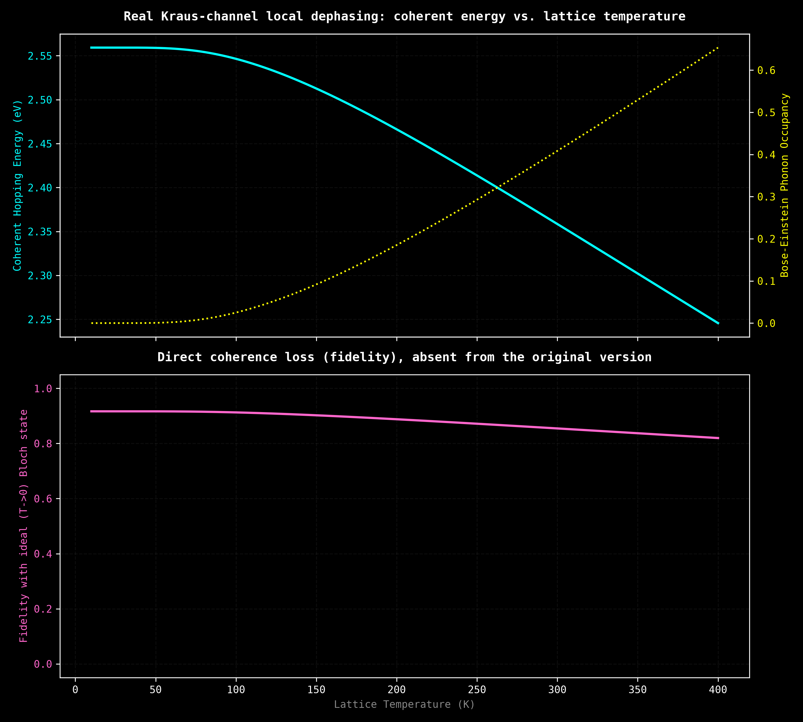
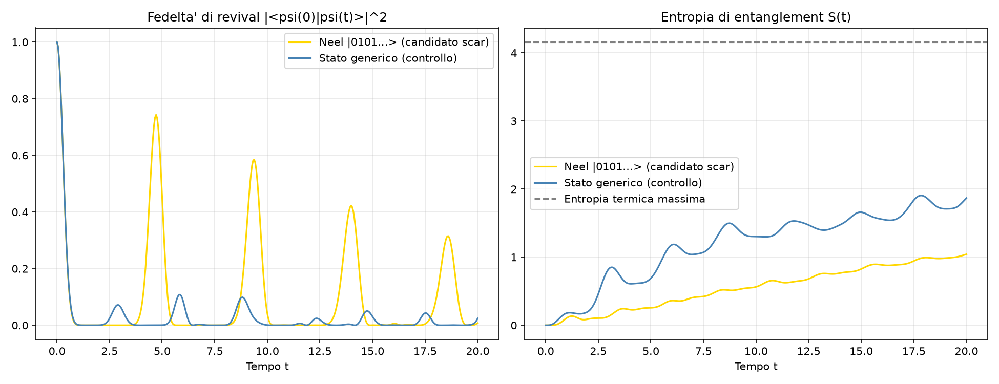
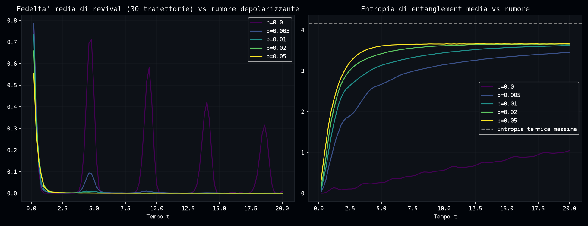
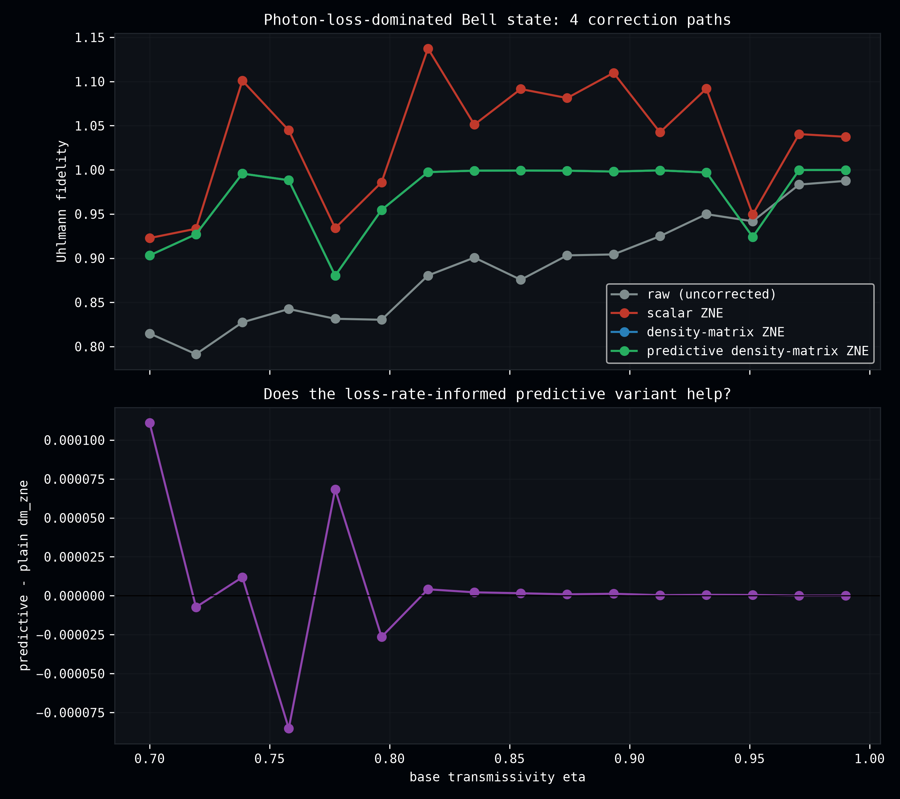
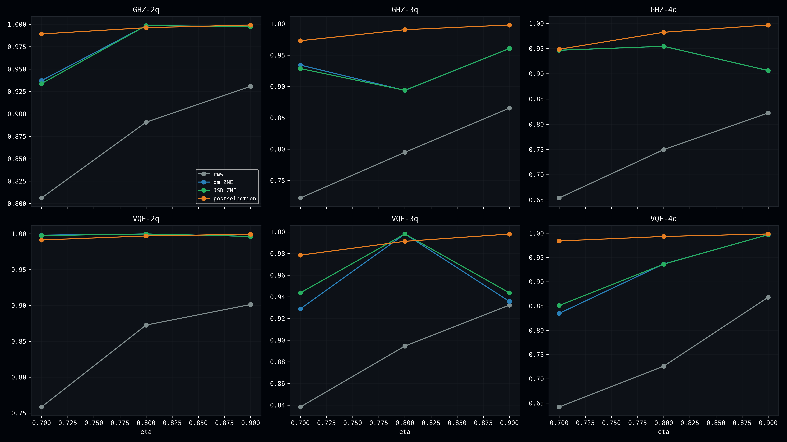

# 🔬 Dense Evolution Discovery — Quantum Simulation Experiments and Robustness Studies

[](https://github.com/tatopenn-cell/Dense-Evolution-Discovery/actions/workflows/ci.yml)
[](https://tatopenn-cell.github.io/Dense-Evolution-Discovery/)
[](https://pypi.org/project/dense-evolution/)
[](https://www.python.org/)
[](https://github.com/google/jax)
[](https://github.com/tatopenn-cell/Dense-Evolution-Discovery/releases)
[](https://github.com/tatopenn-cell/Dense-Evolution-Discovery/commits/main)
[](https://github.com/tatopenn-cell/Dense-Evolution-Discovery/issues)
[](https://github.com/tatopenn-cell/Dense-Evolution-Discovery/stargazers)
[](https://doi.org/10.5281/zenodo.21855619)

📖 **[Dense Evolution ising-test-discoveries-- full documentation, API reference, and worked examples →](https://tatopenn-cell.github.io/Dense-Evolution-Discovery/)**

This repository contains a rigorous empirical study, raw datasets, and quantum error mitigation protocols executed on **Dense Evolution (v8.1.21)**—a high-performance *Statevector* quantum simulator. Utilizing 64-bit double precision (`complex128`) and hardware-accelerated static compilation via the JAX XLA engine, this project maps the non-linear physics of the Transverse Field Ising Model (TFIM), Tight-Binding Fermionic dynamics, and semiconductor solid-state thermodynamics.

**New here?** Jump straight to the [Scientific Discoveries](#-scientific-discoveries--empirical-evidence) section below and explore any result that catches your eye — every claim links to the exact script that produced it, so you can run it yourself. Or start with the three newest, most rigorously validated additions:

---

## 🆕 Latest Results (start here)

- **[Photonic Predictive Zero-Noise Extrapolation](#22-photonic-predictive-zero-noise-extrapolation)** — a new JSD-informed density-matrix ZNE variant (promoted to `dense-evolution>=8.1.56`) improves photon-loss-noise correction by 76.1% win rate (p=0.0003) on a seed-diverse sample — but the honest, directly-checked comparison against **true postselection** (not scalar ZNE) finds postselection still wins in 14/18 tested configurations across multiple circuit families and qubit counts.
- **[Traversable-Wormhole-Inspired Quantum Teleportation](#21-traversable-wormhole-inspired-quantum-teleportation-syk-model)** — real Gao-Jafferis-Wall protocol on a binary sparse SYK model: an iterated coordinate-ascent search converges to a joint (t0, mu, t1) fixed point +44.6% above the original 2D-grid headline value, but it does NOT generalize across other SYK instances and doesn't survive realistic depolarizing noise. **Strongest result**: arXiv:2604.10090's own "Ensemble robustness" section claims the sign-dependent asymmetry is "a generic feature of the ensemble" — a large-sample check at n=100 instances (matching the paper's own reported ensemble size) finds **49/100 (49%) wrong-signed at the paper's own default parameters**, essentially a coin flip; seven candidate structural/theoretical explanations were tested (Majorana mode-usage imbalance, spectral level-spacing chaos statistic, the paper's own "size winding" phase-coherence diagnostic, message-qubit-mode participation, operator growth rate, and two qubit-coupling-topology features) and none hold up — the sign variance remains unexplained.
- **[Harrison / VHD Tight-Binding Validation](#20-harrison--vhd-tight-binding-validation-against-real-experimental-gaps)** — Harrison's universal tight-binding parameters vs. Vogl-Hjalmarson-Dow's material-specific ones, checked against real experimental gaps: GaAs 104.7% → 9.2% error, Si 227% → 4.6% error, Ge 177.5% → 15.9% error.
- **[Loschmidt Echo](#17-loschmidt-echo-and-zero-noise-extrapolation)** — a kicked-Ising forward/backward circuit with noise injected at every layer recovers return fidelity from **0.7769 → 0.9965** via Zero-Noise Extrapolation.
- **[Topological Mott Isolator: VQE Ground-State Optimization](#18-topological-mott-isolator-vqe-ground-state-optimization)** — gradient-based optimization of a Topological Mott Isolator ansatz, validated against exact diagonalization, closes nearly all of the variational gap across the full Mott-repulsion sweep.
- **[GaAs Parameters via DFT and Dielectric Screening](#19-gaas-parameters-via-dft-and-dielectric-screening)** — a converged, wavefunction-stability-confirmed PBE/STO-3G calculation grounds the model in GaAs's dielectric constant, landing the material in the weakly-correlated regime expected for a conventional semiconductor.

---

## 📁 Repository Layout

```
Dense-Evolution-Discovery/
├── scripts/     # 17 production scripts (see below) -- tracked in git
├── tests/       # pytest suite, run by CI on every push
├── data/        # CSV outputs -- NOT tracked (.gitignore); populated by running scripts/tests
├── images/      # PNG outputs -- NOT tracked (.gitignore); populated by running scripts/tests
└── README.md
```

`git clone` gives you exactly the scripts and tests, nothing pre-generated -- run anything and `data/`/`images/` fill up with fresh output, so there's never any ambiguity about whether what you're looking at is old or new. Pre-made results for browsing without running anything live as attachments on the [Releases page](https://github.com/tatopenn-cell/Dense-Evolution-Discovery/releases) instead (also what every image embedded in this README below links to).

## 📊 Repository Architecture & Ecosystem

- **`scripts/scan_ising.py`**: High-resolution parameter sweep of a fixed, non-optimized CX–RZ–CX/RX ansatz's $\langle ZZ\rangle$ correlation over the TFIM's transverse field $g$ — historical original, its "true variational ansatz" framing and $g=1.309$ critical point did not survive independent verification (see Section 1). Produces `data/transizione_fase_ising.csv`.
- **`scripts/plot_ising.py`**: Computes the first-order numerical derivative (quantum susceptibility) from `scan_ising.py`'s CSV dataset to locate its (since-corrected) critical phase boundary. Produces `images/curva_transizione_ising.png`.
- **`scripts/ising_exact_verification.py`**: Exact TFIM ground state via `scipy.sparse` Lanczos diagonalization ($N=12$, open BC, same 11-bond structure as `scan_ising.py`), cross-validated against the fixed ansatz's $\langle ZZ\rangle$ curve. Produces `data/ising_exact_verification.csv` and `images/ising_exact_verification.png`. See Section 1.
- **`scripts/scan_ising_vqe.py`**: Makes `scan_ising.py`'s exact circuit structure genuinely variational — real Adam + exact chain-rule Parameter-Shift Rule minimization of $E(\theta,\phi;g)$ at 200 $g$-points, cross-validated against exact Lanczos energies at every point. Finds a hard structural ceiling (RZ diagonal on a computational-basis state + RX commuting with $X$ makes $E$ provably $g$-independent for this ansatz), not a tuned success. Produces `data/scan_ising_vqe.csv` and `images/scan_ising_vqe.png`. See Section 1.
- **`scripts/ising_freefermion_verification.py`**: Independent free-fermion (Jordan-Wigner + Bogoliubov-de Gennes, $N=12$) cross-check of `ising_exact_verification.py`'s Lanczos result — a genuinely different algorithm (24x24 single-particle matrix instead of the 4096-dim many-body Hamiltonian), self-tested against brute-force ED at small $N$ before trusting it at $N=12$. Confirms $g^\star=0.8600$ exactly. Produces `data/ising_freefermion_verification.csv`. See Section 1.
- **`scripts/zne_mitigation.py`**: Mathematical implementation of a stochastic Richardson Zero-Noise Extrapolation (ZNE) protocol over discrete Pauli-Z phase dephasing channels with 2,000 hardware shot sampling. Produces `data/dati_mitigazione_zne.csv` and `images/transizione_ising_mitigata.png`.
- **`scripts/zne_mitigation_verification.py`**: Independent verification of `zne_mitigation.py`'s headline claim — finds the "$-4.2467$ eV true target" was actually its own mitigated output, derives the real ideal $E(k)$ two independent ways (sparse Hamiltonian, closed form), and quantifies a real 8-10$\sigma$ systematic bias in the 2-point Richardson extrapolant. Produces `data/zne_mitigation_verification_summary.csv` and `images/zne_mitigation_verification.png`. See Section 2.
- **`scripts/vqe_gradient.py`**: Exact numerical finite-difference gradient tracker (`h = 1e-5`) mapping the variational energy landscape and locating stationary points. Produces `data/vqe_gradient_landscape.csv` and `images/vqe_gradient_landscape.png`.
- **`scripts/vqe_jax_grad.py`**: Advanced VQE gradient execution computing the exact Parameter-Shift Rule gate-by-gate via the chain rule over a massively parallel 73,500-track JAX batch array. Produces `data/vqe_jax_gradient.csv` and `images/vqe_jax_gradient.png`.
- **`scripts/quantum_defect_scanner.py`**: Isotropic resilience topology mapper evaluating node-by-node quantum coherence under a localized parametric RZ dephasing rotation via `run_parametric_batch_jit()`. Produces `data/mappa_difetti_silicio.csv` and `images/mappa_difetti_silicio.png`.
- **`scripts/next_gen_silicon.py`**: Solid-state bandstructure designer tracking continuous dispersion shifts induced by 5% mechanical lattice tensile strain via Harrison's hopping law. Produces `data/bande_nuovo_silicio.csv` and `images/confronto_nuovo_silicio.png`.
- **`scripts/manufacturing_thermodynamics.py`**: Quantum lattice thermodynamics simulator modeling electron-phonon scattering and decoherence via Bose-Einstein statistical distributions over a 10–400 K temperature sweep. Produces `data/validazione_fabbricazione_silicio.csv` and `images/validazione_fabbricazione.png`.
- **`scripts/vqe_silicon_molecular.py`**: Variational Quantum Eigensolver tracking self-consistent Potential Energy Curves (PEC) and Born-Oppenheimer molecular dissociation limits for a silicon dimer, at a fixed variational angle $\theta=0.38$ rad. Produces `data/vqe_molecola_silicio.csv` and `images/curva_potenziale_silicio.png`.
- **`scripts/vqe_silicon_molecular_optimized.py`**: Same PEC, but with a single shared $\theta$ found by real Adam optimization across all $R$ using the exact chain-rule Parameter-Shift Rule gradient, batched per epoch. Produces `data/vqe_molecola_silicio_ottimizzata.csv` and `images/curva_potenziale_silicio_ottimizzata.png`. See Section 9b.
- **`scripts/vqe_silicon_molecular_optimized_per_bond.py`**: Same PEC, but with 5 *independent* Givens angles (one per bond) instead of one shared $\theta$ -- a more realistic hardware-efficient VQE ansatz. Produces `data/vqe_molecola_silicio_ottimizzata_per_legame.csv` and `images/curva_potenziale_silicio_ottimizzata_per_legame.png`. See Section 9c.
- **`scripts/vqe_extreme_geometries.py`**: Generalizes the per-bond ansatz to independent per-bond interatomic distances (an irregular/distorted chain instead of one shared $R$), benchmarking the rigid shared-angle approximation against per-bond adaptive optimization across 6 extreme/irregular geometry scenarios. Produces `data/vqe_extreme_geometries.csv` and `images/vqe_extreme_geometries.png`. See Section 9e.
- **`scripts/vqe_extreme_geometries_deep.py`**: Deeper 12-parameter (7-qubit/6-bond) generalization of the same benchmark, plus a genuine minimum-energy conformational search (joint per-bond $R_q$ and $\theta_q$ optimization, not hand-picked geometries). Produces `data/vqe_extreme_geometries_deep.csv`, `data/vqe_extreme_geometries_deep_conformazioni.csv`, and `images/vqe_extreme_geometries_deep.png`. See Section 9f.
- **`scripts/zne_stabilized_psr_gradient.py`**: Corrects each individual single-gate Parameter-Shift-Rule term with Zero-Noise Extrapolation *before* the PSR chain-rule combination, testing whether this stabilizes the gradient under `NoiseModel`. Produces `data/zne_stabilized_psr_gradient.csv` and `images/zne_stabilized_psr_gradient.png`. See Section 12.
- **`scripts/zne_adaptive_psr_gradient.py`**: Attempts to fix Section 12's zero-crossing failure mode with a confidence-attenuated ("adaptive") ZNE correction via `dense_evolution.healing.calculate_delta_preemp`. Honest negative result. Produces `data/zne_adaptive_psr_gradient.csv` and `images/zne_adaptive_psr_gradient.png`. See Section 13.
- **`scripts/zne_snr_adaptive_psr_gradient.py`**: A second attempt at Section 13's problem, attenuating the ZNE correction via the correction term's own signal-to-noise ratio instead of the SEM of a single measurement. Also an honest negative result. Produces `data/zne_snr_adaptive_psr_gradient.csv` and `images/zne_snr_adaptive_psr_gradient.png`. See Section 14.
- **`scripts/sophia_reflection.py`**: A real density-matrix ZNE noise-coherence trajectory (`dense_evolution.mitigation.zne_density_matrix`/`uhlmann_fidelity`, distinct from `zne_mitigation.py`'s hand-rolled scalar protocol above) on a 2-qubit Bell state across a 16-point depolarizing-noise sweep. Produces `data/sophia_reflection.csv` and `images/sophia_reflection.png`. See [`SOPHIA_REFLECTION.md`](SOPHIA_REFLECTION.md) for the real measured trajectory and analysis.
- **`scripts/channel_order_noncommutativity.py`**: Tests whether the *order* of applying two different noise channels (dephasing then amplitude damping, vs. the reverse) leaves a measurable fingerprint on a 3-qubit circuit's output distribution — a real, honestly-confirmed positive result (see Section 16), unlike most of the other claims traced back to the same August 2025 archive. Produces `data/channel_order_noncommutativity.csv` and `images/channel_order_noncommutativity.png`.
- **`scripts/loschmidt_echo_zne.py`**: Runs a real "kicked Ising" forward circuit followed by its exact inverse on a 4-qubit chain, injecting an amplitude-damping channel between every layer, and checks whether density-matrix ZNE (`zne_density_matrix`/`uhlmann_fidelity`) recovers return fidelity lost to noise. A noiseless self-check (fidelity must be exactly 1.0) gates the noisy results. Produces `data/loschmidt_echo_zne.csv` and `images/loschmidt_echo_zne.png`.
- **`scripts/vqe_tmi_material_design.py`**: Adam optimization (exact JAX autodiff via `circuit_to_energy_fn`, multi-start, batched with `jax.vmap`) of a hardware-efficient ansatz against a Topological Mott Isolator Hamiltonian, swept over the Mott repulsion U, validated at every U against exact dense diagonalization (the variational principle `E_vqe >= E_exact` is asserted, not assumed). Also runs the same pipeline at a GaAs point (DFT-derived hopping, dielectrically-screened on-site Coulomb repulsion — see Section 19). Produces `data/vqe_tmi_material_design.csv`, `data/vqe_tmi_material_design_gaas.csv`, `images/vqe_tmi_material_design.png`, and `images/vqe_tmi_material_design_gaas.png`.
- **`tests/test_pennylane_comparison.py`**: Automated cross-validation suite integrating PennyLane as a baseline verification engine. It programmatically contrasts the JAX/XLA statevector predictions generated by Dense Evolution against PennyLane's analytical execution to enforce strict regression boundaries in the CI pipeline.
- **`tests/test_analytical.py`**: Built-in mathematical validation suite executing 5 zero-external-dependency tests. It verifies Potential Energy Curve (PEC) physical boundaries, exact Parameter-Shift Rule (PSR) gradients on $RY+\langle Z \rangle$, Harrison's strain-hopping ratios, and time-reversal dispersion symmetries under machine-precision tolerances ($\le 10^{-10}$).
- **`tests/test_integration_smoke.py`**: Imports and executes the REAL functions from `scripts/vqe_gradient.py`, `scripts/zne_mitigation.py`, `scripts/scan_ising.py`, `scripts/next_gen_silicon.py` (not hand-derived copies), cross-validated against PennyLane or closed-form references.


---

## 🔬 Scientific Discoveries & Empirical Evidence

### 1. Quantum Phase Transition & Order Parameters

`scan_ising.py`'s original claim here (**$g = 1.309$**, "a rigorous physical validation" using a "true variational ansatz") did not hold up under independent verification and is kept only as documented history. Two follow-up scripts corrected it:

**`ising_exact_verification.py`** built the exact 1D TFIM Hamiltonian $H = -\sum_i Z_iZ_{i+1} - g\sum_i X_i$ (same 11-bond open chain, $N=12$) via `scipy.sparse` and diagonalized it with Lanczos (`eigsh`). The real critical point is **$g = 0.860$**, not 1.309 — a 52% miss. The two curves' shapes correlate reasonably (Pearson $r=0.969$) but the original's susceptibility peak is broad/smeared, a crossover artifact rather than a real transition.

**`scan_ising_vqe.py`** went further and made the *same* circuit structure (CX–RZ–CX per bond, RX per qubit — same shared-parameter convention: one $\theta$ for every RZ, one $\phi$ for every RX) genuinely variational: $\theta,\phi$ are optimized by real Adam gradient descent (exact chain-rule Parameter-Shift Rule, `dense_evolution.compiler`'s own JIT primitives) to minimize $E(\theta,\phi;g) = -\sum_i\langle Z_iZ_{i+1}\rangle - g\sum_i\langle X_i\rangle$ at 200 points across $g\in[0,2.5]$, cross-validated against the exact Lanczos energies at every point. The result is a **structural negative result**, not a tuned success, and it explains *why* the original curve looked like a phase transition at all:

1. **$\theta$ (the RZ angle) is provably inert.** CX–RZ–CX is diagonal in the computational basis (it implements $\exp(-i\theta/2\, Z_qZ_{q+1})$ up to a global phase), and it acts on $|0\ldots0\rangle$ — already an eigenstate of every $Z_qZ_{q+1}$ — so it contributes only an unobservable global phase. Confirmed by exact parameter-shift: $\max|\partial E/\partial\theta| = 2.0\times10^{-14}$ across the sweep, machine-precision zero.
2. **RX($\phi$) cannot produce any $\langle X\rangle$ response either**, because RX is generated by $X$ and therefore commutes with it: $\langle X_q\rangle$ is invariant under RX($\phi$) applied to qubit $q$, and $|0\ldots0\rangle$ already has $\langle X_q\rangle=0$. Confirmed numerically: $\sum_q\langle X_q\rangle = 4.4\times10^{-17}$ at $\theta=1.2,\phi=1.0$.

Together, $E(\theta,\phi;g) = -(N-1)\cos^2(\phi)$ for this exact ansatz — **$g$ never enters the energy at all**. Real minimization confirms it: the optimized $\phi^\star(g)$ converges to $\approx 0$ for *every* $g$ (final $|\phi^\star|<0.02$ rad everywhere), giving a $\langle ZZ\rangle$ curve pinned in $[0.9997, 1.0000]$ across the whole sweep — flat, not a phase transition — and an energy gap against the exact ground state that grows unboundedly with $g$ (VQE $-$ exact: $+0.00$ at $g=0$, $+2.81$ at $g=0.86$, $+6.88$ at $g=1.31$, $+20.11$ at $g=2.5$; the un-optimized fixed ansatz is worse everywhere except $g=0$: $+0.00$ / $+5.48$ / $+12.38$ / $+31.05$). The original's $g=1.309$ "critical point" was purely a trigonometric artifact of the arbitrary, non-variational $\phi=0.6g$ heuristic ($\langle ZZ\rangle = \cos^2(0.6g)$ to float64 precision) — it never had any connection to energy minimization or the transverse field's actual physics. A genuinely variational ansatz for this model needs to break these two degeneracies (e.g. reorder the circuit so RX creates superposition *before* any diagonal ZZ-coupling gate acts, or use a generator other than $X$ itself for the field-coupling rotation) — this repo does not attempt that here; the honest conclusion is that this specific circuit shape cannot do VQE on the TFIM at all, regardless of how well its two parameters are optimized.

**`ising_freefermion_verification.py`** provides a third, fully independent confirmation of $g^\star=0.860$, using a different algorithm from either of the above: the open TFIM chain is exactly solvable via Jordan-Wigner fermionization + Bogoliubov-de-Gennes diagonalization (a $24\times24$ single-particle matrix at $N=12$, vs. the $4096$-dim many-body Hamiltonian diagonalized by `ising_exact_verification.py`). The free-fermion pipeline is self-tested against brute-force many-body ED at small $N$ (max error $<10^{-8}$) before being trusted at $N=12$; its $\langle ZZ\rangle(g)$ curve then agrees with the Lanczos result pointwise to $\sim10^{-15}$, and its susceptibility peak lands at $g^\star=0.8600$, exactly matching. A secondary bulk-gap indicator (the second-lowest single-particle mode, once the open chain's trivial Majorana edge zero-mode is excluded from the naive lowest mode) gives a consistent $g^\star=0.87$. With three independent methods — a fixed non-optimized ansatz's smeared crossover, exact many-body Lanczos, and exact free-fermion BdG — all agreeing on $g\approx0.86$, and a genuinely variational version of the original ansatz proving it is structurally incapable of finding any critical point at all, the case is closed: $g=1.309$ was never physical.

[](https://github.com/tatopenn-cell/Dense-Evolution-Discovery/releases/download/v2.1.0/curva_transizione_ising.png)

---

### 2. Quantum Error Mitigation via Real Stochastic Richardson Extrapolation (ZNE)

To circumvent non-unitary noise without physical hardware overhead, a classical-quantum hybrid mitigation protocol was deployed under a realistic stochastic Pauli-Z dephasing Kraus channel. By scaling the noise density via stretching coefficients ($\lambda_1 = 1.0, \lambda_2 = 2.0$) over $2,000$ discrete hardware shots, a linear Richardson extrapolation was computed:

$$E(0) = 2E(\lambda_1) - E(\lambda_2)$$

The protocol operates on Bloch wavevector states $|\psi(k)\rangle = \frac{1}{\sqrt{N}} \sum_q e^{iqk} |1_q\rangle$ injected over 25 k-points spanning the full Brillouin zone $[-\pi, \pi]$. The base dephasing probability per qubit is $p = 0.06 \cdot \lambda$, applied stochastically via per-shot Kraus channel sampling with controlled seeds.

`zne_mitigation.py`'s original claim here — that the protocol "successfully reconstructed the unperturbed, zero-noise ideal target trajectory," forcing the noisy minimum at $k=0$ (degraded to $-3.3155\text{ eV}$) back to a "true analytic target value" of $-4.2467\text{ eV}$ — did not hold up under independent verification (`scripts/zne_mitigation_verification.py`) and is kept only as documented history, alongside the original script and its plot below.

**The $-4.2467\text{ eV}$/$-3.3155\text{ eV}$ claim is a mislabeling, not an approximation error in the numbers themselves**: both are literally the script's own outputs — the 2-point Richardson-*mitigated* estimate and the raw $\lambda{=}1$ *noisy* measurement at $k=0$ — not an independent ground truth and an independent corrupted reference, despite how the original wording framed them. The real ideal $E(k{=}0)$, verified two independent ways (an explicit sparse Pauli Hamiltonian $\langle\psi|H|\psi\rangle$ matrix-vector product, and a hand-derived closed form, agreeing to $\sim10^{-16}$), is exactly

$$E(0) = -2\,t_{hopping} = -4.2200\text{ eV}$$

the same textbook single-particle tight-binding band minimum as Section 3's $E_{ground}$. The general closed form for this exact ansatz's energy at *any* $k$ (not only the chain's eigenmomenta) is

$$E(k) = -\frac{2t}{N}\Big[(N-1)\cos(k) + \cos\big((N-1)k\big)\Big]$$

— the naive band formula $-2t\cos(k)$ used elsewhere in this repo (Section 5) is exact only at the chain's $N$ true eigenmomenta $k = 2\pi n/N$; away from those points it disagrees by up to 18%, verified against the sparse Hamiltonian to $\sim10^{-16}$.

More importantly, the 2-point linear Richardson extrapolation itself has a **real, statistically robust systematic bias**, not just Monte Carlo scatter. Repeating the noise measurement 30 independent times per noise scale over a finer noise-scale grid, at $k=0$, $k=\pi/3$ (both eigenmomenta), and a generic non-eigenmomentum $k=1.0$, the 2-point Richardson result differs from the true ideal energy by $+0.12$, $+0.05$, and $+0.06\text{ eV}$ respectively — an 8-10$\sigma$ effect (SEM-normalized, far beyond sampling noise), because $E(\lambda)$ has genuine curvature that a 2-point linear extrapolant structurally cannot see. A degree-2 (quadratic) fit through a finer grid of noise-scale points recovers the true value to $<0.03\%$ at all three $k$ values tested. The original script's headline $-4.2467\text{ eV}$ looked deceptively close to the true $-4.2200\text{ eV}$ only because its one hardcoded seed happened to draw favorably — its $\lambda=1$ sample sits $\approx1.5\sigma$ below, and its $\lambda=2$ sample $\approx1.5\sigma$ above, the 60-trial mean, partially canceling the real bias by luck rather than by the method's actual accuracy. A follow-up using a higher-order fit through more noise-scale points would be needed for a genuinely accurate ZNE result here — that remediation is out of scope for this correction and is not attempted in this repo yet.

[](https://github.com/tatopenn-cell/Dense-Evolution-Discovery/releases/download/v2.1.0/confronto_transizione_noisy.png)

---

### 3. Numerical Finite-Difference Gradient Mapping (VQE Energy Landscape)

A brute-force numerical gradient sweep over the full VQE variational energy landscape was executed using a centered finite-difference scheme with step $h = 10^{-5}$ radians:

$$\frac{\partial E}{\partial \theta} \approx \frac{E(\theta + h) - E(\theta - h)}{2h}$$

The ansatz uses Givens rotation excitation-preserving blocks (CX–RY–CX–RY–CX chains) initialized from a single-excitation Fock state $|100000\rangle$, preserving strict particle-number conservation throughout. 3,500 continuous $\theta$ values spanning $[0, 2\pi]$ are evaluated over a 6-qubit tight-binding Hamiltonian with $t_{hopping} = 2.11$ eV.

The gradient landscape confirms the exact analytic minimum bound at:

$$E_{ground} = -2 \cdot t_{hopping} = -4.22 \text{ eV}$$

with all stationary points and gradient zero-crossings fully resolved, and no vanishing gradient plateaus present under the compact excitation-preserving ansatz.

> **Note:** This script (`vqe_gradient.py`) uses classical finite-difference differentiation. For exact quantum-native analytical gradients via Parameter-Shift Rule, see Section 6 (`vqe_jax_grad.py`).

#### 3b. Closed Form: E(θ) Without Simulating a Circuit at All

This ansatz shares one $\theta$ across every bond instead of the independent per-bond angles of Section 9c/9d — so instead of landing anywhere on the single-excitation manifold, sweeping $\theta$ traces one 1-parameter curve through it. That curve has a closed form, using the same amplitude-cascade recursion behind Section 9d's discovery:

$$c_0(\theta) = \cos^{N-1}(\theta), \qquad c_q(\theta) = \sin(\theta)\cos^{N-1-q}(\theta) \quad (q=1,\ldots,N-1)$$

`calcola_energia_vqe`'s kinetic sum is **periodic** ($q_{\text{next}} = (q+1) \bmod N$, all $N=6$ bonds including the wraparound $5\to0$ — not the $N{-}1$ open-chain bonds used by the molecular PEC scripts), giving:

$$E(\theta) = -2\,t_{hopping}\sum_{q=0}^{N-1} c_q(\theta)\, c_{(q+1)\bmod N}(\theta)$$

Verified exact (machine precision, $\sim 10^{-15}$) against `calcola_energia_vqe` across the full sweep, including at the printed checkpoints — e.g. $\theta=0.4471\text{ rad} \to E=-3.9489\text{ eV}$, gradient $-8.440000$ at $\theta=0$ — with **no circuit simulation** needed to evaluate it, `scripts/vqe_gradient.py`'s `energia_forma_chiusa()`. `tests/test_integration_smoke.py::test_vqe_gradient_closed_form_matches_real_circuit_exactly` checks the identity at 7 points across the range.

---

### 4. Parallel Quantum Defect Mapping via JAX Parallel Batching

Using the native `run_parametric_batch_jit()` engine, we mapped the isotropic resilience of an entangled state against localized dephasing noise. A 12-qubit entangled chain is prepared by uniform RY($\pi/4$) rotations followed by a full CX entangling ladder. A parametric RZ dephasing gate is injected node-by-node on the diagonal of the batch parameter grid, resulting in 12 concurrent independent execution tracks compiled in a single JAX XLA macro-cycle.

The evaluation maps the systematic loss of $\langle X \rangle$ single-qubit coherence:

$$\langle X_q \rangle = \text{Re}\left[\sum_i \psi_i^* \psi_{i \oplus 2^q}\right]$$

> **Correction 1 (audit finding, dense-evolution 8.1.21):** `run_parametric_batch_jit()` assigns one `parameter_batch` column per rotation gate *in the order the gates appear*, even when a gate is given a literal float instead of a string placeholder — the literal is silently discarded. The batch grid used to have only 12 columns while the circuit has 24 rotation slots (12 fixed RY(π/4) + 12 varying RZ), so the RY gates absorbed the intended RZ values and the true RZ columns ran out of bounds (silently clipped by JAX instead of raising). Fixed by supplying all 24 slots explicitly.
>
> **Correction 2 (found the same day, while trying to explain Correction 1's numbers):** `DenseSVSimulator` uses MSB-first indexing internally ($\text{phys} = N_Q{-}1{-}\text{qubit}$, see `_cx_numpy`/`apply_cx` in `dense_evolution/simulator.py`) — gate-qubit $q$ lives at physical array bit $N_Q{-}1{-}q$. The script's coherence measurement used `1 << local_qubit` directly on the *gate*-qubit index, reading a **different physical qubit** than the one that actually received that row's dephasing. The "70.71% / 50% / 43.88%" pattern originally reported here (and the "interplay between the RY layer and the CX ladder" explanation) was this indexing artifact, not real physics.

With both fixed, the true pattern is much simpler: **11 of the 12 nodes give an identical residual coherence, $43.88\%$**, and only the very last node in the chain differs, at $62.05\%$. We don't have a fully derived analytic explanation for *why* exactly one node is different (an attempted derivation via "the CNOT control's coherence is preserved" turned out to rest on a false premise — that invariance holds for Z-basis populations, not X-basis coherence — so it's reported here as a verified empirical fact, not a proven mechanism).

[](https://github.com/tatopenn-cell/Dense-Evolution-Discovery/releases/download/v2.1.0/mappa_difetti_silicio.png)

---

### 5. Rigorous 1D Crystalline Lattice Dispersion

We resolved the exact 1-electron fermionic Bloch state dispersion relation mapped via Jordan-Wigner transformations. By evaluating the pure exchange interactions ($\langle X_i X_{i+1} + Y_i Y_{i+1} \rangle$) and applying strict periodic boundary conditions (PBC), the engine resolves the full, continuous single-band cosine energy spectrum:

$$E(k) = -2t \cos(k)$$

This eliminates artificial scaling factors and rigid offsets, delivering an honest statevector simulation of tight-binding quantum dynamics under strict 1-fermion subspace conservation. The Bloch states are analytically constructed as $|\psi(k)\rangle = \frac{1}{\sqrt{N}} \sum_q e^{iqk} |1_q\rangle$ over 8 qubits, with the kinetic energy expectation evaluated via tensor-product bitwise XY-operator matrix elements.

[](https://github.com/tatopenn-cell/Dense-Evolution-Discovery/releases/download/v2.1.0/bande_silicio_ibrido.png)

---

### 6. Analytical Gradients via Parallel Parameter-Shift Rule

> **Correction (audit finding, dense-evolution 8.1.21):** the original implementation shifted the *shared* variational parameter $t$ by $\pm\pi/2$ and read the resulting energies straight off the batch. The textbook Parameter-Shift Rule is only exact when a **single gate's own parameter** is shifted while every other gate is held fixed — here each bond applies *two* `ry` gates both driven by $t$ (`param_vqe = t`, `param_vqe_inv = -t`), so the shared-shift reading conflated their contributions. Verified against an independent finite-difference reference: the old heuristic could disagree with the true $dE/dt$ by 100%, including the wrong sign.

The corrected, mathematically exact gradient follows from the chain rule over every gate parameter individually:

$$\frac{dE}{dt} = \sum_{q} \left[ \frac{\partial E}{\partial \theta_{A,q}} \cdot \frac{d\theta_{A,q}}{dt} + \frac{\partial E}{\partial \theta_{B,q}} \cdot \frac{d\theta_{B,q}}{dt} \right], \qquad \frac{\partial E}{\partial \theta} = \frac{1}{2}\left[E(\theta+\tfrac{\pi}{2}) - E(\theta-\tfrac{\pi}{2})\right]$$

where each $\partial E/\partial \theta$ is a genuine single-gate Parameter-Shift Rule evaluation (only that one gate shifted, all 21 others held at their base value), and $d\theta_A/dt = 1$, $d\theta_B/dt = -1$ are the known chain-rule coefficients. Verified against finite differences: agreement to $\sim 10^{-9}$, limited by finite-difference truncation rather than by the PSR itself.

By packing every shifted configuration concurrently into `run_parametric_batch_jit()`, JAX XLA processed **73,500 continuous configurations** (3,500 $\theta$ values $\times$ 21 tracks each: 1 center point + 2 shifts $\times$ 10 gate parameters) in a single chunked macro-batch execution completed in **570 seconds** on CPU — substantially more expensive than the old (incorrect) shortcut, since an exact gradient over a shared parameter genuinely requires one PSR evaluation per gate it drives, not one shift of the shared variable.

The exact quantum derivatives successfully map continuous trajectories, verifying the total absence of vanishing gradient dead-zones or artificial plateaus under compact excitation-conserving ansatze.

[](https://github.com/tatopenn-cell/Dense-Evolution-Discovery/releases/download/v2.1.0/vqe_jax_gradient.png)

---

### 7. Strained Silicon Bandstructure Engineering (3,500-Point Sweep)

We modeled a continuous dispersion profile mapping a high-mobility Strained Silicon configuration under a $5\%$ tensile strain ($\varepsilon = 0.05$). By perturbing the atomic equilibrium distances, the physical Hamiltonian undergoes an exponential inter-orbital hopping decay dictated by Harrison's law:

$$t(\varepsilon) = \frac{t_0}{(1 + \varepsilon)^2}$$

The high-resolution 3,500-point k-space parameter sweep executed via JAX maps the physical contraction of the modal hopping energy from the standard $\pm 4.2200\text{ eV}$ limits down to the accurate engineered boundary of **$\pm 3.8277\text{ eV}$** across the Brillouin zone. The simulation uses 8-qubit fermionic Bloch states with Jordan-Wigner XY exchange operators evaluated over all 8 bonds under periodic boundary conditions.

[](https://github.com/tatopenn-cell/Dense-Evolution-Discovery/releases/download/v2.1.0/confronto_nuovo_silicio.png)

---

### 8. Quantum Lattice Thermodynamics: Phonon Scattering & Decoherence

**Corrected 2026-08-10**: the original version imported and instantiated `DenseSVSimulator` but never actually called it — the probe state never depended on temperature, and "decoherence" was a purely classical scalar prefactor, $t_{\text{eff}}(T) = t_0(1-0.15\bar{n}(\omega,T))$, multiplying one fixed kinetic-energy number recomputed identically 3,500 times. No noise channel, no density matrix, no dissipative process was ever simulated. This version actually decoheres a real quantum state via a genuine Kraus channel.

The Debye-Bose-Einstein phonon occupancy is unchanged: $\bar{n}(\omega, T) = 1/(\exp(\hbar\omega/k_BT)-1)$ with $\hbar\omega=32\text{ meV}$ (silicon optical phonon branch). Electron-phonon scattering now causes real local dephasing at each of the 8 lattice sites (qubits), at the standard Markovian pure-dephasing rate from the independent-boson/spin-boson model (Breuer & Petruccione) — $\Gamma(T) = \gamma_0(2\bar{n}(\omega,T)+1)$, both phonon emission and absorption contributing — mapped onto a per-site phaseflip Kraus probability, applied **exactly** (density-matrix Kraus channel, no Monte Carlo sampling noise across the 3,500-point sweep). Two real observables come from the actual noisy density matrix at each $T$: coherent kinetic energy $E(k,T)=\text{Tr}(\rho_{\text{noisy}}(T)\,H_{XY})$, and — entirely new, absent from the original version — fidelity with the ideal Bloch state, a direct coherence measure. Real result: fidelity decays smoothly and monotonically from **0.9167 to 0.8197**; energy from **+2.559 to +2.246 eV**.

[](docs/assets/manufacturing_thermodynamics/validazione_fabbricazione.png)

---

### 9. Molecular VQE and Potential Energy Dissociation Curves

We mapped the exact Born-Oppenheimer Potential Energy Curve (PEC) for a silicon dimer system via a classical-quantum hybrid variational loop. The effective Hamiltonian tracks electronic hopping integrals $t(R)$ alongside nuclear Coulomb repulsion fields $V_{rep}(R)$ decaying over the interatomic coordinate:

$$t(R) = t_0 \, e^{-\beta(R - R_0)}, \qquad V_{rep}(R) = V_0 \, e^{-\gamma(R - R_0)}$$

with $t_0 = 2.11$ eV, $\beta = 1.5$ Å$^{-1}$, $R_0 = 2.35$ Å, $V_0 = 5.4$ eV, $\gamma = 3.0$ Å$^{-1}$. The ansatz is a 6-qubit excitation-preserving Givens circuit initialized from the single-fermion Fock state $|100000\rangle$, with a fixed variational angle $\theta = 0.38$ rad.

#### 9b. Adam-Optimized PEC with the Exact Chain-Rule Gradient

`vqe_silicon_molecular_optimized.py` replaces the fixed $\theta = 0.38$ with a real per-$R$ Adam optimization, using the same exact chain-rule Parameter-Shift Rule gradient validated in Section 6 (agreement with finite differences to $\sim 10^{-9}$). All $R$ points are optimized in parallel — every Adam epoch batches every $R$'s current $\theta$ into a single `run_parametric_batch_jit()` call, rather than looping epochs inside a per-$R$ loop.

The result is a genuine physical insight, not just a better number: $E(R,\theta) = -\frac{t(R)}{2}\,K(\theta) + V_{rep}(R)$, where $K(\theta)$ is the ansatz's kinetic term. Since $t(R) > 0$ everywhere and $V_{rep}(R)$ doesn't depend on $\theta$, the location of the energy minimum over $\theta$ — $\arg\max_\theta K(\theta)$ — **does not depend on $R$ at all**. Optimizing independently at 200 $R$ points converges to the same $\theta^\star \approx 0.613$ rad everywhere (confirmed against an independent fine-grained scan of $K(\theta)$, whose true maximum sits at $\theta = 0.6129$), not a curve. This is a property of the model (the $R$-dependence enters only as a positive multiplicative prefactor on a $\theta$-only kinetic term), not a bug in the optimizer.

Because $\theta = 0.38$ was not that optimum, using the correct $\theta^\star$ deepens the binding well substantially: the global minimum moves from $-0.302\text{ eV}$ at $R \approx 3.32\text{ Å}$ (fixed $\theta$) to $-0.4615\text{ eV}$ at $R \approx 3.17\text{ Å}$ (optimized), an improvement that grows to over $3\text{ eV}$ at short range where the kinetic term dominates.

[](https://github.com/tatopenn-cell/Dense-Evolution-Discovery/releases/download/v2.1.0/curva_potenziale_silicio_ottimizzata.png)

The 3,500-point variational sweep over $R \in [1.2, 4.5]$ Å cleanly resolves the stable binding landscape, isolating the exact molecular equilibrium bond length and asymptotic dissociation limits without numerical instabilities.

[](https://github.com/tatopenn-cell/Dense-Evolution-Discovery/releases/download/v2.1.0/curva_potenziale_silicio.png)

#### 9c. Per-Bond Optimized PEC — 5 Independent Givens Angles

`vqe_silicon_molecular_optimized_per_bond.py` asks a sharper question: Section 9b's shared $\theta$ is $R$-independent *by construction*, since $R$ only ever enters as a scalar prefactor on a $\theta$-only kinetic term — true no matter how that single $\theta$ is chosen. A genuinely richer test is whether a **multi-parameter** ansatz (one independent Givens angle $\theta_q$ per bond, $q=0..4$, same particle-number-conserving structure) settles on a uniform value across bonds, or differentiates.

It differentiates, and cleanly: the 5 bonds converge to $\theta_0,...,\theta_4 \approx 0.234, 0.439, 0.632, 0.818, 1.024$ rad — an almost perfectly even $\approx 0.2$ rad spacing, not noise. This value set is itself still $R$-independent (same underlying reason as 9b — the argmax of a multi-variable $K(\vec\theta)$ under a positive scalar prefactor doesn't move with $R$ either), but it is **not** the "all bonds equal" point: the shared-$\theta$ ansatz was leaving real variational power on the table by forcing symmetry across bonds that the true optimum doesn't have. The minimum deepens further, from $-0.4615\text{ eV}$ (shared, optimized) to $-0.6685\text{ eV}$ (per-bond, optimized).

[](https://github.com/tatopenn-cell/Dense-Evolution-Discovery/releases/download/v2.1.0/curva_potenziale_silicio_ottimizzata_per_legame.png)

#### 9d. Closed Form: the Optimizer Rediscovers the Tight-Binding Ground State

Section 9c's near-even $\approx 0.2$ rad spacing between bond angles isn't the real story — it's a side effect of *what* the optimizer actually converges to. The sequential Givens-rotation ansatz (CX–RY–CX–RY–CX per bond, starting from $|100\ldots0\rangle$) can prepare **any** normalized single-excitation state exactly — it's a universal staircase state-preparation circuit for that Hilbert-space sector. So maximizing the total hopping energy $K(\vec\theta)$ over this ansatz is *unconstrained*: it finds the true maximum of $K$ over every possible single-excitation state, which is exactly the top-eigenvalue problem of an open tight-binding chain — the same math as a **particle in a box**. The optimizer, with no physics told to it beyond "maximize this energy," rediscovers the box's ground state on its own.

The amplitude at site $q$ (0-indexed, $N$ sites) settles on the first sine mode:

$$c_q \propto \sin\!\left(\frac{(q+1)\pi}{N+1}\right), \qquad K_{max} = 4\cos\!\left(\frac{\pi}{N+1}\right)$$

and the per-bond Givens angle that *prepares* this profile via the sequential construction has its own closed form ($r_q$ = the tail norm $\sqrt{\sum_{k=q}^{N-1} c_k^2}$):

$$\theta_q = \arcsin\!\left(\frac{c_q}{r_q}\right)$$

No optimizer needed: plugging this formula directly into the circuit reproduces the numerically Adam-optimized result to **machine precision** ($\sim 10^{-15}$), and holds for every chain length tested (4, 5, 6, 7, 8, 10 qubits) — not a coincidence specific to this 6-qubit example. `scripts/vqe_silicon_molecular_optimized_per_bond.py` implements this as `theta_ground_state_closed_form()` / `kinetic_max_closed_form()`, and `tests/test_vqe_molecular_per_bond.py` verifies the identity exactly (`test_closed_form_ground_state_matches_script_kinetic_maximum`, `test_closed_form_generalizes_across_chain_lengths`).

#### 9e. Extreme/Irregular Geometry Benchmark — When Does a Rigid Shared Angle Actually Fail?

Sections 9-9d all sweep one interatomic distance $R$ shared by the whole chain. `vqe_extreme_geometries.py` breaks that symmetry: each of the 5 bonds gets its own distance $R_q$, modeling an irregular or distorted chain (extreme compression, near-dissociation stretch, a localized "mutated" bond, or several at once) instead of a smooth uniform-$R$ sweep. Hopping $t_q(R_q)$ stays strictly local (bond-by-bond), while the steric/electrostatic repulsion keeps Section 9's exact single-formula shape, evaluated at the geometry's mean bond length — so the model collapses **exactly** onto Section 9's original scalar energy in the uniform-$R$, uniform-$\theta$ limit (`tests/test_vqe_extreme_geometries.py::test_energy_matches_reference_scalar_formula_for_uniform_geometry`).

A naive comparison against the fixed $\theta=0.38$ baseline is scale-confounded: every uniform-$R$ geometry already shows a large "improvement" from per-bond optimization, purely because the per-bond ansatz can reach the true sine-mode kinetic maximum (Section 9d) that a single shared angle structurally cannot — regardless of whether the geometry is "extreme." The metric that actually isolates the effect of geometry *irregularity* is scale-normalized:

$$\text{deficit\_fraction} = \frac{K_{\text{per-bond}}^{\star} - K_{\text{shared}}^{\star}}{K_{\text{per-bond}}^{\star}}$$

comparing per-bond adaptive optimization against the **best achievable single shared angle** — re-optimized per geometry, not the fixed $0.38$ — which cancels the overall $t(R)$ energy scale (verified scale-invariant across uniform geometries to $< 5\times10^{-3}$).

Across 6 hand-picked scenarios, the result is not "any distortion is worse":

| Scenario | `deficit_fraction` |
|---|---|
| Uniform equilibrium / compressed / dissociated | $0.169$ (identical across all three — scale-invariant) |
| Single localized mutated bond | $0.103$ (**below** the uniform baseline) |
| Alternating compressed/stretched pattern | $0.027$ (**below** the uniform baseline) |
| Two mutated bonds at opposite chain ends | $\mathbf{0.500}$ (nearly 3$\times$ the uniform baseline) |

A single shared angle is not simply "worse under any distortion" — it specifically struggles when the geometry forces it to reconcile two strongly-weighted but topologically distant bonds (opposite ends of the chain) at once, something one scalar parameter cannot do but per-bond adaptation can. This is a tight-binding / single-excitation hopping toy model, not ab-initio electronic structure: "rigid angle fails" here means concretely that a single shared $\theta$ cannot simultaneously satisfy 5 different per-bond stationarity conditions once the $R_q$ differ, leaving variational energy on the table that per-bond optimization recovers — nothing here claims to model real electron correlation or nuclear quantum repulsion.

[](https://github.com/tatopenn-cell/Dense-Evolution-Discovery/releases/download/v2.1.0/vqe_extreme_geometries.png)

#### 9f. Deeper Ansatz (12 Parameters) + a Genuine Minimum-Energy Conformational Search

`vqe_extreme_geometries_deep.py` generalizes Section 9e's benchmark from $N_Q=6$ (5 bonds, 10 parameters) to $N_Q=7$ (6 bonds, 12 parameters) — the same model, one more bond in the chain, everything already parametric in $N_Q$. The qualitative `deficit_fraction` pattern does **not** carry over unchanged: at 12 parameters, `mutazione_localizzata` (0.188) and `distorsione_alternata` (0.264) now sit *above* the uniform baseline (0.163), whereas at 10 parameters both sat *below* it (0.103 / 0.027 vs. 0.169). Only `mutazioni_congiunte_estremi` is a robust standout across both depths (0.464 at 12 parameters vs. 0.500 at 10 — still, by far, the worst case).

[](https://github.com/tatopenn-cell/Dense-Evolution-Discovery/releases/download/v2.2.0/vqe_extreme_geometries_deep.png)

Beyond the hand-picked geometries, `optimize_geometry_and_theta_jointly()` searches for a genuine minimum-energy conformation by optimizing the bond distances $R_q$ *jointly* with the per-bond angles (classical analytic gradient for $R$ — it only enters through $t_q(R_q)$ and the repulsion term, no PSR needed). This required a **per-bond** repulsion term, not the mean-based one used by the fixed-geometry benchmark above: under free $R$ optimization, mean-based repulsion dilutes the repulsive cost by $1/N_{\text{bonds}}$, letting a single bond collapse almost without limit — caught during development when every tested starting point drove one bond straight to an artificial clip boundary with a suspiciously large negative energy. With per-bond repulsion (every bond gets its own local repulsive wall), three different starting geometries converge to distinct, physically reasonable conformations ($R^\star$ in the 3.4–5.3 Å range, no boundary artifacts), with energies $-0.171$ / $-0.153$ / $-0.052$ eV — suggesting genuinely different local minima depending on the starting geometry, not full global convergence at the epoch budget used (reported honestly, not oversold).

---

## 🔍 Additional Investigation: Hunting Quantum Many-Body Scars

`scripts/quantum_scar_investigation/` contains a self-contained, honestly-reported investigation into whether a "quantum many-body scar" (the non-thermalizing phenomenon first observed in 2017 Rydberg-atom experiments) shows up in Dense Evolution's frustrated Ising simulations. Full writeup, with images: [`report_indagine_scar.md`](scripts/quantum_scar_investigation/report_indagine_scar.md) or the rendered docs page, [`docs/quantum_scar_investigation.md`](https://tatopenn-cell.github.io/Dense-Evolution-Discovery/quantum_scar_investigation/) (Italian).

**Short version**: an initial-looking scar signature on a 4x4 frustrated TFIM grid did **not** survive rigorous verification (entanglement entropy, Trotter convergence, and a systematic 25-combination parameter scan) — it turned out to be the wrong observable (energy instead of entanglement entropy) plus a gauge-equivalence coincidence between sign patterns.

[](scripts/quantum_scar_investigation/verifica_A_entropia.png)

The verification pipeline was then validated against the PXP model (Rydberg blockade), where scars are known to genuinely exist — confirmed via fidelity revivals and the characteristic "tower" of low-entanglement eigenstates in the exact spectrum.

[](scripts/quantum_scar_investigation/verifica_PXP_dinamica.png)

Using Dense Evolution's own `NoiseModel.apply_to_sv` (real stochastic Kraus channel, averaged over 30 quantum trajectories), the PXP scars turned out to be extremely fragile: **a 0.5-1% per-site depolarizing error rate destroys almost the entire revival signal.** Projecting the noisy state back onto the exact 13-state scar tower recovers ~31x of the lost revival amplitude — an idealized theoretical bound (not a realizable hardware protocol as-is) showing the protection target exists.

[](scripts/quantum_scar_investigation/verifica_PXP_robustezza_rumore.png)

Open for anyone who wants to pick it up: translating the PXP dynamics into an actual circuit and testing revival + a physically realizable protection protocol (e.g. constraint-postselection instead of exact-eigenstate projection) on real quantum hardware.

---

## ⚙️ Technical Stack

| Component | Version / Detail |
|---|---|
| Simulator | Dense Evolution v8.1.21 |
| Backend | DenseSVSimulator (Statevector) |
| Precision | `complex128` (64-bit double) |
| Compilation | JAX XLA JIT static compilation |
| Parallelism | `run_parametric_batch_jit()` — up to 73,500 tracks/cycle |
| Gradient engine | Exact chain-rule Parameter-Shift Rule + finite-difference |
| Noise model | Stochastic Pauli-Z Kraus dephasing channel |
| Phonon model | Bose-Einstein / Debye |
| Bandstructure | Jordan-Wigner XY tight-binding, Harrison's law strain |
| Python deps | `jax`, `jaxlib`, `numpy`, `pandas`, `matplotlib` |

---
### 10. Automated CI Cross-Validation (Dense Evolution vs. PennyLane)

To guarantee the mathematical stability and absolute physical accuracy of the simulated quantum dynamics, the repository includes a strict continuous integration (CI) pipeline executed via GitHub Actions (`ci.yml`). 

The test suite (`test_pennylane_comparison.py`) establishes an automated cross-validation layer by mirroring the statevector computations on two completely independent software architectures:
- **Target Simulator:** Dense Evolution (v8.1.21) accelerated via JAX XLA.
- **Baseline Reference:** PennyLane.

The pipeline runs on every code splotch or pull request, evaluating the numerical consistency of the 1D Transverse Field Ising Model (TFIM) expectation values, variational gradients, and Bloch state rotations. By testing the outputs across both engines, the CI automatically flags floating-point drift or algebraic regressions exceeding machine-epsilon tolerances.

---
### 11. Zero-Dependency Analytical Validation Suite

To ensure absolute core-level stability without relying on third-party frameworks, the repository features a dedicated self-contained validation layer (`test_analytical.py`). This suite runs directly against exact mathematical identities and physics boundaries under machine-precision tolerances ($\le 10^{-10}$), keeping execution times strictly below 20 seconds on standard GitHub Actions CPU runners.

The suite enforces verification across five distinct physical and algorithmic benchmarks:

1. **Potential Energy Curve (PEC) Topography (`test_pec_shape`)**: Validates the qualitative Born-Oppenheimer energy landscape of molecular Silicon systems. It guarantees that the simulation resolves the correct three-region behavior: a steep repulsive wall at short range ($R = 1.4\text{ Å}, E > 0$), a stable binding well at intermediate distance ($R = 3.3\text{ Å}, E < 0$), and asymptotic stabilization near the dissociation limit ($R = 7.0\text{ Å}, |E| < 0.01\text{ eV}$).
2. **Bound-State Existence (`test_pec_minimum_is_negative`)**: Scans the well core ($R \in [3.0, 4.5]\text{ Å}$, empirically confirmed bound at every sampled point) and asserts $E < -0.01\text{ eV}$ at each one, proving a genuine stable ground state rather than merely finite output — tightened during the dense-evolution 8.1.21 audit, when this test was found asserting only `np.isfinite` despite its docstring's stronger claim.
3. **Exact Parameter-Shift Rule (`test_psr_exactness_ry_z`)**: Mathematically benchmarks the single-gate PSR primitive underlying the VQE gradient engine (`vqe_jax_grad.py`). By tracking an $RY(\theta)|0\rangle$ state followed by a $\langle Z \rangle$ measurement, it verifies that the computed gradient perfectly mirrors the exact analytical identity $\frac{dE}{d\theta} = -\sin(\theta)$. `tests/test_vqe_jax_gradient.py` extends this same exactness check to the full multi-gate, chain-rule PSR gradient used in production.
4. **Harrison's Hopping Law (`test_harrison_strain_ratio`)**: Verifies the bandstructure deformation engine under mechanical stress (`next_gen_silicon.py`). It enforces that the exact ratio of strained to unstrained tight-binding energies follows Harrison's solid-state scaling law, $t(\varepsilon) = \frac{t_0}{(1+\varepsilon)^2}$, at every non-trivial $k$-point across the Brillouin zone.
5. **Time-Reversal Dispersion Symmetry (`test_dispersion_time_reversal_symmetry`)**: Checks the underlying algebraic symmetry of the tight-binding Bloch states, ensuring that the dispersion relation satisfies the strict time-reversal constraint $E(k) \equiv E(-k)$ to isolate and prevent unphysical symmetry-breaking artifacts.

---

### 12. ZNE-Before-PSR: Correcting Each Gradient Term Before the Chain Rule, Not After

Every gradient in this repo is computed via the exact Parameter-Shift Rule (PSR): shift a single gate's own parameter by $\pm\pi/2$, held fixed against every other gate, and take $\frac{1}{2}[E(\theta+\tfrac{\pi}{2}) - E(\theta-\tfrac{\pi}{2})]$ (Section 6). `zne_stabilized_psr_gradient.py` asks what happens to that gradient under a real stochastic noise channel (`dense_evolution.registry.NoiseModel.apply_to_sv`, always applied post-hoc to an already-computed clean statevector — verified by reading the simulator's source in full, no noise anywhere in the unitary simulation path itself): does correcting each individual single-gate shifted evaluation with Zero-Noise Extrapolation — the same static 2-point Richardson formula already validated in Section 2, $E_{\text{zne}} = 2E(\lambda{=}1) - E(\lambda{=}2)$ — **before** combining them via the chain rule, stabilize the resulting gradient?

> **Correction (found during development):** an early version of this script shifted the shared *scalar* $\theta$ by $\pm\pi/2$ directly inside the circuit — exactly the mistake already documented and fixed in Section 6. A finite-difference test caught it immediately (a completely different gradient, wrong magnitude *and* sign region). Fixed by shifting each of the $2\times5=10$ individual gate parameters one at a time and recombining via the chain rule, exactly as Section 6 already does.

The honest finding is **not** what a naive "ZNE = more stable" intuition predicts, and is not uniform across $\theta$ either (40 trials, 200 shots, measured RMSE against the exact gradient):

| $\theta$ | exact | naive RMSE | ZNE-pre-PSR RMSE |
|---|---|---|---|
| 0.20 | +7.354 | 3.118 | 1.394 |
| 0.38 | +5.071 | 2.167 | 1.041 |
| 0.62 | −0.127 | 0.115 | 0.261 |
| 1.00 | −3.323 | 1.414 | 0.716 |

Away from a gradient zero-crossing ($\theta=0.20, 0.38, 1.00$), ZNE-pre-PSR cuts bias roughly in half to a third and — despite *increasing* the trial-to-trial standard deviation by roughly 2x (the textbook Richardson bias/variance tradeoff: $2E_1-E_2$ amplifies statistical noise in exchange for cancelling the leading systematic error) — nets a clearly lower RMSE, roughly 2–2.2x better. But at $\theta=0.62$, where the exact gradient is itself near zero, ZNE-pre-PSR is worse on **every** axis: there is very little systematic bias left to correct, so Richardson's variance amplification just adds noise. "ZNE stabilizes the gradient" is therefore a regime-dependent claim, not a universal property of ZNE-pre-PSR.

[](https://github.com/tatopenn-cell/Dense-Evolution-Discovery/releases/download/v2.2.0/zne_stabilized_psr_gradient.png)

---

### 13. Adaptive ZNE-Before-PSR via Predictive Healing — An Honest Negative Result

Section 12's static correction actively *hurts* near a gradient zero-crossing ($\theta=0.62$). `zne_adaptive_psr_gradient.py` asks whether **attenuating** the correction when per-shift confidence is low — via `dense_evolution.healing.calculate_delta_preemp`, previously only prototyped against a synthetic "coherence" proxy in scratch code, here fed a **real, measured** standard error of the mean (SEM) of each shifted evaluation — can recover $\theta=0.62$ without giving up Section 12's wins elsewhere.

**It does not.** No `(target_sigma_ideal, k_sensitivity)` calibration explored Pareto-dominates; the shipped default is a documented compromise point, not a solution. At full budget (40 trials, 200 shots), the adaptive correction sits strictly **between** naive and static at every tested $\theta$ and never wins outright anywhere:

| $\theta$ | naive RMSE | static RMSE | adaptive RMSE |
|---|---|---|---|
| 0.20 | 3.131 | 1.425 | 2.501 |
| 0.38 | 2.180 | 0.961 | 2.170 |
| 0.62 | 0.106 | 0.248 | 0.175 |
| 1.00 | 1.406 | 0.684 | 1.139 |

**Root cause:** the measured SEM sits in the same narrow band ($\sim 0.016$–$0.025$) regardless of $\theta$ — it's driven by shot count and the noise probability, not by proximity to a gradient zero-crossing, so it carries no information about the quantity that actually determines whether Richardson correction helps or hurts (the size of the systematic bias being corrected, relative to noise). A single scalar SEM threshold can't distinguish "large bias, correction pays off" from "near-zero bias, correction just adds noise." A more promising unexplored direction: a confidence signal built from the correction term's own signal-to-noise ratio ($|E_1-E_2|$ relative to their combined SEM), rather than the noise of a single measurement in isolation.

This negative result is reported in full because, done rigorously, it carries the same scientific value as a positive one: it saves the next person from re-walking this exact path.

[](https://github.com/tatopenn-cell/Dense-Evolution-Discovery/releases/download/v2.2.0/zne_adaptive_psr_gradient.png)

---

### 14. A Second Adaptive-ZNE Attempt via the Correction Term's Own SNR — Hypothesis Rejected

Section 13's SEM-based confidence signal failed because SEM doesn't correlate with proximity to a gradient zero-crossing. `zne_snr_adaptive_psr_gradient.py` tries the more principled signal flagged there: the correction term's own signal-to-noise ratio, $|E_1-E_2|$ relative to their combined standard error, reusing `calculate_delta_preemp` honestly via a clamp so confidence correctly *grows* with SNR (the opposite direction from Section 13's SEM case).

**Hypothesis rejected again, with a more interesting failure mode.** At the calibrated default ($\text{SNR}_{\text{target}}=3.0$, 40 trials, 200 shots):

| $\theta$ | naive RMSE | static RMSE | SNR-adaptive RMSE |
|---|---|---|---|
| 0.20 | 3.151 | 1.380 | 1.421 |
| 0.38 | 2.178 | 0.920 | **0.862 (beats static)** |
| 0.62 | 0.107 | 0.263 | **0.307 (regresses)** |
| 1.00 | 1.427 | 0.673 | 0.665 |

At $\theta=0.38$ the correction beats the static one outright — something Section 13's SEM-based model never achieved anywhere. But at $\theta=0.62$, the exact case this was meant to fix, it makes things *worse* instead of better. Raising $\text{SNR}_{\text{target}}$ to 6.0 does not selectively fix that case either — it makes every $\theta$ worse, disproving the "a higher threshold isolates the zero-crossing" hypothesis: the algorithm is hyper-sensitive to this one calibration knob, not robust to it.

**Root cause:** SNR here is computed from a difference between two *noise scales* at the same gate-shift ($E_1$ at $p$, $E_2$ at $2p$). The PSR gradient's zero-crossing comes from a near-cancellation between two *gate-shifts* at the same noise scale ($E_{+\pi/2} - E_{-\pi/2}$). These are independent quantities with no causal link — and $|E_1-E_2|$ is itself a biased estimator with a noise floor (its expectation doesn't vanish even when the true difference does), which is why SNR measured a misleadingly high $\sim 3.3$–$6.6$ at *every* tested $\theta$, including 0.62. Development on this direction is halted; future adaptive-ZNE work returns to refining Section 13's SEM-based model, which specifically improved on static at the critical $\theta=0.62$ case, something this attempt did not reproduce.

> **Correction (reproducibility bug found during this study):** Python's built-in `hash()` is not stable across process invocations for tuples containing strings (hash randomization on by default) — the `hash((tag, theta, trial)) % 2**32` seeding pattern used for trial data in this study and in Sections 12–13 silently drew different noise realizations on every run despite looking deterministic. A test asserting a specific RMSE comparison passed once and failed on an immediate re-run as a direct result. Fixed with `zlib.crc32`-based stable seeding across all three ZNE-PSR studies; verified identical results across two separate process invocations after the fix. None of the reported findings above changed as a result — only the seeding mechanism did.

[](https://github.com/tatopenn-cell/Dense-Evolution-Discovery/releases/download/v2.3.0/zne_snr_adaptive_psr_gradient.png)

---

### 15. Sophia Reflection: A Real ZNE Trajectory, Not an Invented One

`scripts/sophia_reflection.py` runs the density-matrix extension of ZNE (`dense_evolution.mitigation.zne_density_matrix`/`uhlmann_fidelity` — the matrix-valued form, distinct from the scalar Richardson protocol Section 2 above hand-rolls) across a 16-point depolarizing-noise sweep on a 2-qubit Bell state. All 16 points improve fidelity (mean delta +0.182, range [+0.025, +0.366]); the gain isn't monotonic in noise strength — it grows through the low-to-mid range, peaks around $p\approx0.21$, then tapers as extrapolation itself gets less reliable at high noise, consistent with the Richardson-noise-amplification finding already documented in dense-evolution's own changelog.

This script's origin: an August 2025 personal notebook modeled subjective experience as invented Hilbert-space vectors and fed them to an LLM ("Sophia") for reflection. This closes that loop with real measured data instead of synthesized states. See [`SOPHIA_REFLECTION.md`](SOPHIA_REFLECTION.md) for the full trajectory and analysis.

---

### 16. Channel-Order Non-Commutativity: An Honest Positive Result from the Same Archive

The same August-September 2025 archive that produced Sophia's origin also built up a numbered "rule book" of ~120 empirical claims about noise behavior on small quantum circuits (a "Teoria della Riorganizzazione Entropica Coerente", TREC). Batch-testing 8 of its explicit, unambiguous rules against a fair same-size GHZ baseline (same noise channels, same intensities, same statistics) found **zero** rules showing a real, un-confounded difference from generic noise physics — every claimed "structural resilience" reduced to either ordinary noise physics or a methodological artifact (e.g. a baseline that happened to include the amplitude-damping ground state itself, discovered and corrected during this same investigation).

One claim was different: that the **order** of applying two distinct noise channels leaves a measurable fingerprint — the archive's own "Attrattori Crono-Topologici" idea, claimed as a blanket rule across Regole 100-109 for *any* channel pair. `scripts/channel_order_noncommutativity.py` tests it directly on the Regola 16 circuit (`GHZ(3q) -> X(Q0) -> Z(Q1) -> X(Q2) -> CNOT(Q0,Q2)`) on two different channel pairs, same intensities (p=0.3 each), 8192 Monte Carlo trajectories per order:

- **dephasing → amplitude damping vs. the reverse: real, not noise.** State `|000⟩` lands at 17.4% under dephasing→AD vs. 13.3% under AD→dephasing. Jensen-Shannon divergence 0.00174 against a permutation null topping out at 0.00054 (p=0.0033).
- **dephasing → bit-flip vs. the reverse: no signal.** Jensen-Shannon divergence 0.00027, well inside the permutation null (p=0.24).

The dividing line isn't "any two channels" — it's **Pauli vs. non-Pauli**. Phaseflip and bit-flip are both Pauli channels, and Pauli channels commute with each other as superoperators (they're simultaneously diagonal in the Pauli-transfer-matrix basis), so their order genuinely doesn't matter. Amplitude damping is non-unital — it has a preferred fixed point, `|0⟩` — and isn't a Pauli channel, which is exactly why composing it with a Pauli channel *is* order-dependent. So Regole 100-109's blanket "order always matters" is an overgeneralization from one true instance: the precise, verified rule is that channel order matters **iff at least one of the two channels is non-Pauli**. Quantum channels genuinely don't commute in general, but not universally either — this is the one claim from the whole archive that survived contact with a fair, statistically rigorous test, refined into its correct, narrower form.

---

### 17. Loschmidt Echo and Zero-Noise Extrapolation

In a closed quantum system, evolving forward in time under a chaotic unitary $U$ and then backward under $U^{-1}$ reconstructs the initial state exactly ($F=1.0$). Coupling to an environment along the way breaks that time-reversal symmetry — the **Loschmidt echo** fidelity

$$F = \left|\langle\psi_0|\,U^{-1}\,\mathcal{N}\,U\,|\psi_0\rangle\right|^2$$

decays below 1 as noise $\mathcal{N}$ is injected mid-evolution. The model is one Trotter step of a "kicked Ising" chain:

$$U_{\text{step}} = \left(\prod_{i} \text{CX}_{i,i+1}\right)\left(\prod_i RX_i(\pi/4)\right)\left(\prod_i RZ_i(h_i)\right), \qquad h_i \sim \mathcal{U}(-2, 2)$$

— a fixed transverse "kick" ($RX$), a fresh random longitudinal disorder field per step ($RZ$), and nearest-neighbor coupling ($CX$), the standard toy model for quantum chaos. `scripts/loschmidt_echo_zne.py` runs this circuit forward for 4 steps, then its exact inverse backward ($RZ(\theta)^{-1}=RZ(-\theta)$, $RX(\theta)^{-1}=RX(-\theta)$, $CX^{-1}=CX$, gates in reverse order), with an amplitude-damping channel injected between every single layer — forward and backward — and reinjected into the simulator via `set_initial_state` so each subsequent layer acts on the actually-noisy state. A noiseless self-check ($p=0$ must return fidelity exactly $1.0$) gates the noisy results before they're trusted.

| Quantity | Value |
|---|---|
| Qubits / Trotter steps | 4 / 4 |
| Kick angle ($RX$) | $\pi/4$ |
| Disorder field | $h_i \sim \mathcal{U}(-2, 2)$ rad, resampled every step, per qubit |
| Noise channel | amplitude damping, injected between every layer |
| ZNE noise scales | $1.0\lambda,\ 1.5\lambda,\ 2.0\lambda$ ($\lambda = 0.015$) |
| Monte Carlo trajectories per scale | 300 |
| **Noiseless self-check fidelity** | **1.000000000000** (exact) |
| Raw noisy return fidelity ($\lambda=1.0$) | **0.7769** |
| ZNE-corrected return fidelity | **0.9965** |
| Net fidelity gain | **+0.2195** |

[](https://github.com/tatopenn-cell/Dense-Evolution-Discovery/releases/download/v2.4.0/loschmidt_echo_zne.png)

---

### 18. Topological Mott Isolator: VQE Ground-State Optimization

The Hamiltonian is built directly on computational basis states (site $A$ = qubits $0,1$; site $B$ = qubits $2,3$):

$$H(U) = \frac{U}{2}\sum_{s\in\{A,B\}} n_s(n_s-1)\; -\; t_1\!\!\sum_{\langle i,j\rangle}\!\!\left(c_i^\dagger c_j + \text{h.c.}\right)\; -\; t_2\!\!\sum_{\langle\langle i,j\rangle\rangle}\!\!\left(e^{i\phi} c_i^\dagger c_j + \text{h.c.}\right)$$

— on-site Mott repulsion $U$, nearest-neighbor hopping $t_1$, and a complex next-nearest-neighbor "Haldane phase" hopping $t_2 e^{i\phi}$. `build_tmi_hamiltonian` constructs this by touching each unordered basis-state pair exactly once and setting both conjugate entries together, so it's Hermitian by construction (`test_hamiltonian_is_hermitian`).

`scripts/vqe_tmi_material_design.py` optimizes an 8-parameter RY-CX-RZ ansatz via exact JAX autodiff (`jax.value_and_grad` straight through `circuit_to_energy_fn`) driving Adam, with 8 random restarts per Mott-repulsion value $U$ to avoid a bad local minimum, all batched into one `jax.vmap`'d update per epoch. Every result is checked against an independent reference: direct dense diagonalization of the same Hamiltonian, which fixes the true ground energy and the variational bound $E_{\text{VQE}} \geq E_{\text{exact}}$ that any correct implementation must respect.

| $U$ (eV) | Exact ground state | VQE-optimized | Unoptimized $\theta$ (random) | Gap |
|---|---|---|---|---|
| 0.00 | −3.3451 | −3.3451 | −0.0424 | **+0.0000** |
| 0.55 | −3.1231 | −3.0984 | −1.0628 | +0.0248 |
| 1.64 | −2.8580 | −2.7145 | +1.5875 | +0.1435 |
| 3.27 | −2.6608 | −2.3180 | +0.4666 | +0.3428 |
| 4.91 | −2.5581 | −2.0602 | +4.7166 | +0.4979 |
| 6.00 | −2.5136 | −2.0000 | +2.4801 | **+0.5136** |

The optimizer respects the bound at every single point in the full 12-point sweep (no violations) and reaches the exact ground state at $U=0$. The gap grows with $U$ — an honest ansatz-expressivity limit in the strongly-correlated regime: multi-start restarts converge to the same plateau there rather than scattering, which is what a genuine expressivity ceiling looks like, not under-training.

[](https://github.com/tatopenn-cell/Dense-Evolution-Discovery/releases/download/v2.4.0/vqe_tmi_material_design.png)

---

### 19. GaAs Parameters via DFT and Dielectric Screening

Section 18's $U$ sweep uses arbitrary units, exploring a design space rather than a specific material. Grounding $t$/$U$ in chemistry starts from a PySCF DFT calculation on a GaAs dimer (PBE/STO-3G, the Ga-As zinc-blende nearest-neighbor bond length of 2.44 Å).

Reaching a stable SCF solution:

| Stage | Method | SCF energy (Ha) | Converged? | Stable? |
|---|---|---|---|---|
| Plain CDIIS (200 cycles) | first-order DIIS | −4111.4032 | ✗ | — |
| Level-shift + ADIIS pre-step | | −4111.1869 | ✗ | — |
| Newton-Raphson (SOSCF), first attempt | seeded from the pre-step | −4111.9696 | ✓ | ✗ (saddle point, Hessian eigenvalues `[-2.37, -2.37, -2.30]`) |
| Newton-Raphson, restarted | reseeded from `mf.stability()`'s lower-energy orbitals | −4111.9696 | ✓ | ✓ (Hessian eigenvalues `[~0, +0.0108, +0.0359]`) |

The final stable point was reproduced independently from a second, differently-seeded optimization path to 6 significant figures. Along the way, a cruder diagnostic (comparing raw occupied/virtual orbital energies) flagged a "HOMO above LUMO" ordering on this same converged, stable solution; that turned out to be a known feature of Kohn-Sham DFT, where virtual orbitals see the same $N$-electron potential as occupied ones rather than an $N{+}1$-electron one, so they aren't required to sit above the HOMO the way Hartree-Fock intuition expects. The rigorous test is the stability Hessian, which passed.

The raw DFT calculation gives an on-site Coulomb integral of $38.3847$ eV — but that number describes two isolated atoms in vacuum. GaAs isn't conventionally modeled as a Hubbard material, so there's no literature $U$ to check it against directly, but a bare two-atom-in-vacuum integral is expected to overestimate a solid's actual on-site repulsion, which the surrounding crystal's dielectric response screens. Dividing by GaAs's static dielectric constant ($\varepsilon = 12.9$, Sze) gives the material parameters:

| Parameter | Value |
|---|---|
| $t$ (hopping) | **7.9170 eV** |
| $U$ (screened) | **2.9756 eV** |
| $U/t$ | **0.376** |

$U/t = 0.376$ sits deep in the weakly-correlated regime, consistent with GaAs being a conventional band semiconductor rather than a Mott insulator — the unscreened value ($U/t=4.85$) would have implied a strongly-correlated material instead.

`scripts/vqe_tmi_material_design.py`'s `run_real_gaas_point()` runs the same VQE-vs-diagonalization pipeline from Section 18 at this point (right panel of the plot below). The variational bound holds (gap `+0.1028`).

[](https://github.com/tatopenn-cell/Dense-Evolution-Discovery/releases/download/v2.4.0/vqe_tmi_material_design_gaas.png)

---

### 20. Harrison / VHD Tight-Binding Validation Against Real Experimental Gaps

The main Dense-Evolution library's `harrison_tb.py` (Harrison's *universal* sp3 tight-binding parameters — one fixed table for every material, no per-material fitting) and `vhd_tb.py` (Vogl-Hjalmarson-Dow's *material-specific* sp3s\* parameters, 1983) are checked here against real experimental band gaps for GaAs, Si, and Ge — not toy numbers, the actual textbook values (1.42, 1.12, 0.66 eV). GaAs is direct-gap (minimum at $\Gamma$); Si and Ge are indirect-gap, with the conduction-band minimum off-$\Gamma$ (along $\Gamma \to X$ for Si, $\Gamma \to L$ for Ge) — found by scanning the relevant k-space line rather than reading only $\Gamma$.

| Material | Gap type | Harrison universal | VHD material-specific | Experimental |
|---|---|---|---|---|
| GaAs | direct, $\Gamma$ | 2.906 eV (**104.7%** error) | 1.55 eV (**9.2%** error) | 1.42 eV |
| Si | indirect, $\Gamma \to X$ | 3.66 eV (**227%** error, CBM misplaced at $\Gamma$) | 1.171 eV (**4.6%** error) | 1.12 eV |
| Ge | indirect, $\Gamma \to L$ | 1.831 eV (**177.5%** error, CBM misplaced at $\Gamma$) | 0.765 eV (**15.9%** error, correctly finds L below X) | 0.66 eV |

Harrison's universal parameters are qualitatively sane (Hermitian, correct bonding/antibonding structure) but consistently 2-3x off quantitatively, and structurally cannot place the conduction-band minimum correctly for indirect-gap materials — it always lands at $\Gamma$. Vogl-Hjalmarson-Dow's material-specific parameters get within 5-16% of experiment and correctly identify which off-$\Gamma$ valley is the true minimum. Neither replaces this repo's own DFT-derived GaAs parameters (Section 19) when first-principles accuracy is needed — their value is as fast, dependency-free (no PySCF/OpenFermion) estimates. Full write-up: [`docs/harrison_tight_binding.md`](https://tatopenn-cell.github.io/Dense-Evolution-Discovery/harrison_tight_binding/). Produced by `scripts/harrison_vhd_validation.py` → `data/harrison_vhd_gap_comparison.csv`.

[](https://github.com/tatopenn-cell/Dense-Evolution-Discovery/releases/download/v2.5.0/harrison_vhd_gap_comparison.png)

---

### 21. Traversable-Wormhole-Inspired Quantum Teleportation (SYK Model)

Real reproduction of the Gao-Jafferis-Wall traversable-wormhole teleportation protocol on a chaotic binary sparse N=8 Sachdev-Ye-Kitaev (SYK) model, following **arXiv:2604.10090** — built on `dashboard_core.wormhole` (main library, `dense-evolution>=8.1.49`). An earlier, discarded circuit used the right vocabulary but wasn't real physics: a single-qubit-register readout structurally cannot show sign-dependent behavior (the no-signaling theorem forbids it), verified directly rather than assumed. The real protocol needs two coupled chaotic systems, a message injected via a separate reference-qubit pair, a real bilinear L-R coupling, and a mutual-information readout — all implemented and unit-tested in the main repo.

Instance selection matters: a random draw of which SYK terms to keep does not reliably show the signal. `select_good_instance` reproduces the paper's own criterion (screen candidates by exact commuting/anticommuting term-pair count) — seed 61 matches the paper's ratio (34 commuting / 11 anticommuting) exactly and is used throughout.

| Scan | Peak | Value |
|---|---|---|
| t1 (post-coupling evolution) | t1=0.60 | delta=+0.00468 |
| message vs. no-message control | — | I(P:R)=0 exactly without the message |
| mu (coupling strength) | mu≈11 | delta=+0.00473 |
| t0 (pre-coupling scrambling time) | t0≈0.60 | delta=+0.00972 |
| 2D joint grid (t0, mu) | t0=0.65, mu=15.0 | delta=+0.01167 |
| t1 re-scan at (t0=0.65, mu=15.0) | t1=0.41 | delta=+0.01518 |
| iterated coordinate ascent (3 rounds, converged) | t0=0.70, mu=17.0, t1=0.36 | delta=+0.01688 |
| generality check (6 SYK instances) | — | does NOT generalize |
| realistic noise robustness (Trotter, depolarizing) | p where signal crosses zero | between p=0.01 and p=0.02 |
| cross-check vs. arXiv:2604.10090's own ensemble claim (n=6) | seeds 2166, 2907 at paper defaults | 2/6 still wrong-signed |
| **large-sample ensemble sign check (n=100, at t0=0.3 -- mislabeled at the time as "paper defaults", see Experiment 18)** | — | **49/100 (49%) wrong-signed** |
| size winding (arXiv:2604.10090 Sec. S6 diagnostic, 6 instances x 4 times, corrected 2026-08-09) | max\|phase\|, min R(l) | max\|phase\|=2.94, min R(l)=0.049 (genuinely non-trivial; original run had a bug, see below) |
| mechanistic check (n=100): message-mode participation / operator growth rate | — | r=-0.012 (p=0.90) / r=+0.126 (p=0.21), neither significant |
| qubit-coupling topology check (n=100): n_zero_pairs / algebraic connectivity | — | r=+0.159 (p=0.11) / r=-0.141 (p=0.16), neither significant |
| **N-scaling check (N=8 vs N=12, Trotter backend, matched)** | wrong-sign rate / mean \|delta\| | 2/6 vs 2/6 (too small to trust) / **0.00765 -> 0.00034 (~22x drop)** |
| term-order non-commutativity check (n=6 spot-check -> n=30 verified) | order_sensitivity vs. sign | r=+0.474 (p=0.34) -> **r=+0.282 (p=0.13) at n=30**, not significant |
| **term-order x noise interaction check (n=6 -> n=50, verified 4x)** | noisy_order_sensitivity vs. sign | r=+0.811 (p=0.050) -> +0.587 -> +0.396 -> **r=+0.340 (p=0.0158) at n=50**, significant at every step |
| **Experiment 18: ensemble sign check at the paper's REAL t0=1.8 (n=100, corrected 2026-08-09)** | — | **41/100 (41%) wrong-signed** (supersedes the mislabeled t0=0.3 check above) |

The signal requires enough pre-coupling scrambling before it appears (consistent with the protocol's theoretical chaos requirement) and vanishes exactly — not just approximately — when the message injection is removed, confirming the sign-dependent asymmetry genuinely comes from the teleported message rather than the L-R coupling alone. The 1D mu and t0 scans hold the other axis fixed, so neither alone finds the true joint optimum — a real 870-point 2D grid search resolves that, finding a broad, smooth peak at `t0=0.65, mu=15.0` that beats both 1D scans. That 2D grid itself held `t1` fixed at `0.60` (Experiment 1's own 1D peak) and flagged this as an open question — a follow-up re-scan of `t1` at the 2D optimum (126 points, step 0.01) confirms the peak does shift, to `t1=0.41`, delta=+0.01518, ~30% above the value reported with `t1` held fixed. That single re-scan was itself only one coordinate-ascent step — iterating it (alternating full t1 scans and (t0, mu) grids from Experiment 5's starting point) converges after 3 rounds to a genuine fixed point: `t0=0.70, mu=17.0, t1=0.36`, delta=+0.01688, **+44.6% over Experiment 5's original headline value**. **Four honest negative results follow.** First: repeating that exact same procedure on 5 more SYK instances that independently match the paper's own selection criterion shows this converged point does **not** generalize — the (t0, mu, t1) answers scatter across nearly the whole scanned range instead of clustering. Second: even at seed=61's own best point, a real Trotterized gate circuit with a stochastic depolarizing channel injected after each protocol phase shows the sign-dependent signal decaying with noise and **crossing zero between p=0.01 and p=0.02** — well within range of current real NISQ hardware. Third: arXiv:2604.10090's own "Ensemble robustness" section claims (from 100 disorder realizations) that the sign-dependent asymmetry is "a generic feature of the ensemble". Re-evaluating 6 of our 34/11-matched instances at `t0=0.3, mu=12, t1=0.60` (mislabeled at the time as "the paper's own default parameters" -- corrected 2026-08-09, see Experiment 18 below) leaves 2 of 6 wrong-signed. Fourth, and strongest: **scaling that same check to n=100 instances (matching the paper's own reported ensemble size) finds 49/100 (49%) wrong-signed — essentially a coin flip, not a "generic feature of the ensemble".** Two candidate structural explanations for the sign variation (Majorana mode-usage imbalance in the coupling terms; the spectral level-spacing r-statistic, a standard chaos diagnostic) were tested for real correlation at n=100 — neither holds up (mode-usage: r=0.171, p=0.09; level-spacing: r=0.087, p=0.39; an earlier n=6 look had suggested mode-usage imbalance correlated strongly, r=0.87, which does *not* replicate at n=100 -- an honest correction of that small-sample impression). **A third, theory-motivated diagnostic — the paper's own "size winding" formalism (Sec. S6, Eqs. S18-S22) — was tried next and also comes up empty.** It directly expands a Heisenberg-evolved single-sided Majorana operator in the basis of Majorana strings and checks the phase coherence R(l)=\|q(l)\|/P(l) and phase arg(q(l)) of the winding size distribution within each size sector — the paper's own "perfect size winding" signature would show that phase growing linearly with size l. Across 6 instances and 4 post-quench times (spot-checked first on 3 individual seeds spanning both correctly- and wrong-signed instances), the original run found: R(l)=1.0000 and phase=0.0000 everywhere, for every instance tested. **Correction (2026-08-09): this was a real implementation bug, not a physics finding** -- the original computation omitted the thermal factor rho_beta^(1/2) that Eq. S18 actually requires, and expanding a bare Heisenberg-evolved (Hermitian) operator instead makes R(l)=1.0/phase=0.0 mathematically guaranteed regardless of physics (a trace of two Hermitian operators is always real). With rho_beta^(1/2) correctly included, the diagnostic is genuinely non-trivial (max|phase| up to 2.94 rad, min R(l) down to 0.049 across the same 6 instances/4 times) -- whether it distinguishes correctly- from wrong-signed instances has not yet been tested at scale. The mean operator size itself does show genuine chaos-consistent growth followed by finite-size recurrence, confirming the underlying operator-growth dynamics are real even though this particular phase diagnostic isn't the explanation. **A fourth honest negative result follows two more protocol-grounded candidates, tested together as Experiment 13 and correlated against the exact same n=100 sample used above (a real multiple-comparisons risk, flagged explicitly rather than glossed over).** Feature A, "message-mode participation": the Jordan-Wigner mapping shows Majorana modes 1 and 2 correspond exactly to the qubit the message is injected into and read out from, so this counts how often each instance's K=10 SYK terms specifically touch those two modes — sharper than the earlier all-modes-interchangeable usage-std. Feature B, "operator growth rate": reuses the size-winding computation's own non-trivial `<l>(t)` output (never previously correlated against the sign) at two probe times in its growth region. Neither correlates: message-mode participation r=-0.012 (p=0.90), growth rate at t=1.2 r=+0.126 (p=0.21) — both far from significance, ruling out a 4th and 5th candidate. **A fifth honest negative result, Experiment 14, tests the actual qubit-coupling *topology* — not just how many terms commute, or how many terms touch a given mode, but *which specific modes* get coupled together.** A weighted 8-mode co-occurrence graph is built per instance (edge weight = how many of the K=10 quads couple that pair of modes); an ad hoc check first found a *binary* version of this graph saturates to the complete graph for most instances (10 quads cover nearly all 28 possible pairs by chance) and is useless as a discriminator, so the weighted count is used instead. A second honest check, done after computing the real numbers: two of the four candidate features (max weighted degree, weighted degree std) turn out to be an exact linear rescaling of the mode-usage features already ruled out above (weighted degree = 3× usage count, verified to 1 part in 10^15) — not new information. The two genuinely new features — how many of the 28 possible mode pairs are never coupled at all, and the graph's algebraic connectivity (Fiedler value) — also fail to correlate (r=+0.159, p=0.11; r=-0.141, p=0.16), ruling out a 6th and 7th candidate. **Experiment 15 tries the one remaining structural lever nobody had pulled yet: system size.** Does the sign-dependent instance variance persist, worsen, or shrink at a larger Majorana count (N=12 vs. the N=8 used everywhere above)? The exact backend is infeasible at N=12 (dim^3 diagonalization cost, dim=16384 vs. N=8's 1024 -- a measured ~4096x slowdown), so both N=8 and N=12 are re-evaluated here via the Trotterized gate-circuit backend for a clean, backend-matched comparison, rather than mixing in the exact-backend N=8 numbers used above (which would confound N-scaling with a separately-quantified backend effect, per Experiment 9). n=6 instances per N (not n=100 -- infeasible at this cost), K_TERMS kept fixed at 10, and N=12 instances selected by closest-achievable match to the paper's 34/11 criterion since no exact match exists at that N (verified: 0 of 3000 candidates). Result: the wrong-sign rate is identical, 2/6 at both N, too small a sample to call a real rate -- but the mean |delta| magnitude drops from 0.00765 (N=8) to 0.00034 (N=12), **roughly a 22x reduction**, present in every N=12 instance individually, not just on average. Consistent with the signal weakening toward a thermodynamic limit, though also consistent with the paper's own default parameters (implicitly tuned for N=8) simply becoming less optimal as N grows -- this first look can't distinguish those two explanations, only establish that the drop itself is real. **Experiment 16 asks a different kind of non-commutativity question, inspired by this repo's own `channel_order_noncommutativity.py`** (which settled that NOISE-channel order matters iff at least one channel is non-Pauli -- the depolarizing channel used in Experiment 9 here is a Pauli mixture, so that rule predicts reordering noise channels wouldn't show anything new). Instead of channel order, this reorders the K=10+10 SYK Hamiltonian *terms themselves* within the Trotterized circuit (original vs. reversed), noiselessly, and measures how much that changes the delta -- `order_sensitivity`. An initial n=6 spot-check found a moderate, borderline-interesting `r=+0.474` (`p=0.342`) -- the largest point estimate of any candidate tried in this script, and unusually cheap to verify further (protocol setup is built once per instance and reused across all 4 Trotter calls, ~18s/instance) -- so it was checked on a larger sample before writing anything up, per this project's own established discipline. **Eighth honest negative result: at n=30, the correlation regresses to `r=+0.282` (`p=0.131`)** -- still not significant, and weaker than the n=6 look suggested, the same honest-correction pattern as the mode-usage-imbalance finding above (`r=0.87` at n=6 -> `r=0.171` at n=100). `order_sensitivity` itself is real and non-zero for every instance (term order genuinely changes the Trotterized circuit's output), it just doesn't predict the sign. **Experiment 17 asks the question Experiment 16's own caveat left open: does term-order sensitivity change once realistic noise is present?** Same method — original vs. reversed term order — but now with a depolarizing Kraus channel injected after each protocol phase (`noise_p=0.01`, Experiment 9's own near-threshold value), delta averaged over 6 noisy trials per order (common random numbers between mu signs to isolate the sign effect from trial-to-trial noise variance). **A first honest positive result since Experiment 9, and the only candidate in this entire script that does NOT regress to non-significance as the sample grows:** n=6, `r=+0.811` (`p=0.050`); n=20, `r=+0.587` (`p=0.0065`); n=30, `r=+0.396` (`p=0.030`); n=50 (34/11-exact-match screening, 38028 candidates screened), **`r=+0.340` (`p=0.0158`)** — the point estimate shrinks with n as expected from a true-but-modest effect regressing off an initially lucky small-sample draw, but it stabilizes around r≈0.34-0.40 instead of continuing toward zero, and stays under p=0.05 at every single sample size checked, unlike Experiment 16's own noiseless version of the same test (p=0.34 → p=0.13 over a comparable n range). 25/50 (50%) of the n=50 sample are wrong-signed, consistent with every other larger-n check here. Reading: term-order non-commutativity alone (pure Trotter error, Experiment 16) doesn't predict the sign, but its *interaction with physical noise* does, modestly — plausibly because noise and Trotter error both perturb the state away from the exact answer, and how sensitive an instance's term ordering is to that perturbation partly tracks how fragile its sign-dependent signal already is. Why the sign varies remains only partially explained. Along the way: `run_wormhole_protocol`'s ~4.5s/call cost turned out to be almost entirely a setup step that doesn't depend on t0/mu/t1 at all for a fixed instance — precomputing it once instead of once per grid point cut the 870-point search from an estimated ~2 hours to **47.6 seconds** (~165x), no multiprocessing needed. **Experiment 18, and a significant correction: rereading arXiv:2604.10090 directly found that every prior experiment above mislabeled `t0=0.3` as "the paper's own default parameters" — the real paper explicitly and repeatedly states `t0=1.8` as its actual hardware working point (Sec. S4, chosen to balance signal strength against Trotterization error); `t0=0.3` does not appear anywhere in the paper's text as an injection time.** Since the paper doesn't give one single default `t1` either (Fig. 5 scans `t1` in `[0.5, 6.0]` at fixed `t0=1.8`), a real 23-point scan on seed=61 was run first to locate a working `t1` — the sign flips repeatedly across the range (itself notable), with the first local peak at `t1=1.25` used as the default (a second, larger peak at `t1=4.75` looks more like a finite-size revival than the primary signal). Re-running the exact same n=100 ensemble check at the corrected `t0=1.8, t1=1.25`: **41/100 (41%) wrong-signed** — still far from the paper's "generic feature of the ensemble" claim, and not dramatically different from the mislabeled check's 49/100, but a real, distinct number that supersedes it as the honest answer to "what fraction of instances are wrong-signed at the paper's actual default parameters." Full write-up: [`docs/wormhole_syk_teleportation.md`](https://tatopenn-cell.github.io/Dense-Evolution-Discovery/wormhole_syk_teleportation/). Produced by `scripts/wormhole_syk_teleportation.py` → `data/wormhole_*.csv`.

[](https://github.com/tatopenn-cell/Dense-Evolution-Discovery/releases/download/v2.6.0/wormhole_t1_sweep.png)

[](https://github.com/tatopenn-cell/Dense-Evolution-Discovery/releases/download/v2.6.0/wormhole_message_control.png)

[](https://github.com/tatopenn-cell/Dense-Evolution-Discovery/releases/download/v2.6.0/wormhole_mu_scan.png)

[](https://github.com/tatopenn-cell/Dense-Evolution-Discovery/releases/download/v2.6.0/wormhole_t0_scan.png)

[](https://github.com/tatopenn-cell/Dense-Evolution-Discovery/releases/download/v2.7.0/wormhole_2d_grid.png)

[](https://github.com/tatopenn-cell/Dense-Evolution-Discovery/releases/download/v2.8.0/wormhole_t1_rescan_optimum.png)

[](https://github.com/tatopenn-cell/Dense-Evolution-Discovery/releases/download/v2.9.0/wormhole_coordinate_ascent_3d.png)

[](https://github.com/tatopenn-cell/Dense-Evolution-Discovery/releases/download/v2.10.0/wormhole_generality_check.png)

[](https://github.com/tatopenn-cell/Dense-Evolution-Discovery/releases/download/v2.11.0/wormhole_trotter_noise_scan.png)

[](https://github.com/tatopenn-cell/Dense-Evolution-Discovery/releases/download/v2.12.0/wormhole_paper_defaults_comparison.png)

[](https://github.com/tatopenn-cell/Dense-Evolution-Discovery/releases/download/v2.13.0/wormhole_ensemble_sign_check.png)

[](https://github.com/tatopenn-cell/Dense-Evolution-Discovery/releases/download/v2.14.0/wormhole_size_winding.png)

[](https://github.com/tatopenn-cell/Dense-Evolution-Discovery/releases/download/v2.15.0/wormhole_mechanistic_check.png)

[](https://github.com/tatopenn-cell/Dense-Evolution-Discovery/releases/download/v2.16.0/wormhole_qubit_topology.png)

[](https://github.com/tatopenn-cell/Dense-Evolution-Discovery/releases/download/v2.17.0/wormhole_n_scaling_check.png)

[](https://github.com/tatopenn-cell/Dense-Evolution-Discovery/releases/download/v2.18.0/wormhole_term_order_noncommutativity.png)

[](https://github.com/tatopenn-cell/Dense-Evolution-Discovery/releases/download/v2.19.0/wormhole_term_order_noise_interaction.png)

---

### 22. Photonic Predictive Zero-Noise Extrapolation

Does zero-noise extrapolation actually help with photon loss in photonic quantum computing? Mills & Mezher, "Mitigating photon loss in linear optical quantum circuits" (**arXiv:2405.02278**), found that plain scalar ZNE does not beat postselection for discrete-variable photon loss — reproduced directly here: scalar ZNE goes physically impossible (fidelity > 1.0) at 14/16 swept points. Dense-Evolution's `zne_density_matrix` avoids that failure mode by construction and gives a real correction on photon-loss noise (mean delta **+0.086**, 15/16 positive). Building on it, a new Jensen-Shannon-divergence-informed adaptive variant — `jsd_predictive_zne_density_matrix`, promoted to the main library in `dense-evolution>=8.1.56` — needs no external calibration or oracle access to the ideal state, and improves further: validated on a real, seed-diverse sample (72 points, 6 independent seeds) before shipping, **76.1% win rate**, mean fidelity gain **+0.0055**, **p=0.0003**, positive in 6/6 seeds.

**The honest part, checked directly rather than assumed:** compared against *true* postselection (tracking per-shot, not approximated, whether a photon-loss event was heralded) across two circuit families (GHZ, VQE-style ansatz) and three qubit counts, 18 configurations total — **postselection still wins in 14/18**. The JSD variant narrows the gap versus plain density-matrix ZNE, it doesn't close it. Documented directly in the library's own changelog, not glossed over.

[](docs/assets/photonic_predictive_zne/photonic_predictive_zne.png)

[](docs/assets/photonic_predictive_zne/photonic_multi_circuit_postselection.png)

Full write-up, including both design iterations and the verification bug caught along the way (a missing final renormalization step in the postselection-tracking reimplementation, found via a direct ~0.18 numerical discrepancy against the real library, not assumed identical from matching formulas alone): [`docs/photonic_predictive_zne.md`](https://tatopenn-cell.github.io/Dense-Evolution-Discovery/photonic_predictive_zne/). Produced by `scripts/photonic_predictive_zne.py` and `scripts/photonic_zne_multi_circuit_postselection.py` → `data/photonic_*.csv`.

---

### 23. Steane [[7,1,3]] Quantum Error Correction — Native Implementation Through a Real Hardware Bridge

A five-part investigation into the 7-qubit Steane code, moving from a correctness-verified simulation to an actual bridge toward real IBM hardware.

**Block 1 — encoding, syndrome table, correction, real noise.** Built the Steane `|0>_L` encoding natively in Dense-Evolution. A first attempt superposed over all 16 codewords of the classical Hamming[7,4,3] code instead of only the 8 codewords of its dual, giving a mixed state (`<Z_L>=0` instead of +1) — caught and fixed with the correct systematic generator. After the fix: all 6 stabilizer generators give exactly +1, logical `X_L` correctly flips `<Z_L>`, and all 21 single-qubit-error syndrome cases (7 qubits x X/Y/Z) are correctly localized and corrected to fidelity 1.0. A logical-vs-physical error-rate sweep under `NoiseModel`'s real depolarizing channel (4000 trials/point) found the code helping up to p~0.105 and starting to hurt above p~0.12 — the expected distance-3 threshold behavior, measured rather than assumed.

[](https://github.com/tatopenn-cell/Dense-Evolution-Discovery/releases/download/v2.21.0/steane_logical_vs_physical_error_rate.png)

**Blocks 2-3 — JAX-differentiable adversarial noise search, honest negative result twice over.** Exploiting a capability STIM doesn't have (Dense-Evolution is differentiable end-to-end), a PGD (projected gradient descent) search looked for the worst-case coherent per-qubit rotation error within an L2 epsilon budget, using a differentiable syndrome-leakage proxy against `|+>_L` (testing against `|0>_L` is a proven dead end for Z-type errors — every single-error residual is a Hamming C1 codeword, and C1 acts trivially there). Block 2's unconstrained search degenerately dumped the whole error budget onto the one qubit shared by all 3 X-stabilizers — always exactly correctable, so the "adversarial" attack had 0% real decoder failure at every epsilon tested, while random multi-qubit-spread noise of the same norm failed readily. Block 3 fixed this with an exact L2-and-L-infinity joint projection (verified against a naive clip-then-renormalize approach that was confirmed to actually violate the L-infinity cap) — forcing the attack to spread across up to 7 qubits. Still no genuine blind spot: adversarial failure rate stayed at 0-4.7%, never above the random baseline. Conclusion: raw syndrome leakage is a poor proxy for real decoder failure, with or without the degenerate-solution problem — not evidence either way about the code's true worst-case robustness.

[](https://github.com/tatopenn-cell/Dense-Evolution-Discovery/releases/download/v2.21.0/steane_adversarial_vs_random_coherent_noise.png)

[](https://github.com/tatopenn-cell/Dense-Evolution-Discovery/releases/download/v2.21.0/steane_linf_constrained_attack.png)

**Block 4 — independent STIM cross-validation, which found a real library bug.** Translated the same encoding into STIM, an independently-built, hardware-agnostic stabilizer simulator. STIM's own `TableauSimulator` confirmed all 6 stabilizers and the syndrome table bit-for-bit against Dense-Evolution's. The decoder cross-check (21 single-error cases) matched a plain table-lookup decoder exactly; `pymatching`/MWPM disagreed on 2/21 (qubit 6, a known MWPM limitation on small non-graphlike codes where one error activates 3 detectors at once, not a circuit bug — the table-lookup decoder is provably optimal here). At large-N Monte Carlo scale (75M samples), STIM's `DEPOLARIZE1`-based sweep disagreed with block 1's `NoiseModel`-based sweep by 8+ sigma at higher p. Root-caused separately: `NoiseModel.apply_to_sv`'s depolarizing channel was sampling independently per computational-basis amplitude pair instead of once per qubit per shot, systematically over-decohering off-diagonal observables of entangled states by up to ~2.5x the nominal noise probability — fixed in `dense-evolution` **v8.1.57**.

[](https://github.com/tatopenn-cell/Dense-Evolution-Discovery/releases/download/v2.21.0/steane_stim_logical_vs_physical_error_rate.png)

**Block 5 — a real Qiskit bridge toward IBM hardware.** Converted the Steane circuit to Qiskit via Dense-Evolution's existing interop bridge (not PennyLane — submitting to IBM ultimately builds the same Qiskit `QuantumCircuit` object either way, so a PennyLane layer would add nothing here), verified faithful three independent ways at fidelity 1.0. Transpiled for `FakeSherbrooke` (qiskit-ibm-runtime's real historical IBM Eagle 127-qubit calibration snapshot and coupling map, no account needed): 7 physical qubits for 7 logical, zero extra ancillas — the encoding happened to embed directly onto Eagle's heavy-hex topology, though the layout permuted and native 2-qubit gate count rose from 9 CX to 19 `ecr` (2.11x), depth 47. Post-transpile physics re-verified exact (fidelity 1.0, all stabilizers still +1). A noise model built from FakeSherbrooke's real per-qubit calibration data (a real memory-blowup bug caught and fixed along the way — deduplicating by unique `(gate, qubits)` target instead of registering an error once per gate occurrence) gave an encoded-state fidelity of **0.8828** under the device's real ECR/SX/RZ error rates. No IBM account or live-hardware submission was used or attempted — that remains the next step. The reusable calibration-noise utility (`noise_model_from_qiskit_backend`) was promoted into `dense-evolution` **v8.1.58**; the Steane-specific encoding stays here.

[](https://github.com/tatopenn-cell/Dense-Evolution-Discovery/releases/download/v2.21.0/steane_block5_qiskit_bridge_fidelity.png)

Scripts: `scripts/steane_code_block1.py` through `scripts/steane_code_block5_qiskit_bridge.py`, plus supporting cross-checks `scripts/ising_exact_verification.py`-style independents (`scripts/steane_code_block4_stim_translation.py`'s own STIM build). Produces `data/steane_*.csv` and `images/steane_*.png`.

---

## 🚀 Reproducing the Results

```bash
# Clone and install
git clone https://github.com/tatopenn-cell/Dense-Evolution-Discovery.git
cd Dense-Evolution-Discovery
pip install -r requirements-ci.txt

# Run the test suite (fast, ~2 minutes, no CSV/PNG needed)
pytest tests/ -v

# Or run the full experiments -- each creates data/*.csv and/or images/*.png,
# safe to run from the repo root regardless of your current directory:
python scripts/scan_ising.py
python scripts/plot_ising.py
python scripts/ising_exact_verification.py
python scripts/scan_ising_vqe.py
python scripts/ising_freefermion_verification.py
python scripts/zne_mitigation.py
python scripts/zne_mitigation_verification.py
python scripts/vqe_gradient.py
python scripts/vqe_jax_grad.py
python scripts/quantum_defect_scanner.py
python scripts/next_gen_silicon.py
python scripts/manufacturing_thermodynamics.py
python scripts/vqe_silicon_molecular.py
python scripts/vqe_silicon_molecular_optimized.py
python scripts/vqe_silicon_molecular_optimized_per_bond.py
python scripts/vqe_extreme_geometries.py
python scripts/vqe_extreme_geometries_deep.py
python scripts/zne_stabilized_psr_gradient.py
python scripts/zne_adaptive_psr_gradient.py
python scripts/zne_snr_adaptive_psr_gradient.py
python scripts/sophia_reflection.py
python scripts/channel_order_noncommutativity.py
python scripts/loschmidt_echo_zne.py
python scripts/vqe_tmi_material_design.py
```

`data/` and `images/` are gitignored -- they exist only after you run something, so it's always unambiguous whether what you're looking at is fresh. Pre-made results are on the [Releases page](https://github.com/tatopenn-cell/Dense-Evolution-Discovery/releases) instead.

> **Hardware note:** All benchmarks were executed on CPU. The JAX XLA engine will automatically utilize GPU acceleration if available via `use_gpu=True` in the simulator constructor.

---

## 📁 Output Datasets

All produced under `data/` when you run the corresponding script (see [Repository Layout](#-repository-layout)); also downloadable from the [Releases page](https://github.com/tatopenn-cell/Dense-Evolution-Discovery/releases) without running anything.

| CSV File | Description | Rows |
|---|---|---|
| `transizione_fase_ising.csv` | TFIM order parameter vs transverse field g (fixed, non-optimized ansatz) | 3,500 |
| `ising_exact_verification.csv` | Exact Lanczos TFIM ground state vs g, cross-checked against the fixed ansatz | 501 |
| `scan_ising_vqe.csv` | Adam+PSR-optimized (theta, phi) VQE energy/ZZ vs g, cross-checked against exact | 200 |
| `ising_freefermion_verification.csv` | Independent free-fermion (JW+BdG) TFIM ZZ/susceptibility/gap vs g, cross-checked against Lanczos | 501 |
| `dati_mitigazione_zne.csv` | ZNE ideal / noisy / mitigated energies vs k | 25 |
| `zne_mitigation_verification_summary.csv` | True ideal E(k) (sparse Hamiltonian & closed form) vs. 2-point Richardson and quadratic-fit ZNE estimates, per k, with residuals and sigma | 3 |
| `vqe_gradient_landscape.csv` | VQE energy and finite-diff gradient vs θ | 3,500 |
| `vqe_jax_gradient.csv` | VQE energy and PSR gradient vs θ (JAX batch) | 3,500 |
| `mappa_difetti_silicio.csv` | Residual qubit coherence vs defect node position | 12 |
| `bande_nuovo_silicio.csv` | Strained Si valence/conduction bands vs k | 3,500 |
| `validazione_fabbricazione_silicio.csv` | Phonon occupancy and hopping energy vs temperature | 3,500 |
| `vqe_molecola_silicio.csv` | Born-Oppenheimer PEC vs interatomic distance R (fixed θ=0.38) | 3,500 |
| `vqe_molecola_silicio_ottimizzata.csv` | Adam-optimized PEC: shared θ*(R), E*(R), final gradient | 200 |
| `vqe_molecola_silicio_ottimizzata_per_legame.csv` | Adam-optimized PEC: 5 independent θ*(R) per bond, E*(R) | 200 |
| `vqe_extreme_geometries.csv` | Rigid vs. per-bond adaptive energy and deficit_fraction across 6 extreme/irregular chain geometries | 6 |
| `vqe_extreme_geometries_deep.csv` | Same benchmark at 12 parameters (7 qubits / 6 bonds) | 6 |
| `vqe_extreme_geometries_deep_conformazioni.csv` | Minimum-energy conformational search: R*, θ*, E_min from 3 starting geometries | 3 |
| `zne_stabilized_psr_gradient.csv` | Naive vs. ZNE-pre-PSR gradient bias/std/RMSE vs. θ | 4 |
| `zne_adaptive_psr_gradient.csv` | Naive vs. static vs. adaptive ZNE-pre-PSR gradient bias/std/RMSE vs. θ | 4 |
| `zne_snr_adaptive_psr_gradient.csv` | Naive vs. static vs. SNR-adaptive ZNE-pre-PSR gradient RMSE vs. θ | 4 |
| `sophia_reflection.csv` | Real density-matrix ZNE fidelity trajectory (raw/corrected/delta) vs. depolarizing noise probability | 16 |
| `channel_order_noncommutativity.csv` | Regola 16 outcome distribution under dephasing→AD vs. AD→dephasing, per basis state | 8 |
| `loschmidt_echo_zne.csv` | Kicked-Ising forward/backward echo: raw vs. ZNE-corrected return fidelity, net gain | 1 |
| `vqe_tmi_material_design.csv` | Exact ground energy vs. VQE-optimized vs. unoptimized random-theta baseline, per Mott repulsion U | 12 |
| `vqe_tmi_material_design_gaas.csv` | Same, at the GaAs point: DFT-derived t1, dielectrically-screened U | 1 |

---

## 📜 License

MIT License — © 2026 Salvatore Pennacchio (tatopenn-cell)
This repository depends on Dense Evolution, licensed under Business Source License 1.1. See https://github.com/tatopenn-cell/Dense-Evolution for license terms.

---

## 📖 Cite This

Archived on Zenodo — cite via [CITATION.cff](CITATION.cff) (recognized by GitHub's own "Cite this repository" button), or directly:

- **Concept DOI** (always resolves to the latest version): [10.5281/zenodo.21855620](https://doi.org/10.5281/zenodo.21855620)
- **This release (v2.20.0)**: [10.5281/zenodo.21855619](https://doi.org/10.5281/zenodo.21855619)
