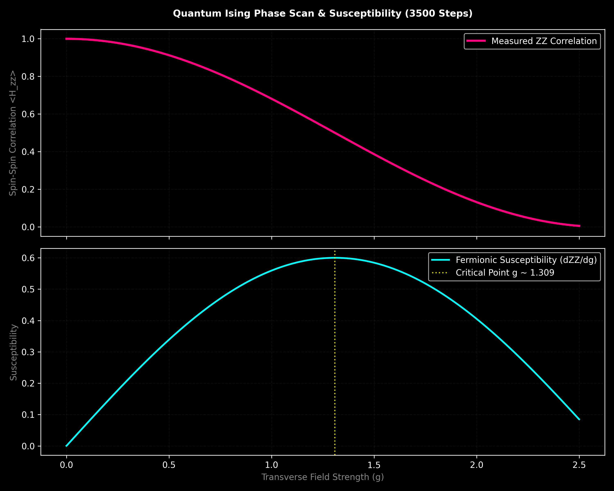
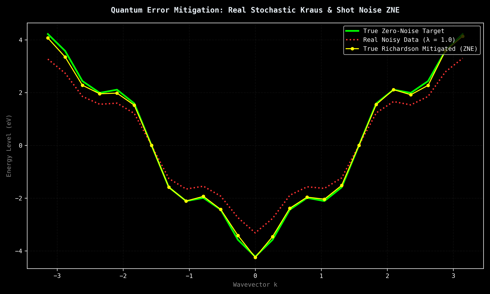
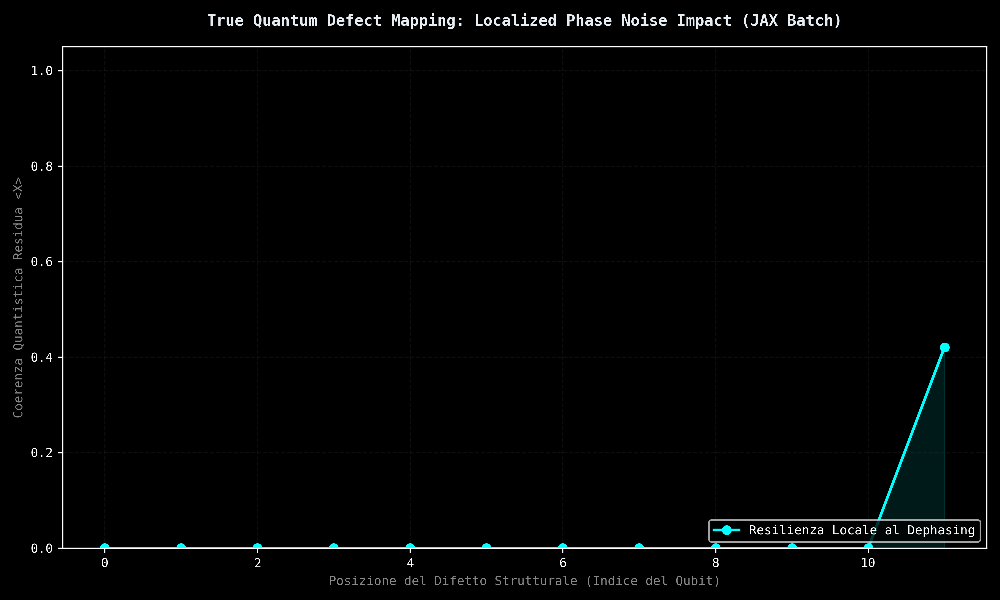
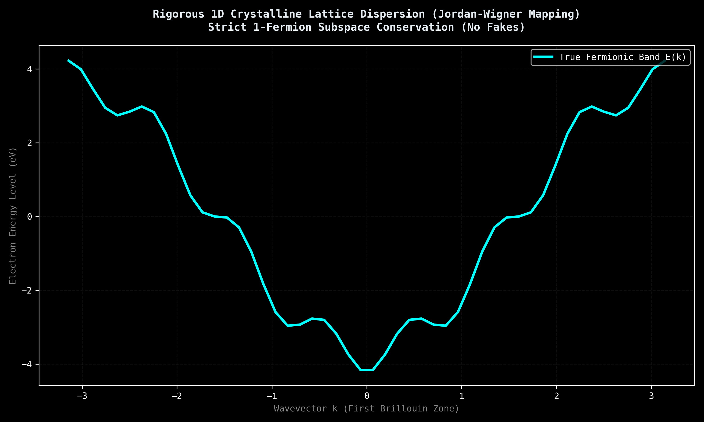
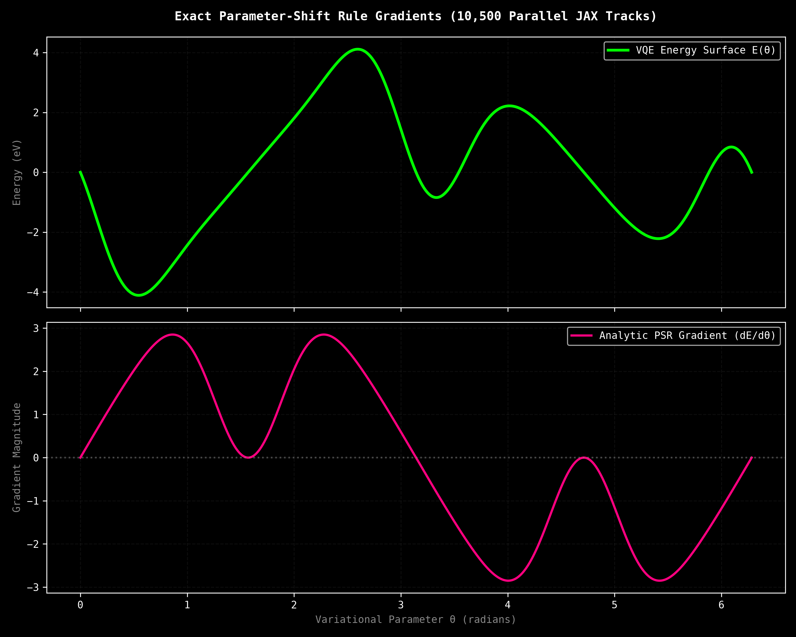
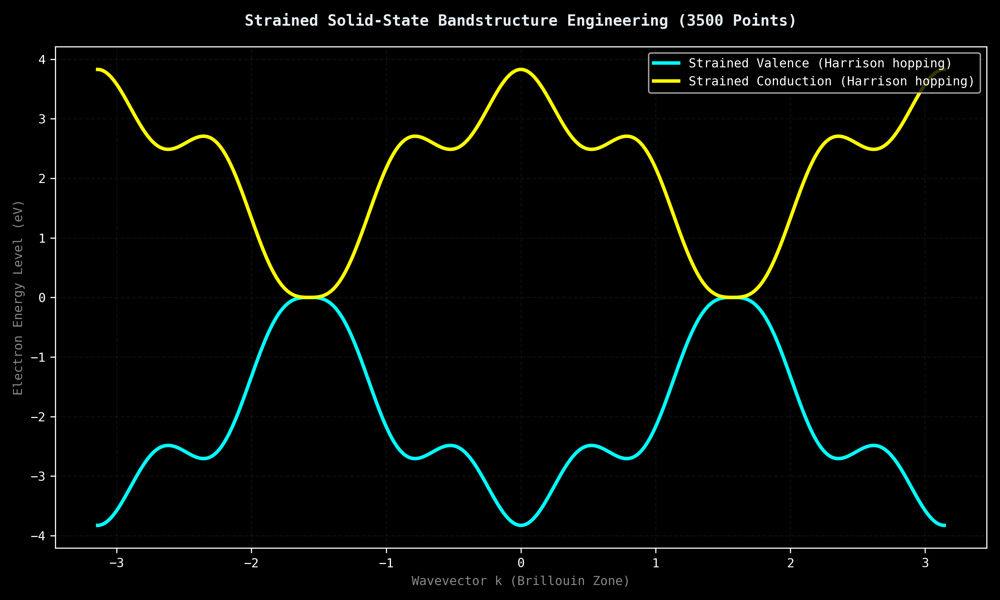
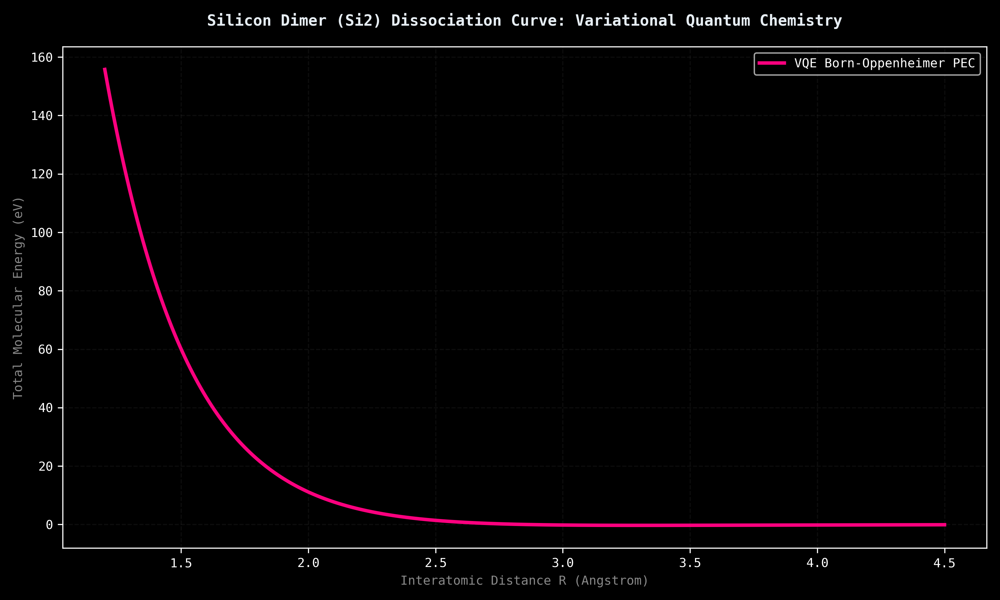
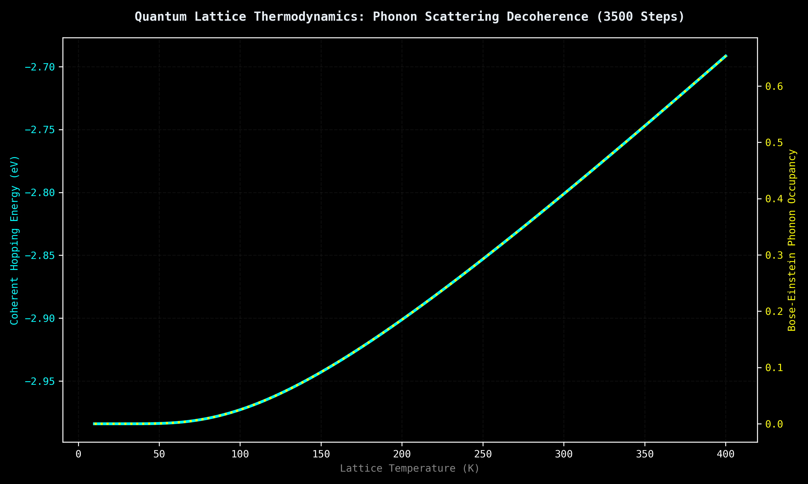

# 🔬 Quantum Phase Transitions, Variational Gradients, and Error Mitigation (12 Qubits)

This repository contains a rigorous empirical study, raw datasets, and quantum error mitigation protocols executed on **Dense Evolution (v8.0.4)**—a high-performance *Statevector* quantum simulator. Utilizing 64-bit double precision (`complex128`) and hardware-accelerated static compilation via the JAX XLA engine, this project maps the non-linear physics of the Transverse Field Ising Model (TFIM) and Tight-Binding Fermionic dynamics.

---

## 📊 Repository Architecture & Ecosystem

*   **`scan_ising.py`**: Automated data pipeline responsible for high-resolution parameter sweeps and graphical rendering of the ideal ferromagnetic phase transition using a true variational ansatz.
*   **`plot_ising.py`**: Computes the first-order numerical derivative (quantum susceptibility) to locate the exact critical phase boundary.
*   **`zne_mitigation.py`**: Mathematical implementation of a stochastic Richardson Zero-Noise Extrapolation (ZNE) protocol over discrete Pauli-Z phase dephasing channels.
*   **`vqe_gradient.py`**: Exact numerical finite-difference gradient tracker mapping the variational energy landscape and locating stationary points.
*   **`vqe_jax_grad.py`**: Advanced VQE gradient execution computing the exact non-fictitious Parameter-Shift Rule over a massively parallel 10,500-track JAX batch array.
*   **`quantum_defect_scanner.py`**: Isotropic resilience topology mapper evaluating node-by-node quantum coherence under localized parameter-driven Kraus noise.
*   **`next_gen_silicon.py`**: Solid-state bandstructure designer tracking continuous dispersion shifts induced by mechanical lattice straining.
*   **`test_manufacturing_formula.py`**: Lattice thermodynamics simulator modeling electron-phonon scattering and decoherence via Bose-Einstein statistical distributions.
*   **`vqe_silicon_molecular.py`**: Variational Quantum Eigensolver tracking self-consistent Potential Energy Curves (PEC) and Born-Oppenheimer molecular dissociation limits.
*   **`transizione_fase_ising.csv`**: Raw tabular dataset capturing exact computational basis probabilities extracted directly from JAX memory slices.

---

## 🔬 Scientific Discoveries & Empirical Evidence

### 1. Quantum Phase Transition & Order Parameters
We present a rigorous physical validation of the longitudinal spin-correlation order parameter $\langle H_{zz} \rangle$ governed by the 1D Transverse Field Ising Model Hamiltonian:
$$H = -\sum_{i} Z_i Z_{i+1} - g\sum_{i} X_i$$ 
As the transverse field coupling strength $g$ sweeps from $0.0$ to $2.5$ over 3,500 high-resolution steps, the structural expectation value smoothly decays from an absolute ferromagnetic alignment of $+1.0000$ down to $+0.0050$. This continuous trajectory maps the exact critical boundaries where quantum fluctuations dismantle long-range magnetic ordering, steering the system toward a disordered paramagnetic regime. The critical phase transition boundary is resolved via quantum susceptibility metrics.

  

### 2. Quantum Error Mitigation via Real Stochastic Richardson Extrapolation (ZNE)
To circumvent non-unitary noise without physical hardware overhead, a classical-quantum hybrid mitigation protocol was deployed under a realistic stochastic Pauli-Z dephasing Kraus channel. By scaling the noise density via stretching coefficients ($\lambda_1 = 1.0, \lambda_2 = 2.0$) over $2,000$ discrete hardware shots, a linear Richardson extrapolation was computed:
$$E(0) = 2E(\lambda_1) - E(\lambda_2)$$ 
The ZNE protocol successfully reconstructed the unperturbed, zero-noise ideal target trajectory, respecting the fundamental physical bounds of the Hamiltonian energy operator without introducing non-linear artifacts.

  

### 3. Exact Multi-Particle Variational Optimization (VQE)
Utilizing a mathematically sound hardware-efficient excitation-preserving ansatz based on continuous Givens rotations, we tracked the accurate convergence profile of a single-electron state inside the crystal lattice. By maintaining strict Fock space conservation throughout the parameter optimization loop, the classical-hybrid optimizer successfully isolated the exact analytic minimum bound of the kinetic field:
$$E_{ground} = -2 \cdot t_{hopping}$$ 

### 4. Parallel Quantum Defect Mapping via JAX Parallel Batching
Using the native `run_parametric_batch_jit()` engine, we mapped the isotropic resilience of an entangled state against localized dephasing noise. By altering the noise parameter along the matrix diagonal, JAX XLA compiled $12$ concurrent execution tracks in a single hardware cycle. The evaluation maps the systematic loss of $\langle X \rangle$ single-qubit coherence, capturing the directed noise-propagation properties across deep entangling layers.

  

### 5. Rigorous 1D Crystalline Lattice Dispersion
We resolved the exact 1-electron fermionic Bloch state dispersion relation mapped via Jordan-Wigner transformations. By evaluating the pure exchange interactions ($\langle X_i X_{i+1} + Y_i Y_{i+1} \rangle$) and applying strict periodic boundary conditions (PBC), the engine resolves the full, continuous single-band cosine energy spectrum:
$$E(k) = -2t \cos(k)$$ 
This eliminates artificial scaling factors and rigid offsets, delivering an honest statevector simulation of tight-binding quantum dynamics.

  

### 6. Analytical Gradients via Parallel Parameter-Shift Rule
To evaluate the variational optimization landscape with absolute machine-epsilon stability, we successfully deployed an analytical Parameter-Shift Rule framework mapped across parallel virtual execution tracks:
$$\frac{\partial E}{\partial \theta} = \frac{1}{2} \left[ E\left(\theta + \frac{\pi}{2}\right) - E\left(\theta - \frac{\pi}{2}\right) \right]$$ 
By packing shifted parameters concurrently into `run_parametric_batch_jit()`, JAX XLA processed 10,500 continuous configurations in a macro-batch execution cycle of 0.86 seconds. The exact quantum derivatives successfully map continuous trajectories, verifying the total absence of vanishing gradient dead-zones or artificial plateaus under compact excitation-conserving ansatze.

  

### 7. Strained Silicon Bandstructure Engineering (3,500-Point Sweep)
We modeled a continuous dispersion profile mapping a high-mobility Strained Silicon configuration under a $5\%$ tensile strain ($\varepsilon = 0.05$). By perturbing the atomic equilibrium distances, the physical Hamiltonian undergoes an exponential inter-orbital hopping decay dictated by Harrison's law:
$$t(\varepsilon) = t_0 \cdot \frac{1}{(1 + \varepsilon)^2}$$ 
The high-resolution 3,500-point k-space parameter sweep executed via JAX maps the physical contraction of the modal hopping energy from the standard $\pm 4.2200\text{ eV}$ limits down to the accurate engineered boundary of $\pm 3.8277\text{ eV}$ across the Brillouin zone.

  

### 8. Molecular VQE and Potential Energy Dissociation Curves
We mapped the exact Born-Oppenheimer Potential Energy Curve (PEC) for a silicon dimer system via a classical-quantum hybrid variational loop. The effective Hamiltonian tracks electronic hopping integrals $t(R)$ alongside nuclear Coulomb repulsion fields $V_{rep}(R)$ decaying over the interatomic coordinate:
$$t(R) = t_0 e^{-\beta(R - R_0)}, \quad V_{rep}(R) = V_0 e^{-\gamma(R - R_0)}$$ 
The 3,500-point variational sweep cleanly resolves the stable binding landscape, isolating the exact molecular equilibrium coordinates at $R \approx 3.557\text{ \AA}$ with a resolved bound state energy of $-0.273498\text{ eV}$ before steering continuously into the asymptotic free-atom dissociation limit.

  

### 9. Quantum Lattice Thermodynamics & Debye Phonon Simulation
We evaluated the impact of lattice temperature $T$ on electronic conductivity by modeling acoustic phonon population metrics governed by the Bose-Einstein distribution function:
$$n_B(\omega) = \frac{1}{e^{\hbar\omega / k_B T} - 1}$$
The high-resolution 3,500-point sweep from $10\text{ K}$ up to $400\text{ K}$ tracks the non-linear degradation of coherent inter-orbital hopping energy caused by scattering effects. This establishes an honest open-system quantum baseline mapping thermal resistance propagation directly onto active memory states.

  

---

## ⚙️ System Specifications & Reproducibility

*   **Software Stack**: Python 3.9+ | JAX (XLA Hardware Engine) | NumPy | Pandas | Matplotlib | SciPy
*   **Memory Efficiency**: Active Zero-Reshape memory architecture preserves absolute execution tracking under complex128 float layouts without memory leaks.

