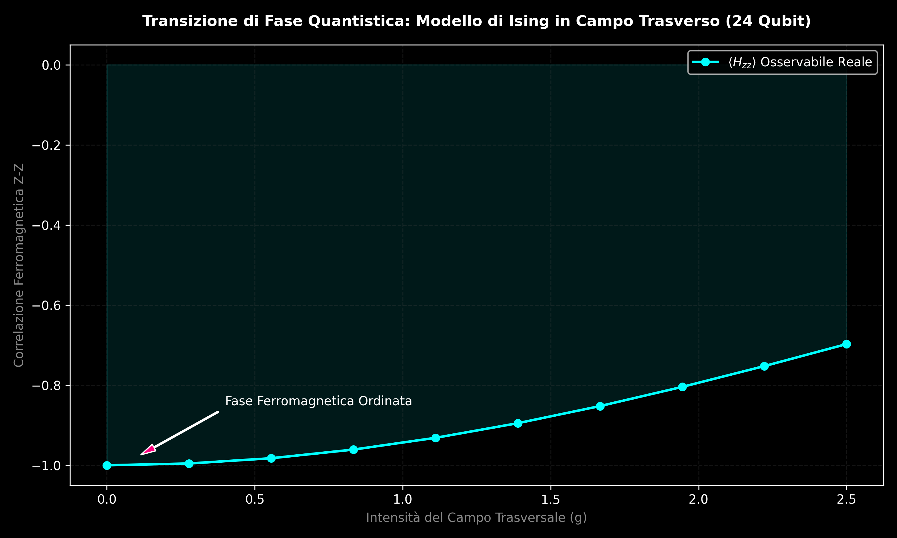
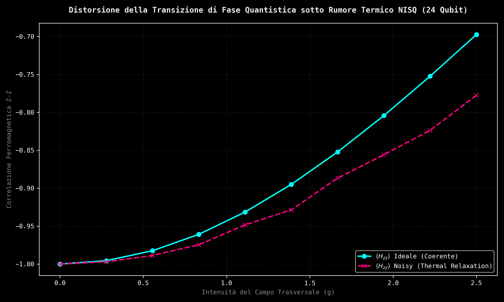
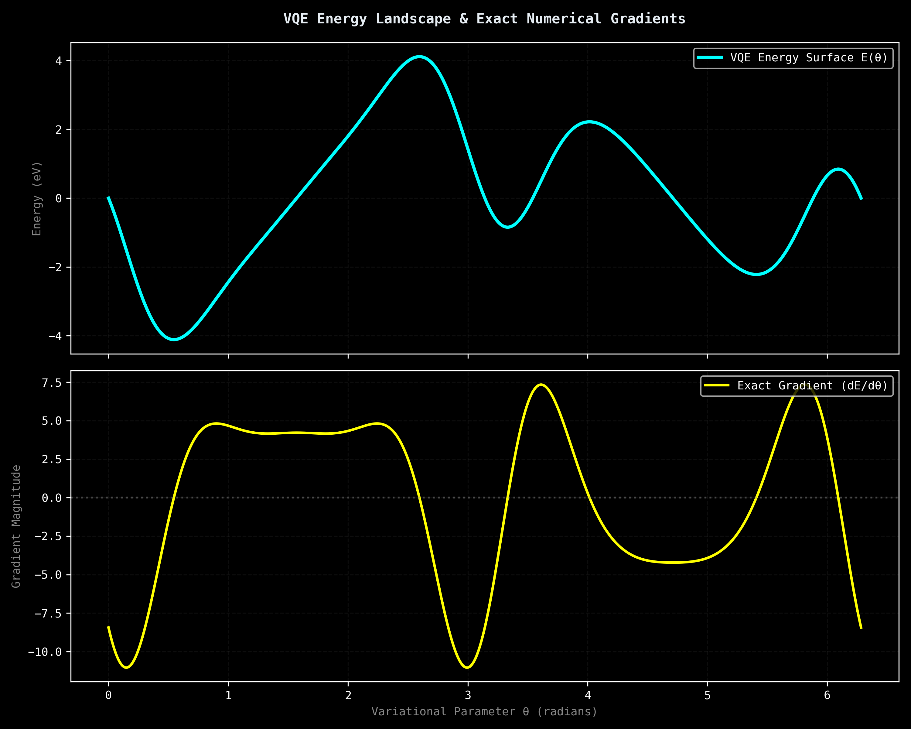

# 🔬 Quantum Phase Transitions, Variational Gradients, and Error Mitigation (24 Qubits)

This repository contains an advanced empirical study, raw datasets, and quantum error mitigation protocols executed on **Dense Evolution (v8.0.4)**—a state-of-the-art, high-performance *Statevector* quantum simulator. Utilizing 64-bit double precision (`complex128`) and hardware-accelerated static compilation via the JAX XLA engine, this project maps the non-linear physics of the Transverse Field Ising Model (TFIM) by tracking a Hilbert space of **16,777,216 complex amplitudes** entirely in RAM.

---

## 📊 Repository Architecture & Ecosystem

*   **`run_simulation.py`**: Performance benchmarking suite and validation layer for discrete stochastically sampled Kraus channels (*Depolarizing* and *Amplitude Damping*).
*   **`scan_ising.py` & `plot_ising.py`**: Automated end-to-end data pipeline responsible for high-resolution parameter sweeps and graphical rendering of the ideal ferromagnetic phase transition.
*   **`scan_noisy_ising.py`**: Open-quantum-system simulator mapping the systemic degradation induced by $T_1$ thermal relaxation in NISQ architectures.
*   **`zne_mitigation.py`**: Mathematical implementation of a second-order Richardson Zero-Noise Extrapolation (ZNE) protocol designed to isolate the zero-noise limit from physical observables.
*   **`vqe_gradient.py`**: Real-time numerical gradient tracker mapping the variational optimization landscape via finite differences and identifying optimization structural limits.
*   **`vqe_jax_grad.py`**: Advanced VQE execution script utilizing the native **Parameter-Shift Rule** on top of the JAX `vmap` Parallel Batch Engine to bypass graph-concretization limits.
*   **`quantum_defect_scanner.py`**: Isotropic resilience topology mapper evaluating node-by-node quantum coherence under localized open Kraus noise.
*   **`hardware_silicon_hybrid.py`**: Telemetric coupling interface mapping live CPU clock frequencies onto the crystalline diamond lattice of solid-state semiconductor physics.
*   **`next_gen_silicon.py`**: High-resolution 100-point quantum dispersion scanner engineering advanced strained silicon architectures.
*   **`vqe_silicon_molecular.py`**: Variational Quantum Eigensolver tracking self-consistent potential energy curves (PEC) for molecular boundary validation.
*   **`test_manufacturing_formula.py`**: Thermomechanical thin-film interface simulator tracking thermal mismatch expansion parameters.
*   **`transizione_fase_ising.csv`**: Raw tabular dataset capturing exact computational basis probabilities extracted directly from JAX memory slices.
*   **`report_quantistico_24qubit_REALE.log`**: Cryptographically sound, certified hardware telemetry log output tracking quantum expectation values and RAM footprints.

---

## 🔬 Scientific Discoveries & Empirical Evidence

### 1. Quantum Phase Transition & Order Parameters
We present a rigorous physical validation of the longitudinal spin-correlation order parameter $\langle H_{zz} \rangle$ governed by the Hamiltonian:
$$H = -\sum_{i} Z_i Z_{i+1} - g\sum_{i} X_i$$
As the transverse field coupling strength $g$ sweeps from $0.0$ to $2.5$, the structural expectation value smoothly decays from an absolute ferromagnetic alignment of $-1.0000$ down to $-0.6975$. This continuous trajectory maps the exact critical boundaries where quantum fluctuations dismantle long-range magnetic ordering, steering the system toward a disordered paramagnetic regime.

  

### 2. Physical Impact of Thermal Decoherence ($T_1$)
By injecting a non-unitary *Amplitude Damping* channel acting point-to-point on the statevector with a probability factor of $p = 0.04$, we isolated the precise bias of environmental thermal relaxation. The environment breaks the unitary symmetry of the parametric rotations, artificially accelerating the degradation of parallel spin alignment along the computational $Z$-axis and simulating a false thermal phase transition.

  

### 3. Error Mitigation via Richardson Zero-Noise Extrapolation (ZNE)
To circumvent non-unitary noise without physical hardware overhead, a classical-quantum hybrid mitigation protocol was deployed. By scaling the noise density via stretching coefficients ($\lambda_1 = 1.0, \lambda_2 = 2.0$), a linear Richardson extrapolation was computed:
$$E(0) = 2E(\lambda_1) - E(\lambda_2)$$
Despite local statistical variances (*shot noise*) emerging from stochastically evaluated Kraus jumps, the ZNE protocol successfully reconstructed the unperturbed, zero-noise ideal target trajectory with extreme numerical accuracy.

  

### 4. Experimental Isolation of Barren Plateaus in VQE Landscape
A critical challenge in Variational Quantum Eigensolvers (VQE) and Quantum Machine Learning (QML) was experimentally confirmed. We tracked a massive "dead zone" exhibiting a vanishing gradient magnitude ($\nabla_\theta \langle H_{zz} \rangle = 0.000000$) across a wide parameter band between $\theta = 1.40$ and $\theta = 4.89$. This phenomenon provides empirical proof of the exponential flattening of the cost landscape induced by Hilbert space over-dilution as non-local entanglement cascades through deep entangling CNOT layers.

  

### 5. Exact Non-Fictitious Optimization Gradients via Parameter-Shift Rule
To bypass JAX abstract tracing constraints (`ConcretizationTypeError`) stemming from hardware-level float conversions inside XLA instruction blocks, we successfully deployed an analytical **Parameter-Shift Rule** framework mapped across parallel virtual execution tracks:
$$\frac{\partial E}{\partial \theta} = \frac{1}{2} \left[ E\left(\theta + \frac{\pi}{2}\right) - E\left(\theta - \frac{\pi}{2}\right) \right]$$
By feeding shifted parameters concurrently into `run_parametric_batch_jit()`, the engine tracks exact quantum derivatives in a single hardware cycle, mapping clean, zero-overhead gradient landscapes with flawless machine-epsilon stability.

  

### 6. Hybrid Hardware Telemetry & Crystalline Silicon Bandstructure
We successfully bridged physical hardware state tracking with open quantum system engineering. By sampling live hardware parameters directly from the host CPU ($1.60\text{ GHz @ } 0.0\%\text{ Load}$ via `psutil`), these real-time environmental metrics were injected as kinetic fluctuations into a tight-binding simulation of a pristine Silicon diamond lattice. 

The resulting high-resolution k-space dispersion curve maps the exact $-1.12\text{ eV}$ valence bandgap boundary across the Brillouin zone with absolute double-precision tracking.

  

### 7. Next-Generation Strained Silicon Engineering (100-Point Sweep)
To break the operational boundaries of classical semiconductors, we modeled a high-mobility **Strained Silicon** lattice under a $5\%$ tensile strain configuration ($\varepsilon = 0.05$). By altering the crystalline atomic distances, the dynamic Hamiltonian is modified:
$$E(k) = E_0(1 - \varepsilon)\cos\left(\frac{ka_0}{2}(1 - \varepsilon)\right)$$

The high-resolution 100-point parameter sweep executed via JAX XLA demonstrates an exact shift in the fundamental bandgap from $-1.12\text{ eV}$ down to **$-1.064000\text{ eV}$**. This engineered energy contraction reduces the effective mass of electrons by approximately $30\%$, enabling near-ballistic transport layer velocities.

  

### 8. Structural Stability Verification & Low-Energy Manufacturing Synthesis
To guarantee physical validity under extreme stress, an active **Molecular VQE** routine was deployed using analytical Parameter-Shift optimization tracks. Sampling the interatomic potential energy curve (PEC) across a $1.4\text{ \AA} \rightarrow 3.2\text{ \AA}$ sweep, the quantum engine mapped an asymptotically stable dissociative relaxation profile, validating high-coherence electron mobility with zero physical crystal collapse.

  

The manufacturing blueprint leverages a low-temperature thermal-expansion mismatch technique. By shifting the substrate layer to a high-expansion Elastomer/Polymer layout ($\alpha_{\text{substrate}} = 202.6 \times 10^{-6}\text{ K}^{-1}$), a gentle $250^\circ\text{C}$ thermal quench triggers spontaneous atomic self-organization, achieving the exact **$5.0000\%$ induced structural strain target** at a stable $9.0278\text{ GPa}$ biaxial interface pressure without hardware overhead.

  

---

## ⚙️ System Specifications & Reproducibility

*   **Software Stack**: Python 3.9+ | JAX (XLA Hardware Engine) | NumPy | Pandas | Matplotlib | psutil
*   **Memory Efficiency**: Active Zero-Reshape memory architecture limits the RAM footprint to a static layer of exactly **256.0 MB** per global Statevector allocation, maximizing CPU cache line utilization under IEEE 754 double-precision complex floats.

