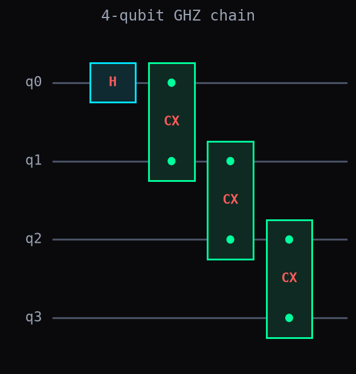
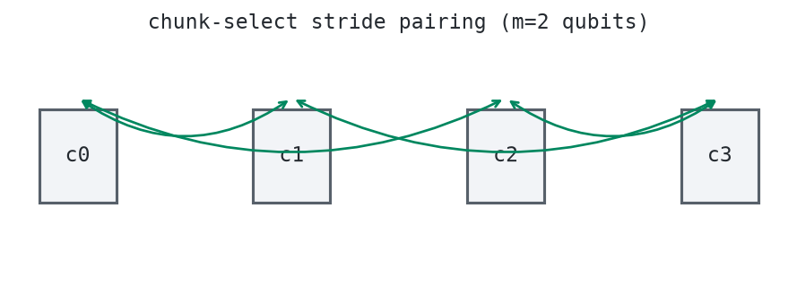
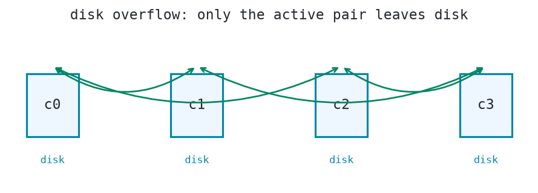

# Chunk: Multi-Device and Disk-Backed Simulation

!!! note
    The implementation lives in the main library:
    [`dense_evolution.Chunk`](https://tatopenn-cell.github.io/Dense-Evolution/api/chunk/)
    (shipped in `dense-evolution>=8.1.67`, with its own unit test suite in
    the main repo). This page is the experimental log for what this repo
    adds on top: the distributed path actually run on real multiple
    devices, and the disk-overflow path actually run against real files —
    not just demonstrated up to the point where they would run.

## Why a normal simulator isn't enough

A statevector simulator has to hold one complex number for every possible
outcome of the qubits it simulates. Four qubits means 16 outcomes — a tiny
array. Forty qubits means over a trillion outcomes — many terabytes, more
than any single computer's RAM.

`Chunk` runs the exact same kind of circuit without ever building that one
giant array. It splits the array into smaller, RAM-sized pieces, and runs
gates across those pieces instead. This page checks, by really running it,
that three different ways of holding those pieces — all in one computer's
RAM, spread across several separate devices, or spilled to disk when even
several devices aren't enough — all compute the exact same physics.

## Step 1. The circuit: a 4-qubit GHZ chain

```python
import dense_evolution as de

qasm = 'OPENQASM 2.0; include "qelib1.inc"; qreg q[4]; h q[0]; cx q[0],q[1]; cx q[1],q[2]; cx q[2],q[3];'
circuit = de.QASMParser().parse(qasm)
ops = circuit.to_tuples()
```

`h q[0]` puts qubit 0 into an equal superposition of `0` and `1`. Each
`cx` (controlled-NOT) then copies that qubit's value onto the next one, so
the whole chain ends up either all-`0` or all-`1`, never anything in
between — the standard "GHZ state" used throughout quantum computing to
check that entanglement survives a pipeline end to end.



## Step 2. The reference answer: one plain simulator

```python
baseline = de.DenseSVSimulator(4)
baseline.run_circuit_jit(ops)
baseline.get_probabilities().round(4)
```

```
array([0.5, 0. , 0. , 0. , 0. , 0. , 0. , 0. , 0. , 0. , 0. , 0. , 0. , 0. , 0. , 0.5])
```

Half the probability on outcome `0000`, half on `1111`, nothing else —
exactly the GHZ signature. Every other step on this page checks against
this same number.

## Step 3. Splitting the array into 4 pieces, still in RAM

```python
from dense_evolution.backends.chunk import Chunk
from dense_evolution import chunk as chunk_mod

chunk_mod.get_dynamic_chunk = lambda dtype_target: 2
ram = Chunk(4)
ram.run_chunk(ops)
ram.num_chunks, ram.get_probabilities().round(4)
```

```
(4, array([0.5, 0. , 0. , 0. , 0. , 0. , 0. , 0. , 0. , 0. , 0. , 0. , 0. , 0. , 0. , 0.5]))
```

Forcing the safe piece size down to 2 qubits splits the 4-qubit array into
4 separate pieces of 4 amplitudes each — on a real machine `Chunk` only
does this once a circuit genuinely doesn't fit, but forcing it here shows
the split working on a circuit small enough to check by eye. Identical
result to Step 2, computed as 4 small pieces instead of 1 array.

## Step 4. The same 4 pieces, on 4 real separate devices

Each of those 4 pieces can also live on its own physical device instead of
sharing one process's RAM. Two of the 4 qubits (the two `Chunk` used to
pick which piece a gate belongs to) decide, for a gate that touches both
pieces, which pair of pieces needs to exchange data:



```python
import os
os.environ["XLA_FLAGS"] = "--xla_force_host_platform_device_count=8"
import jax

dist = Chunk(4)
dist.run_chunk_distributed(ops)
jax.device_count(), dist.get_probabilities().round(4)
```

```
(8, array([0.5, 0. , 0. , 0. , 0. , 0. , 0. , 0. , 0. , 0. , 0. , 0. , 0. , 0. , 0. , 0.5]))
```

`XLA_FLAGS` set before JAX starts up makes this machine present 8 separate
CPU devices instead of 1 — enough to give each of the 4 pieces its own
device. The two pieces on either side of an arrow above really send their
data to each other over that connection (`jax.lax.ppermute`), not through
shared memory. Same GHZ result again.

## Step 5. Past even that: pieces that don't all fit at once

```python
disk = Chunk(4, memory_threshold=0.999999, allow_disk_overflow=True)
disk.run_chunk(ops)
disk.get_probabilities().round(4)
```

```
(array([0.5, 0. , 0. , 0. , 0. , 0. , 0. , 0. , 0. , 0. , 0. , 0. , 0. , 0. , 0. , 0.5]))
```

`memory_threshold=0.999999` forces `Chunk` to decide the 4 pieces can't
safely fit together — on a real machine this only happens at a piece
count too large for actual RAM. `allow_disk_overflow=True` makes it fall
back to keeping every piece as a file on disk instead of raising an
error, loading only the one or two files a gate actually needs at a time:



Same GHZ result a third time — call `disk.close()` afterward to remove the
temporary files.

## Real timing, all three ways (one run on this machine)

| Path | Time | Matches Step 2? |
|---|---|---|
| Baseline (Step 2) | 564 ms | — (reference) |
| RAM, 4 pieces (Step 3) | 992 ms | Yes |
| 4 real devices (Step 4) | 1079 ms | Yes |
| Disk-backed (Step 5) | 4112 ms | Yes |

All three include a one-time JAX compilation cost on first use — none of
this is a fair speed comparison, only a correctness one. The ordering
itself is still the expected one: real network exchange between devices
costs more than reading from the same process's RAM, and real file I/O
costs far more than either.

---

## Details

### Two real papers behind these two extra paths

The device-to-device pairing in Step 4 follows the same scheme LaRose
2018 ([arXiv:1801.01037](https://arxiv.org/abs/1801.01037), "Distributed
Memory Techniques for Classical Simulation of Quantum Circuits") used on
a real MPI/OpenMP supercomputer (up to 33 qubits across 26 processors): a
fixed number of qubits chosen to select which piece of the array a gate
belongs to, the rest handled purely locally within a piece. This repo's
own run above is 8 simulated CPU devices on one machine, not a real
multi-host cluster — that remains untested here.

The disk-backed fallback in Step 5 follows Pednault et al. 2019
([arXiv:1910.09534](https://arxiv.org/abs/1910.09534), "Leveraging
Secondary Storage to Simulate Deep 54-qubit Sycamore Circuits") — the
technique IBM used to classically simulate circuits believed at the time
to be beyond classical reach, by never holding more than the currently
active pieces in memory.

### Why disk-backed can't just be "a memmap"

The obvious-looking shortcut — back each piece with a `numpy.memmap` file
instead of a plain array — doesn't work here: `dense_evolution`'s arrays
are always live `jax.Array` objects, and JAX has no notion of a
memmap-backed device array. A piece only genuinely "lives on disk" while
idle if it isn't loaded into a `jax.Array` at all until a gate needs it —
which is what `dense_evolution/backends/chunk/disk_overflow.py` actually
does, one gate (or one pair of pieces) at a time. This is the same reason
the main library's own `docs/api/chunk.md` gives for this design; see
that page for the phase-classification details.

### Why the main library's own docs stop short of this

`docs/api/chunk.md`'s own Step 6 demonstrates the distributed path only
as far as the `RuntimeError` it raises when too few JAX devices are
present — the library's own doc build never sets `XLA_FLAGS` beforehand.
This experiment sets it as the very first lines of the script, before
`dense_evolution` or `jax` are imported at all — JAX's device count is
fixed the first time it initializes, so setting the flag any later has no
effect — specifically so this page could show the real communication path
running, not just the guard clause in front of it.

### The distributed check only runs for real outside the shared test suite

`XLA_FLAGS` only works if it's set before JAX initializes for the very
first time in the whole process — and this repo's CI runs every test
file in one shared pytest process. If an earlier-collected test file
imports `dense_evolution`/`jax` first, JAX has already locked in 1 real
device by the time this script's own `XLA_FLAGS` line runs, and Step 4
falls back silently to reporting it as unavailable instead of running.
Running `python scripts/chunk_distributed_disk_experiment.py` on its own
(as this page's own numbers were produced) always hits the real
8-device path — `tests/test_chunk_distributed_disk_experiment.py` skips
that one check, with the reason above, when it detects this.

### Reproducing this page

`scripts/chunk_distributed_disk_experiment.py` runs everything on this
page top to bottom, including generating the three images above via
`dense_evolution.circuits.diagram.plot_circuit` (Step 1) and this
script's own small matplotlib helper for the piece-pairing diagrams
(Steps 4-5) built from the run's own real `num_chunks`/stride values, not
drawn by hand. `tests/test_chunk_distributed_disk_experiment.py` checks
its results on every CI run.

## See Also

- [Chunk API reference](https://tatopenn-cell.github.io/Dense-Evolution/api/chunk/) — the full guide this experiment builds on, including the in-RAM-only Steps 1-5.
- [Traversable-Wormhole-Inspired Quantum Teleportation](wormhole_syk_teleportation.md) — another experiment log built directly on top of a published main-library feature.
