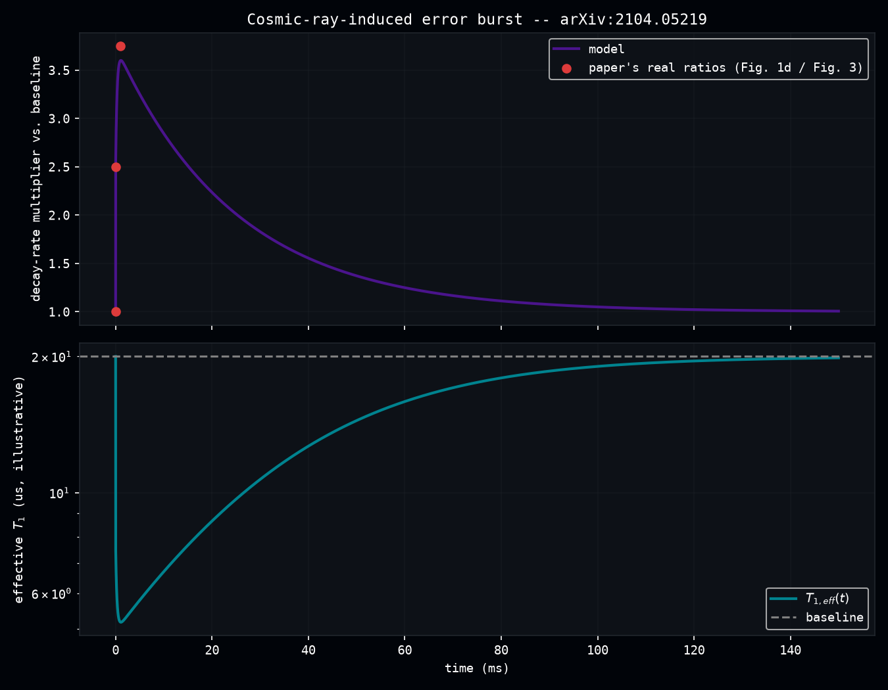
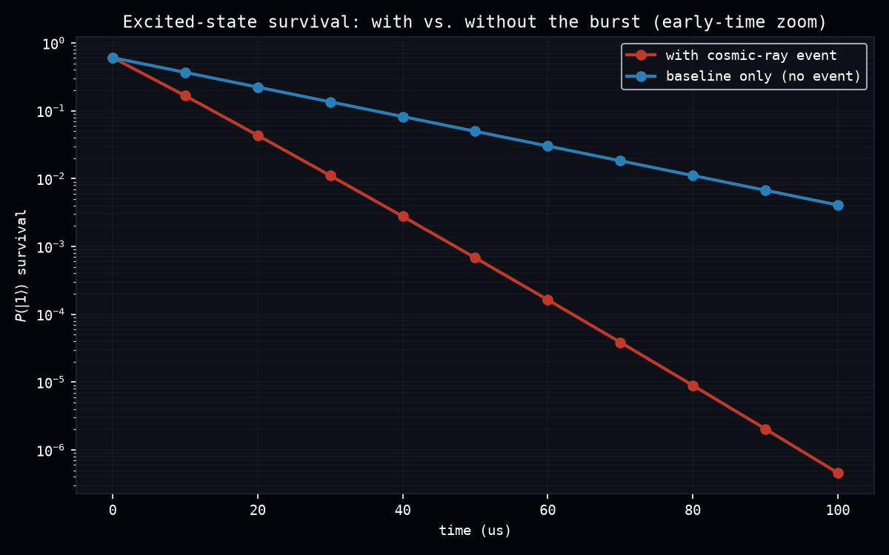

# Cosmic-Ray Error Bursts: Validating the Dissipative Counterpart to Trotter Pulses

arXiv:[2104.05219](https://arxiv.org/abs/2104.05219) (McEwen et al., published in *Nature Physics*) directly measures what happens when a cosmic-ray/gamma-ray impact hits a 26-qubit Google Sycamore chip: a burst of quasiparticles transiently collapses the chip's effective T1, pushing simultaneous decay errors from a baseline ~4/26 qubits to ~10/26 within ~10us, further to ~15/26 over ~1ms, then back down exponentially with a time constant tightly grouped in the 25-30ms range (fitted across 415 real events). This experiment reproduces that measured shape with `dense_evolution.continuous_dissipative_evolve`, promoted straight out of the discussion that followed `germanium_iswap_validation.py` -- its first real-data validation.

**Scope note:** this validates `continuous_dissipative_evolve` (Dense-Evolution PR [#122](https://github.com/tatopenn-cell/Dense-Evolution/pull/122)) and an amplitude-damping channel matching this paper's own reported error asymmetry. It does *not* reproduce the paper's matched-filter event-detection algorithm, the spatial hotspot dynamics across the real 26-qubit array, or the T-RReCS multi-timescale measurement protocol -- this is a single representative qubit, not a 26-qubit simulation.

## Why this needed a new utility, not the one already promoted

`continuous_pulse_evolve` (Dense-Evolution PR [#121](https://github.com/tatopenn-cell/Dense-Evolution/pull/121)), promoted from `germanium_iswap_validation.py`'s `exact_final_state`, evolves a *pure state* under a time-dependent *Hamiltonian* -- correct for a coherent control pulse, wrong for this paper's mechanism. The paper's own asymmetry finding (decay errors only, no excess excitation errors in their control RReCS run) confirms this is quasiparticle-poisoning dissipation, not a coherent drive: a rising and falling *decay rate*, which cannot be written as a Hermitian Hamiltonian coefficient. `continuous_dissipative_evolve` scans a **density matrix** through a time-dependent **CPTP channel** instead -- the same `jax.lax.scan` pattern, applied to the physics that actually needs it.

## Two honest approximations, kept separate from what's paper-exact

1. **The rise shape is ours, the decay is the paper's own fit.** The paper states two descriptive rise timescales (~10us, ~1ms) with precise error counts at each, but publishes no closed-form rise fit -- modeled here as two sequential saturating exponentials (`tau1=3us`, `tau2=300us`) chosen only to pass through those two points. The **decay**, in contrast, uses the paper's own directly fitted single-exponential time constant (25ms, the central value of their reported 25-30ms range).
2. **The baseline T1 is an assumption, the event's scaling is not.** The paper's raw baseline count ("~4/26") mixes true T1 decay with finite readout infidelity by its own admission, so reading it directly as a single-qubit decay probability implies an unrealistically short T1 (~6us). Instead, the model fixes a representative baseline T1 (`T1_BASELINE_ASSUMED_US = 20`, a plausible value for this hardware generation, isolated to one named constant) and scales the instantaneous decay probability by the paper's own real, dimensionless ratios -- peak/baseline = 15/4 = 3.75x, intermediate/baseline = 10/4 = 2.5x.



The top panel's model curve passes through the paper's three real (time, ratio) points by construction; the bottom panel translates the same profile into an effective T1 (illustrative, not a literal measured device T1 -- see the script's docstring), dropping 4x at peak and recovering to baseline over the fitted 25ms tail.

## Amplitude damping, not depolarizing

`dense_evolution.global_depolarizing_channel` (the SPAM channel promoted from the germanium experiment) is **symmetric** -- it mixes any state toward the fully-mixed state. This paper's mechanism is **asymmetric**: population only ever moves `|1>` &rarr; `|0>`. The experiment defines its own amplitude-damping channel matching that, and checks directly that a `|0><0|` input passes through untouched -- the real signature the paper uses to identify quasiparticle poisoning.

## Early-time survival: where the event's effect is actually visible

A continuously idle, unreset qubit with a 20us baseline T1 has already decayed to numerical zero long before the 25ms recovery tail is relevant -- 1ms is 50 baseline lifetimes. That is not a bug in the model; it is the paper's own point about quantum error correction needing to run faster than T1. The event's real, checkable effect is on the **early decay rate**, while both curves are still numerically distinguishable from zero:



At `t=20us`, survival with the event is **5.1x lower** than the undisturbed baseline (`0.043` vs. `0.223`) -- directly consistent with the paper's own framing of these events as "catastrophic" for any computation trying to hold a state through one.

## Status

Validated in `scripts/cosmic_ray_burst_validation.py` and `tests/test_cosmic_ray_burst_validation.py` (7/7 passing). Uses `continuous_dissipative_evolve`/`amplitude_damping_channel`, both released in Dense-Evolution v8.1.67.

## Reproduce

```bash
python scripts/cosmic_ray_burst_validation.py
pytest tests/test_cosmic_ray_burst_validation.py -v
```
