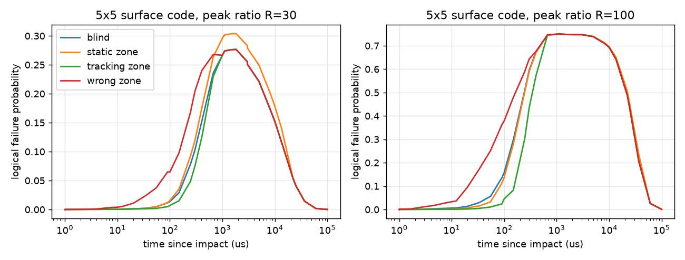

# Cosmic-Ray Bursts: When Does Knowing the Hot Zone Help the Decoder?

**In plain terms**: a cosmic ray hits a superconducting chip, errors first concentrate on a few qubits, then spread until the whole chip is affected. This page asks whether a decoder that knows *where* the burst is, and follows it as it spreads, fails less often than one that does not. The answer: yes, but only in the first ~300 microseconds. After ~1 ms the zone covers everything and the knowledge is useless.

It follows [Cosmic-Ray Burst Validation](cosmic_ray_burst_validation.md), which reproduces the time profile of arXiv:[2104.05219](https://arxiv.org/abs/2104.05219) (McEwen et al.). Here the profile drives three decoding studies.

## What the paper gives, and what it does not

| Needed for the study | In arXiv:2104.05219 |
|---|---|
| Decay errors only, no excitation errors | Yes (Fig. S1) |
| Hot zone, then spread over the chip | Yes: localized hot spot at impact, whole 26-qubit patch elevated by ~1.5 ms (Fig. 3c) |
| Per-qubit error rate in the hot spot | Time-averaged over 300 us windows, post-hoc |
| Which qubits erred in a given run | No |
| Real-time detection that could feed a decoder | No: events are found afterwards with a matched filter over 60 s datasets |

So a decoder can be given the zone as a *prior* (elevated per-qubit error probability), which is what the paper supports, but not the list of qubits that flipped.

## Step 1: Perfect knowledge of the flipped qubits (erasure)

`scripts/cosmic_ray_erasure_decoding.py` treats the hot-spot qubits that flipped as heralded erasures of a Steane [[7,1,3]] block. Extended with the hot-spot size (1-7 qubits), the time since impact, and imperfect detection (false negatives, false positives, latency), all computed exactly by enumerating the 2^7 X-error patterns.

The gain over the blind decoder is ~22% at the peak for a 2-qubit zone, and for a 3-qubit zone it erodes roughly in proportion to the false-negative rate (about 50% left at 30% missed flags, 25% at 50%). False positives up to 5% change little. Flags that arrive after ~10 ms remove the gain exactly where it matters (the 1-1.5 ms peak). This step assumes the decoder knows the exact qubits that flipped, which the paper does not provide, so it is an upper bound.

## Step 2: The zone as a prior, with decay errors

`scripts/cosmic_ray_zone_weighted_decoding.py`: decay errors (amplitude damping, Pauli-twirled to X, Y with gamma/4 and a small Z term), and maximum-likelihood decoding on stabilizer cosets. Three decoders that differ only in the prior they assume: blind (baseline everywhere), zone (knows hot qubits and strength), wrong zone. Exact, no sampling.

- With the peak ratio R of 3.75 or 10 the zone prior changes nothing: one baseline error is always more likely than two hot-qubit errors.
- With R=30 or 100 (hot-qubit decay probability 28% or 95%, closer to the paper's hot spot) and a small zone, failures drop by 49% (2 qubits, R=30) up to 95% (R=100).
- A wrong zone is 2.4 to 4.3 times worse than the blind decoder at R=30 (zones of 2-5 qubits).

## Step 3: A zone that spreads

`scripts/cosmic_ray_spreading_zone_decoding.py`: the front starts at 2 qubits and covers k(t) = 2 + (N-2)(1 - exp(-t/300 us)) qubits; the burst strength follows `cosmic_ray_burst_profile`. A fourth decoder knows the initial patch only (static). Averaged over 120 random spreading orders on the 7-qubit block.

Tracking the zone helps between 10 and 300 us (up to 77% at R=100) and gives 0% from 1 ms on. The average over the first 100 ms is +0.3%. The static decoder is 25% worse than blind at R=30.

## Step 4: A 5x5 surface code (Kaggle)

`scripts/cosmic_ray_surface_zone_kaggle.py` runs on Kaggle: rotated surface code, distance 5, 25 qubits, MWPM decoding (`pymatching`) with per-qubit weights from each prior, on a true 5x5 geometry with the zone spreading by distance from the impact qubit, averaged over all 25 impact positions, 50,000 shots per point. It first checks that every single and double X, Z, Y error is corrected. Raw results: `data/cosmic_ray_surface_zone_results.json`.



| R | t (us) | blind | static | tracking | wrong zone | tracking gain |
|---|---|---|---|---|---|---|
| 30 | 100 | 0.0138 | 0.0154 | 0.0070 | 0.0648 | 49% |
| 30 | 300 | 0.1028 | 0.1190 | 0.0750 | 0.2042 | 27% |
| 30 | 1000 | 0.2666 | 0.2961 | 0.2666 | 0.2666 | 0% |
| 100 | 10 | 0.0060 | 0.0026 | 0.0011 | 0.0332 | 82% |
| 100 | 100 | 0.1579 | 0.1370 | 0.0456 | 0.3786 | 71% |
| 100 | 300 | 0.5960 | 0.5899 | 0.4353 | 0.6435 | 27% |
| 100 | 1000 | 0.7483 | 0.7485 | 0.7498 | 0.7493 | 0% |

Averaged over the first 100 ms: tracking gain +0.3% at both R values; static -11.6% (R=30) and -3.6% (R=100); wrong zone 1.01x and 1.00x the blind rate. The larger code does not lengthen the useful window: the paper's chip also has 26 qubits and saturates in about 1.5 ms.

## What this means

A zone-aware decoder is useful only if the burst is detected and localized within roughly 300 us of the impact, and the zone map is kept current. A stale or wrong map is worse than no map. At saturation the failure probability is 27-75% for every decoder, consistent with the paper's conclusion that mitigation on the chip itself is needed.

## Details

- **Assumptions chosen here, not measured:** baseline decay probability 0.01; initial patch of 2 qubits; spread time 300 us (the paper estimates ~180 us for the initial spread and saturation near 1-1.5 ms); Pauli-twirled amplitude damping; one snapshot in time (code capacity), X and Z decoded independently in the surface-code study.
- **The 3.75x ratio** in `cosmic_ray_burst_profile` is 15/4, the chip-wide count of simultaneous errors at ~1 ms over a baseline of ~4. Applying it per qubit understates a localized hot spot, hence the stronger R=30 and R=100 cases.
- **Not searched:** whether zone-aware decoding of cosmic-ray bursts has been studied before; the literature check covered the indexed papers only (McEwen et al. 2104.05219, Gu et al. 2408.00829 on erasure qubits, Grassl-Beth-Pellizzari 1997 on the erasure channel).
- **Step 1 history:** an earlier wording of `cosmic_ray_erasure_decoding.py` credited the paper with real-time identification of the hit qubits and cited a "Fig. 3c" hot-spot size of exactly 2 qubits; the docstring now states what the paper supports.

## Reproduce

```bash
python scripts/cosmic_ray_erasure_decoding.py
python scripts/cosmic_ray_zone_weighted_decoding.py
python scripts/cosmic_ray_spreading_zone_decoding.py
```

The 5x5 surface-code study is a Kaggle notebook (`scripts/cosmic_ray_surface_zone_kaggle.py`, internet on, CPU).
