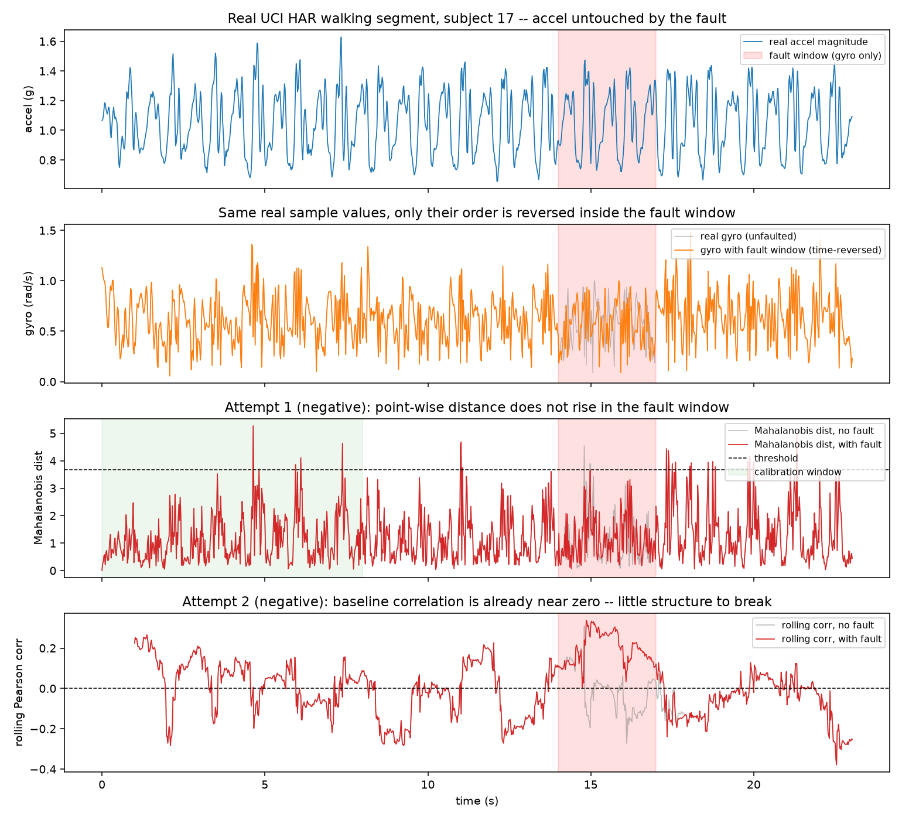

# Cross-Channel Mahalanobis Fusion: A Real Negative Result

The Mahalanobis-SVDD Audio-IMU paper (Yang, Zhao et al. 2025, arXiv:2505.05811, indexed
in quantumrag) claims a fault can break the normal correlation between two sensor
channels without being a large deviation in either channel alone -- and that a joint
distance over both channels catches this where a single-channel detector structurally
cannot. This experiment tests that claim directly, closed-form only (no neural network,
per explicit instruction), on real IMU data already used in this repo (`imu_sensor_
validation.md`): UCI HAR's real accelerometer and real gyroscope, subject 17, a real
23-second WALKING segment.

## Step 1. Two real channels, one real fault

```python
accel = real_accel_magnitude(subject=17, activity="WALKING")   # 3-axis, real device
gyro = real_gyro_magnitude(subject=17, activity="WALKING")     # 3-axis, same real device
```

`accel` and `gyro` come from the same real sensor, at the same real timestamps, during
real human gait -- two genuinely different sensing modalities (linear acceleration vs
angular velocity) that should, in principle, move together with the gait rhythm.

The real test is in the fault: swap a 3-second window of `gyro` for a **time-reversed**
copy of itself.

```python
gyro_fault = gyro.copy()
gyro_fault[700:850] = gyro[700:850][::-1]
```

Every sample value inside that window is still real and still has exactly the same
distribution as before (verified: `sorted(gyro_fault[700:850]) == sorted(gyro[700:850])`)
-- a single-channel detector calibrated on magnitude has little reason to fire. Only the
real temporal correspondence with the concurrently-recorded `accel` signal is destroyed.
This is deliberately a *correlation-breakdown* fault, not a magnitude fault -- exactly
the case the paper's method is supposed to catch and a single-channel detector is not.

## Step 2. Attempt 1: a point-wise joint Mahalanobis distance

```python
d_accel, d_gyro = diff(accel), diff(gyro_fault)
mean, cov = fit(d_accel[:400], d_gyro[:400])   # real calibration window, no lookahead past it
dist[t] = mahalanobis([d_accel[t], d_gyro[t]], mean, cov)
```

Result: **0% of the fault window flagged** -- worse than either single-channel detector
alone (accel 4%, faulted gyro 3%), and no higher than the real false-positive rate on
unfaulted data (2.5%).

Diagnosed, not just accepted: a point-wise joint distance only asks whether one
`(d(accel)[t], d(gyro)[t])` pair looks unusual on its own. It has no way to tell that the
pairs are arriving in the *wrong order* -- real gait excursions are close enough to
time-symmetric that a reversed sample still lands inside the normal-looking ellipse most
of the time.

## Step 3. Attempt 2: a rolling correlation (sensitive to order, unlike Step 2)

```python
corr[t] = pearson_corr(d_accel[t-50:t], d_gyro[t-50:t])   # 1s window, real gait cycle
```

This construction *is* sensitive to reordering. But the real baseline correlation, on
unfaulted real data, turned out to already be close to zero (mean 0.04, std 0.11 over the
calibration window) -- there was little real cross-channel structure left for the fault
to break in the first place. The fault window's mean (0.20) is barely different.



## Result

Neither closed-form construction beat single-channel detection on this real data. Kept
as a real, disclosed negative finding, not smoothed into a positive story -- consistent
with this repo's own standard (e.g. the causal `healing_filter` rewrite's dead end).

---

## Details

**Why accelerometer+gyroscope, not audio+IMU**: no real paired audio+IMU dataset was
available in-session. Accel and gyro are two genuinely different real IMU sensing
modalities from the same real device at the same real timestamps -- the part of the
underlying hypothesis (cross-modality correlation as a fault signal) this experiment
could actually test honestly with data on hand.

**Likely cause of the weak baseline correlation, not chased further here**: both channels
were reduced to 3-axis Euclidean magnitudes before comparison. That discards the
directional/phase information (which axis is rotating vs accelerating, and when) that
most plausibly carries the real physical coupling between linear acceleration and
angular velocity during gait. A fairer test would compare matched per-axis signals
(e.g. `total_acc_x` against the gyro axis measuring rotation about the corresponding
plane) instead of magnitudes -- a real, separate undertaking (correct axis/frame
alignment between the two real sensors), not attempted here.

**Not a promotion candidate.** Both real domain-1 attempts came back negative -- this
project's own 2-domain bar for promoting a Discovery utility to Dense-Armor was never
in reach here; the result itself is the deliverable of this experiment, not a shipped
function.

**Reproducing this**: `python scripts/robot_sensor_validation/cross_channel_mahalanobis_imu.py`
(downloads the real 61MB UCI HAR dataset on first run if not already cached from
`imu_sensor_validation.md`'s own experiment).
