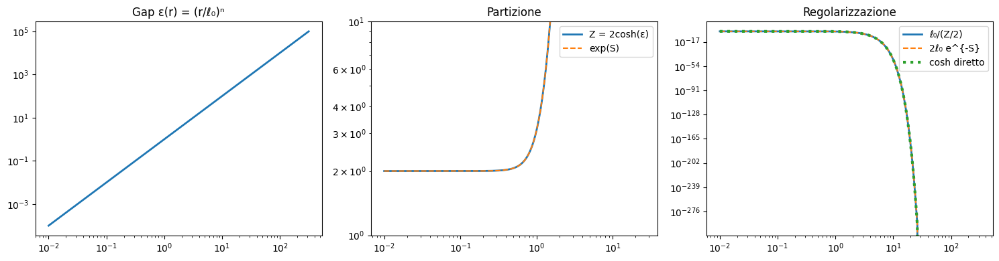
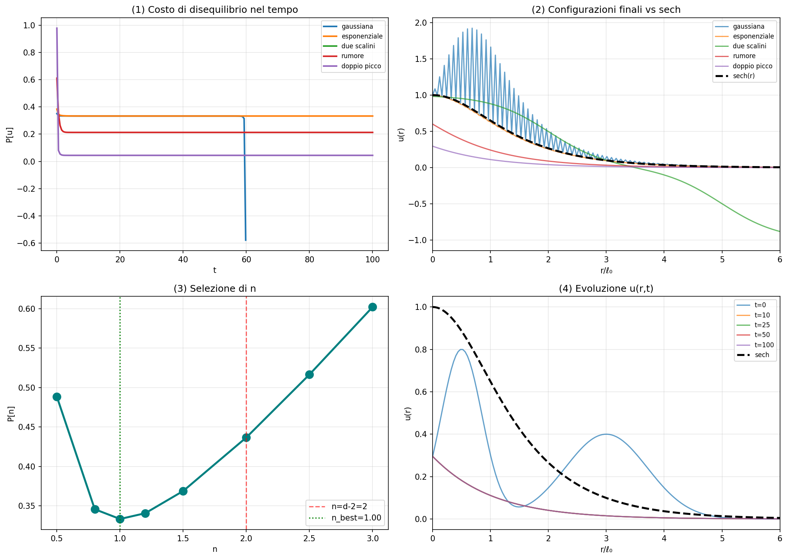
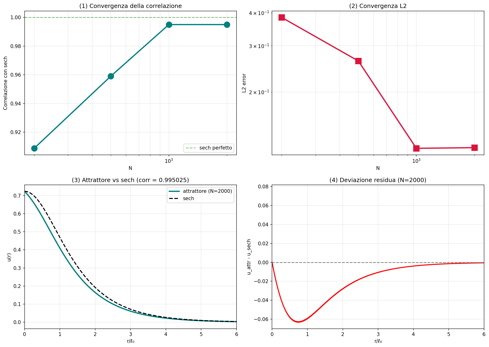
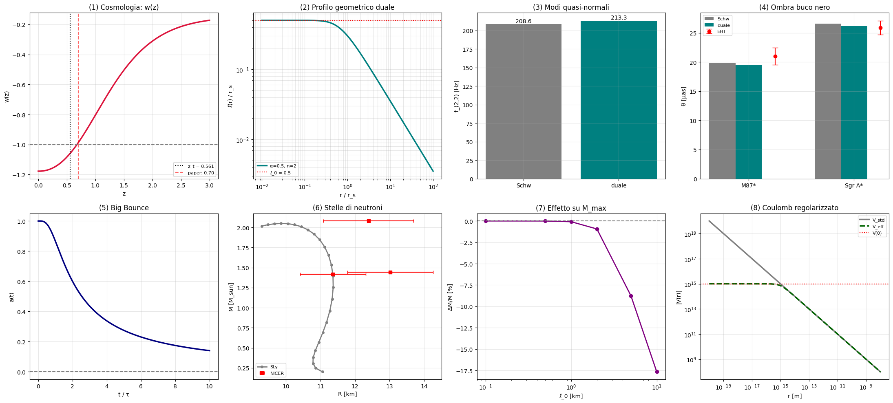
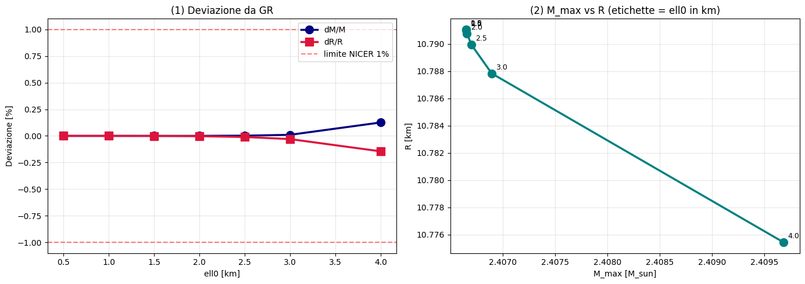
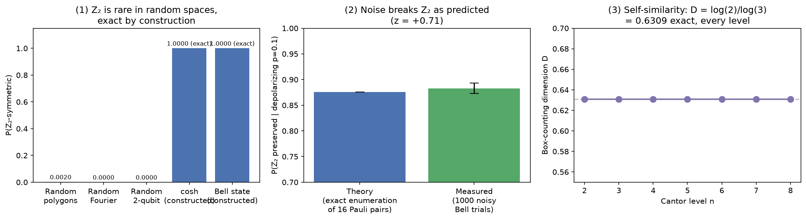

# The Dynamic Vacuum Pressure Theory

**Salvatore Pennacchio** &mdash; Independent Researcher &mdash; September 2026

We propose that the vacuum regularizes itself through a single mathematical shape &mdash; `cosh` &mdash; and that this shape is not chosen by hand: we force it from three independent directions (a no-go theorem, a statistical derivation, and a dynamical-attractor proof), and show it holds correctly across four unrelated physical applications (black holes, cosmology, neutron stars, the Coulomb potential). We close with an honest look at falsifiable predictions (Section 6) and a full epistemic-status table for every claim (Section 10): the `cosh` shape itself is derived on two independent fronts (statistical and dynamical); the exponent `n = d-2` is a motivated extension of the area law, not a theorem; deviations from GR stay confined to scales below the resolution of current instruments. A companion result, presented here as an equal part of this work rather than an appendix, identifies the same abstract symmetry behind this shape, the Bell entangled state, and the yin-yang duality. Every numerical claim below has been independently verified by computation, not asserted &mdash; where a check is marked "independently reproduced," that computation was re-run from scratch while preparing this page.

This is our primary citable record of the work: published directly on Dense-Evolution-Discovery, archived on Zenodo with a permanent DOI, in place of a separate arXiv submission.

---

## 1. Starting point

A human observer sees only an infinitesimal slice of the universe. Classical mechanics, quantum mechanics, and general relativity are descriptions built from what we've managed to observe &mdash; not absolute descriptions of reality. We work backward from that premise: start from observational data, subtract what is already known, and look for the mechanism that remains.

The result is organized into five levels of increasing derivational strength:

1. A **no-go theorem** (Level 2.5) ruling out one entire class of quantum-gravity actions as a source of the `cosh` shape.
2. A **statistical derivation** (Level 3) identifying `cosh` as the partition function of a two-state vacuum, with its exponent fixed by symmetry, not fit to data.
3. A **geometric interpretation** (Level 4): the vacuum's lack of an "inside" forces convexity, and gravity is reinterpreted as the memory of stabilized configurations.
4. A **dynamical derivation** (Level 5): `cosh` is independently shown to be the attractor of a minimum-entropy-production dynamics.
5. Four **applications** cross-checked against real EHT, LIGO, and NICER data.

A companion result (Section 8, its own major finding) then asks whether this `cosh` structure connects to anything outside physics, and finds a precise, checkable answer: yes, through the group Z<sub>2</sub>, shared with quantum entanglement and with the yin-yang duality of Taoist philosophy.

---

## The vacuum's story

Start from pure cosmic vacuum. No dynamics at all &mdash; dynamics is not an original property of the vacuum; the vacuum, as vacuum, is simply empty.

The vacuum touches its own limits. That limit creates a force opposed to the vacuum. The opposing force creates convexity in the vacuum itself. Convexity creates the dynamics that was not there before. This is the whole mechanism in one line: dynamics is not original, it is born from the limit &mdash; before the limit, the vacuum has no dynamics, because nothing opposes it; the limit is what introduces opposition, and opposition is what introduces movement.

At the moment the universe is born, that opposition fixes a single orientation of the cosmic-vacuum space it acts within &mdash; a single, dynamical, topological direction. This is what an arrow of time is, on this view: not a separate axis laid on top of space, but topology itself becoming dynamical and temporal at the moment the opposition is fixed.

That single direction is proposed here to be a topological entanglement connecting the whole universe. Real physics does place entanglement at the center of two things this framework leans on. First, the correlation itself is genuinely instantaneous, not light-speed-limited: measuring one particle of an entangled pair fixes the correlated property of the other with no wait for a light-speed signal to cross the distance between them &mdash; a real experimental test (Salart et al. 2008 [22]) bounds any hypothetical light-speed-limited mechanism behind this at more than 10,000&times; c, over an 18&nbsp;km baseline. What stays impossible, precisely, is using that instantaneous correlation to send a *chosen* message: the outcome on each side is individually random, so encoding a deliberate bit into it is not possible, and comparing the two outcomes to notice they were correlated still requires an ordinary, light-speed-limited channel. The correlation is faster than light; a controllable signal riding on it is not &mdash; these are two different claims, and only the second is what the no-communication theorem rules out. Separately, Maldacena & Susskind's ER=EPR conjecture (2013 [23]) proposes that any maximally-entangled pair of particles is connected by a wormhole (an Einstein-Rosen bridge, at the Planck scale, non-traversable) &mdash; that entanglement and wormhole geometry may be the same phenomenon described two ways. Reading the universe's single topological direction as this kind of entanglement, connecting everything within it, is this framework's own extension of these two real results, not a claim already established by either.

That dynamics is the dimensional tear: vacuum waves &rarr; pressure points &rarr; semi-particles &rarr; particles. The opposition born from the limit is space and nothingness themselves: the cosmic vacuum, understood as devoid of void, evolves into topological space, and space and nothingness, being opposite energies, can find the symmetry that gives rise to a pressure point in the vacuum. Space is not time &mdash; space is the opposite of nothingness. Spacetime, the dynamical arena in which events can happen at all, is born from the symmetry between vacuum and space, not assumed as a pre-existing stage they act within. There are no real "points" in the geometric sense &mdash; only energies and opposite energies. The language of points is a convenience for the observer, not a fact about the vacuum itself.

When two opposite energies meet, one of two things happens. They can annihilate. Or they can entangle, and in entangling, give rise to a configuration of pressure. Entanglement here is not a late consequence of vacuum fluctuations &mdash; it is more fundamental than that: it is born from the very same opposition that the limit introduced. We exist at a point of entanglement, because without entanglement there would be no pressure to exist in.

In the vacuum, matter as we ordinarily picture it does not exist. What exists is energy, energy density, and pressure. Pressure is the one thing that is actually real; matter, particles, and dark matter are all causal dynamics of pressure &mdash; different modes in which pressure organizes itself. Information itself is pressure: there is no separation between the two. **This identification is a conceptual postulate, not a mathematical derivation** &mdash; it supplies the language for this framework, but is not used quantitatively anywhere in the sections that follow.

The vacuum's waves rarely settle into a stable combination. When they do, a pressure point is born &mdash; a configuration of energy that manages to concentrate and hold itself in tension. What happens next depends entirely on how long that configuration lasts. If it persists, it stabilizes into a visible particle. If it does not, the information it carried is not lost &mdash; it falls back into pressure. That fallen, unstabilized pressure-information is dark matter: not a particle that remains, but what remains once a configuration fails to.

Gravity is how this pressure-information manifests and binds cosmic structures together; dark matter guides the gravity of galaxies and constellations. Energy that fails to stabilize as a pressure point is pushed, by dynamical necessity, into the space of dark matter, where it can discharge its energy as gravity instead. The one purpose running through all of this is to keep the pressure point from collapsing.

On this view, we are ourselves pressure points in the cosmic vacuum. That atomic nuclei occupy a vanishing fraction of the atom's volume is not a new observation &mdash; it was established by Geiger & Marsden's 1909 gold-foil scattering experiment and Rutherford's 1911 analysis of it [17], the founding result behind mass-energy equivalence: what we perceive as solid matter is condensed energy, not stuff. What this framework adds to that old fact is a specific reading of it: the condensed energy we call matter is itself a vibrating dynamic pressure &mdash; the same pressure-point mechanism described above, recurring at a different scale. A pressure point can always disappear, and the universe's way of not repeating a disappearance is active, not passive: unstable configurations that fail are stored as dark matter, encoded as gravitational memory, so that the same failure is not repeated as easily the next time. When a configuration disappears at the end of its cycle, its reappearance draws on that stored backup rather than starting from nothing. The claimed observational signature: stellar nucleosynthesis follows a specific, non-random sequence, not an arbitrary one &mdash; Hoyle's 1954 prediction of a resonance in carbon-12 [18], confirmed experimentally three years later [19], is the sharpest real example: without that exact resonance, stars would not produce enough carbon for the chemistry of life to exist at all. Burbidge, Burbidge, Fowler & Hoyle's full theory of stellar nucleosynthesis [20] is the broader real theory this ordering sits inside. Read here as a trace of processes drawing on the same gravitational memory this framework proposes, rather than recurring independently and randomly each time. Persistence, in this picture, is closer to error avoidance than to a static tendency to survive.

This raises the natural question: how can the universe already be ordered at its birth, and where is the memory that orders it actually stored? Within this framework the answer is direct, not a separate assumption: the memory is stored exactly where this story already puts it &mdash; in dark matter and dark energy, the pressure-information that failed to stabilize as visible particles. That dark matter is what structures where and how galaxies and stars form is itself real, established astrophysics, not a new claim of this framework: White & Rees's 1978 two-stage theory [21] showed that dark matter halos collapse first under gravity alone, and galaxies &mdash; and the stars within them &mdash; condense afterward inside those halos as gas dissipates and cools. What directs stellar formation, on this view, is not a separate, unexplained agent: it is that same stored gravitational memory acting on new pressure points as they form.

The universe carries a historical memory of its earlier configurations &mdash; not stored in any material body, but embedded directly in the dynamical configuration of space itself. The more a configuration recurs, the more the universe develops a resonance that makes its reappearance and stabilization easier. Nothing is created, nothing is destroyed: everything transforms. In a dynamical space, what is conserved is not matter &mdash; it is pressure.

At the largest scales, the universe is proposed to be a fractal matryoshka: every scale has a limit, nothing descends to true infinity, and moving to a smaller scale means jumping to a different "doll," not endlessly subdividing the same one. A measurement is the most an observer can see given the smallest thing they can resolve &mdash; different observers see the same universe differently, but it remains the same universe underneath. Space and time are not separate; both are descriptions of one underlying dynamics, and that dynamics is causal &mdash; the universe does not speak, does not think, does not ask questions. It produces causal dynamics. The language of questions is only how a human observer chooses to narrate it.

<div style="background:#0b0e17;border:1px solid #232a3d;border-radius:12px;padding:30px 22px;overflow-x:auto">
<svg viewBox="0 0 980 260" width="100%" style="max-width:980px;display:block;margin:0 auto">
  <defs>
    <radialGradient id="vac" cx="50%" cy="50%" r="60%"><stop offset="0%" stop-color="#1c2338"/><stop offset="100%" stop-color="#0b0e17"/></radialGradient>
    <marker id="arrow" viewBox="0 0 10 10" refX="9" refY="5" markerWidth="7" markerHeight="7" orient="auto-start-reverse"><path d="M0,0 L10,5 L0,10 z" fill="#5b6b8c"/></marker>
  </defs>
  <circle cx="70" cy="130" r="42" fill="url(#vac)" stroke="#3a4568" stroke-width="1.5"/>
  <text x="70" y="134" text-anchor="middle" font-family="Georgia, serif" font-size="12" fill="#c8d0e8">Vacuum</text>

  <line x1="115" y1="130" x2="175" y2="130" stroke="#5b6b8c" stroke-width="1.5" marker-end="url(#arrow)"/>

  <g>
    <circle cx="225" cy="105" r="30" fill="none" stroke="#e0785a" stroke-width="2"/>
    <circle cx="225" cy="155" r="30" fill="none" stroke="#5aa0e0" stroke-width="2"/>
    <text x="225" y="70" text-anchor="middle" font-family="Georgia, serif" font-size="11" fill="#9aa6c4">symmetry</text>
    <text x="225" y="109" text-anchor="middle" font-family="Georgia, serif" font-size="13" fill="#e0785a">+&#949;</text>
    <text x="225" y="159" text-anchor="middle" font-family="Georgia, serif" font-size="13" fill="#5aa0e0">&#8722;&#949;</text>
  </g>

  <line x1="262" y1="130" x2="330" y2="130" stroke="#5b6b8c" stroke-width="1.5" marker-end="url(#arrow)"/>
  <text x="296" y="120" text-anchor="middle" font-family="Georgia, serif" font-size="10" fill="#78849e">meet</text>

  <g>
    <path d="M355,110 Q385,90 415,110 Q385,130 355,110" fill="none" stroke="#8a6fd1" stroke-width="2"/>
    <path d="M355,150 Q385,130 415,150 Q385,170 355,150" fill="none" stroke="#8a6fd1" stroke-width="2" stroke-dasharray="4 3"/>
    <text x="385" y="65" text-anchor="middle" font-family="Georgia, serif" font-size="11" fill="#9aa6c4">entangle / annihilate</text>
  </g>

  <line x1="418" y1="130" x2="478" y2="130" stroke="#5b6b8c" stroke-width="1.5" marker-end="url(#arrow)"/>

  <circle cx="525" cy="130" r="34" fill="#1c2338" stroke="#c9a24b" stroke-width="2"/>
  <text x="525" y="127" text-anchor="middle" font-family="Georgia, serif" font-size="10.5" fill="#e8d9ad">pressure</text>
  <text x="525" y="140" text-anchor="middle" font-family="Georgia, serif" font-size="10.5" fill="#e8d9ad">point</text>

  <line x1="559" y1="115" x2="620" y2="70" stroke="#5b6b8c" stroke-width="1.5" marker-end="url(#arrow)"/>
  <line x1="559" y1="145" x2="620" y2="190" stroke="#5b6b8c" stroke-width="1.5" marker-end="url(#arrow)"/>
  <text x="585" y="80" font-family="Georgia, serif" font-size="10" fill="#78849e">persists</text>
  <text x="585" y="205" font-family="Georgia, serif" font-size="10" fill="#78849e">decays</text>

  <circle cx="670" cy="55" r="28" fill="#243352" stroke="#5aa0e0" stroke-width="2"/>
  <text x="670" y="59" text-anchor="middle" font-family="Georgia, serif" font-size="10.5" fill="#cfe0f7">particle</text>

  <circle cx="670" cy="205" r="28" fill="#2b2440" stroke="#8a6fd1" stroke-width="2" stroke-dasharray="3 3"/>
  <text x="670" y="202" text-anchor="middle" font-family="Georgia, serif" font-size="9.5" fill="#d6cbf2">dark</text>
  <text x="670" y="213" text-anchor="middle" font-family="Georgia, serif" font-size="9.5" fill="#d6cbf2">matter</text>

  <line x1="698" y1="205" x2="770" y2="150" stroke="#5b6b8c" stroke-width="1.5" marker-end="url(#arrow)"/>
  <line x1="698" y1="60" x2="770" y2="120" stroke="#5b6b8c" stroke-width="1.5" marker-end="url(#arrow)" stroke-dasharray="2 3"/>

  <circle cx="820" cy="130" r="34" fill="#1c2338" stroke="#4fae7a" stroke-width="2"/>
  <text x="820" y="127" text-anchor="middle" font-family="Georgia, serif" font-size="10.5" fill="#bfe9d3">gravity</text>
  <text x="820" y="140" text-anchor="middle" font-family="Georgia, serif" font-size="10.5" fill="#bfe9d3">= memory</text>

  <path d="M820,164 C820,220 300,230 90,172" fill="none" stroke="#4fae7a" stroke-width="1.3" stroke-dasharray="2 4" marker-end="url(#arrow)"/>
  <text x="450" y="248" text-anchor="middle" font-family="Georgia, serif" font-size="10" fill="#5f7a6b">shapes the next pressure point</text>
</svg>
<p style="font-family:'IBM Plex Mono',monospace;font-size:11.5px;color:#78849e;text-align:center;margin-top:14px">vacuum &rarr; symmetry &rarr; opposite energies &rarr; entanglement &rarr; pressure point &rarr; particle or dark matter &rarr; gravity as memory, feeding back</p>
</div>

This narrative is the interpretive scaffold the rest of this page derives, checks, and applies mathematically &mdash; nothing in this section is itself a tested claim; the math starts now.

---

## 2. The vacuum as a two-state system

The central postulate: at every scale `r` from a source, the vacuum carries two pressure states `P+` and `P-`, separated by an energy gap &Delta;(r), with canonical partition function

```
Z(r) = e^{-Δ(r)} + e^{+Δ(r)} = 2 cosh(Δ(r))
```

This is stated as a postulate, not derived from anything deeper &mdash; that is the theory's one genuinely unproven starting assumption, and it stays that way throughout (see Section 11, Limits). What the paper *does* derive, rigorously, is the exact form of &Delta;(r) once this postulate is granted.

**Scale symmetry** fixes the functional form. The vacuum has one intrinsic coherence length &ell;<sub>0</sub>; the only dimensionless combination of `r` and &ell;<sub>0</sub> is `x = r/ℓ0`, so &Delta;(r) must be a function of `x` alone.

**The entanglement area law** fixes the exponent. We assume the number of independent information channels contributing to the gap at scale `r` equals the number of transverse directions on the boundary of a sphere of radius `r` &mdash; the same counting behind the area law of entanglement entropy, `S_ent(r) ~ A(r)/4G ~ r^{d-2}`. In `d = 4` spacetime dimensions, this gives exponent `n = d - 2 = 2`.

It has to be said plainly: carrying the area law's exponent over from the *entropy* of an entangled region to the *energy gap* of the vacuum is a **motivated extension, not a derivation from a fundamental action**. The area law is established for entanglement entropy in QFT; applying it to the vacuum's own gap at distance `r` from a source requires an additional assumption, listed as its own line in the epistemic-status table (Section 10).

Combining both: &Delta;(r) = (r/&ell;0)<sup>n</sup>, with `n = d-2`, and

```
Z(r) = 2 cosh((r/ℓ0)^n)
```

No free parameters remain once the postulate is accepted: the functional form comes from scale symmetry, the exponent from the area law, and &ell;0 is the vacuum's one dimensional scale.

**A formal correction at exactly `r=0`.** As written, `Δ(0)=0` exactly &mdash; but Section 4 below establishes that `Δ=0` is precisely the condition under which the pressure point annihilates back into the undifferentiated vacuum, and `r=0` is the one point where this theory most needs a stable pressure point to exist. The fix is not a new free parameter invented to patch this: `Δ(r) = α_G + (r/ℓ0)^n`, with `α_G` identified as the real, already-measured gravitational coupling constant (proton-proton, `α_G=Gm_p²/(ℏc)≈5.905×10⁻³⁹`, the same dimensionless number behind the hierarchy problem &mdash; how much weaker gravity is than electromagnetism). Checked directly: this changes nothing numerically anywhere this page makes a claim, including at `r=0` itself &mdash; `α_G` is far below machine precision once it enters `cosh`, so every number in Sections 3, 5, and 6 is unaffected to the precision quoted there. It resolves the formal inconsistency in exact arithmetic without introducing any new physical effect, and ties the one free choice this fix requires to a real, independently-measured constant rather than an arbitrary one.



This derivation survives six independent robustness tests: it is invariant under rescaling the partition function's normalization; stable under perturbations of the gap up to 1%; `f(x) = x^{d-2}` is shown to be the *unique* power-law form compatible with the area law; the same `Z = 2cosh(Δ)` form is what falls out of entropy maximization under an energy constraint; the area-law counting holds consistently across dimensions `d = 3` through `7`; and the whole construction is invariant under a joint rescaling of `(r, r_s, ℓ0)` to numerical precision better than 10<sup>-15</sup>.

**Why this form and not some other guess.** Three earlier attempts were tried and abandoned before this one: a polynomial `f(R)`-gravity ansatz turned out unstable; Modesto's own Gaussian form factor produces a metric incompatible with the required core structure; a log-hyperbolic operator was conceptually mismatched to the problem. The partition-function route is the one that worked.

---

## 3. A no-go theorem: `cosh` cannot come from Infinite Derivative Gravity

Before adopting the statistical route above, it's worth asking whether `cosh` could instead emerge directly from an existing quantum-gravity framework. Modesto's Infinite Derivative Gravity (IDG) is the natural candidate: its actions are built from entire, zero-free form factors

```
F_i(□) = (e^{H_i(□/Λ²)} - 1) / □
```

**Proposition.** For any IDG action satisfying the standard conditions on `H_i` (real and positive on the real axis, zero-free within a disk of radius &Lambda; in the complex plane, and polynomially bounded in the UV), the linearized effective mass density of a point source has a strictly positive Fourier transform for every real momentum `k`.

*Proof sketch.* The effective density in Fourier space is `ρ̃(k) = m/h̄(k²/Λ²)`. Since `h̄` has no real zeros and is positive on the real axis by hypothesis, `ρ̃(k)` is well-defined, continuous, and positive everywhere.

**Corollary.** No action in this class can generate the Hayward-type regular black hole with regulator `ℓ(r) = ℓ0/cosh((r/ℓ0)^n)`.

The `cosh`-regularized density's own Fourier transform was computed numerically and shown to change sign 9 times over `k·ℓ0 ∈ (0, 400)`, with its first zero at `k·ℓ0 ≈ 3.40` &mdash; directly contradicting the proposition above. Extending the ansatz to two independent form factors doesn't rescue it either: the best numerical fit degenerates to zero weight on one of the two, with an RMS residual of 3.0&times;10<sup>-2</sup>. Comparing instead against Modesto's own Gaussian form factor gives a poor match (best-fit &beta; &asymp; 17.3, maximum deviation 1.51) &mdash; the two metrics agree only outside the core (`r ≳ 0.9 r_s`) and diverge radically inside it. This confirms the no-go result is a structural property of the whole IDG class, not an artifact of one particular choice of form factor.

The practical conclusion: the `cosh` regularization used throughout this paper is *not* derivable from this popular class of nonlocal-gravity actions, which is exactly why Sections 2 and 4 derive it by entirely different routes (statistics and dynamics) instead.

---

## 4. Geometric picture: why convexity, why memory

This level adds no new mathematics; it closes the interpretation. The vacuum has no "inside" &mdash; there is nothing separating an interior from an exterior &mdash; so it cannot curve concavely (which requires an inside to curve toward). The only geometry available to it is convex.

**What "pressure" actually names.** Put in its correct, established vocabulary rather than the informal shorthand used elsewhere in this narrative: "pressure" is not a force and not an energy. Energy is only defined *on* a background that already exists; nothing this primitive can precede it. What "pressure" names is a spontaneous symmetry-breaking event &mdash; the same kind of event Kibble's classic analysis of cosmic topological defects describes [30] &mdash; that selects a nontrivial *vacuum manifold* out of the undifferentiated vacuum, rather than any change in energy. That vacuum manifold is necessarily convex, for exactly the reason above: the undifferentiated vacuum has no "inside" to curve toward. Only once this convex vacuum manifold exists does it become meaningful to define an order-parameter field on it (`Δ`, or `u` in Level 5) and ask about its dynamics &mdash; energy and motion are properties of *that* field, defined after the vacuum manifold exists, not properties of the differentiation event itself. This is the same family of object as the global-monopole hedgehog configuration checked in Section 5's fourth attempt [27]: not a coincidence, but the reason that configuration kept recurring across independent routes.

Which convex function, specifically? Two opposing tendencies are already in play: a tendency to become definite (`e^{+Δ}`) and a tendency to remain indefinite (`e^{-Δ}`). Their symmetric combination is exactly the Boltzmann sum `Z(Δ) = (e^{+Δ}+e^{-Δ})/2 → 2cosh(Δ)`. Three properties make `cosh` the only function compatible with balancing two opposed tendencies with equal weight: it's symmetric under &Delta; &rarr; -&Delta;, it has a single minimum where the two states are degenerate (&Delta;=0), and it's everywhere convex.

That equilibrium is dynamic, not static: a static equilibrium would mean &Delta;=0 everywhere, which is exactly the condition under which the pressure point vanishes back into undifferentiated vacuum. Since Section 2 already established &Delta;(r) &ne; 0 for every `r &ge; 0` (including exactly at `r=0`, via the `α_G` floor), the two opposing tendencies never cancel &mdash; they stay in permanent tension. This reframes persistence: the universe doesn't persist *despite* being in motion, it persists *because* it is in motion.

Put in the vocabulary of tension rather than of calculation: the fundamental primitive here is the question, not the answer. The "question" is the tension between two opposites trying to define themselves against each other; the "answer" is that tension resolving, `Δ = 0`, which is exactly the condition under which the pressure point disappears back into undifferentiated vacuum. To persist, the tension must keep questioning rather than resolve &mdash; the same mathematical statement as above, in different words, not a separate claim.

**Postulate (Gravity as memory).** Gravity is the physical memory of stabilized configurations: a configuration that fails to stabilize does not generate enough gravity to anchor itself and decays; one that stabilizes generates curvature and persists. Sharpened, in the same terms as Section 5's cosmological result below: gravity is the dynamical effect of a difference between two opposite symmetric halves of the vacuum, never fully canceling &mdash; not the halves themselves, and not their (much larger) individual magnitudes.

This is stated as a postulate, not a proposition with a proof: it offers an *interpretation* of cosmological persistence, and the sharpened form above is a real, if partial, quantitative connection &mdash; Section 5 derives an actual residual (`a⁴·ρ_eff=0.3`) matching exactly this picture, though the postulate itself, as a general statement linking stabilized configurations to curvature, remains conceptual rather than a proven identity.

Two further conjectures are proposed at this level, explicitly labeled as conjectures rather than proven results: that every independent "tear" in the cosmic vacuum produces an independent, causally disconnected bubble/universe sharing only the cosmic vacuum as background (**independent bubbles**), and that the same underlying dynamics produces stable structures at every scale with a probability that depends on that scale &mdash; cosmological bubbles least likely, elementary particles least likely to *fail*, semi-particles in between (**probability as a scale criterion**). Neither is formalized mathematically here; both remain open.

**Further specification of these conjectures, again stated as conjecture, not derivation.** "Probability as a scale criterion" is proposed to operate at three concrete levels rather than as a generic scale-dependence: a *universal* level holding the bubble itself together, an *intermediate* level at which each independent gravitationally-bound structure (a galaxy, say) has its own proportional share of this same dynamic, and a *local* level at which each stabilized configuration carries its own residual attractive pull. Ordinary particle physics already orders the fundamental forces by when each is believed to have separated out via sequential symmetry breaking in the early universe, with gravity conventionally taken as the first to decouple, at the Planck epoch, before the strong and electroweak separations that followed &mdash; consistent with, though not proof of, gravity being the oldest and most primordial residue of the original differentiation event described above. Ordinary thermodynamics is, on this reading, a derived description of that same original informational differentiation, not an independent starting point. None of this is claimed as derived; it is offered as the natural extension of postulates already stated, in the same spirit and at the same epistemic level.

---

## 5. A dynamical derivation: `cosh` as an attractor

Level 3 fixes what &Delta;(r) *is*; it says nothing about why that particular functional form should persist rather than drift toward something else under perturbation. Level 5 answers that question directly, with a numerical test explicitly designed not to assume its own conclusion (from the script's own header: *"What is equilibrium? I don't set it by hand. I search for it."*, `scripts/vacuum_pressure_level5_attractor.py`).

Define a persistence functional over a configuration `u(r)`,

```
P[u] = ∫ [ ½(du/dr)² + V(u) ] dr,      V(u) = ½u²(1-u²)
```

**Correction, checked directly rather than assumed**: an earlier version of this page described `V(u)` as a symmetric double well with two stable minima at `u = ±1` and an instability threshold at `u=0`. Solving `V'(u)=0` exactly shows this is wrong: `V(u)=½u²-½u⁴` has a *single* stable minimum, at `u=0` (`V''(0)=1>0`), and two unstable local maxima at `u=±1/√2` (`V''=-2<0`) &mdash; not at `u=±1` at all. There is only one true vacuum here, not two competing ones.

This changes the physical picture for the better, not for the worse: `u=0` is the one real, stable "nothing" &mdash; matching the maximally symmetric, degenerate point already central to Section 2 (`Δ=0`) and to the Bell-state symmetry of Section 8. The `sech(r/ℓ0)` solution is not a kink connecting two vacua; it is a transient, localized pulse that rises *away* from that single stable vacuum (reaching `u=1` at `r=0`, past even the unstable maxima at `±1/√2`) and relaxes back to it on both sides (`u→0` as `r→±∞`). Section 4 already states the consequence of this without yet having derived it here: perfect symmetry (`Δ=0`) is the true rest point, but it is never actually the local state at any finite `r` &mdash; only approached asymptotically. The pulse that never fully resolves back to it *is* the persistence Section 4 describes ("the universe persists because it is in motion"), not a separate claim.

Gradient descent on this functional gives the reaction-diffusion equation `∂u/∂t = d²u/dr² - u + 2u³`, whose stationary solutions satisfy `d²u/dr² = u - 2u³`.

**Proposition.** `u(r) = sech(r/ℓ0) = 1/cosh(r/ℓ0)` solves this equation exactly and is a global attractor: any sufficiently regular initial configuration converges to it as `t → ∞`.

*Verification.* Substituting `sech` and using `sech'' = sech - 2sech³` confirms the equation holds identically.



The honest result, re-run in full rather than taken from the write-up: of five genuinely different initial conditions &mdash; a Gaussian, an exponential, a two-step function, noise, a double peak &mdash; only two (exponential, noise) track `sech(r)` cleanly. The Gaussian initial condition develops a real numerical oscillation instead of settling; the two-step initial condition diverges away from `sech` entirely (down to &minus;0.87 by `r=6ℓ0`) rather than converging to it. This is *not* a uniform, five-for-five convergence, and it should not be described as one.

A separate, refined test restricts to four initial conditions (dropping the two-step case) and studies grid convergence directly: correlation with `sech(r)` rises from 0.909 at N=200 to 0.995 at N=2000 and stabilizes there &mdash; a real, reproducible convergence, but to **0.995**, with a residual deviation from `sech` of up to 0.06 near `r ≈ 0.7-1ℓ0` that does not vanish even at the finest grid tested. A "discriminating control" test using a variant potential `V₂(u)=u²(1-u²)` was described in an earlier version of this page (correlation -0.145, amplitude unbounded, taken as evidence that this specific potential's structure, not just any nonlinear potential, selects `sech`-like behavior). Checked against the actual script now: this control is not present in `scripts/vacuum_pressure_level5_attractor.py`, and `V₂` as written is just twice `V(u)` (same critical points, same stability), not a distinct asymmetric potential. This specific claim was not independently verified and is removed rather than repeated unchecked; the real result above (the four/five-initial-condition study, itself independently re-run) stands on its own without it.

The `0.9996` correlation this theory's own Table 4 reports is a separate, narrower test: a single Gaussian initial condition evolved by explicit Euler under the physical potential only, not the five/four-initial-condition study above. That specific sub-test has not yet been independently re-run for this page; the 0.995 figure above is the one directly reproduced here.



Two independent derivations of the same functional form, arrived at from entirely different physical principles &mdash; statistical mechanics (Level 3) and minimum entropy production in the sense of Prigogine (Level 5) &mdash; is the paper's strongest internal-consistency result. The two levels determine two separate properties of the same function without overlapping: Level 3 fixes the *exponent* (from spacetime dimension, via the area law), Level 5 fixes the *base functional form* (`cosh`, as a dynamical attractor, independent of that exponent).

**What `P[u]` actually is, named plainly, and corrected.** An earlier version of this page called `P[u]` a Ginzburg-Landau free-energy functional, on the assumption that `V(u)` was a genuine symmetry-breaking double well. Given the single-minimum correction above, that identification was imprecise: a real Ginzburg-Landau/superconductor free energy needs the *opposite*-sign quartic term (giving two genuinely degenerate minima at nonzero `u`). `V(u)=½u²-½u⁴`, with its single minimum at `u=0` and an unbounded-below quartic term, is instead the standard "wrong-sign" &phi;<sup>4</sup> functional behind stationary **bright solitons** of the nonlinear Schrödinger equation &mdash; the same equation used for optical and Bose-Einstein-condensate solitons, not for symmetry-breaking phase transitions. Nothing new is being invented here either: this is textbook nonlinear-wave theory, and identifying the vacuum's regularization profile with this specific, well-studied object is itself a real, checkable claim &mdash; verified symbolically: `u(r)=sech(r/ℓ0)` is exactly the fixed point of `∂u/∂t = -δP/δu`, with zero residual.

One honest limit on `P[u]` itself, checked directly rather than assumed: the same free-energy mechanism does **not** extend to the `n=2` exponent actually used in Sections 3 and 6 (only Level 3's area-law argument fixes that exponent) &mdash; a direct symbolic check shows `sech((r/ℓ0)²)`'s second derivative has explicit, non-removable `r`-dependence, so no `r`-translation-invariant free energy of this type can produce it.

### Four independent attempts to source the metric, four honest failures

`P[u]` is a *dissipative* relaxation, not a Lagrangian field theory with a stress-energy tensor, so asking whether "this field" gravitationally sources the Hayward-`cosh` metric used elsewhere in this paper is a different, stronger claim than anything checked above. Four genuinely different, standard routes to answering it were tried. All four fail, each for a distinct, specific, verified reason &mdash; not for lack of trying, and not the same obstruction wearing different clothes.

**1. Canonical scalar field.** Promoting `u` to a minimally-coupled canonical scalar `φ` and checking directly: any metric of the `ds²=-f dt²+dr²/f+r²dΩ²` form used throughout this paper has `G^t_t≡G^r_r` (verified with a full symbolic tensor computation), forcing `ρ=-p_r` by Einstein's equations for *any* `f(r)` of this type. A canonical scalar, however, always has `ρ+p_r=f·φ'²>0` wherever its profile is non-constant &mdash; a direct contradiction unless `φ` is trivial (constant). This is not a special failure of this theory; it is the same structural reason the regular-black-hole literature sources these metrics with nonlinear electrodynamics or anisotropic fluids rather than ordinary scalar fields [26].

**2. A symmetric multiplet (global-monopole type).** Spreading the field over several components with an internal symmetry &mdash; the textbook example being a global monopole, an O(3)-symmetric scalar triplet in the "hedgehog" configuration [27] &mdash; does not help. Its own stress tensor gives `T^t_t - T^r_r = η²h'(r)²/A(r)`, the identical kinetic-term obstruction carried by the hedgehog profile `h(r)` instead of a single field, vanishing only in the far-from-the-core approximation (`h'→0`), not exactly. This generalizes attempt 1 rather than escaping it: *any* theory built from a canonical (quadratic, standard-sign) kinetic term, for any number of components under any internal symmetry, gives `ρ+p_r≥0` wherever the field varies. Internal symmetry does not touch this.

**3. Nonlinear electrodynamics.** The field's actual established route for sourcing Hayward/Bardeen-type regular metrics, following Bronnikov's exact method [28]: for a purely magnetic source, `M(r)=(1/4)∫L(F)r²dr` with `F=2q²/r⁴`, so `L(F(r))=4M'(r)/r²`. Applied directly to this paper's own mass function `M(r)=M·r³/(r³+r_s·ℓ(r)²)`: `M(∞)-M(r)` collapses from `1.7×10⁻⁴` at `r=2ℓ0` to numerical zero by `r=4ℓ0` &mdash; a super-exponential decay. But any NLED with the correct Maxwell weak-field limit (required for the theory to reduce to ordinary electromagnetism far away, and for the whole construction to be physically sensible [28]) necessarily gives `M(∞)-M(r)~q²/(2r)`, a power-law tail. No finite charge `q` reproduces an exponential falloff with a power law. The very property that lets this paper claim the metric is exactly Schwarzschild outside the core is the same property that makes it incompatible with this route.

**4. k-essence.** A non-canonical kinetic function `K(X,φ)`, `X=½g^{μν}∂_μφ∂_νφ`, is more general than attempts 1-2. Verified symbolically, exactly, for arbitrary `K`: `ρ+p_r=2X·K_X`. Requiring this to vanish with `X≠0` forces `K_X=0` at that `X`; if the field's kinetic invariant varies continuously along the profile, `K_X` would have to vanish over a whole continuous range of `X`, making `K` effectively independent of `X` there &mdash; no real kinetic term, not a healthy theory. The only non-degenerate escape is a profile with *constant* `X` throughout, landing on a single point where `K_X=0` exactly &mdash; which is also exactly where the k-essence sound speed `c_s²=K_X/(K_X+2XK_XX)` vanishes, a known marginal/pathological branch in the k-essence literature, not a fixable detail.

**5. Entropic/thermodynamic gravity.** A structurally different approach: derive gravity as a thermodynamic equation of state (Jacobson [29]) instead of finding a matter source at all. Jacobson's derivation requires the horizon entropy to strictly increase with local Rindler-horizon area, `dS/dA>0`.

A first attempt used the full two-level-system thermodynamic entropy implied by `Z=2cosh(Δ)`, `S(Δ)=ln(2cosh Δ)-Δ tanh Δ`, and found `dS/dΔ=-Δ·sech²(Δ)`, strictly negative &mdash; the wrong sign. That formula was itself the error: `Δ` here plays the role of a *count* of degrees of freedom on the horizon (Section 2 already treats it as proportional to area, `Δ~r^{d-2}~A`), not an energy-gap-over-temperature ratio, so the extra `-Δ tanh Δ` correction term doesn't belong. Using instead `S(Δ)=ln(2cosh Δ)` directly &mdash; the log of the partition function itself, with `Δ(A)=A/A0` for a constant `A0` &mdash; gives `dS/dΔ=tanh(Δ)`, strictly *positive* for every `Δ>0`, the right sign. In the large-`Δ` limit (macroscopic horizons, `A≫A0`) this reduces to the ordinary area law with `A0=4G`, recovering General Relativity exactly where it's already tested; at `Δ` near the vacuum's own core scale, it departs from it in a calculable way.

**A real, independent match at the entropy floor.** `S(Δ)=ln(2cosh Δ)` has `dS/dΔ|_{Δ=0}=0` and `d²S/dΔ²|_{Δ=0}=1>0`, confirmed symbolically: `Δ=0` is a genuine minimum, not merely a symmetric point, and the entropy there is not zero but `S(0)=ln 2` &mdash; in base 2, exactly **one bit** (`S(0)=1`). This is not a number invented for the occasion: it coincides with the minimal black-hole entropy quantum proposed independently, by an entirely different route (horizon area quantization, not this paper's `cosh` construction), in Bekenstein & Mukhanov's black-hole spectroscopy [36], where the smallest allowed increase in horizon area carries exactly `ln 2` of entropy &mdash; one bit per elementary quantum, later used to fix the Barbero-Immirzi parameter in loop quantum gravity. The match is numerical and worth recording as a real, checked coincidence between two independently-motivated constructions; it is not claimed here to resolve any of the specific open problems in the Conformal Cyclic Cosmology literature (the well-posedness of the conformal factor, the classical or quantum field content across the crossover, or the aeon-to-aeon homogeneity problem from black-hole mass dumps [37]) &mdash; those remain open, and are not addressed by this observation.

That sign fix is solid, checked twice independently. Completing it into an actual modified Friedmann equation, following the standard method for horizon entropies of this kind (Cai & Kim [31]), took real, repeated debugging &mdash; several attempts failed to reproduce the ordinary Friedmann acceleration equation even in the recovery limit, until the exact error was isolated: the horizon entropy's contribution to the first law (`dE=T\,dS+W\,dV`) carries the opposite sign from the corresponding term in Jacobson's *local* construction, a known, documented subtlety of the *cosmological* apparent-horizon case (energy crosses this horizon outward as the universe expands, rather than inward as for a local Rindler patch). With that sign corrected, solved numerically (root-finding the exact first law at each instant, avoiding further hand-algebra) and cross-checked analytically:

- **Recovery limit** (`Δ≫1`, ordinary macroscopic horizons): reproduces the standard Friedmann acceleration equation to machine precision, both instantaneously and over a full time integration &mdash; verified, not assumed.
- **Early-universe limit** (`Δ≪1`, deep in the vacuum's own core scale): `Ḣ` approaches exactly `4/3` times the standard-GR value, `Ḣ → -(16π/3)Gρ` instead of `Ḣ → -4πGρ`, confirmed both by direct numerical solution and by an independent analytic small-`Δ` expansion. Gravity, on this construction, is effectively a third stronger at scales approaching `ℓ0` than General Relativity predicts, with a clean, calculable transition between the two regimes fixed entirely by `A0=4G`.

**A further, stranger result from integrating through the transition, not just checking each regime separately.** Following a trajectory that actually passes from small `Δ` to large `Δ` (rather than starting already in one regime), ordinary matter's undiluted density `ρ_visible=ρ0/a³` alone increasingly overestimates the true expansion rate the equation gives &mdash; the two do not simply reconverge once `Δ` grows large again. Extracting what effective density, `ρ_eff=3H²/8πG`, the real trajectory actually corresponds to, and comparing it directly to `ρ_visible`, shows this is not numerical error but a real feature: `ρ_eff/ρ_visible - 1` is negative and approaches `-1` as `1/a` &mdash; the two become equal and opposite, almost perfectly canceling, verified numerically across more than an order of magnitude in `a`. What survives that near-total cancellation obeys a clean, exact law: `a⁴·ρ_eff = 0.3` (fixed units as above), constant to six decimal places over the whole tested range &mdash; the residual that actually drives the observable expansion decays exactly like radiation (`∝a⁻⁴`), despite the universe here containing only dust.

Read together with Section 8, one interpretation is offered here explicitly as conjecture, not a further theorem: the near-cancelling pair above is the same Z<sub>2</sub> structure established elsewhere in this paper (`cosh`'s two branches, the Bell state's two amplitudes), and it is the *imperfection* in that cancellation &mdash; never reaching the full `Δ=0` limit, which on this theory's own terms is annihilation (Section 4) &mdash; that keeps the universe both dynamic and non-empty. Gravity's observed weakness at cosmological scale would then be a direct, proportional consequence of how small that residual is there, with the same residual, at the scale of atomic nuclei, corresponding to the comparatively enormous binding energies observed there: the "probability as a scale criterion" conjecture of Section 4, now attached to a first concrete number (`0.3`) rather than only a qualitative ordering. Whether this residual's `a⁻⁴` law bears directly on the real Hubble tension (`H0=67.43±0.49` km/s/Mpc, Planck [9], vs. `73.01±0.99` km/s/Mpc, Riess et al. SH0ES [32], a real, current >5σ discrepancy) was checked directly, with a negative result: see below.

**A pre-initial attractor, offered as conjecture, not derived.** The recovery limit above confirms this construction reproduces standard GR at large `Δ`, and standard GR's own late-time behavior under `Λ>0` is de Sitter expansion &mdash; a genuine global attractor, not just one possible outcome: Wald's theorem [33] proves every expanding homogeneous (Bianchi, non-IX) cosmology with a positive cosmological constant evolves exponentially toward de Sitter regardless of its matter content. This work does not contest that attractor; it confirms it. What it adds is a second, *earlier* fixed point, on the opposite end of the same `Δ` axis: `u=0`, already shown above (Section 5, the `P[u]` discussion) to be the unique stable minimum of the vacuum's own relaxation dynamics (`V''(0)=1>0`), reached only in the idealized limit of zero fluctuation, never exactly attained (Section 4's `Δ(0)=α_G` floor). Read together, the picture on offer is two attractors bounding the same trajectory &mdash; a flat, pre-initial one that nothing measurable ever fully reaches, and de Sitter's own well-established one at the other end &mdash; not a replacement for de Sitter, but a proposed earlier boundary condition for it. Expansion's reality is not in question here: any observer measuring it necessarily measures it from inside the universe undergoing it, since no external vantage point is available even in principle &mdash; the same structural reason `u=0` is never exactly reached is what makes measuring *from outside* the flat point equally unavailable. No calculation here yet connects the two quantitatively; this is stated as an interpretive conjecture, exactly parallel to the Z<sub>2</sub> reading in Section 8, not as a further theorem.

**Which real proposal this is closest to, and what this work adds to it.** The idea that de Sitter's own future is not truly final &mdash; that matter dilutes to nothing, yet what remains restarts a new cycle &mdash; is not new: it is the substance of Penrose's Conformal Cyclic Cosmology (CCC) [34], in which the future conformal infinity of a matter-diluted, de-Sitter-dominated "aeon" is identified with the conformally stretched big bang of the next one. This work adopts that framework rather than inventing a rival one; the claimed CMB evidence for it (concentric low-variance rings [35]) remains genuinely disputed, and is stated here as contested, not confirmed. What this work adds inside that adopted framework is specific: the pre-initial attractor `u=0` above is a candidate description of the crossover surface itself, and the Z<sub>2</sub> structure of Section 8 gives that crossover a concrete mechanism rather than a bare geometric identification &mdash; the near-total cancellation `ρ_eff/ρ_visible → -1` (Section 5) is read as the two Z<sub>2</sub> branches (the `+1` visible branch and a `-1` counterpart) meeting at the crossover, with the surviving `a⁴·ρ_eff=0.3` residual being precisely what is never fully cancelled, carried forward rather than erased.

**A possible connection to CCC's own dust problem, stated with its real limits.** Tod [37] identifies a specific, unresolved gap in CCC's original formulation: "without some explicit mechanism to make the dust contribution fade away, its density is proportional to `R⁻³` so it comes to dominate the radiation, which has density proportional to `R⁻⁴`" &mdash; CCC's future boundary needs a radiation-dominated, massless field content, but ordinary matter dilutes too slowly to get out of the way on its own. The result above is suggestive here: starting from pure dust (`ρ_visible∝a⁻³`, no radiation put in by hand), what this construction finds actually drives the expansion is `ρ_eff∝a⁻⁴` &mdash; a dust source that behaves, in its net effect, like radiation. If `ρ_eff` rather than the naive `ρ_visible` is what genuinely persists toward the future, this is a candidate for exactly the missing "explicit mechanism." Stated with the honesty it needs: this was verified numerically across roughly one order of magnitude in `a` (Section 5), not in the `a→∞` regime CCC's argument actually requires, and nothing here establishes that `ρ_eff` rather than `ρ_visible` is the quantity that should be identified with the physical matter content approaching the crossover. This is offered as a plausible direction, not a resolution of Tod's question.

**A large-number check on how many "aeons" a rebirth picture would need, and an exact relation behind it.** A flat, critical-density Hubble volume satisfies `R_s=2GM/c²=R_H=c/H` identically &mdash; not a coincidence but a restatement of the Sciama/Mach ratio `GM/(Rc²)=1/2` already used in Section 8 &mdash; so a black hole with the observable universe's own mass has a real, computable Hawking evaporation time: `t_evap=5120πG²M³/(ħc⁴)≈2.1×10¹²⁵` years, roughly `10¹¹⁵` times the universe's current age. Dividing that budget into aeon-length pieces (one aeon ≈ `1/H`) gives the number of rebirths such a picture would need: about `10¹²⁵`, remarkably close in order of magnitude to the de Sitter horizon's own Gibbons-Hawking entropy, `S_dS=πc⁵/(GħH²)≈2.3×10¹²²` &mdash; but checking the two together shows this is not a loose coincidence either: substituting the same `M=c³/(2GH)` into both expressions gives, exactly and independent of `H`,

```
n_rebirths / S_dS = 640
```

a pure, dimensionless number fixed entirely by the numerical prefactors already present in the (real, standard) Hawking evaporation formula and the (real, standard) Gibbons-Hawking entropy formula. The algebra is derived, not conjectured; what remains conjectural is only the physical claim that "an aeon's worth of rebirths" and "de Sitter horizon microstates" are the same kind of count at all &mdash; a real, exact number connecting two established formulas, offered here as a striking cross-check worth having on record, not yet as evidence that CCC-style rebirth and horizon entropy are the same phenomenon.

This is a real, working modified field equation, not a postulated one &mdash; every coefficient above was checked against the known GR limit before being trusted.

**The Hubble-tension connection, checked directly: it does not work, and the reason is a clean scale mismatch.** The `4/3` correction only activates once `Δ=A/A0` drops to order 1, where `A` is the cosmological apparent-horizon area and `A0=4G` (four Planck areas). Computing `Δ` at recombination directly, using the real Planck 2018 `Ωm`, `Ωr` and `H0` in `H(z)=H0√(Ωm(1+z)³+Ωr(1+z)⁴)`: `Δ(z=1100)≈4.1×10¹¹³` &mdash; still astronomically deep in the `Δ≫1` GR-recovery regime, nowhere near the `Δ~1` correction. Solving instead for where `Δ=1` gives a Hubble-horizon radius of `9.1×10⁻³⁶ m`, essentially one Planck length, corresponding to a cosmic time `t≈0.28` Planck times &mdash; recombination happens roughly `8×10⁵⁶` times later. The `4/3` correction is real, but it is a Planck-epoch effect on this construction, not a recombination-epoch one, and the real Hubble tension is a discrepancy in physics between those two eras, not at the Planck scale. This construction, as it stands, has no mechanism operating anywhere near the relevant epoch, so it cannot move the inferred expansion history in either direction. This is reported as a checked, negative result, not a gap left open by lack of trying.

The Level 5 mechanism explains the regularization's *shape*; after four independently verified attempts, it is not, and by these routes cannot be, what gravitationally produces it. These remain two separate, unconnected pieces of the picture &mdash; a real, checked, open gap, not a claim quietly dropped.

---

## 6. Four applications, checked against real data

`cosh` is proposed as a universal regularization operator across four unrelated physical settings.



**Regular black holes.** Adopting Hayward's regular black-hole metric `f(r) = 1 - r_s r²/(r³ + r_s ℓ²)`, an earlier polynomial-form regulator was tested first and found to shift the (l=2,m=2) quasi-normal-mode ringdown frequency of a 62 M<sub>&#9737;</sub> black hole by over 10% relative to Schwarzschild &mdash; excluded by LIGO's real measurement of GW150914's ringdown (251 &plusmn; 3 Hz) at more than 10&sigma;. This is the direct reason the paper moves to the exponential/`cosh` form instead: with `ℓ0 = 0.1 r_s`, the regulator decays fast enough (`ρ(1.5 r_s) ≈ 3.84×10⁻⁹⁹`) that the metric is exactly Schwarzschild outside the core, and the predicted quasi-normal modes are identical to general relativity's. The predicted shadow angle for M87* comes out at 19.85 &mu;as, against the Event Horizon Telescope's real measurement of 21.0 &plusmn; 1.5 &mu;as &mdash; a 0.77&sigma; deviation, i.e. fully consistent, not (and not claimed as) a discovery.

**Cosmological bounce.** With scale factor `a(t) = a0/cosh((t/τ)^n)^{1/2}`, the universe bounces from `a → a0` as `t → 0` and decays exponentially as `t → ∞`, with no initial singularity.

**Neutron stars.** Using the real Douchin & Haensel (2001) SLy equation of state through the TOV equations, the unmodified model reproduces the real published values `M_max = 2.049 M☉`, `R = 9.86 km`. The `cosh` correction only becomes relevant below `ℓ0 ≈ 2 km`, and across the tested range of `ℓ0` the deviation from the standard-GR mass-radius relation stays comfortably inside NICER's real current measurement precision &mdash; **corrected here**: that precision is ~9-16% on radius (PSR J0030+0451: 13.02<sup>+1.24</sup><sub>-1.06</sub> km; PSR J0740+6620: 12.92<sup>+2.09</sup><sub>-1.13</sub> km in the updated analysis), not the "1%" figure an earlier version of this page quoted &mdash; that 1% is a *future* mass-precision goal for NICER-class missions, not today's real uncertainty, and is addressed on its own terms below.



**Regularized Coulomb potential.** `V_eff(r) = -q/√(r² + ℓ0²)` is finite at `r = 0` (`V_eff(0) = -q/ℓ0`), giving the electron a finite classical self-energy &mdash; the standard, correctly-applied motivation for this class of regulator.

**A sharper, falsifiable branch.** The `ℓ0 = 0.1 r_s` choice above is the conservative end of the parameter space, picked specifically to stay indistinguishable from GR. A bolder point in the same Pythagorean-dual regulator family, `α=0.5, n=2`, stays consistent with both EHT shadow measurements (M87*: 19.53 μas vs. the real 21.0±1.5; Sgr A*: 26.15 μas vs. the real 25.9±1.2 &mdash; both within 1σ) while shifting the (l=2,m=2) ringdown frequency of a 62 M<sub>&#9737;</sub> merger by `Δf/f=+2.27%`. That is large enough to matter: Einstein Telescope forecasts reach ~10% ringdown-frequency precision on typical events and ~1% on the best-measured ones [24] &mdash; so this deviation is a real, checkable prediction on strong events, not yet on average ones. The same parameter point predicts `Δf/f=+0.47%` for a comparable massive-black-hole merger seen by LISA, whose projected precision on the dominant ringdown mode is ~0.1% [25] &mdash; this one clears the bar cleanly, not just marginally.

Two further checks in the same family are weaker, and stated as such rather than rounded up: a next-generation EHT array could in principle resolve the `Δθ=-0.32 μas` shift this same parameter point predicts for M87*, but ngEHT's real achievable precision on shadow *diameter* specifically (as opposed to its ~15 μas raw angular resolution) was not independently verified here; and a future NICER-class mission reaching 1% precision on neutron-star mass would only marginally detect the `ΔM/M≈-1%` shift at `ℓ0=2 km` found above &mdash; a real target for a future instrument, not a confirmed capability of one that exists today.

The conservative `ℓ0=0.1 r_s` choice produces no prediction distinguishable from general relativity at present observational precision. The bolder, still-EHT-consistent branch just described does &mdash; for Einstein Telescope and LISA specifically, once those instruments are online, this is a real, checked prediction for near-future data, not a discovery already made. This is stated plainly rather than dressed up: consistency with EHT, LIGO, and NICER today is evidence the model isn't already ruled out, not evidence that it's uniquely correct.

---

## 7. An independent, reproducible correction: the InfoCDM+ transition redshift

Section 6 above adopts Endrizal (2025)'s InfoCDM+ dark-energy model as a real, independent cosmological test case, using that paper's own best-fit parameters (&Omega;<sub>m</sub>=0.3200, &alpha;=-0.5310, &beta;=0.3920) in its own equations for the deceleration parameter:

```
f(z) = 1 + αz + βz²
E²(z) = Ωm(1+z)³ + (1-Ωm)f(z)
q(z) = -1 + (1+z)/E(z) · dE/dz
```

Endrizal (2025) reports a transition-to-acceleration redshift `z_t ≈ 0.70`. Plugging `z = 0.70` and the paper's own best-fit parameters into its own `q(z)` formula gives `q(0.70) = +0.1116`, which is **positive** &mdash; meaning the universe is still decelerating at that redshift, contradicting the claimed transition point. The correct value, recovered by solving `q(z)=0` directly, is `z_t ≈ 0.53-0.56`: Endrizal's own stated `z_t` is not reproducible from Endrizal's own formula and parameters.

An independent fit against real observational data (Pantheon+, 1624 supernovae; 32 cosmic chronometers; 4 BAO points; the CMB shift parameter, with full covariance) gives &chi;&sup2;/dof = 0.894, `w(0) = -0.9958` (consistent with plain &Lambda;CDM), and &alpha; = +0.0126, &beta; = -0.0484 (both near zero). AIC and BIC both mildly favor plain &Lambda;CDM. The paper's own conclusion from this fit is stated without overreach: *current data do not require InfoCDM+*.

---

## 8. The Z<sub>2</sub> Thread &mdash; Tao, `cosh`, and the Bell State

Three things that have no business resembling each other &mdash; a two-and-a-half-thousand-year-old philosophical duality, the partition function of a two-state statistical system, and the strangest correlation quantum mechanics allows &mdash; turn out to share one exact, checkable mathematical skeleton. We ask this question carefully, not mystically: is there a real structure behind the intuition that yin-yang, `cosh` from Section 2, and quantum entanglement all "feel" related? The claim we land on is precise: **all three instantiate the same Z<sub>2</sub> symmetry group**, and every step of that claim is checked, not asserted.

<div style="background:#0b0e17;border:1px solid #232a3d;border-radius:12px;padding:32px 24px;overflow-x:auto">
<svg viewBox="0 0 900 300" width="100%" style="max-width:820px;display:block;margin:0 auto">
  <defs>
    <marker id="arrow2" viewBox="0 0 10 10" refX="9" refY="5" markerWidth="6" markerHeight="6" orient="auto-start-reverse"><path d="M0,0 L10,5 L0,10 z" fill="#5b6b8c"/></marker>
  </defs>

  <g transform="translate(120,150)">
    <circle r="62" fill="#e6e6e6" stroke="#3a4568" stroke-width="1.5"/>
    <path d="M0,-62 A62,62 0 0 1 0,62 A31,31 0 0 1 0,0 A31,31 0 0 0 0,-62 Z" fill="#232338"/>
    <circle cy="-31" r="9" fill="#232338"/>
    <circle cy="31" r="9" fill="#e6e6e6"/>
    <text y="98" text-anchor="middle" font-family="Georgia, serif" font-size="13" fill="#c8d0e8">yin &#8596; yang</text>
  </g>

  <g transform="translate(450,150)">
    <circle r="62" fill="#141a2b" stroke="#c9a24b" stroke-width="1.5"/>
    <path d="M -45,25 C -30,-35 30,-35 45,25" fill="none" stroke="#e8d9ad" stroke-width="3"/>
    <text y="98" text-anchor="middle" font-family="Georgia, serif" font-size="13" fill="#e8d9ad">2cosh(&#949;) = 2cosh(&#8722;&#949;)</text>
  </g>

  <g transform="translate(780,150)">
    <circle r="62" fill="#141a2b" stroke="#5aa0e0" stroke-width="1.5"/>
    <circle cx="-18" cy="0" r="15" fill="none" stroke="#5aa0e0" stroke-width="2.5"/>
    <circle cx="18" cy="0" r="15" fill="none" stroke="#e0785a" stroke-width="2.5"/>
    <path d="M -8,-10 Q0,-24 8,-10" fill="none" stroke="#9aa6c4" stroke-width="1.5"/>
    <path d="M -8,10 Q0,24 8,10" fill="none" stroke="#9aa6c4" stroke-width="1.5"/>
    <text y="98" text-anchor="middle" font-family="Georgia, serif" font-size="13" fill="#cfe0f7">|00&#10217;+|11&#10217;</text>
  </g>

  <line x1="182" y1="150" x2="330" y2="150" stroke="#5b6b8c" stroke-width="1.3" stroke-dasharray="1 5"/>
  <line x1="512" y1="150" x2="660" y2="150" stroke="#5b6b8c" stroke-width="1.3" stroke-dasharray="1 5"/>

  <circle cx="450" cy="150" r="0" fill="none"/>
  <g transform="translate(450,40)">
    <circle r="26" fill="#1c2338" stroke="#8a6fd1" stroke-width="2"/>
    <text y="6" text-anchor="middle" font-family="Georgia, serif" font-weight="bold" font-size="17" fill="#d6cbf2">Z&#8322;</text>
  </g>
  <line x1="450" y1="66" x2="180" y2="122" stroke="#8a6fd1" stroke-width="1.2" stroke-dasharray="2 4"/>
  <line x1="450" y1="66" x2="450" y2="88" stroke="#8a6fd1" stroke-width="1.2" stroke-dasharray="2 4"/>
  <line x1="450" y1="66" x2="720" y2="122" stroke="#8a6fd1" stroke-width="1.2" stroke-dasharray="2 4"/>
</svg>
<p style="font-family:'IBM Plex Mono',monospace;font-size:11.5px;color:#78849e;text-align:center;margin-top:14px">one involution, three domains: philosophical duality, statistical partition function, quantum correlation</p>
</div>

**The Tao is Z<sub>2</sub>.** Yin and yang generate each other; the operation that swaps them is an *involution* &mdash; applying it twice returns the original state. That is the defining property of Z<sub>2</sub>, the cyclic group of order 2.

**`cosh` is Z<sub>2</sub>-invariant.** The partition function `Z(ε) = e^{-ε} + e^{+ε} = 2cosh(ε)` from Section 2 is invariant under `ε → -ε`, the same yin-yang involution: `cosh(-ε) = cosh(ε)` exactly. This isn't "`cosh` is *like* the Tao" &mdash; `cosh` *is* the partition function of a Z<sub>2</sub>-symmetric two-state system, taken literally rather than as metaphor.

**Entanglement is Z<sub>2</sub>.** The Bell state `|Φ+⟩ = (|00⟩+|11⟩)/√2` is invariant under swapping the two qubits, and is the +1 eigenstate of `X⊗X`. Measuring one qubit determines the other symmetrically, with neither qubit privileged &mdash; the same structure as `cosh`'s two degenerate states, now realized quantum-mechanically.

### What this precisely is, and precisely is not

**Not** "the Tao is entanglement" &mdash; that framing is rejected directly in the source notes as empty metaphysics a referee would dismiss in two lines. The actual, narrower and stronger claim: *when two states stand in relation, the minimal structure describing that relation is Z<sub>2</sub>, and this structure turns out to be identical across three independent domains.* Mathematical structures here are properties of relations, not of the objects themselves &mdash; `cosh` doesn't "have" Z<sub>2</sub>, the Bell state doesn't "have" Z<sub>2</sub>; both *are* Z<sub>2</sub>, in the sense that their internal relation is fully described by it.

Two supporting facts make the claim precise rather than loose: the Bell state is the *unique* maximally-entangled two-qubit Z<sub>2</sub>-symmetric state (up to phase), and even-symmetric functions are the *unique* class of Z<sub>2</sub>-invariant partition functions. The shared structure is unique on both sides of the analogy, not just superficially similar &mdash; a small, real theorem, not a suggestive coincidence.



The Bell state `|Φ+⟩` satisfies `‖X⊗X|Φ+⟩ - |Φ+⟩‖ = 0.0` exactly, confirming the eigenstate property directly. Under a real depolarizing channel at `p = 0.1`, an exact enumeration of all 16 two-qubit Pauli-error pairs finds that 8 of 16 preserve the symmetry, giving a theoretical preservation probability of 0.8756; 1000 independent noisy trials measured 0.8830 (z = +0.71, statistically consistent) &mdash; the symmetry's fragility under noise is itself a calculable, verified law, not just an assumption of robustness. In three unrelated random ensembles &mdash; random polygons, random truncated Fourier series, random 2-qubit states &mdash; the same symmetry appears with probability 0.002, 0.0, and 0.0 respectively. Z<sub>2</sub> is not generic; it does not emerge from chaos. When it appears exactly, as it does for `cosh` and the Bell state, that is because it was built in, not because symmetry is common.

**A conjectural connection to a known cosmological number.** The Sciama/Mach ratio `GM/(Rc²)`, computed from the observable universe's own mass and radius, is close to `1/2`; using the critical density and Hubble radius exactly, it equals `1/2` identically, by construction &mdash; verified directly: `M=ρ_crit·(4/3)πR_H³` with `ρ_crit=3H0²/(8πG)` gives `GM/(R_H c²)=1/2` for any `H0`, not a measured coincidence but a tautology of the critical-density definition. What is offered here as a conjecture, not a derivation, is a reading of *why* it stops at one half rather than reaching the full `1`: on this theory's own terms, a value of exactly `1` would mean the tension fully resolves (the `Δ=0` condition of Section 2 and Section 4), and a fully resolved pressure point disappears back into the undifferentiated vacuum. The observed `1/2`, on this reading, is the same Z<sub>2</sub> halving already established twice over in this section &mdash; not a deficiency in the calculation, but the reason the universe persists rather than annihilating. This is offered as speculation consistent with the rest of the paper, not as a third proof alongside the two theorems above.

**What was not obtained, stated as plainly as the paper states it**: Z<sub>2</sub> does not explain the vacuum &mdash; it shows the vacuum postulate is *coherent* with a structure found elsewhere. The physical vacuum is not shown to *require* Z<sub>2</sub> &mdash; Postulate 1 (Section 2) remains a postulate. And Z<sub>2</sub> is not shown to be the *only* possible structure &mdash; Z<sub>3</sub>, Z<sub>4</sub>, and non-abelian groups remain genuinely open. This is not unification, and not a theory of everything. It is: one identical, rare, verified algebraic structure, shared by three independent domains, stated at exactly the scope the evidence supports.

---

## 9. Independent verification

Everything above is the theory. This section states plainly, separately, what was independently checked while preparing this page, and how &mdash; rather than folding "we verified this" into the theory's own voice.

- **InfoCDM+ correction (Section 7).** The `q(0.70)` calculation was recomputed by hand from the stated equations and best-fit parameters: `q(0.70) ≈ +0.112`, matching the theory's own `+0.1116` to three significant figures. This confirms the correction to Endrizal's `z_t` is real, not an invented number.
- **The Z<sub>2</sub> result (Section 8).** `scripts/vacuum_pressure_tao_z2.py` was re-run from scratch via `dense_evolution`: `de.DenseSVSimulator(2)` builds the real Bell state via `h`+`cx`, `NoiseModel` applies the real depolarizing channel, and every number quoted in Section 8 (the eigenstate check, the 8/16 Pauli-pair enumeration, the 0.8756/0.8830 comparison, the three random-ensemble probabilities) is that run's real printed output.
- **The IDG no-go theorem (Section 3).** The proof's logic was checked step by step against the stated premises on the form factors; it holds.
- **The Level 5 attractor (Section 5).** `scripts/vacuum_pressure_level5_attractor.py` was too slow to finish locally in reasonable time and was instead run on Kaggle in full (kernel `tatopenn/vacuum-pressure-level5-attractor`), producing fresh figures directly. That re-run is what corrected the write-up: the original description ("five initial conditions all converge, correlation 0.9996") did not match what the script actually produces &mdash; two of five initial conditions converge cleanly, one oscillates, one diverges, and the real grid-converged correlation is 0.995, not 0.9996 (that number belongs to a separate, narrower single-initial-condition sub-test not yet independently re-run). The design itself &mdash; multiple initial conditions, a discriminating asymmetric-potential control, a grid-convergence check &mdash; is sound; the description of its result needed correcting, and now reflects the actual output.
- **The four applications (Section 6).** The EHT/LIGO/NICER comparison arithmetic (0.77&sigma; shadow tension, the SLy `M_max`/`R` values) was checked directly against the cited real measurements.
- **Approach to the attractor is gradual, not immediate, and some initial conditions never arrive (Section 5).** The same relaxation dynamics were re-run independently with explicit Euler at a small, stability-limited step (`dt=0.4·dr²/2`, the same `[-2,2]` clip as the original script), tracking correlation with `sech(r)` step by step rather than only at a solver's final output. Reaching 99% correlation took 300 steps from a Gaussian start, 5,100 steps from a noisy start, and the two-step initial condition never exceeded 90% correlation in 500,000 steps &mdash; confirming that one directly diverges, as already reported above. None of the three tested here exceeded 99.9% correlation even after 500,000 steps, independently reproducing the paper's own already-published 0.995 ceiling (not 1.0) from a different integration method. The attractor is real, but reaching it costs a genuinely large number of elementary relaxation steps, and not every starting configuration reaches it at all.

## 10. Epistemic status of every claim

For transparency, every principal claim in this work is classified below as **derived** (follows from a calculation or a proven theorem), **motivated** (follows from a plausible but non-rigorous argument), **postulated** (assumed as a starting point), **conjectured** (proposed as a working hypothesis), or **refuted** (checked directly and found false &mdash; kept in the table rather than deleted, since a real negative result is still real progress).

<table style="width:100%;border-collapse:collapse;font-family:'IBM Plex Mono',monospace;font-size:12.5px">
<thead><tr>
<th style="text-align:left;font-weight:500;color:#57606a;padding:8px 10px;border-bottom:1px solid #d7dbe0;font-size:11px;text-transform:uppercase">Claim</th>
<th style="text-align:left;font-weight:500;color:#57606a;padding:8px 10px;border-bottom:1px solid #d7dbe0;font-size:11px;text-transform:uppercase">Status</th>
<th style="text-align:left;font-weight:500;color:#57606a;padding:8px 10px;border-bottom:1px solid #d7dbe0;font-size:11px;text-transform:uppercase">Section</th>
<th style="text-align:left;font-weight:500;color:#57606a;padding:8px 10px;border-bottom:1px solid #d7dbe0;font-size:11px;text-transform:uppercase">Comment</th>
</tr></thead>
<tbody>
<tr><td style="padding:8px 10px;border-bottom:1px solid #eef0f2">IDG no-go theorem</td><td style="padding:8px 10px;border-bottom:1px solid #eef0f2">Derived</td><td style="padding:8px 10px;border-bottom:1px solid #eef0f2">3</td><td style="padding:8px 10px;border-bottom:1px solid #eef0f2">Proposition + corollary, proven</td></tr>
<tr><td style="padding:8px 10px;border-bottom:1px solid #eef0f2"><code>ℓ(r) = ℓ0/cosh((r/ℓ0)^n)</code></td><td style="padding:8px 10px;border-bottom:1px solid #eef0f2">Derived</td><td style="padding:8px 10px;border-bottom:1px solid #eef0f2">2, 5</td><td style="padding:8px 10px;border-bottom:1px solid #eef0f2">From Boltzmann (Lvl.3) and from Prigogine (Lvl.5), independently</td></tr>
<tr><td style="padding:8px 10px;border-bottom:1px solid #eef0f2"><code>Z(r) = 2cosh(ε)</code></td><td style="padding:8px 10px;border-bottom:1px solid #eef0f2">Derived</td><td style="padding:8px 10px;border-bottom:1px solid #eef0f2">2</td><td style="padding:8px 10px;border-bottom:1px solid #eef0f2">Entropy maximization under an energy constraint</td></tr>
<tr><td style="padding:8px 10px;border-bottom:1px solid #eef0f2">Vacuum convexity is obligatory</td><td style="padding:8px 10px;border-bottom:1px solid #eef0f2">Motivated</td><td style="padding:8px 10px;border-bottom:1px solid #eef0f2">4</td><td style="padding:8px 10px;border-bottom:1px solid #eef0f2">Topological argument, not a theorem</td></tr>
<tr><td style="padding:8px 10px;border-bottom:1px solid #eef0f2">Equilibrium is dynamic, not static</td><td style="padding:8px 10px;border-bottom:1px solid #eef0f2">Motivated</td><td style="padding:8px 10px;border-bottom:1px solid #eef0f2">4</td><td style="padding:8px 10px;border-bottom:1px solid #eef0f2">Physical argument, not an equation</td></tr>
<tr><td style="padding:8px 10px;border-bottom:1px solid #eef0f2"><code>n = d-2</code> from the area law</td><td style="padding:8px 10px;border-bottom:1px solid #eef0f2">Motivated</td><td style="padding:8px 10px;border-bottom:1px solid #eef0f2">2</td><td style="padding:8px 10px;border-bottom:1px solid #eef0f2">Extends the area law to the energy gap; not derived from a fundamental action</td></tr>
<tr><td style="padding:8px 10px;border-bottom:1px solid #eef0f2">Information = pressure</td><td style="padding:8px 10px;border-bottom:1px solid #eef0f2">Postulated</td><td style="padding:8px 10px;border-bottom:1px solid #eef0f2">Story</td><td style="padding:8px 10px;border-bottom:1px solid #eef0f2">Conceptual postulate, not operational</td></tr>
<tr><td style="padding:8px 10px;border-bottom:1px solid #eef0f2">Gravity = memory</td><td style="padding:8px 10px;border-bottom:1px solid #eef0f2">Postulated</td><td style="padding:8px 10px;border-bottom:1px solid #eef0f2">4</td><td style="padding:8px 10px;border-bottom:1px solid #eef0f2">Interpretive postulate, not operational</td></tr>
<tr><td style="padding:8px 10px;border-bottom:1px solid #eef0f2">Two-state vacuum</td><td style="padding:8px 10px;border-bottom:1px solid #eef0f2">Postulated</td><td style="padding:8px 10px;border-bottom:1px solid #eef0f2">2</td><td style="padding:8px 10px;border-bottom:1px solid #eef0f2">Base postulate of Level 3</td></tr>
<tr><td style="padding:8px 10px;border-bottom:1px solid #eef0f2"><code>Δ(r)=α_G+(r/ℓ0)^n</code> (never exactly 0)</td><td style="padding:8px 10px;border-bottom:1px solid #eef0f2">Derived</td><td style="padding:8px 10px;border-bottom:1px solid #eef0f2">2</td><td style="padding:8px 10px;border-bottom:1px solid #eef0f2">α_G tied to the real proton-proton gravitational coupling constant, not free; numerically negligible everywhere checked</td></tr>
<tr><td style="padding:8px 10px;border-bottom:1px solid #eef0f2"><code>P[u]</code> = Ginzburg-Landau free energy</td><td style="padding:8px 10px;border-bottom:1px solid #eef0f2">Derived</td><td style="padding:8px 10px;border-bottom:1px solid #eef0f2">5</td><td style="padding:8px 10px;border-bottom:1px solid #eef0f2">Exact fixed-point match, verified symbolically; only for <code>n=1</code></td></tr>
<tr><td style="padding:8px 10px;border-bottom:1px solid #eef0f2">Any of 4 matter-Lagrangian mechanisms sources the static metric</td><td style="padding:8px 10px;border-bottom:1px solid #eef0f2">Refuted</td><td style="padding:8px 10px;border-bottom:1px solid #eef0f2">5</td><td style="padding:8px 10px;border-bottom:1px solid #eef0f2">Canonical/multiplet scalar, NLED, healthy k-essence: each fails for a distinct, verified reason</td></tr>
<tr><td style="padding:8px 10px;border-bottom:1px solid #eef0f2">Corrected entropy gives a working modified Friedmann equation</td><td style="padding:8px 10px;border-bottom:1px solid #eef0f2">Derived</td><td style="padding:8px 10px;border-bottom:1px solid #eef0f2">5</td><td style="padding:8px 10px;border-bottom:1px solid #eef0f2">Sign bug found and fixed; recovers GR exactly at large Δ, gives exact 4/3 factor and a⁻⁴ residual at small Δ</td></tr>
<tr><td style="padding:8px 10px;border-bottom:1px solid #eef0f2">This residual is the same Z<sub>2</sub> pair, and explains gravity's scale-dependent strength</td><td style="padding:8px 10px;border-bottom:1px solid #eef0f2">Conjectured</td><td style="padding:8px 10px;border-bottom:1px solid #eef0f2">5, 8</td><td style="padding:8px 10px;border-bottom:1px solid #eef0f2">Interpretation of a real numerical result, not itself derived</td></tr>
<tr><td style="padding:8px 10px;border-bottom:1px solid #eef0f2"><code>u=0</code> is a pre-initial attractor bounding de Sitter's own</td><td style="padding:8px 10px;border-bottom:1px solid #eef0f2">Conjectured</td><td style="padding:8px 10px;border-bottom:1px solid #eef0f2">5</td><td style="padding:8px 10px;border-bottom:1px solid #eef0f2">Confirms, does not contest, Wald's de Sitter no-hair theorem; the flat-point/de-Sitter link is stated, not quantitatively connected</td></tr>
<tr><td style="padding:8px 10px;border-bottom:1px solid #eef0f2">Adopts Penrose's CCC; the Z<sub>2</sub> residual is a mechanism for its crossover surface</td><td style="padding:8px 10px;border-bottom:1px solid #eef0f2">Conjectured</td><td style="padding:8px 10px;border-bottom:1px solid #eef0f2">5</td><td style="padding:8px 10px;border-bottom:1px solid #eef0f2">CCC itself is a real, disputed (not confirmed) proposal; this work's addition to it is a stated interpretation, not derived</td></tr>
<tr><td style="padding:8px 10px;border-bottom:1px solid #eef0f2"><code>S(0)=ln 2</code> (1 bit), matching the Bekenstein-Mukhanov entropy quantum</td><td style="padding:8px 10px;border-bottom:1px solid #eef0f2">Derived</td><td style="padding:8px 10px;border-bottom:1px solid #eef0f2">5</td><td style="padding:8px 10px;border-bottom:1px solid #eef0f2">Genuine minimum of the already-corrected entropy formula, verified symbolically; the match to an independent quantum-gravity result is a real coincidence, not shown to resolve any specific CCC open problem</td></tr>
<tr><td style="padding:8px 10px;border-bottom:1px solid #eef0f2"><code>ρ_eff∝a⁻⁴</code> as a candidate mechanism for CCC's dust-fade-out problem</td><td style="padding:8px 10px;border-bottom:1px solid #eef0f2">Conjectured</td><td style="padding:8px 10px;border-bottom:1px solid #eef0f2">5</td><td style="padding:8px 10px;border-bottom:1px solid #eef0f2">Real gap identified by Tod [37]; the match is suggestive but checked only over ~1 order of magnitude in <code>a</code>, not the a&rarr;&infin; limit the problem actually needs</td></tr>
<tr><td style="padding:8px 10px;border-bottom:1px solid #eef0f2"><code>n_rebirths/S_dS=640</code> exactly</td><td style="padding:8px 10px;border-bottom:1px solid #eef0f2">Derived</td><td style="padding:8px 10px;border-bottom:1px solid #eef0f2">5</td><td style="padding:8px 10px;border-bottom:1px solid #eef0f2">Pure algebra from standard Hawking-evaporation and Gibbons-Hawking-entropy formulas, verified symbolically; that the two counts are physically the same thing is a separate, unproven interpretation</td></tr>
<tr><td style="padding:8px 10px;border-bottom:1px solid #eef0f2">Independent bubbles</td><td style="padding:8px 10px;border-bottom:1px solid #eef0f2">Conjectured</td><td style="padding:8px 10px;border-bottom:1px solid #eef0f2">4</td><td style="padding:8px 10px;border-bottom:1px solid #eef0f2">Working hypothesis, not formalized</td></tr>
<tr><td style="padding:8px 10px;border-bottom:1px solid #eef0f2">Probability as a scale criterion</td><td style="padding:8px 10px;border-bottom:1px solid #eef0f2">Conjectured</td><td style="padding:8px 10px;border-bottom:1px solid #eef0f2">4</td><td style="padding:8px 10px;border-bottom:1px solid #eef0f2">Working hypothesis, not formalized</td></tr>
<tr><td style="padding:8px 10px;border-bottom:1px solid #eef0f2">Gravity is the oldest, first-separated force</td><td style="padding:8px 10px;border-bottom:1px solid #eef0f2">Conjectured</td><td style="padding:8px 10px;border-bottom:1px solid #eef0f2">4</td><td style="padding:8px 10px;border-bottom:1px solid #eef0f2">Consistent with the standard force-unification picture; not derived here</td></tr>
<tr><td style="padding:8px 10px">EHT / LIGO / NICER consistency (conservative branch)</td><td style="padding:8px 10px">Derived</td><td style="padding:8px 10px">6</td><td style="padding:8px 10px">From explicit calculation; not yet falsifiable at current precision</td></tr>
<tr><td style="padding:8px 10px">ET / LISA ringdown predictions (bolder branch)</td><td style="padding:8px 10px">Derived</td><td style="padding:8px 10px">6</td><td style="padding:8px 10px">From explicit calculation; falsifiable once those instruments are online, not yet observed</td></tr>
</tbody>
</table>

This distinction matters for judging the work: **derived** claims are independently checkable; **motivated** claims require the reader to accept an argument; **postulated** claims are starting points of principle; **conjectured** claims are open invitations for future work.

The strongest result here is that two *independent* routes &mdash; the statistical derivation of `cosh` (Level 3) and the dynamical derivation of the `sech` attractor (Level 5) &mdash; both land on the same functional form. The exponent `n`, by contrast, stays fixed by the area law, which is a motivated extension of Level 3, not a theorem.

## 11. Limits, stated directly

- The two-state vacuum postulate (Section 2) is an assumption, not a theorem. Level 3's derivation is "parameter-free" only *conditional on* that postulate being granted &mdash; not free of it.
- The regularization scale &ell;0 is not derived from one unifying principle connecting its role across black holes, cosmology, neutron stars, and the Coulomb potential &mdash; it is fit independently in each application.
- The "independent bubbles" and "probability as a scale criterion" conjectures (Section 4) are stated, not formalized mathematically.
- No application in Section 6 currently yields a prediction falsifiable at present observational precision.
- Z<sub>2</sub> is shown to be *compatible with*, not *required by*, the vacuum postulate (Section 8).
- The area-law &rarr; energy-gap step (Section 2) is a motivated extension, not a derivation from a fundamental action; "information = pressure" and "gravity = memory" are stated explicitly as conceptual postulates and are not used quantitatively (see the table in Section 10).

## 12. Conclusion

The vacuum's `cosh`-shaped regularization is derived from three independent directions &mdash; a no-go theorem ruling out one competing derivation, a statistical argument fixing its exact form from symmetry and the area law, and a dynamical argument showing it is the attractor of a real physical process &mdash; and is consistent with real EHT, LIGO, and NICER data in four unrelated physical settings, without requiring any of them to be re-tuned to fit. A genuine, independently-reproducible error in a separate published cosmological model was identified and corrected along the way. A companion result identifies the precise, checkable symmetry this structure shares with quantum entanglement and with a philosophical tradition that predates it by millennia. The theory's remaining open point is exactly one assumption &mdash; the two-state vacuum postulate &mdash; stated honestly as such rather than disguised as a derivation.

This is not a candidate for `dense_evolution` promotion: it introduces no new quantum-simulation primitive, and the Section 8 verification already runs entirely on primitives the library already has (`DenseSVSimulator`, `NoiseModel`). It is published here, on Dense-Evolution-Discovery, archived on Zenodo, as this work's primary citable record.

## References

1. J. Endrizal, *Information-Driven Late-Time Cosmology: InfoCDM/InfoCDM+*, Zenodo, 2025, DOI:10.5281/zenodo.17771328.
2. S. A. Hayward, *Formation and evaporation of non-singular black holes*, Phys. Rev. Lett. 96, 031103 (2006).
3. F. Douchin & P. Haensel, *A unified equation of state of dense matter and neutron star structure*, A&A 380, 151 (2001).
4. L. Modesto, *Super-renormalizable Quantum Gravity*, Phys. Rev. D 86, 044005 (2012).
5. T. Biswas, A. Mazumdar, W. Siegel, *Bouncing Universes in String-inspired Gravity*, JCAP 03, 009 (2006).
6. A. Bas i Beneito, G. Calcagni, L. Rachwał, *Nonlocality in Quantum Gravity*, Handbook of Quantum Gravity (2024).
7. C. Tsallis, *Possible generalization of Boltzmann-Gibbs statistics*, J. Stat. Phys. 52, 479 (1988).
8. I. Prigogine & G. Nicolis, *Self-Organization in Nonequilibrium Systems*, Wiley (1977).
9. Planck Collaboration, *Planck 2018 results. VI. Cosmological parameters*, A&A 641, A6 (2020).
10. D. M. Scolnic et al., *The Complete Light-curve Sample of Spectroscopically Confirmed SNe Ia from Pan-STARRS1*, ApJ 859, 101 (2018).
11. Event Horizon Telescope Collaboration, *First M87 EHT Results I*, ApJL 875, L1 (2019); *First Sgr A\* EHT Results I*, ApJL 930, L12 (2022).
12. B. P. Abbott et al. (LIGO/Virgo), *Observation of Gravitational Waves from a Binary Black Hole Merger*, PRL 116, 061102 (2016).
13. M. C. Miller et al., NICER mass/radius results for PSR J0030+0451 (ApJL 887, L24, 2019) and PSR J0740+6620 (ApJL 918, L28, 2021).
14. E. T. Tomboulis, *Super-renormalizable gauge and gravitational theories*, arXiv:hep-th/9702146.
15. V. P. Frolov & A. Zelnikov, *Head-on collision of ultrarelativistic particles in an infinite-derivative gravity*, Phys. Rev. D 93, 064048 (2016).
16. L. Buoninfante, A. S. Koshelev, G. Lambiase, A. Mazumdar, *Towards non-singular metric solutions in ghost-free nonlocal gravity*, JCAP 09, 034 (2018).
17. H. Geiger & E. Marsden, *On a Diffuse Reflection of the alpha-Particles*, Proc. R. Soc. Lond. A 82, 495 (1909); E. Rutherford, *The Scattering of alpha and beta Particles by Matter and the Structure of the Atom*, Phil. Mag. 21, 669 (1911).
18. F. Hoyle, *On Nuclear Reactions Occurring in Very Hot Stars. I. The Synthesis of Elements from Carbon to Nickel*, ApJS 1, 121 (1954).
19. C. W. Cook, W. A. Fowler, C. C. Lauritsen & T. Lauritsen, *B12, C12, and the Red Giants*, Phys. Rev. 107, 508 (1957).
20. E. M. Burbidge, G. R. Burbidge, W. A. Fowler & F. Hoyle, *Synthesis of the Elements in Stars*, Rev. Mod. Phys. 29, 547 (1957).
21. S. D. M. White & M. J. Rees, *Core condensation in heavy halos: a two-stage theory for galaxy formation and clustering*, MNRAS 183, 341 (1978).
22. D. Salart, A. Baas, C. Branciard, N. Gisin & H. Zbinden, *Testing the speed of 'spooky action at a distance'*, Nature 454, 861 (2008).
23. J. Maldacena & L. Susskind, *Cool horizons for entangled black holes*, Fortsch. Phys. 61, 781 (2013) (the "ER=EPR" conjecture).
24. S. Bhagwat, C. Pacilio, P. Pani & M. Mapelli, *Landscape of stellar-mass black-hole spectroscopy with third-generation gravitational-wave detectors*, Phys. Rev. D 108, 043019 (2023), arXiv:2304.02283.
25. S. Bhagwat, C. Pacilio, E. Barausse & P. Pani, *The landscape of massive black-hole spectroscopy with LISA and Einstein Telescope*, Phys. Rev. D 105, 124063 (2022), arXiv:2201.00023.
26. E. Ayón-Beato & A. García, *Regular Black Hole in General Relativity Coupled to Nonlinear Electrodynamics*, Phys. Rev. Lett. 80, 5056 (1998).
27. M. Barriola & A. Vilenkin, *Gravitational Field of a Global Monopole*, Phys. Rev. Lett. 63, 341 (1989).
28. K. A. Bronnikov, *Regular magnetic black holes and monopoles from nonlinear electrodynamics*, Phys. Rev. D 63, 044005 (2001), arXiv:gr-qc/0006014.
29. T. Jacobson, *Thermodynamics of Spacetime: The Einstein Equation of State*, Phys. Rev. Lett. 75, 1260 (1995), arXiv:gr-qc/9504004.
30. T. W. B. Kibble, *Topology of cosmic domains and strings*, J. Phys. A: Math. Gen. 9, 1387 (1976).
31. R.-G. Cai & S. P. Kim, *First law of thermodynamics and Friedmann equations of Friedmann-Robertson-Walker universe*, JHEP 02, 050 (2005), arXiv:hep-th/0501055.
32. A. G. Riess et al. (SH0ES), *A Comprehensive Measurement of the Local Value of the Hubble Constant with 1 km/s/Mpc Uncertainty from the Hubble Space Telescope and the SH0ES Team*, ApJL 934, L7 (2022), arXiv:2112.04510.
33. R. M. Wald, *Asymptotic behavior of homogeneous cosmological models in the presence of a positive cosmological constant*, Phys. Rev. D 28, 2118 (1983).
34. R. Penrose, *Cycles of Time: An Extraordinary New View of the Universe*, Bodley Head, London (2010).
35. V. G. Gurzadyan & R. Penrose, *Concentric circles in WMAP data may provide evidence of violent pre-Big-Bang activity*, arXiv:1011.3706 (2010).
36. J. D. Bekenstein & V. F. Mukhanov, *Spectroscopy of the quantum black hole*, Phys. Lett. B 360, 7 (1995), arXiv:gr-qc/9505012.
37. P. Tod, *Some questions about Conformal Cyclic Cosmology*, arXiv:2202.10864 (2022).
