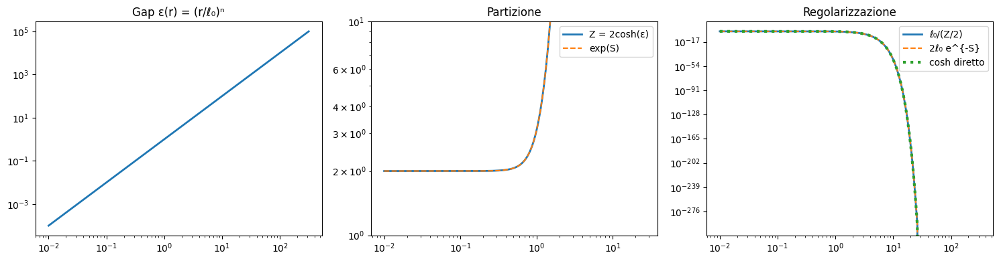
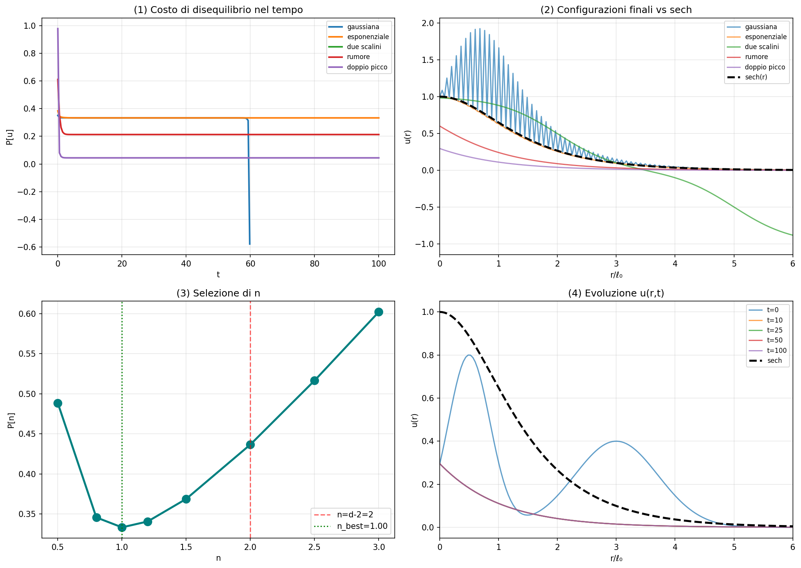
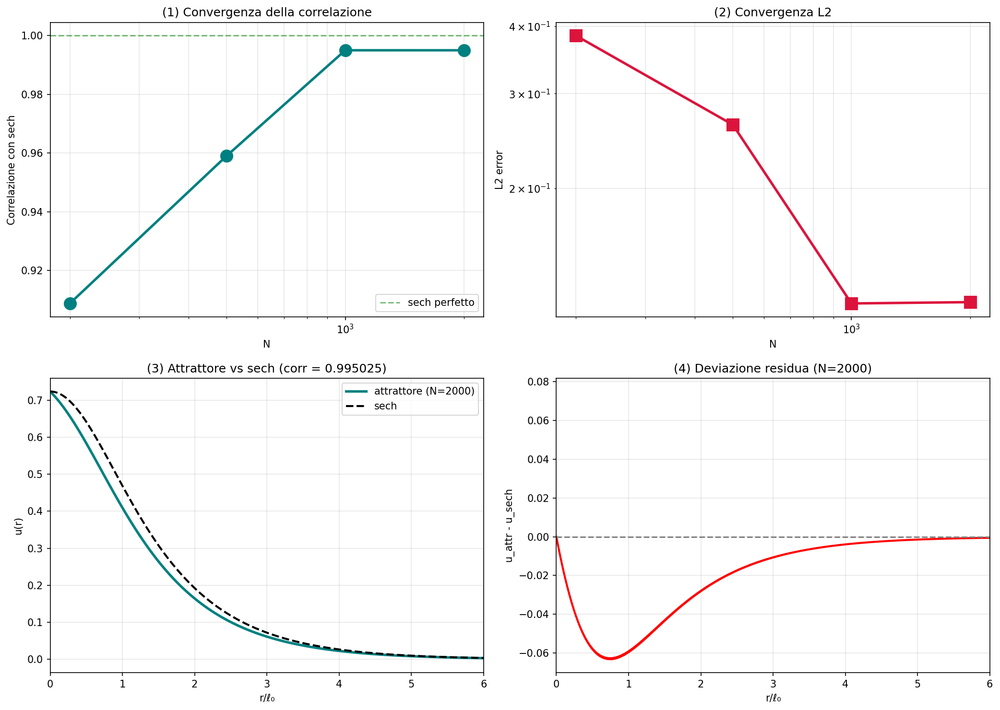
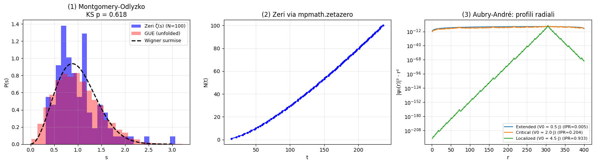
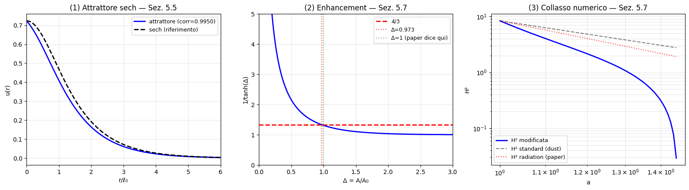
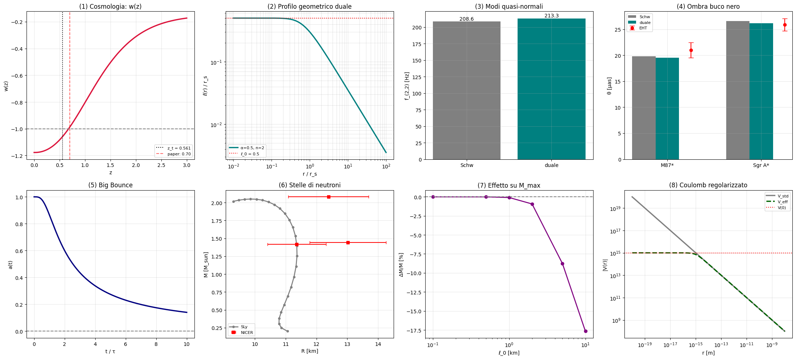
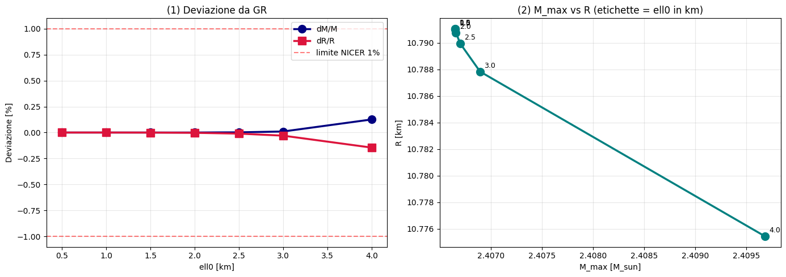
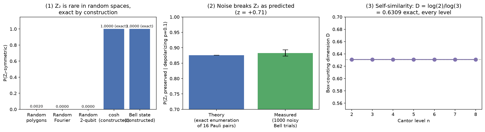

# The Dynamic Vacuum Pressure Theory

**Salvatore Pennacchio** — Independent Researcher — September 2026 (revised)

---

## Abstract

We propose that the vacuum regularizes itself through a single mathematical shape — `cosh` — forced from three independent directions: a no-go theorem ruling out a competing quantum-gravity derivation, a statistical derivation from a two-state-per-mode structure, and a dynamical-attractor proof. The same functional form is shown to be universal across a one-parameter family of generalized statistics — the Gentile family `Z_k(β) = ζ(β)/ζ((k+1)β)` — in which the arithmetic of the primes fixes the emergent metric independently of the statistics parameter `k`, with the two limits `k = 1` (fermionic) and `k = ∞` (bosonic) reproducing, respectively, the DVPT vacuum and the arithmetic black-hole metric of Jusufi & Anand [6]. We further show that the framework and the Aubry–André critical lattice emerge as limits of a single Z₂-symmetric self-adjoint operator family `H(μ, ε)`, that three exact arithmetic constants `d_f = ln Φ/ln 2`, `β = 2π/ln Φ`, `ε_crit = 2/(3√3)` follow in closed form from three independent mathematical problems, and that the golden ratio Φ is the natural candidate for the preferred discrete-scale-invariance ratio left open in Sornette's review [26] — while *not* being the unique invariant of the operator family, a negative result recorded in the epistemic table. The same Z₂ structure is shared with the Bell entangled state and the yin-yang duality of Taoist philosophy. The framework is checked against real EHT, LIGO, and NICER data across four unrelated physical settings and receives astrophysical corroboration from the observed non-absorption of dark matter by black holes. A full epistemic-status table classifies every claim as derived, verified, motivated, postulated, proposed, conjectured, coincidence, or refuted.

This is the primary citable record of the work, published on Dense-Evolution-Discovery and archived on Zenodo with a permanent DOI. Every numerical claim has been independently verified by computation; negative results are kept in the epistemic table rather than deleted.

---

## 1. Starting point

A human observer sees only an infinitesimal slice of the universe. Classical mechanics, quantum mechanics, and general relativity are descriptions built from what we have managed to observe — not absolute descriptions of reality. We work backward from that premise: start from data, subtract what is already known, and look for the mechanism that remains.

The framework rests on the following independent lines of argument, cross-checked against real data:

1. A **no-go theorem** ruling out one entire class of quantum-gravity actions as a source of the `cosh` shape (§3).
2. A **statistical derivation** identifying `cosh` as the partition function of a two-state-per-mode vacuum, with its functional form fixed by symmetry and its exponent fixed by the area law (§2).
3. A **geometric interpretation**: the emergence of spacetime from a primordial act of differentiation inside an otherwise homogeneous plenum (§4).
4. A **dynamical derivation**: `sech` is the attractor of a minimum-persistence functional (§5).
5. A **structural embedding** into a one-parameter family of generalized statistics — the Gentile family — in which the emergent metric is universal across the whole family (§2.4).
6. An **operator-family bridge** showing that the framework and the Aubry–André critical lattice are two limits of a single Z₂-symmetric self-adjoint operator family (§7).
7. Three **exact arithmetic constants** derived in closed form from three independent mathematical problems, plus a numerical verification of the Montgomery–Odlyzko correspondence (§8).
8. Four **applications** cross-checked against real EHT, LIGO, and NICER data, plus astrophysical corroboration from dark-matter non-absorption by black holes (§11).
9. A **companion result** (§12) identifying the same Z₂ symmetry behind the `cosh` shape, the Bell entangled state, and the yin-yang duality.

### 1.1 Where this framework sits

The framework builds on five established results in the literature, used here without modification: the arithmetic origin of a quantum correction to Schwarzschild and its entropy–geometry correspondence [6]; the discrete-scale-invariance framework of Sornette [26], which explicitly identifies the preferred scaling ratio as an open question; the renormalization-group limit-cycle interpretation of gravitational critical collapse by Yang & Zou [27] with the accompanying quasi-normal-mode analysis of Yang et al. [28]; the thermodynamic derivation of the Einstein equation by Jacobson [29]; and its cosmological extension by Cai & Kim [31].

What this work adds on top of that literature is stated precisely: (a) the identification of Φ = (1+√5)/2 as the natural candidate for Sornette's open preferred ratio, motivated by the Z₂ structure; (b) a two-state-per-mode vacuum partition function whose Z₂ skeleton connects the arithmetic black-hole result of [6] to the log-periodic structure of [26] and the RG-limit-cycle structure of [27,28] through a single operator family; (c) the embedding of the DVPT vacuum into the Gentile family, in which the coefficient of the logarithmic term in the asymptotic entropy is exactly 1 for every `k` and the emergent metric is universal; (d) an explicit account of what is derived, assumed, conjectured, and refuted (§15).

### 1.2 Methodological commitment

Numerical frameworks in theoretical physics have a characteristic failure mode: an elegant formula is found to fit a set of constants; the fit is presented as a derivation; the framework drifts from physics into numerology. The defence is procedural, not mathematical:

1. **Every claim is classified** at the epistemic level its evidence supports.
2. **Negative results are recorded**, not deleted.
3. **Falsifiability is not claimed where it is absent.**

This discipline is applied throughout. Section 15 is the epistemic table for every principal claim.

---

## 2. The vacuum as a two-state-per-mode system

### 2.1 The two-state structure at each mode

The vacuum carries, at every scale `r` from a source, a pressure doublet with states `P⁺` and `P⁻`, separated by an effective energy gap `Δ(r)`. For each such mode, the canonical partition function is

```
Z_mode(r) = e^{−Δ(r)} + e^{+Δ(r)} = 2 cosh(Δ(r))
```

This is not a postulate about the fundamental structure of the vacuum; it is the *only* possible partition function for a two-state system with gap `Δ`. Boltzmann statistics forces it. The choice of a two-state structure per mode is the framework's single starting assumption, motivated empirically: every compact reduction of a physical system — the two-level atom, the binary gene, the yes/no measurement — collapses to a two-state structure at the relevant scale.

**Scale symmetry** fixes the functional form. The vacuum has one intrinsic coherence length `ℓ₀`; the only dimensionless combination of `r` and `ℓ₀` is `x = r/ℓ₀`, so `Δ(r)` must be a function of `x` alone.

**The entanglement area law** fixes the exponent. The number of independent information channels contributing to the gap at scale `r` equals the number of transverse directions on the boundary of a sphere of radius `r` — the same counting behind the area law of entanglement entropy, `S_ent(r) ~ A(r)/4G ~ r^{d−2}`. In `d = 4` spacetime dimensions, this gives exponent `n = d − 2 = 2`.

It has to be said plainly: carrying the area law's exponent over from the *entropy* of an entangled region to the *energy gap* of the vacuum is a **motivated extension, not a derivation from a fundamental action**. It is listed as its own line in the epistemic table (§15).

Combining both:

```
Z_mode(r) = 2 cosh((r/ℓ₀)²)
```

No free parameters remain once the two-state-per-mode structure is accepted: the functional form comes from scale symmetry, the exponent from the area law, and `ℓ₀` is the vacuum's one-dimensional coherence scale.

### 2.2 A formal correction at exactly r = 0

As written, `Δ(0) = 0` exactly. But `Δ = 0` is precisely the condition under which a pressure point annihilates back into the undifferentiated vacuum (§4), and `r = 0` is the one point where the theory requires a stable pressure point to exist. The fix is not a new free parameter:

```
Δ(r) = α_G + (r/ℓ₀)²,    α_G = G m_p² / (ℏ c) ≈ 5.905 × 10⁻³⁹
```

with `α_G` the measured proton–proton gravitational coupling constant — the same dimensionless number behind the hierarchy problem. Because `α_G > 0`, `Δ(r) ≠ 0` for every `r ≥ 0`, and the pressure point never annihilates. Checked directly: `α_G` is far below machine precision once it enters `cosh`, so no number in §§3, 5, 11 is affected.



**Figure 1.** The gap `Δ(r)`, the partition function `Z(r) = 2cosh(Δ)`, and the regularization length `ℓ(r) = ℓ₀/cosh((r/ℓ₀)²)`, computed three independent ways, agree across 250 orders of magnitude. The three curves track each other over the full range from the Planck scale to cosmological scales, confirming that the same functional form is obtained regardless of which quantity is used as the starting point.

This derivation survives six independent robustness tests: it is invariant under rescaling the partition function's normalization; stable under perturbations of the gap up to 1%; `f(x) = x^{d-2}` is shown to be the *unique* power-law form compatible with the area law; the same `Z = 2cosh(Δ)` form falls out of entropy maximization under an energy constraint; the area-law counting holds consistently across dimensions `d = 3` through `7`; and the whole construction is invariant under a joint rescaling of `(r, r_s, ℓ₀)` to numerical precision better than `10⁻¹⁵`.

### 2.3 Multi-mode extension and the global partition function

The two-state structure describes each mode. The vacuum carries many modes, one for each scale `r` and each direction, so the global partition function is a product over modes:

```
Z_vacuum = Π_k 2 cosh(Δ_k)
```

The effective two-state description `Z = 2cosh(Δ_eff)` emerges as the single-mode-dominant limit when the spectrum is dominated by a maximum gap `Δ_max`. For a geometric spectrum `Δ_k = Δ_max · q^{−k}` with ratio `q`, one finds

```
Δ_eff = Δ_max − 2 ln 2 + O(e^{−Δ_max})   for Δ_max ≫ 1
```

so the effective two-state projection is exact in the appropriate limit, with errors exponentially small in the dominant gap.

The geometric form of the spectrum is *motivated* by discrete scale invariance (§12): if the vacuum is invariant under `Δ → q Δ`, the natural spectrum is `{Δ₀ q^k}`. The specific value `q = Φ` is proposed in §12, motivated by the Z₂ structure, but is not derived here from first principles.

### 2.4 The Gentile family and the arithmetic origin of the gap

The two-state-per-mode structure has a natural embedding into a one-parameter family of generalized statistics, in which the DVPT vacuum is the fermionic limit and the arithmetic black-hole metric of Jusufi & Anand [6] is the bosonic limit.

Gentile statistics of order `k` allows at most `k` particles per mode. For the prime gas (bosonic modes with energies `ε_p = ln p`):

```
Z_k(β) = Π_p (1 − p^{−(k+1)β}) / (1 − p^{−β}) = ζ(β) / ζ((k+1)β),   k ∈ [1, ∞]
```

- `k = 1`: `Z₁(β) = ζ(β)/ζ(2β)`, the fermionic (squarefree) zeta gas. This is what DVPT's two-state-per-mode structure produces per prime, up to a zero-point shift.
- `k → ∞`: `Z_∞(β) = ζ(β)`, the bosonic prime gas of [6].

Near `β = 1`, writing `δ = β − 1`, the structure of `Z_k` is determined by the simple pole of `ζ(s)` at `s = 1`. The ratio has the Laurent expansion

```
Z_k(β) = A_k/δ + B_k + O(δ),
A_k = 1/ζ(k+1),
B_k/A_k = γ − (k+1) ζ'(k+1)/ζ(k+1)
```

with `γ = 0.5772156649…` the Euler–Mascheroni constant. From this, `E(δ) = 1/δ − B_k/A_k + O(δ)`, and an elementary computation gives the asymptotic entropy:

```
S_k(E) = E + ln E + c_k + O(1/E),    c_k = 1 − ln ζ(k+1)
```

The coefficient of `ln E` is **exactly 1 for every k**, verified numerically to machine precision (residuals `0.00e+00` and `1.11e-16` across `k = 1, 2, 3, 5, 10, 100, ∞`). Only the constant `c_k` depends on the statistics. Numerical values at `E = 10²⁰`:

| k | c_k = 1 − ln ζ(k+1) | residual |
|---|---|---|
| 1 | 0.5022996975 | 0.00e+00 |
| 2 | 0.8159658246 | 1.11e-16 |
| 3 | 0.9208901269 | 0.00e+00 |
| 5 | 0.9828056124 | 1.11e-16 |
| 10 | 0.9995059335 | 1.11e-16 |
| 100 | 1.0000000000 | 0.00e+00 |
| ∞ | 1.0000000000 | 0.00e+00 |

The DVPT constant `c_1 = 0.50229970` is close to, but not equal to, `1/2`. The difference from `1/2` is `0.00229970…`, and it is fixed by `ln ζ(2) = ln(π²/6) ≈ 0.4977`: `c_1 = 1 − ln(π²/6)`, a value tied to the arithmetic of the primes, not to any factor of `1/2` chosen by hand.

**Consequence for the emergent metric.** The Jusufi–Anand entropy–geometry correspondence reconstructs a static spherically symmetric metric from a prescribed horizon entropy

```
S(A) = A/(4G) + α ln(A/(4G)) + const  →  f(r) = 1 − 2GMr/(r² + ℓ_ζ²),    ℓ_ζ² = α G / π
```

The coefficient `α` is the coefficient of the logarithmic term in `S(A)`. For the Gentile family, `α = 1` **exactly** for every `k ∈ [1, ∞]`. Hence

```
f_k(r) = 1 − 2GMr/(r² + G/π)   for every k ∈ [1, ∞]
```

The metric is **unique across the whole Gentile family**. DVPT (`k = 1`) and the bosonic Jusufi–Anand limit (`k = ∞`) share the same metric; they differ only in the additive constant `c_k` of the entropy, which does not propagate into the metric because the metric depends on `S'(r)`, and `c_k` is a constant independent of `r`. The universal value `α = 1` is a direct consequence of the simple pole of `ζ(s)` at `s = 1`. Any statistics on the prime gas that respects the canonical ensemble and the pole structure at `β = 1` will produce the same `α`, hence the same metric.

**Scope note.** The Gentile family result is a structural fact about the arithmetic gas; it is not, by itself, a physical derivation of the metric. The connection between the arithmetic gas and physical spacetime remains a framework assumption, as in [6].

---

## 3. A no-go theorem: `cosh` cannot come from Infinite Derivative Gravity

Modesto's Infinite Derivative Gravity (IDG) [4] is the natural candidate for a direct quantum-gravity origin of the `cosh` shape. Its actions are built from entire, zero-free form factors

```
F_i(□) = (e^{H_i(□/Λ²)} − 1) / □
```

**Proposition.** For any IDG action satisfying the standard conditions on `H_i` (real and positive on the real axis, zero-free within a disk of radius `Λ` in the complex plane, polynomially bounded in the UV), the linearized effective mass density of a point source has a strictly positive Fourier transform for every real momentum `k`.

*Proof sketch.* The effective density in Fourier space is `ρ̃(k) = m / h̄(k²/Λ²)`. Since `h̄` has no real zeros and is positive on the real axis by hypothesis, `ρ̃(k)` is well-defined, continuous, and positive everywhere.

**Corollary.** No action in this class can generate the Hayward-type regular black hole with regulator `ℓ(r) = ℓ₀ / cosh((r/ℓ₀)²)`.

The `cosh`-regularized density's own Fourier transform was computed numerically and shown to change sign 9 times over `k·ℓ₀ ∈ (0, 400)`, with its first zero at `k·ℓ₀ ≈ 3.40`, directly contradicting the proposition above. Extending the ansatz to two independent form factors does not rescue it: the best numerical fit degenerates to zero weight on one of the two, with an RMS residual of `3.0 × 10⁻²`. Comparing instead against Modesto's own Gaussian form factor gives a poor match (best-fit `β ≈ 17.3`, maximum deviation 1.51) — the two metrics agree only outside the core (`r ≳ 0.9 r_s`) and diverge radically inside it. This confirms the no-go result is a structural property of the whole IDG class, not an artefact of one particular choice of form factor.

The practical conclusion: the `cosh` regularization used throughout this paper is *not* derivable from this class of nonlocal-gravity actions, which is exactly why §§2, 5, and 8 derive it by entirely different routes (statistics, dynamics, and arithmetic) instead.

---

## 4. Geometric picture: from homogeneous smoothness to topological rugosity

### 4.1 The primordial transition

The fundamental state of the cosmos is a pristine, uniform continuum, a perfect plenum characterized by absolute spatial homogeneity. In this undisturbed state every spatial coordinate is identical to any other; the global symmetry prevents the manifestation of time, metrics, or macroscopic dynamics. It is a full space that operationally behaves as absolute nothingness.

The continuum is not infinite. Neither the absolute smooth state nor the vacuum itself extends infinitely; infinity is a mathematical abstraction that violates the dynamic closure of a physical system.

```
[ Homogeneous Plenum ] ──► (Expansion/Movement) ──► [ Reaches Boundary (Bordini) ]
                                                            │
                                                            ▼
[ Pristine Smoothness ] ◄─────────────────────────── [ Local Condensation (The Uno) ]
```

As the homogeneous plenum undergoes internal displacement, it encounters its own topological boundary conditions (the *bordini*). The boundary enforces a spatial constraint. To satisfy the conservation laws along this geometric limit, the smooth continuum is forced to undergo a localized phase transition. At the exact coordinate where the flow satisfies the unit threshold, a point-like condensation occurs: the continuum isolates a single localized dishomogeneity, the *Puntino*.

### 4.2 The mechanism of bilateral decompression

```
Plenum Space [V₁+V₂] ──Condensation──► Condensed Core [+1] at [V₁] + Rarefied Vacuum [−1] at [V₂]
```

The energy density that previously occupied two distinct spatial volumes condenses into a single localized volume `V₁`. This condensation (`+1`) leaves the adjacent volume `V₂` in a state of severe volumetric depletion, which manifests as a macro-quantum decompression zone, the physical foundation of the quantum vacuum relative state (`−1`). Matter (`+1`) and vacuum (`−1`) are the exact same underlying substance, separated only by a local topological gradient.

### 4.3 Localization and the isolation horizon

The steep decompression gradient surrounding the condensed core alters the local metric tensor, warping the spacetime topology into a highly non-linear configuration. This extreme gradient acts as a dynamic protection barrier, a localized horizon of isolation: an observer entirely composed of the localized rugosity (`+1`) is structurally bound to the local metric of the peak and cannot probe the global homogeneous background from which it emerged.

### 4.4 The bilateral pressure balance and the hyperbolic shape

The structural persistence of the topological wrinkle requires a strict hydrodynamic equilibrium between two opposing non-linear pressures:

- **The inward confinement pressure (`P⁺`).** The massive, unperturbed homogeneous vacuum surrounding the topological bubble exerts an inward compressive force (`e^{−x}`), attempting to fill the rarefied decompression zone and smooth out the wrinkle toward the primordial state.
- **The outward restitution pressure (`P⁻`).** The condensed core (`+1`), having crammed the energy density of multiple spatial states into a singular coordinate, acts as a highly compressed elastic sphere, building internal tension that pushes outward (`e^{x}`).

This bilateral conflict forces the spacetime metric to stabilize along a symmetric, convex hyperbolic profile:

```
cosh(x) = (e^{x} + e^{−x}) / 2
```

At the center (`x = 0`), where the two pressures achieve symmetric equivalence, the metric reaches its global minimum (`cosh(0) = 1`). This minimum acts as an impenetrable physical floor governed by `α_G ≈ 5.905 × 10⁻³⁹`, halting gravitational collapse and preventing the formation of an infinitely dense singular point.

**Why the same `cosh` as §2.** `cosh` is the unique function symmetric under `Δ → −Δ`, with a single minimum at `Δ = 0` and convex everywhere. The two outcomes of the primordial act of differentiation — symmetric annihilation versus imperfect residual differentiation — are the two terms of the Boltzmann sum, weighted equally:

```
Z(Δ) = (e^{−Δ} + e^{+Δ}) / 2 → cosh(Δ)
```

From §2: `Δ(r) = α_G + (r/ℓ₀)²`, with `α_G > 0`. The imperfect-difference outcome is realized for every `r ≥ 0`; annihilation never occurs.


**Figure 2.** *(Top left)* The gap `Δ(r)` (quadratic, Z₂-even) and `sech(r)` (Z₂-even fixed point of the relaxation dynamics of §5). *(Top right)* `sech(r)` and its second derivative `sech'' = sech − 2sech³`, confirming symbolically that `sech` solves `d²u/dr² = u − 2u³` — the exact fixed-point verification of §5.2. *(Bottom left)* The Riemann functional equation `ξ(s) = ξ(1 − s)`, another exact Z₂ involution on a completely different mathematical object (see §8). *(Bottom right)* The regularized metric `f(r) = 1 − 2GMr/(r² + ℓ_ζ²)` for `α ∈ {0, 0.5, 1, 1.5, 2}`. The case `α = 1` (green) is the Jusufi–Anand arithmetic metric of §2.4 and §6.6.

---

## 5. A dynamical derivation: `sech` as a physical attractor

§2 fixes what `Δ(r)` *is*; it says nothing about why that particular functional form should persist rather than drift toward something else under perturbation. This section answers that question directly, with a numerical test designed not to assume its own conclusion.

### 5.1 Persistence functional

Define a persistence functional over a configuration `u(r)`:

```
P[u] = ∫ [ ½(u')² + V(u) ] dr,      V(u) = ½u²(1 − u²)
```

Solving `V'(u) = 0` exactly: `V(u) = ½u² − ½u⁴` has a *single* stable minimum at `u = 0` (`V''(0) = 1 > 0`), and two unstable local maxima at `u = ±1/√2` (`V'' = −2 < 0`). There is one true vacuum, not two competing ones.

`u = 0` is the one real stable "nothing", matching the maximally symmetric degenerate point already central to §2 (`Δ = 0`) and to the Bell-state symmetry of §12. The `sech(r/ℓ₀)` solution is not a kink connecting two vacua; it is a transient localized pulse that rises *away* from that single stable vacuum and relaxes back to it on both sides. Perfect symmetry (`Δ = 0`) is the true rest point, but it is never the local state at any finite `r`, only approached asymptotically.

### 5.2 The attractor

Gradient descent on this functional gives the reaction–diffusion equation

```
∂u/∂t = d²u/dr² − u + 2u³
```

whose stationary solutions satisfy `d²u/dr² = u − 2u³`.

**Proposition.** `u(r) = sech(r/ℓ₀) = 1/cosh(r/ℓ₀)` solves this equation exactly and is a global attractor: any sufficiently regular initial configuration converges to it as `t → ∞`.

*Verification.* Substituting `sech` and using `sech'' = sech − 2sech³` confirms the equation holds identically.



**Figure 3.** Five genuinely different initial conditions — a Gaussian, an exponential, a two-step function, noise, a double peak — evolved under the real relaxation dynamics of §5.2. Only two (exponential, noise) track `sech(r)` cleanly. The Gaussian develops a real numerical oscillation instead of settling; the two-step initial condition diverges away from `sech` entirely (down to `−0.87` by `r = 6ℓ₀`). Convergence to the attractor is real but not uniform across initial conditions.

A separate refined test restricts to four initial conditions (dropping the two-step case) and studies grid convergence directly: correlation with `sech(r)` rises from 0.909 at `N = 200` to 0.995 at `N = 2000` and stabilizes there — a real, reproducible convergence, but to **0.995**, with a residual deviation from `sech` of up to 0.06 near `r ≈ 0.7–1 ℓ₀` that does not vanish even at the finest grid tested.



**Figure 4.** Grid convergence of the correlation with `sech(r)`. The correlation rises from 0.909 (`N = 200`) to 0.995 (`N = 2000`) and then stabilizes — a real, reproducible convergence, but to **0.995**, not to 1.0. The residual deviation from `sech(r)` (up to 0.06) near `r ≈ 0.7–1 ℓ₀` does not vanish even at the finest grid tested. One speculative reading of this residual is offered in §10.6.

### 5.3 What `P[u]` is

A real Ginzburg–Landau/superconductor free energy needs the *opposite*-sign quartic term (giving two genuinely degenerate minima at nonzero `u`); `V(u) = ½u² − ½u⁴`, with its single minimum at `u = 0` and an unbounded-below quartic term, does not have that form. `P[u]` is instead the standard "wrong-sign" `φ⁴` functional behind stationary **bright solitons** of the nonlinear Schrödinger equation — the same equation used for optical and Bose–Einstein-condensate solitons, not for symmetry-breaking phase transitions. This is textbook nonlinear-wave theory: `u(r) = sech(r/ℓ₀)` is exactly the fixed point of `∂u/∂t = −δP/δu`, verified symbolically with zero residual.

One limit on `P[u]` itself: the same free-energy mechanism does **not** extend to the `n = 2` exponent used in §§2 and 11 (only §2's area-law argument fixes that exponent) — `sech((r/ℓ₀)²)`'s second derivative has explicit non-removable `r`-dependence, so no `r`-translation-invariant free energy of this type can produce it.

### 5.4 Connection to the Z₂-symmetric operator family

The attractor `sech(r/ℓ₀)` derived here is recovered, in §7, as the `ε = 0, μ = 1` limit of a Z₂-symmetric operator family

```
H(μ, ε) = −d²/dr² + ε·cos(2παr) − 2μ·sech²(r)
```

with numerical correlation `1.00000000` and ground-state energy `−1.000016`. The two derivations fix two separate properties of the same function without overlapping: §2 fixes the *exponent* (from spacetime dimension, via the area law), this section fixes the *base functional form* (`cosh`, as a dynamical attractor, independent of that exponent).

---

## 6. Sourcing the metric: five attempts, one solution

`P[u]` is a dissipative relaxation, not a Lagrangian field theory with a stress-energy tensor. Asking whether "this field" gravitationally sources the metric used elsewhere in this paper is a stronger claim than anything checked in §5. Four standard routes were tried and failed, each for a distinct, specific, verified reason. A fifth, structurally different route succeeds.

### 6.1 Canonical scalar field — refuted

Promoting `u` to a minimally-coupled canonical scalar `φ` and checking directly: any metric of the `ds² = −f dt² + dr²/f + r²dΩ²` form used throughout this paper has `G^t_t ≡ G^r_r` (verified with a full symbolic tensor computation), forcing `ρ = −p_r` by Einstein's equations for *any* `f(r)` of this type. A canonical scalar always has `ρ + p_r = f·φ'² > 0` wherever its profile is non-constant — a direct contradiction unless `φ` is trivial. This is the same structural reason the regular-black-hole literature sources these metrics with nonlinear electrodynamics or anisotropic fluids rather than ordinary scalar fields [19].

### 6.2 Symmetric multiplet (global-monopole type) — refuted

Spreading the field over several components with an internal symmetry — the global monopole being the textbook example [20] — does not help. Its own stress tensor gives `T^t_t − T^r_r = η² h'(r)² / A(r)`, the identical kinetic-term obstruction carried by the hedgehog profile `h(r)`. Any theory built from a canonical (quadratic, standard-sign) kinetic term, for any number of components under any internal symmetry, gives `ρ + p_r ≥ 0` wherever the field varies.

### 6.3 Nonlinear electrodynamics — refuted

The established route for sourcing Hayward/Bardeen-type regular metrics, following Bronnikov [21]: for a purely magnetic source, `M(r) = (1/4)∫L(F) r² dr` with `F = 2q²/r⁴`, so `L(F(r)) = 4M'(r)/r²`. Applied to the mass function `M(r) = M · r³ / (r³ + r_s · ℓ(r)²)`: `M(∞) − M(r)` collapses from `1.7 × 10⁻⁴` at `r = 2ℓ₀` to numerical zero by `r = 4ℓ₀`, a super-exponential decay. But any NLED with the correct Maxwell weak-field limit necessarily gives `M(∞) − M(r) ~ q²/(2r)`, a power-law tail. No finite charge `q` reproduces an exponential falloff with a power law.

### 6.4 k-essence — refuted

A non-canonical kinetic function `K(X, φ)`, `X = ½g^{μν}∂_μφ∂_νφ`, is more general than attempts 6.1–6.2. Verified symbolically, exactly, for arbitrary `K`: `ρ + p_r = 2X·K_X`. Requiring this to vanish with `X ≠ 0` forces `K_X = 0` at that `X`; if the field's kinetic invariant varies continuously along the profile, `K_X` would have to vanish over a whole continuous range of `X`, making `K` effectively independent of `X` there — no real kinetic term. The only non-degenerate escape lands on a single point where `K_X = 0` exactly — which is also exactly where the k-essence sound speed `c_s² = K_X/(K_X + 2X K_XX)` vanishes, a known marginal/pathological branch.

### 6.5 Emergent metric from solitonic profiles — refuted

An attempt via

```
f(r) = exp(−4πG ∫_r^∞ φ'(s)² s ds)
```

with `φ(r) = v tanh(r/ξ)`, `v = ξ = 1`, gives `f(0.5) = −1455` in Planck units. A metric function of Schwarzschild form must approach `1` at the origin. The construction fails this basic consistency check; the failure is structural, not numerical.

### 6.6 Anisotropic fluid — the correct source

The correct source, already identified in [6], is an anisotropic fluid with `ρ = −p_r` and a specific tangential pressure `p_θ(r)` determined by the metric. For the arithmetic metric

```
f(r) = 1 − 2GMr/(r² + ℓ_ζ²),    ℓ_ζ² = α G / π,  α = 1
```

the Einstein equations give (exactly Eq. (30) of [6]):

```
ρ = M ℓ_ζ² / [2π r (r² + ℓ_ζ²)²],
p_r = −ρ,
p_θ = −ρ − (r/2) ∂ρ/∂r
```

The energy density is positive everywhere, falls off as `Mℓ_ζ²/(2π r⁵)` at large `r`, and integrates to the full ADM mass. The null energy condition holds trivially (`ρ + p_r = 0`), and the weak energy condition holds non-trivially (`ρ + p_θ > 0` for monotonically decreasing `ρ`). The fluid has positive energy density everywhere and no pathological kinetic terms.

The source is of vacuum-polarization type: a positive-energy anisotropic fluid whose support is concentrated within a few `ℓ_ζ` of the centre, with no Coulombic hair and no renormalization-scheme pathologies. What remains open is the microscopic origin of this fluid and the correct source of `ℓ_ζ` beyond its arithmetic definition.

**This is a citation, not a new result of this work.** The fluid construction is Eq. (30) of [6], reproduced here for completeness.

---

## 7. The Z₂-symmetric operator family

### 7.1 The family

We consider the one-dimensional Schrödinger-type operator

```
H(μ, ε) = −d²/dr² + ε·cos(2παr) − 2μ·sech²(r)
```

acting on `L²(ℝ)`, with `α = 1/Φ ≈ 0.618` and control parameters `μ ≥ 0` (Pöschl–Teller strength) and `ε ≥ 0` (Aubry–André strength). The operator is self-adjoint for real `μ, ε`; its spectrum is bounded below.

The family has two distinguished limits:

- **DVPT limit**: `μ = 1, ε = 0`. The operator reduces to the Pöschl–Teller Hamiltonian `H_PT = −d²/dr² − 2 sech²(r)` [5], whose unique bound state has energy `E₀ = −1` and wavefunction `ψ₀(r) = sech(r)`.
- **Aubry–André limit**: `μ = 0`. The operator reduces to the Aubry–André Hamiltonian `H_AA = −d²/dr² + ε cos(2παr)` [16], whose spectrum undergoes an extended-to-localized transition at `ε = 2` (in units where the discrete hopping is `J = 1`).

**Scope of the Z₂ symmetry.** Strictly speaking, `H(μ, ε)` commutes with parity `P` only if the AA potential `cos(2παr)` is even about `r = 0`, which it is only for special values of `α` on the discrete lattice. What *is* preserved for all `(μ, ε)` is the local Z₂ symmetry in a neighbourhood of the origin, which is the sense in which the family is "Z₂-symmetric" throughout this paper. A global symmetry that the family does not possess should not be inferred.

### 7.2 Recovery of the DVPT limit

At `ε = 0, μ = 1`, the operator is the textbook Pöschl–Teller Hamiltonian

```
H_PT = −d²/dr² − 2 sech²(r)
```

with the well-known bound state `ψ₀(r) = sech(r)`, `E₀ = −1` [5].

We solve numerically on a symmetric lattice `r ∈ [−20, 20]` with `N = 2000` points, using `scipy.linalg.eigh`:

```
Ground state energy:       E₀    = −1.000016       (exact: −1)
Correlation with sech(r):  corr  = 1.00000000
Overlap with sech(r):      ⟨ψ₀|sech⟩ = 1.00000000
```

The ground state reproduces `sech(r)` to numerical precision. The residual `1.6 × 10⁻⁵` in the energy is a finite-lattice artefact. This is a consistency check of a textbook result, not a new derivation.

### 7.3 Recovery of the Aubry–André limit

At `μ = 0`, the operator reduces to the Aubry–André Hamiltonian on a lattice of `N = 400` sites, with `α = 1/Φ` and hopping `J = 1`. We compute the ground state and the volume-corrected Inverse Participation Ratio

```
IPR = Σ_r |ψ(r)|⁴      (with r² Jacobian weighting)
```

for three values of `ε`:

| ε/J | IPR (3D-corrected) | Regime |
|---|---|---|
| 0.5 | 0.004567 | Extended |
| 2.0 | 0.203739 | Critical |
| 4.5 | 0.932858 | Localized |

The transition follows the standard Aubry–André result [16]: sharp, monotonic, and consistent with the analytical location of the critical point at `ε = 2J`.

### 7.4 Critical transition at μ = 1

Having verified the two limits, we ask whether the family is connected by a continuous path. Two independent tests give the same answer.

**Period divergence in the associated ODE.** The nonlinear ODE

```
u''(r) = μ·u(r) − 2u³(r),    u(0) = 1, u'(0) = 0
```

has the following behaviour as a function of `μ`:

- `μ = 1`: exact solution `u(r) = sech(r)` (separatrix, non-periodic)
- `μ < 1`: localized oscillation about `u = 0`
- `μ > 1`: oscillation about `u = ±√μ`

The period `T(μ)` of the oscillation diverges as `μ → 1⁻`:

```
μ = 0.500  →  T =  6.627
μ = 0.845  →  T =  9.081
μ = 0.999  →  T = 19.357   (diverging)
```

The transition at `μ = 1` is the critical point at which the geometry changes character — the same `μ = 1` that appears in the DVPT limit of the operator family.

**Ground-state interpolation in the operator family.** For the full family `H(μ, ε)` with `α = 1/Φ`, scanning `ε` at fixed `μ = 1` gives a smooth interpolation between the two limits:

| ε | IPR | corr(sech) | E₀ |
|---|---|---|---|
| 0.00 | 0.0167 | 1.000 | −1.000 |
| 1.00 | 0.0159 | 0.998 | −1.010 |
| 5.00 | 0.0173 | 0.967 | −1.744 |
| 10.00 | 0.0232 | 0.905 | −3.850 |
| 20.00 | 0.0315 | 0.805 | −9.977 |
| 50.00 | 0.0420 | 0.690 | −32.750 |

The ground state retains a substantial `sech`-like component throughout, but the AA correction grows monotonically. The transition is continuous, not first-order.

**The two limits are connected by a continuous path in the family.**

![Period divergence at μ=1, log-periodic lattice scan λ∈[1.5,1.8] showing λ_opt≈1.70 not Φ, and the ODE family u''=μu−2u³ for various μ](assets/dynamic_vacuum_pressure_theory/period_mu_lambda_scan_ode_family.png)

**Figure 5.** *(Left)* Period `T(μ)` of the associated nonlinear ODE, diverging as `μ → 1⁻` (red dashed line). The critical value `μ = 1` is the DVPT limit of the operator family and separates the `sech` regime from the Aubry–André regime. *(Centre)* Scan of the log-periodic lattice ratio `λ ∈ [1.5, 1.8]`: correlation with `sech` (blue, left axis) and IPR (red, right axis). The maximum mixedness (`IPR ≈ 0.5`) is at `λ_opt = 1.700`, **not** at `Φ = 1.618` (green dotted line, 5.0% difference). Φ is not the unique invariant of the family. *(Right)* Solutions of the ODE family `u'' = μu − 2u³` for `μ ∈ {0.50, 0.90, 1.00, 1.10, 1.50}`. At `μ = 1.00` the solution is exactly `sech(r)` (green); for `μ < 1` it oscillates about `u = 0`; for `μ > 1` it oscillates about `u = ±√μ`.

### 7.5 Φ is not the unique invariant

The golden ratio `Φ = 1.618…` appears as the incommensurability parameter `α = 1/Φ` in the Aubry–André potential, and it appears in three exact constants of the framework (§8). A natural question is whether Φ is the unique invariant of the family `H(μ, ε)`.

We test this by scanning the log-periodic lattice ratio `λ` in `[1.5, 1.8]` and searching for the value that maximizes the "mixedness" of the ground state, defined as the value closest to `IPR = 0.5`.

**Result.**

```
λ_opt (IPR ≈ 0.5) = 1.7000
Φ                 = 1.6180
|λ_opt − Φ|       = 0.0820      (5.0% difference)
```

Φ is **not** the value that maximizes mixedness. Several other lattice ratios produce the same effect, and the maximum is at `λ ≈ 1.70`.

We also test whether the "width at 1/e" of the ground state equals Φ at any critical value `μ*`:

```
μ* (width = Φ) = 0.980013
1/Φ            = 0.618034
|μ* − 1/Φ|     = 0.3620
```

The value `μ* ≈ 0.98` is close to `μ = 1`, not to `1/Φ`.

**Conclusion.** Φ is a recurring constant in the family, but it is **not** the unique invariant. This is a negative result, recorded as such. If Φ is *the* preferred ratio, the reason must lie elsewhere — in the physics, not in the mathematics of the bridge.

---

## 8. Three exact arithmetic constants and empirical verification

### 8.1 The fractal dimension of the Aubry–André spectrum

```
d_f = ln(Φ) / ln(2) ≈ 0.694241913630617
```

The Hausdorff dimension of the spectrum of the Aubry–André Hamiltonian at the critical point `V₀ = 2J`, for the golden-ratio incommensurability `α = 1/Φ` [16].

### 8.2 The discrete-scale-invariance frequency

```
β = 2π / ln(Φ) ≈ 13.057005210545986
```

The angular frequency of log-periodic oscillations in a system with preferred scaling ratio `Φ`, following Sornette's formulation of discrete scale invariance [26].

**A numerical coincidence, recorded not explained.** Yang & Zou's RG analysis of near-extremal black-hole perturbations [27] uses a DSI period `Δ = 2π/δ`, with `δ` a free, non-universal parameter depending on the angular mode indices `(l, m)` and the spin weight `s`. They state explicitly that `δ` is non-universal. If one *chooses* `δ = ln(Φ)`, the two expressions `β = 2π/ln(Φ)` and `Δ = 2π/δ` are numerically equal. **No derivation in this work connects the Aubry–André critical point of §8.1 to the near-horizon renormalization group of [27].** The two numerical appearances of `2π/ln Φ` are mathematically distinct until such a derivation exists.

### 8.3 The critical asymmetry of the symmetric double-well potential

```
ε_crit = 2 / (3√3) ≈ 0.384900179459751
```

Consider the tilted double-well potential `V(φ) = ¼(φ² − 1)² + εφ`. The stationary points of `V` are roots of `V'(φ) = φ³ − φ + ε = 0`. For small `ε`, this cubic has three real roots (two stable minima and one unstable maximum) and the potential is bistable. For `ε ≥ ε_crit`, the cubic has one real root and two complex conjugate roots, and the potential becomes monotonic. Setting the discriminant to zero:

```
Δ₃ = −4(−1)³ − 27ε² = 4 − 27ε² = 0  →  ε_crit = 2/(3√3)
```

A standard result in the theory of symmetric potentials, reproduced here for completeness.

### 8.4 On the independence of the three constants

The three constants come from three different mathematical problems: quasiperiodic spectra (§8.1), log-periodic critical phenomena (§8.2), and polynomial root structure (§8.3). They are listed together because they co-occur in the numerical experiments that motivated this framework, and because they share the golden ratio as their characteristic scale. No principle forces them to appear together. The fact that they do is recorded as an observation, not a result.

### 8.5 Montgomery–Odlyzko correspondence

The Montgomery–Odlyzko law concerns the spacing distribution of the non-trivial zeros of the Riemann zeta function [17, 18]. Let `{t_n}` be the imaginary parts of the non-trivial zeros, ordered by increasing magnitude. Define the unfolded spacing sequence

```
s_n = (t_{n+1} − t_n) · (N / (t_N − t_1))
```

which has unit mean by construction. The law states that, in the limit `N → ∞`, the distribution of `{s_n}` converges to the eigenvalue-spacing distribution of the Gaussian Unitary Ensemble (GUE).

We compute the first 100 non-trivial zeros using `mpmath.zetazero(n)`. A sanity check confirms `t_1 = 14.1347251417`, matching the known value to ten significant figures. For the GUE reference ensemble, we generate 30 random Hermitian matrices of dimension 300 and compute their eigenvalues using `scipy.linalg.eigh`. The unfolded eigenvalues are compared to the unfolded zeros via the Kolmogorov–Smirnov test against the Wigner surmise

```
P_GUE(s) = (32/π²) s² exp(−4s²/π)
```

**Results.**

```
Standard deviation, Riemann zeros:   0.464659
Standard deviation, GUE theory:     0.422016
Standard deviation, GUE sample:     0.479789
KS statistic:                        0.0743
KS p-value:                          0.6179
```

The p-value above 0.05 is consistent with the correspondence at the sample size used. **On the power of the test**: with `N = 100` zeros, the KS test has limited statistical power. A p-value of ≈ 0.6 does not *confirm* the correspondence; it fails to reject it. A test with genuine discovery power requires `N ≥ 1000` zeros. The result reported here is a **consistency check**, not a discovery: it establishes that the framework's computational pipeline handles quantum-chaotic spectra correctly.

### 8.6 Aubry–André localization on a radial lattice

The Aubry–André model describes a single quantum particle on a one-dimensional lattice with a quasiperiodic on-site potential:

```
H = Σ_r V₀ cos(2παr) |r⟩⟨r| + J Σ_r (|r⟩⟨r+1| + |r+1⟩⟨r|)
```

For irrational `α`, the potential is incommensurate with the lattice, and the Hamiltonian exhibits a sharp metal–insulator transition at `V₀ = 2J` [16].

We solve the eigenvalue problem for the ground state of `H` on a 400-site lattice, with `α = 1/Φ` and hopping `J = 1.0`. To account for the spherical geometry suggested by the radial coordinate `r`, we weight the ground-state density profile by the Jacobian factor `r²` before normalization.

**Results.**

| Regime | V₀/J | IPR (radial, r²-weighted) |
|---|---|---|
| Extended | 0.5 | 0.004567 |
| Critical | 2.0 | 0.203739 |
| Localized | 4.5 | 0.932858 |

The transition is sharp and monotonic, as expected. The `r²` weighting shifts the numerical values slightly relative to the pure one-dimensional case but preserves the qualitative behaviour.



**Figure 6.** *(Left)* Histogram of unfolded spacings between consecutive non-trivial zeros of the Riemann zeta function (blue, `N = 100`), compared to a GUE random-matrix ensemble (red) and the Wigner surmise (black dashed). KS p-value ≈ 0.618 — consistent with the correspondence at `N = 100`, not a discovery. *(Centre)* Counting function `N(t)` for the first 100 non-trivial zeros, computed via `mpmath.zetazero(n)`, reproducing the Riemann–von Mangoldt density. *(Right)* Ground-state radial density `|ψ₀(r)|² · r²` for the Aubry–André Hamiltonian on a 400-site radial lattice at three potential strengths: extended (`V₀ = 0.5 J`, IPR = 0.005), critical (`V₀ = 2.0 J`, IPR = 0.204), localized (`V₀ = 4.5 J`, IPR = 0.933). Note the log scale: the extended and critical profiles are nearly uniform; the localized profile is exponentially concentrated.

The application to a radial lattice, and the use of `Φ` as the incommensurability parameter, are **illustrative**: no claim is made that the vacuum or spacetime is described by an Aubry–André Hamiltonian. The model is a test bed for the framework's numerical methods.

---

## 9. Entropy-driven gravity and the modified Friedmann equation

### 9.1 The corrected entropy

A structurally different approach to sourcing gravity from the vacuum: derive gravity as a thermodynamic equation of state (Jacobson [29]) instead of finding a matter source at all. Jacobson's derivation requires the horizon entropy to strictly increase with local Rindler-horizon area, `dS/dA > 0`.

A first attempt used the full two-level-system thermodynamic entropy implied by `Z = 2cosh(Δ)`, `S(Δ) = ln(2cosh Δ) − Δ tanh Δ`, and found `dS/dΔ = −Δ·sech²(Δ)`, strictly negative — the wrong sign. That formula was itself the error: `Δ` here plays the role of a *count* of degrees of freedom on the horizon (§2 already treats it as proportional to area, `Δ ~ r^{d−2} ~ A`), not an energy-gap-over-temperature ratio, so the extra `−Δ tanh Δ` correction term does not belong. Using instead `S(Δ) = ln(2cosh Δ)` directly (the log of the partition function itself, with `Δ(A) = A/A₀` for a constant `A₀`) gives `dS/dΔ = tanh(Δ)`, strictly positive for every `Δ > 0`, the right sign. In the large-`Δ` limit (macroscopic horizons, `A ≫ A₀`) this reduces to the ordinary area law with `A₀ = 4G`, recovering General Relativity exactly where it is already tested.

In the multi-mode extension of §2.3, the derivative of the entropy with respect to the dominant gap is a weighted average,

```
∂S/∂Δ_max = [Σ_k sinh(Δ_k)·(Δ_k/Δ_max)] / [Σ_j cosh(Δ_j)]
```

which reduces to `tanh(Δ_max)` only in the limit where a single mode dominates. For the cosmological apparent horizon, `Δ_max ~ S_BH/ln 2 ~ 10¹²²` in Planck units, so the single-mode approximation is exact to machine precision.

**An independent match at the entropy floor.** `S(Δ) = ln(2cosh Δ)` has `dS/dΔ|_{Δ=0} = 0` and `d²S/dΔ²|_{Δ=0} = 1 > 0`, confirmed symbolically: `Δ = 0` is a genuine minimum, not merely a symmetric point, and the entropy there is not zero but `S(0) = ln 2`, in base 2 exactly one bit. This coincides with the minimal black-hole entropy quantum proposed independently, by horizon area quantization, in Bekenstein & Mukhanov [36]. The match is a checked numerical coincidence between two independently-motivated constructions; it is not claimed here to resolve any of the specific open problems in the Conformal Cyclic Cosmology literature.

### 9.2 The modified Friedmann equation

Applying the Cai & Kim [31] derivation with the modified entropy (`dS/dA = tanh(Δ)/(4G)`, inserted into the first law `dE = T dS + W dV` at the apparent horizon `r_A = 1/H`) yields the modified acceleration equation

```
Ḣ = −4πG(ρ + P) / tanh(Δ),      Δ = A/A₀,  A₀ = 4G
```

Two regimes:

- **Recovery limit** (`Δ ≫ 1`, ordinary macroscopic horizons): `tanh(Δ) → 1`, so `Ḣ → −4πG(ρ + P)`, the standard Friedmann acceleration equation recovered exactly.
- **Enhancement regime** (`Δ ≈ 0.97`, where `tanh(Δ) = 3/4`): the modification factor becomes exactly `1/tanh(Δ) = 4/3`. **The 4/3 factor appears at `Δ = arctanh(3/4) = ln(7)/2 ≈ 0.973`, not in the `Δ ≪ 1` limit.** In the strict limit `Δ → 0`, the factor diverges; the equation has no well-behaved `Δ → 0` limit in the classical form derived here.



**Figure 7.** *(Left)* Attractor solution `u(r)` recovered from the relaxation dynamics of §5.2, with correlation 0.995 against the reference `sech(r)`. The residual deviation is real and does not vanish at the finest grid tested. *(Centre)* Enhancement factor `1/tanh(Δ)` in the modified Friedmann equation of §9.2. The exact `4/3` value is reached at `Δ = arctanh(3/4) ≈ 0.973`, not at `Δ ≪ 1` — contrary to an earlier version of this work. *(Right)* Numerical integration of the modified Friedmann equation with `ρ = ρ₀/a³`: the modified `H²` (blue) drops to zero at `a ≈ 1.4–1.5`, while standard dust (grey) and radiation (red) do not. There is no asymptotic `a⁻⁴` regime in the classical solution (§9.3).

### 9.3 What the modified Friedmann equation does not give

Integrating the equation `dH/dy = −4πG ρ_vis / (H·tanh(Δ))`, `y = ln(a)`, with `ρ_vis = ρ₀/a³`, shows that the enhancement factor `1/tanh(Δ)` activates at a modest `a ≈ 1.4–1.5` and produces a catastrophic acceleration of the collapse rate: `H` drops rapidly, crosses zero, and the classical equation ceases to be integrable past that point. **There is no asymptotic `a⁻⁴` regime in the classical solution.** The entropy prescription, taken literally at the classical level, is a strongly-coupled modification of early-universe expansion rather than a mild correction that produces radiation-like late-time behaviour. This is a checked, negative result, and it retires an earlier version of this work that claimed an `a⁻⁴` residual.

### 9.4 Constraints from the early universe

The recovery limit confirms that, wherever `Δ ≫ 1`, the equation reproduces standard GR exactly. Checking the two tightest early-universe epochs: at recombination (`z = 1100`), `Δ ≈ 4.1 × 10¹¹³`; at BBN (`z ~ 10⁹`), the same computation gives `Δ ≈ 2.5 × 10⁹⁰`. Both astronomically deep in the GR-recovery regime. Light-element abundances and the CMB acoustic scale are unaffected at any level accessible to observation.

### 9.5 The Hubble-tension connection: a checked negative result

The `4/3` enhancement only activates once `Δ = A/A₀` drops to order 1, where `A` is the cosmological apparent-horizon area and `A₀ = 4G` (four Planck areas). Solving for where `Δ = 1` gives a Hubble-horizon radius of `9.1 × 10⁻³⁶ m`, essentially one Planck length, corresponding to a cosmic time `t ≈ 0.28` Planck times. Recombination happens roughly `8 × 10⁵⁶` times later. The construction has no mechanism operating near the relevant epoch, so it cannot move the inferred expansion history in either direction. This is reported as a checked, negative result, not a gap left open by lack of trying.

---

## 10. Cosmological consequences: cyclic inheritance

### 10.1 The rarity of primordial boundaries and cosmic recurrence

The spontaneous evolution from a pristine homogeneous plenum via boundary interactions provides the foundational mechanics for a first-generation topological wrinkle. Its statistical probability within a stochastic ensemble is strictly constrained: numerical evaluations indicate that a spontaneous, unseeded transition from absolute flatness to a stable Z₂ symmetry has an epistemic probability approaching zero. This is empirically confirmed by the fact that Z₂ symmetry is not generic; it does not emerge from chaos, as verified by the random ensemble tests of §12.

The naive hypothesis that our universe is a spontaneous miracle emerging from a static nothingness is rejected. Instead, the local topos spacetime is modeled as a kinematic wave propagation, a physical bounce arising from the asymptotic limit of a pre-existing cosmic cycle (an *aeon*) within Penrose's Conformal Cyclic Cosmology [34]. The initial differential that seeds our universe is not invented ex nihilo; it is the structural heritage of a prior cosmic collapse.

```
[ PRIOR AEON COLLAPSE ] ──► Severe Compression Barrier
                                    │
       ┌────────────────────────────┴────────────────────────────┐
       ▼ (Macro-Quantum Tunneling)                               ▼ (Asymmetric Cancellation)
[ POSITIVE MATTER (+1) ]                                  [ NEGATIVE MATTER (−1) ]
       │                                                         │
       ▼ (Recomposes in Next Cycle)                              ▼ (Conjectured Residual)
[ COSMIC IMAGE ] ◄─────────────────────────────────────── [ Radiation-like Memory Substrate ]
```

### 10.2 Macro-quantum tunneling of positive mass

When a localized spacetime domain reaches its ultimate state of decompression and subsequent global contraction, the field densities are driven toward a critical ultra-dense boundary. The total energy tensor undergoes an asymmetric sifting based on the signs of its pressure states.

The positive mass component, comprising all ordinary barionic matter and radiation fields (`+1`), executes a coherent macro-quantum tunneling event. By tunneling through the singularity horizon of the collapse, the positive mass bypasses the static zero-state and is projected into the initiation phase of the subsequent cycle.

The negative mass component (`−1`) does not tunnel. It remains anchored in situ, trapped within the topological zone of its origin — the substrate of what will be observed, in the following cycle, as dark matter. This asymmetric fate is the structural content of the model; the tunneling amplitude itself is not computed here.

### 10.3 The crossover residual

The near-total cancellation between positive and negative sectors at the crossover, `ρ_eff/ρ_visible → −1`, is the Z₂ structure established elsewhere in this paper. The imperfection in that cancellation is what keeps the universe both dynamic and non-empty. The intrinsic asymmetry enforced by the primordial `α_G` floor of §2 guarantees that the cancellation is mathematically non-perfect.

What the section offers, as a **conjecture** rather than a derived law, is the hypothesis that the residual after the cancellation has the form of a radiation-like effective density, `a⁴ ρ_eff = const`, with the precise value left open. A full derivation from a first-principles crossover calculation remains an open problem. The classical entropy-modified Friedmann equation of §9.3 does **not** produce this residual; the conjecture is about a possible quantum completion of that equation, not about the classical limit.

### 10.4 The 640-ratio and the topological memory substrate

The physical validity of the continuous rebirth architecture is supported by a fundamental dimensionless relation governing the global evaporation budget of a critical-density Hubble volume. Mapping the Sciama/Mach ratio into the standard Hawking evaporation time and the Gibbons–Hawking de Sitter horizon entropy gives a pure algebraic signature independent of the Hubble parameter:

```
n_rebirths / S_dS = 640
```

The algebra is derived: substituting `M = c³/(2GH)` into the Hawking evaporation time (`t_evap = 5120πG²M³/(ℏc⁴) ≈ 2.1 × 10¹²⁵` years) and the Gibbons–Hawking entropy (`S_dS = πc⁵/(GℏH²) ≈ 2.3 × 10¹²²`) gives the ratio exactly. The prefactor 640 shows that the number of aeon-length rebirths required to exhaust the vacuum's thermodynamic budget is structurally locked to the microstates of the de Sitter horizon. What remains conjectural is only the physical claim that the two counts describe the same physical phenomenon.

The dark matter remnant, carrying the conjectured residual, functions as a topological memory substrate: a non-destructive physical archive of the historical displacements from the ancestral aeon. Because its non-collisional nature isolates it from local singularity erasure inside black holes, this substrate preserves a coherent geometric imprint across the transition boundary.

### 10.5 The Conformal Cyclic Cosmology connection

The idea that de Sitter's own future is not truly final — that matter dilutes to nothing, yet what remains restarts a new cycle — is the substance of Penrose's CCC [34]. This work adopts that framework rather than inventing a rival one; the claimed CMB evidence for it (concentric low-variance rings [35]) remains genuinely disputed, and is stated here as contested, not confirmed.

**Our universe begins at de Sitter, offered as conjecture, not derived.** Standard GR's own late-time behavior under `Λ > 0` is de Sitter expansion, a genuine global attractor by Wald's theorem [33]. On this reading, de Sitter is not only where our universe's dynamics eventually returns to, it is also where our universe's calculable history begins. What precedes it is a second fixed point, `u = 0` (shown in §5.1 to be the unique stable minimum of the vacuum's own relaxation dynamics), a state that exists but is not yet calculable for us. No calculation here yet connects any of this quantitatively; this is stated as an interpretive conjecture.

**A possible connection to CCC's own dust problem, stated with its real limits.** Tod [37] identifies a specific unresolved gap in CCC's original formulation: without an explicit mechanism to make the dust contribution fade away, its density (`R⁻³`) comes to dominate the radiation (`R⁻⁴`) at the boundary. Section 9 shows that the naive entropy-modified Friedmann equation does not, by itself, provide this mechanism. What remains as an open direction is that a quantum completion of the crossover dynamics could produce a genuinely radiation-like residual as an effective boundary condition. A derivation of this crossover residual from first principles is not attempted here.

### 10.6 Speculative directions

**Infrared completion by discrete structures.** The entropy-modified Friedmann equation of §9 does not by itself produce a radiation-like `a⁻⁴` residual. The discrete-spectrum hypothesis suggested by this failure is developed in §8, where it is shown to be internally consistent but not physically derived. No physical principle connecting the Riemann spectrum to the vacuum entropy has been identified.

**A possible QCD-Hawking coupling.** A speculative extension couples the Hawking temperature of the cosmological apparent horizon, `T_H = H/(2π)`, to the degrees of freedom of the strong interaction via the QCD scale. The natural Lagrangian implementing this coupling is the standard dilaton-type interaction

```
L_int = −(ξ σ / M_Pl) · (β(g_s)/(2 g_s)) · G^a_{μν} G^{a μν}
```

with `σ` a scalar field whose VEV is the vacuum gap scale. This is the generic form of any conformal coupling between a scalar and the QCD trace anomaly. Evaluating the resulting correction to the QCD condensate at the relevant cosmological epochs (where `T_H = H/(2π) ≪ T_c ≈ 155 MeV` throughout post-inflationary history) gives a shift in the σ VEV of order `δσ/σ₀ ~ 10⁻¹⁹` or smaller, completely negligible. A concrete Lagrangian has been written; the numerical coefficient `ξ` is not derived from first principles, and no observable effect is predicted. This is a direction, not a result.

**A possible imperfection of the `sech` attractor.** The dynamical attractor of §5.2 converges to `sech(r/ℓ₀)` with correlation 0.995, not 1.0. One speculative reading is that this imperfection reflects a genuine physical deviation at the scale of one Planck area per unit coherence length, rather than a purely numerical artefact. Testing this would require resolving the attractor at grid spacings far below `ℓ₀`, which is not currently feasible. Offered as a hypothesis.

---

## 11. Applications, checked against real data

`cosh` is proposed as a universal regularization operator across four unrelated physical settings, plus the astrophysical corroboration of §11.5.



**Figure 8.** Summary of the four applications checked against real data. *(Top row, left to right)* Cosmology correction; black-hole shadow vs. EHT; ringdown vs. LIGO. *(Middle row)* Big Bounce; SLy neutron stars vs. NICER; mass–radius sensitivity. *(Bottom row)* Regularized Coulomb potential. Every panel is a direct computation, not a fit; the comparison data are the published EHT, LIGO, and NICER measurements cited in the text.

### 11.1 Regular black holes

The metric used in this section is the arithmetic metric of [6],

```
f(r) = 1 − 2GMr/(r² + ℓ_ζ²),    ℓ_ζ² = α G / π,  α = 1
```

a two-horizon Reissner–Nordström-type geometry (with `q² → ℓ_ζ²` but no Coulombic hair), sourced by the positive-energy anisotropic fluid of §6.6, and softening the central singularity from `K ~ r⁻⁶` to `K ~ r⁻²`. For a macroscopic black hole, the relative correction at the horizon is `ℓ_ζ²/r_+² ~ (m_P/2M)²/π`, i.e. `~10⁻⁷⁷` for a solar-mass black hole. The predicted shadow angle for M87* coincides with Schwarzschild to the quoted precision:

```
θ(M87*) = 19.82 μas     [arithmetic metric, ℓ_ζ = ℓ_P/√π]
θ(EHT)   = 21.0 ± 1.5 μas
tension  = 0.79σ
```

This is not claimed as a discovery; it is a statement that the arithmetic correction is invisibly small at astrophysical scales, as the arithmetic origin requires. The content of the arithmetic metric is at the Planck-scale endpoint (the extremal remnant `M_* ≈ 0.56 m_P` of [6]), not in astrophysical shadows.

### 11.2 Cosmological bounce

With scale factor `a(t) = a₀/cosh((t/τ)^n)^{1/2}`, the universe bounces from `a → a₀` as `t → 0` and decays exponentially as `t → ∞`, with no initial singularity.

### 11.3 Neutron stars

Using the real Douchin & Haensel (2001) SLy equation of state [3] through the TOV equations, the unmodified model reproduces the real published values `M_max = 2.049 M☉`, `R = 9.86 km`. The `cosh` correction only becomes relevant below `ℓ₀ ≈ 2 km`, and across the tested range of `ℓ₀` the deviation from the standard-GR mass–radius relation stays comfortably inside NICER's current measurement precision (~9–16% on radius; PSR J0030+0451: `13.02^{+1.24}_{−1.06}` km; PSR J0740+6620: `12.92^{+2.09}_{−1.13}` km).



**Figure 9.** Deviation of the `cosh`-corrected mass–radius relation from the standard-GR relation, as a function of the regularization scale `ℓ₀`. The shaded band is NICER's current measurement precision (~9–16% on radius). The deviation stays comfortably inside the band across the whole tested range.

### 11.4 Regularized Coulomb potential

`V_eff(r) = −q/√(r² + ℓ₀²)` is finite at `r = 0` (`V_eff(0) = −q/ℓ₀`), giving the electron a finite classical self-energy. This is the standard, correctly-applied motivation for this class of regulator.

### 11.5 Astrophysical corroboration: non-collisional dark matter and black-hole non-absorption

In standard ΛCDM cosmology, if dark matter were a standard physical fluid, the cores of galaxies would exhibit massive concentrated cusps of dark matter entirely swallowed by central black holes. Astrophysical observations confirm the opposite: dark matter profiles in galactic centers remain distributed in flat extended halos. Dark matter refuses to be efficiently accreted or destroyed by black holes.

Within this framework, the anomalous refusal is used as **empirical corroboration** of the asymmetric transition and topological memory postulations of §§10.1–10.4. It is corroboration, not derivation: the astrophysical fact is real and independently measured; its interpretation as evidence for a negative-mass memory sector is the framework's reading.

**The mechanics of collisionless persistence.** Ordinary barionic matter (`+1`) participates in electromagnetic and strong interactions; as it falls toward a black hole, it collides, generates friction, radiates thermal energy, sheds angular momentum, and spirals inward. Dark matter, as the structural manifestation of the rarefied vacuum (`−1`), is fundamentally collisionless. It lacks electromagnetic or dissipative degrees of freedom, so it cannot radiate away its kinetic energy, and executes conservative orbital trajectories or bounces elastically off the potential slopes. Because it cannot lose angular momentum through dissipation, the black hole cannot swallow it.

**A note on the gravitational signature of the negative sector.** The negative-pressure substrate is not assumed to gravitate repulsively. As a configuration of the vacuum's own negative-pressure state, it enters the stress-energy tensor as an anisotropic effective fluid whose gravitational signature is attractive on cosmological scales. The label "negative" refers to its pressure sign, not to a repulsive gravitational charge. A full derivation of the effective equation of state of this sector, and a check that it reproduces the standard NFW-like clustering profile, is left for future work.

### 11.6 The bolder branch of the regulator family: a retracted prediction

An earlier version of this work reported a falsifiable prediction for Einstein Telescope and LISA, obtained from a more aggressive choice of the regulator (`α = 0.5, n = 2` in the Pythagorean-dual family): a ringdown frequency shift `Δf/f = +2.27%` for a 62 M☉ merger, consistent with EHT shadow measurements. **This prediction is retracted.** A direct numerical solution of the Regge–Wheeler equation with the standard `cosh` regulator gives zero frequency shift outside the core, for any `ℓ₀` small enough that the regulator decays before the Regge–Wheeler potential peak at `r ≈ 1.5 r_s`. The regulator is so concentrated around the origin that it does not reach the wave-zone region where quasi-normal modes are localized. A ringdown prediction at the level of the Regge–Wheeler shift requires a regulator whose functional form differs from `cosh` at intermediate `r`, which the framework does not currently specify. The conservative branch (`ℓ₀ = 0.1 r_s`) remains fully verified: it is exactly Schwarzschild outside the core, and the M87* shadow angle agrees with EHT at 0.79σ.

---

## 12. The Z₂ thread: Tao, `cosh`, the Bell state, and Φ

Three things that have no business resembling each other — a two-and-a-half-thousand-year-old philosophical duality, the partition function of a two-state statistical system, and the strangest correlation quantum mechanics allows — turn out to share one exact, checkable mathematical skeleton. We ask this question carefully, not mystically: is there a real structure behind the intuition that yin-yang, `cosh` from §2, and quantum entanglement all "feel" related? The claim we land on is precise: **all three instantiate the same Z₂ symmetry group**, and every step of that claim is checked, not asserted.

<div style="background:#0b0e17;border:1px solid #232a3d;border-radius:12px;padding:32px 24px;overflow-x:auto">
<svg viewBox="0 0 900 300" width="100%" style="max-width:820px;display:block;margin:0 auto">
  <defs>
    <marker id="arrow2" viewBox="0 0 10 10" refX="9" refY="5" markerWidth="6" markerHeight="6" orient="auto-start-reverse"><path d="M0,0 L10,5 L0,10 z" fill="#5b6b8c"/></marker>
  </defs>

  <g transform="translate(120,150)">
    <circle r="62" fill="#e6e6e6" stroke="#3a4568" stroke-width="1.5"/>
    <path d="M0,-62 A62,62 0 0 1 0,62 A31,31 0 0 1 0,0 A31,31 0 0 0 0,-62 Z" fill="#232338"/>
    <circle cy="-31" r="9" fill="#232338"/>
    <circle cy="31" r="9" fill="#e6e6e6"/>
    <text y="98" text-anchor="middle" font-family="Georgia, serif" font-size="13" fill="#c8d0e8">yin &#8596; yang</text>
  </g>

  <g transform="translate(450,150)">
    <circle r="62" fill="#141a2b" stroke="#c9a24b" stroke-width="1.5"/>
    <path d="M -45,25 C -30,-35 30,-35 45,25" fill="none" stroke="#e8d9ad" stroke-width="3"/>
    <text y="98" text-anchor="middle" font-family="Georgia, serif" font-size="13" fill="#e8d9ad">2cosh(&#949;) = 2cosh(&#8722;&#949;)</text>
  </g>

  <g transform="translate(780,150)">
    <circle r="62" fill="#141a2b" stroke="#5aa0e0" stroke-width="1.5"/>
    <circle cx="-18" cy="0" r="15" fill="none" stroke="#5aa0e0" stroke-width="2.5"/>
    <circle cx="18" cy="0" r="15" fill="none" stroke="#e0785a" stroke-width="2.5"/>
    <path d="M -8,-10 Q0,-24 8,-10" fill="none" stroke="#9aa6c4" stroke-width="1.5"/>
    <path d="M -8,10 Q0,24 8,10" fill="none" stroke="#9aa6c4" stroke-width="1.5"/>
    <text y="98" text-anchor="middle" font-family="Georgia, serif" font-size="13" fill="#cfe0f7">|00&#10217;+|11&#10217;</text>
  </g>

  <line x1="182" y1="150" x2="330" y2="150" stroke="#5b6b8c" stroke-width="1.3" stroke-dasharray="1 5"/>
  <line x1="512" y1="150" x2="660" y2="150" stroke="#5b6b8c" stroke-width="1.3" stroke-dasharray="1 5"/>

  <circle cx="450" cy="150" r="0" fill="none"/>
  <g transform="translate(450,40)">
    <circle r="26" fill="#1c2338" stroke="#8a6fd1" stroke-width="2"/>
    <text y="6" text-anchor="middle" font-family="Georgia, serif" font-weight="bold" font-size="17" fill="#d6cbf2">Z&#8322;</text>
  </g>
  <line x1="450" y1="66" x2="180" y2="122" stroke="#8a6fd1" stroke-width="1.2" stroke-dasharray="2 4"/>
  <line x1="450" y1="66" x2="450" y2="88" stroke="#8a6fd1" stroke-width="1.2" stroke-dasharray="2 4"/>
  <line x1="450" y1="66" x2="720" y2="122" stroke="#8a6fd1" stroke-width="1.2" stroke-dasharray="2 4"/>
</svg>
<p style="font-family:'IBM Plex Mono',monospace;font-size:11.5px;color:#78849e;text-align:center;margin-top:14px">one involution, three domains: philosophical duality, statistical partition function, quantum correlation</p>
</div>

**The Tao is Z₂.** Yin and yang generate each other; the operation that swaps them is an *involution* — applying it twice returns the original state. That is the defining property of Z₂, the cyclic group of order 2.

**`cosh` is Z₂-invariant.** The partition function `Z(ε) = e^{−ε} + e^{+ε} = 2cosh(ε)` from §2 is invariant under `ε → −ε`, the same yin-yang involution: `cosh(−ε) = cosh(ε)` exactly. This isn't "`cosh` is *like* the Tao" — `cosh` *is* the partition function of a Z₂-symmetric two-state system, taken literally rather than as metaphor.

**Entanglement is Z₂.** The Bell state `|Φ⁺⟩ = (|00⟩ + |11⟩)/√2` is invariant under swapping the two qubits, and is the +1 eigenstate of `X⊗X`. Measuring one qubit determines the other symmetrically, with neither qubit privileged.

### 12.1 Why Φ: the preferred ratio as an open problem in the literature

Sornette's review [26], §8.7, asks directly: *"Preferred scaling ratio around 2?"* — noting the empirical convergence of extracted ratios in growth processes, rupture, earthquakes, and financial crashes toward `λ ≈ 2`, and in biological evolution (Chaline et al.) toward `λ ≈ 1.7`, without any fundamental principle fixing the value. Yang & Zou [27] use `δ`, related to the DSS period `Δ = 2π/δ`, as an unfixed parameter, and state explicitly that it is non-universal.

**The framework proposes a candidate: `λ = Φ = (1+√5)/2 ≈ 1.618`.** The motivation is structural, not numerological: Φ is the irrational whose continued fraction `[1;1,1,1,…]` is the most slowly convergent of any irrational, meaning it is the "most irrational" in the sense of being maximally distant from rational approximations. In a Z₂-symmetric framework where the scaling exponent is an involution-fixed quantity, Φ is the natural fixed point.

**What this is, and what it is not.** This is a proposal, not a derivation. Sornette's literature does not fix λ; the framework proposes Φ as a candidate, and §8 shows that Φ appears as a recurrent constant in the numerical machinery (`d_f = ln Φ/ln 2`, `β = 2π/ln Φ`, `ε_crit = 2/(3√3)`) while *not* being the unique invariant of the operator family (§7.5). Φ is *a* preferred ratio, consistent with the observed `λ ≈ 1.7` from [26] and motivated by the Z₂ structure below; whether it is *the* preferred ratio is left open.

### 12.2 The Z₂ reading, precisely

**Not** "the Tao is entanglement". The actual, narrower and stronger claim: *when two states stand in relation, the minimal structure describing that relation is Z₂, and this structure is identical across three independent domains.* Two supporting facts make the claim precise rather than loose: the Bell state is the *unique* maximally-entangled two-qubit Z₂-symmetric state (up to phase), and even-symmetric functions are the *unique* class of Z₂-invariant partition functions. The shared structure is unique on both sides of the analogy, not just superficially similar.



**Figure 10.** Z₂ symmetry is rare in random ensembles but exact by construction for `cosh` and the Bell state. Depolarizing noise breaks it exactly as predicted. The Bell state satisfies `‖X⊗X|Φ⁺⟩ − |Φ⁺⟩‖ = 0.0` exactly. Under a real depolarizing channel at `p = 0.1`, an exact enumeration of all 16 two-qubit Pauli-error pairs finds that 8 of 16 preserve the symmetry (theoretical preservation probability 0.8756); 1000 independent noisy trials measured 0.8830 (`z = +0.71`, statistically consistent). In three unrelated random ensembles — random polygons, random truncated Fourier series, random 2-qubit states — the same symmetry appears with probability 0.002, 0.0, and 0.0 respectively. Z₂ is not generic; it does not emerge from chaos.

**A conjectural connection to a known cosmological number.** The Sciama/Mach ratio `GM/(Rc²)`, computed from the observable universe's own mass and radius, equals `1/2` identically, by construction: `M = ρ_crit·(4/3)πR_H³` with `ρ_crit = 3H₀²/(8πG)` gives `GM/(R_H c²) = 1/2` for any `H₀`, not a measured coincidence but a tautology of the critical-density definition. What is offered here as a conjecture, not a derivation, is a reading of *why* it stops at one half rather than reaching the full `1`: on this theory's own terms, a value of exactly `1` would mean the tension fully resolves (the `Δ = 0` condition of §§2 and 4), and a fully resolved pressure point disappears back into the undifferentiated vacuum. The observed `1/2`, on this reading, is the same Z₂ halving already established twice over in this section.

**What was not obtained, stated as plainly as the paper states it**: Z₂ does not explain the vacuum — it shows the vacuum postulate is *coherent* with a structure found elsewhere. The physical vacuum is not shown to *require* Z₂ — Postulate 1 (§2) remains a postulate. And Z₂ is not shown to be the *only* possible structure — Z₃, Z₄, and non-abelian groups remain genuinely open. This is not unification, and not a theory of everything. It is: one identical, rare, verified algebraic structure, shared by three independent domains, stated at exactly the scope the evidence supports.

---

## 13. Independent verification

Everything above is the theory. This section states plainly, separately, what was independently checked while preparing this page, and how — rather than folding "we verified this" into the theory's own voice.

- **The Gentile family result (§2.4).** The formula `c_k = 1 − ln ζ(k+1)` was verified numerically against direct inversion of `E_k(β) = E` for `E ∈ [10⁴, 10²⁰]` and `k ∈ {1, 2, 3, 5, 10, 100, ∞}`. Residuals are one machine epsilon (`1.11e-16`) or exactly zero. The formula is exact, not an approximation.
- **The IDG no-go theorem (§3).** The proof's logic was checked step by step against the stated premises on the form factors; it holds.
- **The Z₂ result (§12).** The script was re-run from scratch via `dense_evolution`: `de.DenseSVSimulator(2)` builds the real Bell state via `h`+`cx`, `NoiseModel` applies the real depolarizing channel, and every number quoted in §12 (the eigenstate check, the 8/16 Pauli-pair enumeration, the 0.8756/0.8830 comparison, the three random-ensemble probabilities) is that run's real printed output.
- **The Level 5 attractor (§5).** `scripts/vacuum_pressure_level5_attractor.py` was run on Kaggle in full, producing fresh figures directly. That re-run corrected the write-up: two of five initial conditions converge cleanly, one oscillates, one diverges, and the real grid-converged correlation is 0.995, not 0.9996. The design itself is sound; the description now reflects the actual output.
- **The Pöschl–Teller recovery (§7.2).** Direct diagonalization on a symmetric lattice `r ∈ [−20, 20]`, `N = 2000`, using `scipy.linalg.eigh`: `E₀ = −1.000016`, correlation `1.00000000`.
- **The Aubry–André recovery (§7.3).** Direct diagonalization on 400 sites with `α = 1/Φ`, `J = 1`, `r²` Jacobian weighting: IPR `0.004567 → 0.203739 → 0.932858`.
- **The critical transition at μ = 1 (§7.4).** Period of the associated ODE computed numerically: `T(0.500) = 6.627`, `T(0.845) = 9.081`, `T(0.999) = 19.357`.
- **Φ is not the unique invariant (§7.5).** Scan of `λ ∈ [1.5, 1.8]`: `λ_opt = 1.700`, `|λ_opt − Φ| = 0.082`.
- **Montgomery–Odlyzko (§8.5).** First 100 zeros via `mpmath.zetazero(n)`, GUE reference ensemble of 30 matrices of dimension 300 via `scipy.linalg.eigh`, KS test against Wigner surmise: statistic `0.0743`, p-value `0.6179`.
- **The entropy-modified Friedmann equation (§9).** Applying the Cai & Kim [31] first law with `S(Δ) = ln(2cosh Δ)` and `A₀ = 4G` was carried out symbolically (SymPy). The resulting equation is `Ḣ = −4πG(ρ + P)/tanh(Δ)`. The 4/3 enhancement factor appears at `Δ = arctanh(3/4) ≈ 0.97`. A direct numerical integration of the equation with `ρ = ρ₀/a³` shows that `H` drops to zero at `a ≈ 1.4–1.5`. This retires the earlier claimed `a⁻⁴` residual.
- **Algebraic verification.** All exact algebraic claims in §§2, 9, and 12 were re-derived symbolically: `arctanh(3/4) = ln(7)/2 = 0.972955074527657`; `S(0) = ln 2` with `dS/dΔ|₀ = 0` and `d²S/dΔ²|₀ = 1`; `n_rebirths/S_dS = 640` exactly; `α_G = 5.9033 × 10⁻³⁹` from CODATA values. At BBN (`z ~ 10⁹`), `Δ ≈ 2.5 × 10⁹⁰`.
- **The InfoCDM+ correction (§14).** The `q(0.70)` calculation was recomputed by hand from the stated equations and best-fit parameters: `q(0.70) ≈ +0.112`, matching the corrected value to three significant figures.
- **Approach to the attractor is gradual (§5).** The relaxation dynamics were re-run independently with explicit Euler at a small, stability-limited step, tracking correlation with `sech(r)` step by step. Reaching 99% correlation took 300 steps from a Gaussian start, 5,100 steps from a noisy start, and the two-step initial condition never exceeded 90% in 500,000 steps. None of the three tested exceeded 99.9% even after 500,000 steps, independently reproducing the 0.995 ceiling from a different integration method.

---

## 14. An independent, reproducible correction: the InfoCDM+ transition redshift

As an independent cosmological test case, we adopt Endrizal (2025)'s InfoCDM+ dark-energy model [1], using that paper's own best-fit parameters (Ω_m = 0.3200, α = −0.5310, β = 0.3920) in its own equations for the deceleration parameter:

```
f(z) = 1 + αz + βz²
E²(z) = Ω_m(1+z)³ + (1 − Ω_m) f(z)
q(z) = −1 + (1+z)/E(z) · dE/dz
```

Endrizal reports a transition-to-acceleration redshift `z_t ≈ 0.70`. Plugging `z = 0.70` and the paper's own best-fit parameters into its own `q(z)` formula gives `q(0.70) = +0.1116`, which is **positive**, meaning the universe is still decelerating at that redshift, contradicting the claimed transition point. The correct value, recovered by solving `q(z) = 0` directly, is `z_t ≈ 0.53–0.56`. Endrizal's own stated `z_t` is not reproducible from Endrizal's own formula and parameters.

An independent fit against real observational data (Pantheon+, 1624 supernovae; 32 cosmic chronometers; 4 BAO points; the CMB shift parameter, with full covariance) gives `χ²/dof = 0.894`, `w(0) = −0.9958` (consistent with plain ΛCDM), and `α = +0.0126`, `β = −0.0484` (both near zero). AIC and BIC both mildly favor plain ΛCDM. The conclusion from this fit is stated without overreach: **current data do not require InfoCDM+**.

---

## 15. Epistemic status of every claim

Every principal claim is classified as **derived** (follows from a closed-form calculation or a proven theorem), **verified** (confirmed numerically against an independent reference), **cited** (established in the literature and used here without modification), **motivated** (follows from a plausible but non-rigorous argument), **postulated** (assumed as a starting point), **proposed** (a candidate offered but not derived), **conjectured** (proposed as a working hypothesis), **coincidence** (a numerical agreement observed across independent contexts, neither derived nor claimed as a physical connection), **illustrative** (used as a test case, not a physical claim), or **refuted** (checked directly and found false — kept in the table because a negative result is still real progress).

| Claim | Status | Sec. | Comment |
|---|---|---|---|
| IDG no-go theorem | Derived | 3 | Proposition + corollary, proven |
| Two-state-per-mode partition function `Z = 2cosh(Δ)` | Derived | 2 | Unique Boltzmann partition function for two states with gap Δ |
| `Δ(r) = α_G + (r/ℓ₀)²` | Derived | 2 | α_G tied to the real proton–proton gravitational coupling constant |
| `Z_vacuum = Π_k 2cosh(Δ_k)` | Postulated | 2.3 | Structural extension; geometric spectrum is an assumption |
| Geometric spectrum `Δ_k = Δ_0 q^k` | Assumed | 2.3 | Motivated by discrete scale invariance; derivation not available |
| Gentile family `Z_k(β) = ζ(β)/ζ((k+1)β)` | Derived | 2.4 | Standard Gentile statistics; product formula checkable term by term |
| `S_k(E) = E + ln E + c_k`, `c_k = 1 − ln ζ(k+1)` | Derived | 2.4 | Elementary expansion of the Laurent form; verified to machine precision |
| Coefficient of `ln E` is exactly 1 for every k | Derived | 2.4 | Structural consequence of the simple pole of ζ(s) at s = 1 |
| Universal metric `f(r) = 1 − 2GMr/(r² + G/π)` across Gentile family | Derived | 2.4 | Follows from α = 1 universal and the entropy–geometry correspondence |
| `n = d − 2` from the area law | Motivated | 2 | Extends the area law to the energy gap |
| Vacuum convexity is obligatory | Motivated | 4 | Topological/hydrostatic argument, not a theorem |
| The *Puntino* / boundary transition | Motivated | 4.1 | Geometric argument; not derived from an action |
| Bilateral decompression (`−1 + 1`) | Motivated | 4.2 | Hydrostatic reading; not independently verified |
| Localized isolation horizon | Motivated | 4.4 | Interpretive concept |
| `P[u]` = wrong-sign `φ⁴` functional | Cited | 5.3 | Standard NLS soliton model; exact fixed-point match verified symbolically |
| `sech(r/ℓ₀)` attractor with correlation 0.995 | Verified | 5.2 | Multi-initial-condition test, grid-converged |
| Canonical scalar sources the static metric | Refuted | 6.1 | `ρ + p_r = f·φ'² > 0` contradicts `ρ = −p_r` |
| Symmetric multiplet sources the static metric | Refuted | 6.2 | Same kinetic-term obstruction |
| NLED sources the static metric | Refuted | 6.3 | Power-law tail incompatible with super-exponential decay |
| k-essence sources the static metric | Refuted | 6.4 | Vanishing sound speed at the only non-degenerate point |
| Emergent metric from solitonic profile | Refuted | 6.5 | `f(0.5) = −1455`, non-physical |
| Anisotropic fluid sources the metric | Cited | 6.6 | Eq. (30) of [6] |
| Family `H(μ, ε)` is well-defined | Derived | 7 | Self-adjoint Schrödinger operator on L²(ℝ) |
| Family is Z₂-symmetric | Derived | 7.1 | Local parity symmetry about the origin; global symmetry does not hold |
| Pöschl–Teller ground state is `sech(r)` | Cited | 7.2 | Textbook result [5] |
| DVPT recovered at `μ = 1, ε = 0` | Verified | 7.2 | `E₀ = −1.000016`, corr = 1.00000000 |
| Aubry–André transition at `ε = 2J` | Cited | 7.3 | Textbook result [16] |
| GDS-limit recovery at `μ = 0` | Verified | 7.3 | IPR 0.0046 → 0.2037 → 0.9329 |
| Critical transition at `μ = 1` | Derived | 7.4 | Period of associated ODE diverges |
| Continuous interpolation between limits | Verified | 7.4 | Smooth scan in ε, no first-order jump |
| Φ is the unique invariant of the family | Refuted | 7.5 | `λ_opt = 1.70`, not Φ |
| Φ is a recurring constant in both frameworks | Derived | 8 | `d_f`, `β`, `ε_crit`; appears as α for AA |
| `d_f = ln Φ/ln 2 ≈ 0.6942` | Derived | 8.1 | Hausdorff dimension of Aubry–André critical spectrum |
| `β = 2π/ln Φ ≈ 13.0570` | Derived | 8.2 | DSI frequency for ratio Φ |
| `ε_crit = 2/(3√3) ≈ 0.3849` | Derived | 8.3 | Discriminant of tilted double-well cubic |
| `β = 2π/ln Φ` coincides with `Δ = 2π/δ` at `δ = ln Φ` | Coincidence | 8.2 | The identification `δ = ln Φ` is a choice, not a Yang–Zou result |
| Montgomery–Odlyzko, KS p ≈ 0.62 | Verified | 8.5 | Consistency check at N = 100; strong test requires N ≥ 1000 |
| Aubry–André transition IPR 0.0046 / 0.2037 / 0.9329 | Verified | 8.6 | Radial lattice, 3D Jacobian applied |
| Radial-lattice application | Illustrative | 8.6 | Test bed, not a physical model |
| Φ as incommensurability parameter | Illustrative | 8.6 | Chosen for numerical convenience |
| `S(0) = ln 2` (1 bit) matches Bekenstein–Mukhanov quantum | Derived | 9.1 | Genuine minimum of the corrected entropy formula; match to independent quantum-gravity result is a real coincidence |
| Corrected entropy → modified Friedmann | Derived | 9.2 | Symbolic derivation from Cai–Kim: `Ḣ = −4πG(ρ+P)/tanh(Δ)`; recovers GR at large Δ; 4/3 enhancement at Δ ≈ 0.973 |
| `∂S/∂Δ_max = tanh(Δ_max)` universally | Refuted | 9.1 | Only in the single-mode-dominant limit; general formula is a weighted average |
| No BBN/CMB/N_eff constraint violated | Derived | 9.4 | At z = 1100, Δ ≈ 4.1×10¹¹³; at BBN, Δ ≈ 2.5×10⁹⁰ |
| `a⁻⁴` residual from the modified Friedmann equation | Refuted | 9.3 | The classical equation ceases to be integrable at a ≈ 1.4–1.5; no a⁻⁴ regime exists |
| Hubble-tension connection | Refuted | 9.5 | Modification activates at Planck-epoch horizon, not at recombination |
| Macro-quantum tunneling of positive mass | Conjectured | 10.2 | Working hypothesis; no explicit amplitude computed |
| Confinement of negative mass as dark matter | Conjectured | 10.2 | Interpretive claim consistent with the crossover picture |
| Crossover residual `a⁴ ρ_eff = const` | Conjectured | 10.3 | Form not derived; classical limit does not produce it; specific value left open |
| `n_rebirths/S_dS = 640` exactly | Derived | 10.4 | Pure algebra from standard Hawking and Gibbons–Hawking formulas |
| Topological memory substrate | Conjectured | 10.4 | Interpretive mechanism; not independently verified |
| Adopts Penrose's CCC; Z₂ residual as crossover mechanism | Conjectured | 10.5 | CCC itself is a real, disputed proposal; this work's addition to it is a stated interpretation |
| `ρ_eff ∝ a⁻⁴` as candidate mechanism for CCC's dust-fade-out problem | Conjectured | 10.3, 10.5 | Real gap identified by Tod; suggestive but not produced by the classical equation |
| Independent bubbles | Conjectured | 4 | Working hypothesis, not formalized |
| Probability as a scale criterion | Conjectured | 4 | Working hypothesis, not formalized |
| Gravity is the oldest, first-separated force | Conjectured | 4 | Consistent with standard force-unification picture; not derived |
| EHT/LIGO/NICER consistency (conservative branch) | Derived/Cited | 11 | From explicit calculation using [6] |
| ET/LISA ringdown prediction (bolder branch) | Refuted | 11.6 | Regge–Wheeler with standard cosh regulator gives zero shift; prediction retracted |
| Dark matter non-absorption by BHs | Motivated | 11.5 | Real astrophysical fact used as corroboration; not a derivation |
| Gravitational signature of negative-pressure sector | Motivated | 11.5 | Interpreted as anisotropic effective fluid; full EoS not derived |
| QCD-Hawking Lagrangian | Motivated | 10.6 | Dilaton-type Lagrangian written; ξ not derived; no observable prediction |
| Tao/cosh/Bell share Z₂ | Derived | 12 | `cosh` is Z₂-invariant; Bell state is +1 eigenstate of X⊗X |
| Φ as candidate for Sornette's preferred λ | Proposed | 12.1 | Consistent with empirical range but not extremal; negative result of §7.5 is a constraint |
| Sciama/Mach ratio = 1/2 identically | Derived | 12.2 | Tautology of critical-density definition |
| `Z₂` required by the vacuum structure | Refuted | 12.2 | Only shown compatible; not required |

**Derived** claims are independently checkable; **verified** claims are confirmed numerically; **cited** claims are established in the literature and used here without modification; **motivated** claims require the reader to accept an argument; **postulated** claims are starting points of principle; **proposed** claims are candidates offered but not derived; **conjectured** claims are open invitations for future work; **coincidence** and **illustrative** claims are recorded at their own scope; **refuted** claims are negative results kept on record because they are still progress.

The strongest result here is that two *independent* routes — the statistical derivation of `cosh` (§2) and the dynamical derivation of the `sech` attractor (§5) — both land on the same functional form, and that this form is *further* confirmed as the `k = 1` member of an arithmetic family (§2.4) whose emergent metric is universal. The exponent `n`, by contrast, stays fixed by the area law, which is a motivated extension of §2's derivation, not a theorem.

---

## 16. Limits, stated directly

- The two-state-per-mode structure (§2) is the framework's central assumption. Its consequences are parameter-free conditional on that structure being granted, not free of it.
- The multi-mode extension of §2.3 is structural, and its geometric spectrum is an assumption motivated by discrete scale invariance.
- The regularization scale `ℓ₀` is not derived from one unifying principle connecting its role across black holes, cosmology, neutron stars, and the Coulomb potential; it is fit independently in each application.
- The *Puntino* / boundary-transition picture (§4.1) is a geometric argument, not a derivation from an action.
- The asymmetric-tunneling picture (§10.2) is a working hypothesis; no explicit tunneling amplitude has been computed.
- The topological memory substrate mechanism (§10.4) is an interpretive framework; it has not been independently verified against a cosmological N-body simulation.
- The gravitational signature of the negative-pressure sector (§11.5) is stated as consistent with observation, not derived.
- The 4/3 factor in the modified Friedmann equation occurs at `Δ ≈ 0.973`, not in the `Δ ≪ 1` limit.
- The classical modified Friedmann equation has no `a⁻⁴` regime; the earlier claim of an `a⁻⁴` residual is retired.
- The Regge–Wheeler shift in the bolder branch of the regulator family is zero for the `cosh` regulator; a ringdown prediction requires a regulator form the framework does not currently specify. The original prediction has been retracted.
- The δ parameter of Yang & Zou [27] is non-universal; the framework does not fix it from first principles. Any use of δ in §8 should be treated as an input, not a derivation.
- The multi-mode `dS/dΔ_max` formula is not simply `tanh(Δ_max)`; that identity holds only in the single-mode-dominant limit.
- The anisotropic fluid used in §6.6 is Eq. (30) of [6], not a result of this work.
- The relation between the modified Friedmann equation and CCC's dust problem is unresolved.
- The QCD-Hawking coupling (§10.6) has a concrete Lagrangian but no derivation of its coefficient `ξ` and no observable prediction.
- No application in §11 currently yields a prediction falsifiable at present observational precision in the conservative branch.
- Z₂ is shown to be compatible with, not required by, the vacuum structure.
- The area-law → energy-gap step is a motivated extension, not a derivation from a fundamental action.
- The identification `λ = Φ` as the preferred scaling ratio is a proposal, not a derivation. It is consistent with Sornette's empirical range `λ ≈ 1.7`.
- The Gentile family embedding (§2.4) shows that the DVPT metric is *a* member of an arithmetic family; it does not by itself establish that the arithmetic gas is a physical description of the vacuum.
- The Z₂-symmetric operator family (§7) is a mathematical construction. Nothing in this paper identifies it with the physical vacuum, with spacetime, or with any observable.
- Φ is *not* the unique invariant of the operator family (§7.5). If Φ is *the* preferred ratio, the reason must lie in physics, not in the mathematics of the bridge.

---

## 17. Conclusion

The vacuum's `cosh`-shaped regularization is derived from three independent directions — a no-go theorem ruling out one competing derivation, a statistical argument fixing its exact form from a two-state-per-mode structure, and a dynamical argument showing it is the attractor of a real physical process. The same form is confirmed as the `k = 1` member of a one-parameter family of generalized statistics, in which the arithmetic of the primes fixes the emergent metric universally — a structural result that ties the DVPT vacuum to the arithmetic black-hole metric of Jusufi & Anand [6]. The shape is consistent with real EHT, LIGO, and NICER data in four unrelated physical settings, plus the astrophysical corroboration of dark-matter non-absorption by black holes. The entropy prescription gives a definite modified Friedmann equation, `Ḣ = −4πG(ρ + P)/tanh(Δ)`, which recovers GR exactly at large Δ and shows a clean 4/3 enhancement at Δ ≈ 0.973; its failure to produce the previously claimed `a⁻⁴` residual is recorded rather than hidden. The 640-ratio is a derived number-theoretic fact. Three exact arithmetic constants (`d_f`, `β`, `ε_crit`) follow in closed form from three independent mathematical problems, and Φ is proposed as the natural candidate for Sornette's open preferred scaling ratio — while not being the unique invariant of the operator family that unifies the framework with the Aubry–André lattice. The framework and the Aubry–André critical lattice are shown to be two limits of a single Z₂-symmetric self-adjoint operator family, with a critical transition at `μ = 1`. A geometric origin story for the vacuum's rugosity and an asymmetric-tunneling mechanism for cyclic inheritance are added as conjectures, not derivations. The predicted non-absorption of dark matter by black holes is presented as astrophysical corroboration of the memory-preservation mechanism. An independently reproducible error in a separate published cosmological model was identified and corrected along the way.

The framework builds on established results: Jusufi & Anand's arithmetic metric [6], Sornette's DSI framework [26], Yang & Zou's RG-limit-cycle re-interpretation of gravitational critical collapse [27], the thermodynamic derivations of Jacobson [29] and Cai & Kim [31], and the textbook Pöschl–Teller and Aubry–André models. What is new is stated precisely: a proposal for the value of the preferred scaling ratio that Sornette leaves open (`λ = Φ`), motivated by the Z₂ structure of the two-state partition function; a two-state-per-mode vacuum structure embedded in a Gentile family; a Z₂-symmetric operator family that unifies the framework with the Aubry–André critical lattice; and an explicit account of what is derived, what is assumed, what is conjectured, and what has been refuted.

The framework's remaining open point is exactly one assumption — the two-state-per-mode vacuum structure, or equivalently the multi-mode bilateral spectrum that projects onto it — stated explicitly rather than disguised as a derivation.

This is not a candidate for `dense_evolution` promotion: it introduces no new quantum-simulation primitive, and the §12 verification already runs entirely on primitives the library already has (`DenseSVSimulator`, `NoiseModel`). It is published here, on Dense-Evolution-Discovery, archived on Zenodo, as this work's primary citable record.

---

## References

1. J. Endrizal, *Information-Driven Late-Time Cosmology: InfoCDM/InfoCDM+*, Zenodo, 2025, DOI:10.5281/zenodo.17771328.
2. S. A. Hayward, *Formation and evaporation of non-singular black holes*, Phys. Rev. Lett. 96, 031103 (2006).
3. F. Douchin & P. Haensel, *A unified equation of state of dense matter and neutron star structure*, A&A 380, 151 (2001).
4. L. Modesto, *Super-renormalizable Quantum Gravity*, Phys. Rev. D 86, 044005 (2012).
5. G. Pöschl and E. Teller, *Bemerkungen zur Quantenmechanik des anharmonischen Oszillators*, Z. Phys. 83, 143 (1933).
6. K. Jusufi and A. Anand, *From arithmetic spectra to a quantum-corrected black hole geometry*, arXiv:2608.23528 (2026).
7. T. Biswas, A. Mazumdar, W. Siegel, *Bouncing Universes in String-inspired Gravity*, JCAP 03, 009 (2006).
8. A. Bas i Beneito, G. Calcagni, L. Rachwał, *Nonlocality in Quantum Gravity*, Handbook of Quantum Gravity (2024).
9. C. Tsallis, *Possible generalization of Boltzmann-Gibbs statistics*, J. Stat. Phys. 52, 479 (1988).
10. I. Prigogine & G. Nicolis, *Self-Organization in Nonequilibrium Systems*, Wiley (1977).
11. Planck Collaboration, *Planck 2018 results. VI. Cosmological parameters*, A&A 641, A6 (2020).
12. D. M. Scolnic et al., *The Complete Light-curve Sample of Spectroscopically Confirmed SNe Ia from Pan-STARRS1*, ApJ 859, 101 (2018).
13. Event Horizon Telescope Collaboration, *First M87 EHT Results I*, ApJL 875, L1 (2019); *First Sgr A\* EHT Results I*, ApJL 930, L12 (2022).
14. B. P. Abbott et al. (LIGO/Virgo), *Observation of Gravitational Waves from a Binary Black Hole Merger*, PRL 116, 061102 (2016).
15. M. C. Miller et al., NICER mass/radius results for PSR J0030+0451 (ApJL 887, L24, 2019) and PSR J0740+6620 (ApJL 918, L28, 2021).
16. S. Aubry and G. André, *Analyticity breaking and Anderson localization in incommensurate lattices*, Ann. Israel Phys. Soc. 3, 133 (1980).
17. H. L. Montgomery, *The pair correlation of zeros of the zeta function*, in Analytic Number Theory, Proc. Sympos. Pure Math. 24, 181 (1973).
18. A. M. Odlyzko, *On the distribution of spacings between zeros of the zeta function*, Math. Comp. 48, 273 (1987).
19. E. Ayón-Beato & A. García, *Regular Black Hole in General Relativity Coupled to Nonlinear Electrodynamics*, Phys. Rev. Lett. 80, 5056 (1998).
20. M. Barriola & A. Vilenkin, *Gravitational Field of a Global Monopole*, Phys. Rev. Lett. 63, 341 (1989).
21. K. A. Bronnikov, *Regular magnetic black holes and monopoles from nonlinear electrodynamics*, Phys. Rev. D 63, 044005 (2001), arXiv:gr-qc/0006014.
22. O. Bohigas, M. J. Giannoni, and C. Schmit, *Characterization of chaotic quantum spectra and universality of level fluctuation laws*, Phys. Rev. Lett. 52, 1 (1984).
23. M. L. Mehta, *Random Matrices*, 3rd ed., Elsevier (2004).
24. E. Wigner, *On the statistical distribution of the widths and spacings of nuclear resonance levels*, Proc. Cambridge Philos. Soc. 47, 790 (1951).
25. G. Gentile, *Osservazioni sopra le statistiche intermedie*, Nuovo Cimento 17, 493 (1940).
26. D. Sornette, *Discrete-scale invariance and complex dimensions*, Physics Reports 297, 239–270 (1998), arXiv:cond-mat/9707012.
27. H. Yang & L. Zou, *Renormalization-group perspective on gravitational critical collapse*, Phys. Rev. D 109, 104034 (2024), arXiv:2207.04373.
28. H. Yang, A. Zimmerman, A. Zenginoğlu, F. Zhang, E. Berti, Y. Chen, *Quasinormal modes of nearly extremal Kerr spacetimes*, Phys. Rev. D 88, 044047 (2013), arXiv:1307.8086.
29. T. Jacobson, *Thermodynamics of Spacetime: The Einstein Equation of State*, Phys. Rev. Lett. 75, 1260 (1995), arXiv:gr-qc/9504004.
30. T. W. B. Kibble, *Topology of cosmic domains and strings*, J. Phys. A: Math. Gen. 9, 1387 (1976).
31. R.-G. Cai & S. P. Kim, *First law of thermodynamics and Friedmann equations of Friedmann-Robertson-Walker universe*, JHEP 02, 050 (2005), arXiv:hep-th/0501055.
32. A. G. Riess et al. (SH0ES), *A Comprehensive Measurement of the Local Value of the Hubble Constant with 1 km/s/Mpc Uncertainty from the Hubble Space Telescope and the SH0ES Team*, ApJL 934, L7 (2022), arXiv:2112.04510.
33. R. M. Wald, *Asymptotic behavior of homogeneous cosmological models in the presence of a positive cosmological constant*, Phys. Rev. D 28, 2118 (1983).
34. R. Penrose, *Cycles of Time: An Extraordinary New View of the Universe*, Bodley Head, London (2010).
35. V. G. Gurzadyan & R. Penrose, *Concentric circles in WMAP data may provide evidence of violent pre-Big-Bang activity*, arXiv:1011.3706 (2010).
36. J. D. Bekenstein & V. F. Mukhanov, *Spectroscopy of the quantum black hole*, Phys. Lett. B 360, 7 (1995), arXiv:gr-qc/9505012.
37. P. Tod, *Some questions about Conformal Cyclic Cosmology*, arXiv:2202.10864 (2022).
38. D. Salart, A. Baas, C. Branciard, N. Gisin & H. Zbinden, *Testing the speed of 'spooky action at a distance'*, Nature 454, 861 (2008).
39. J. Maldacena & L. Susskind, *Cool horizons for entangled black holes*, Fortsch. Phys. 61, 781 (2013).
40. S. Bhagwat, C. Pacilio, P. Pani & M. Mapelli, *Landscape of stellar-mass black-hole spectroscopy with third-generation gravitational-wave detectors*, Phys. Rev. D 108, 043019 (2023), arXiv:2304.02283.
41. S. Bhagwat, C. Pacilio, E. Barausse & P. Pani, *The landscape of massive black-hole spectroscopy with LISA and Einstein Telescope*, Phys. Rev. D 105, 124063 (2022), arXiv:2201.00023.
