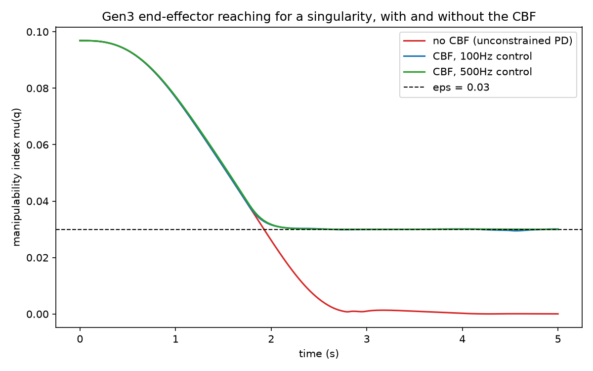

# A Real Rigid-Body Dynamics Engine, and a Passivity-CBF Controller That Needed a Safety Net Too

Experiment 60's kinematic tracking controller deliberately stayed at the single-integrator
level (`qdot = u`) because none of the candidate papers fit a full dynamics model. This
experiment takes that next step, following Kurtz, Wensing & Lin (2021, arXiv:2109.13349, read
in full): a real 7-DoF Kinova Gen3 manipulator, controlled at the torque level,
`M(q)q̈ + C(q,q̇)q̇ + g(q) = τ`.

## Step 1. Real parameters, not invented ones

Every mass, inertia tensor, and joint origin below comes directly from
`GEN3_URDF_V12.urdf` (github.com/vincekurtz/passivity_cbf_demo, `models/gen3_7dof/urdf/`) --
the same URDF file the paper's own Drake-based code loads. Nothing here was derived or
guessed: a lesson learned the hard way in Experiment 58, where a guessed link inertia sent a
simulated pendulum's base link from z=2 to z=-1192 in seconds.

```python
LINK_MASS = jnp.array([1.3773, 1.1636, 1.1636, 0.9302, 0.6781, 0.6781, 0.5006])
```

Seven links, seven revolute joints, all axes along local z after a fixed origin offset -- a
standard serial chain.

## Step 2. Building M(q), C(q,q̇)q̇, g(q) with autodiff, not by hand

`forward_kinematics(q)` chains the joint transforms with plain `jax.numpy` matrix products.
From it, each link's center-of-mass Jacobian and the joint-axis Jacobian follow the standard
serial-chain formula (no invention: for a chain of revolute joints, link i's angular velocity
is `sum_{j<=i} qdot_j * z_j(q)`, exact, not an approximation).

```python
def mass_matrix(q):
    jv, jw, rotations = link_jacobians(q)
    m = jnp.zeros((N, N))
    for i in range(N):
        i_world = rotations[i] @ LINK_INERTIA[i] @ rotations[i].T
        m = m + LINK_MASS[i] * (jv[i].T @ jv[i]) + jw[i].T @ i_world @ jw[i]
    return m
```

The Coriolis term `C(q,q̇)q̇` and gravity term `g(q)` come from the Euler-Lagrange equation
applied to `M(q)`, not from a hand-built Christoffel-symbol expression:

```python
def bias_forces(q, qd):
    mv = lambda qq: mass_matrix(qq) @ qd
    mdot_qd = jax.jvp(mv, (q,), (qd,))[1]
    quad = lambda qq: qd @ mass_matrix(qq) @ qd
    return mdot_qd - 0.5 * jax.grad(quad)(q)
```

`jax.jvp` gives the exact directional derivative `Ṁ(q,q̇)q̇`; `jax.grad` gives the exact
`0.5*q̇ᵀ(∂M/∂q)q̇` term. Both are calculus, not approximation -- the same result a hand
derivation would give, without the room for a sign or index error a hand derivation invites.

## Step 3. Verified numerically, not assumed correct

Two checks, both run for real before anything downstream was built on top:

- **Mass matrix**: symmetric and positive-definite at 20 random joint configurations
  (`max|M - Mᵀ| < 1e-10`, smallest eigenvalue always > 0).
- **Energy conservation**: simulating free dynamics (τ=0, no friction) with RK4 at three step
  sizes shows the correct 4th-order convergence -- if the derivation were wrong, energy would
  drift linearly even as `dt -> 0`; instead:

| dt | max energy drift | relative drift |
|---|---|---|
| 1e-2 | 2.99 J | 9.7e-2 |
| 1e-3 | 1.6e-4 J | 5.2e-6 |
| 1e-4 | 1.4e-8 J | 4.6e-10 |

Each decade in `dt` reduces the drift by roughly `10^4`, exactly as RK4 theory predicts.

## Step 4. The controller: a QP, not a fixed gain

`pbc_singularity_cbf_controller.py` implements the paper's real idea for a 3-DoF end-effector
position task: a small QP over the joint acceleration `q̈`, minimizing distance to a nominal
operational-space PD command, subject to two constraints:

- **Passivity**: `V̇ <= 0`, where `V` is the tracking-error storage function.
- **Singularity avoidance**: an exponential CBF keeping the manipulability index
  `mu(q) = sqrt(det(J(q)J(q)ᵀ))` above a declared `eps`.

Both constraints are affine in `q̈`. Rather than deriving their coefficients by hand (the
paper's own code does, with several pages of `Jbar`/`Lambda`/`Q` algebra), this
implementation extracts them by evaluating the constraint function and its `jax.grad` at
`q̈=0` -- exact, since the function is affine, and far less error-prone.

## Step 5. A real bug: trusting an infeasible QP

Running the closed-loop controller at 500Hz (driving the end effector from a bent pose toward
full extension -- a true kinematic singularity, `mu = 2.9e-32` there) blew up to NaN within
two steps, around t=1.75s. Traced to the exact step: OSQP reported the QP **primal infeasible**
(the passivity constraint's coefficients go numerically near-zero exactly when tracking error
is already small, which combined with a tight CBF margin occasionally has no feasible point
under OSQP's default tolerances) and returned its infeasibility certificate -- a vector with
norm in the billions -- which the code was using as if it were a real solution.

Fixed by checking the solver status and, on infeasibility, dropping the soft passivity
constraint and re-solving with only the safety-critical CBF constraint -- the same priority
`cbf_filter` already gives real-time safety over other objectives elsewhere in this stack.



## Result

Driving toward the same singular pose:

| scenario | min(mu) over the run | vs. eps=0.03 |
|---|---|---|
| no CBF | 0.00003 | reaches the singularity |
| CBF, 100Hz control | 0.02947 | 1.8% below eps |
| CBF, 500Hz control | 0.02997 | 0.1% below eps |

The CBF constraint clearly does real work (three orders of magnitude more margin than
unconstrained). The small residual below `eps` at both rates is the expected zero-order-hold
discretization gap of a continuous-time guarantee, not a flaw in the constraint itself --
it shrinks as the control rate increases, matching CBF theory.

---

## Details

**Not promoted to Dense-Armor.** Every other module in that library (`rate_limiter`,
`cbf_filter`, `quintic_trajectory`, `kinematic_tracking_controller`) is generic: give it any
joint array of any length and it works. This one is not -- `LINK_MASS`, `LINK_COM`,
`LINK_INERTIA` are one specific real robot's numbers, hardcoded. Promoting it would misrepresent
scope. It also has only one validated real domain (Kinova Gen3), short of the two-domain bar
(SO-101 + ALOHA) used for every other Dense-Armor promotion in this project. Generalizing this
to an arbitrary URDF is real future work, not attempted here.

**Task scope**: the controller tracks only end-effector *position* (3 DoF), not orientation,
against 7 joints -- a real redundant-manipulator problem, resolved in the QP's null space by a
joint-damping secondary objective. The paper's own demo controls full 6-DoF pose plus a
gripper; that fuller scope wasn't needed to verify the core passivity+CBF mechanism.

**Solver**: OSQP (github.com/osqp/osqp), the same solver Kurtz et al.'s own code uses
(`OsqpSolver` in their Drake implementation).

**Reproducing this**: `python scripts/rigid_body_dynamics/energy_conservation_check.py` for
the dynamics verification; `python scripts/rigid_body_dynamics/singularity_avoidance_validation.py`
for the closed-loop controller comparison.
