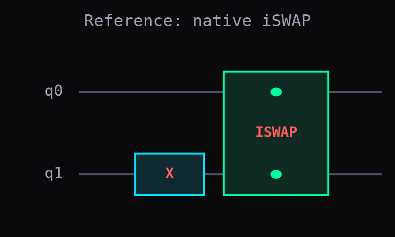
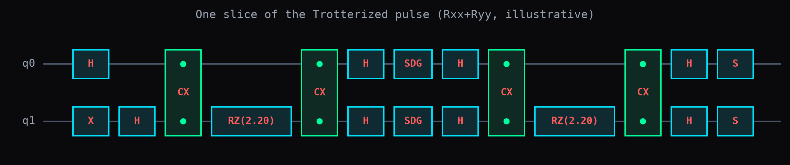
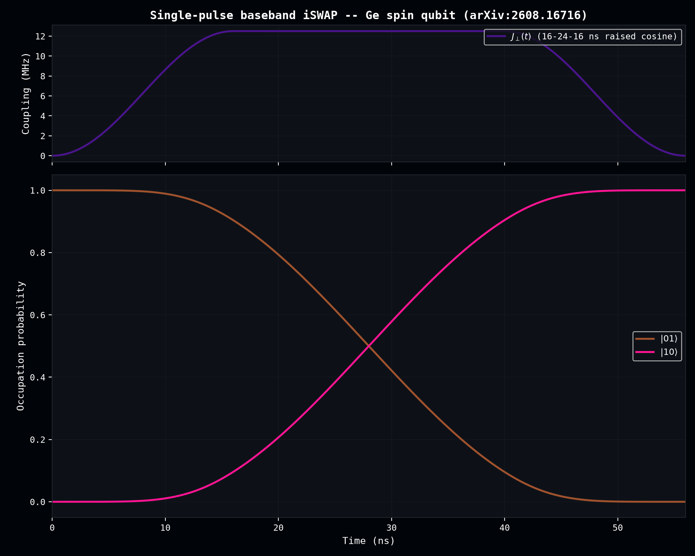

# Germanium Baseband iSWAP: Validating a 4-Day-Old Experimental Result

arXiv:[2608.16716](https://arxiv.org/abs/2608.16716) (Massai et al., IBM Research Europe -- Zurich, 17-18 Aug 2026) demonstrates a real single-pulse baseband iSWAP gate (56 ns) in strained-germanium hole spin qubits, by orienting the magnetic field so the exchange interaction's longitudinal component `J∥` and Zeeman detuning `E_Δg` both vanish, leaving a pure transverse `J⊥` coupling. This experiment reproduces their result with `dense_evolution.circuits.trotter`, applied for the first time to a genuinely time-dependent pulse (previously only exercised against static Hamiltonians), and extends the analysis with four follow-up checks.

**Scope note:** this validates `dense_evolution.circuits.trotter` and `dense_evolution.uhlmann_fidelity` -- *not* `dense_evolution.solvers.vhd_tb`/`harrison_tb` ("tight-binding"). Those compute bulk-crystal band structure (sp3s* basis, no spin, no confinement) -- a different physics regime from this paper's confined two-spin exchange qubits, even though `vhd_tb` already has real germanium parameters.

## Two real physics corrections to the naive Colab draft

1. The paper's transverse Hamiltonian is `H⊥ = (1/2)J⊥(σ+₁σ-₂ + h.c.) = (1/4)J⊥(XX+YY)` -- a coefficient of 1/4, not the naively-assumed 1/2.
2. The real pulse shape (Supp. Fig. 13) is 16 ns raised-cosine rise + 24 ns flat top + 16 ns raised-cosine fall (56 ns total) -- not a Tukey window spanning the whole duration.

A third bug (a factor-of-2 error in the peak-amplitude calibration, giving a 50% swap instead of 100%) was caught only by actually running the code, not by inspection.

## Reference circuit and Trotterized pulse

The native `iswap` gate defines ground truth directly through dense_evolution's own gate set (drawn as a Quirk-style box diagram by this experiment's `draw_circuit` utility), sidestepping any basis-convention mismatch with the paper's matrix notation.



Each Trotterized pulse slice's `Rxx`/`Ryy` rotation is built from `pauli_rotation_ops` directly (not `trotter_evolve_ops`, since the coefficient varies per slice with the pulse envelope).



**Notable derived fact:** X⊗X, Y⊗Y, and Z⊗Z always pairwise commute (simultaneously diagonal in the Bell basis). Since this operating point has `J∥=0` by construction, the Trotter decomposition here is *exact* at any slice count -- fidelity is already >0.999 at just 4 slices, saturating to 1.0 by 32. The small residual is pure quadrature error from approximating the smooth envelope with piecewise-constant steps, not Trotter truncation error.



## SPAM noise: the paper's own exact channel

`dense_evolution.circuits.registry.NoiseModel`'s built-in `'depolarizing'` model is a **per-qubit local** channel -- physically different from the paper's own **global 2-qubit** depolarizing model, `D_p(ρ) = (1-p)ρ + (p/4)I₄` (Section XVIII.C). Reusing `NoiseModel` here would silently model different physics, so this experiment implements the paper's exact channel by hand and scores it with `dense_evolution.uhlmann_fidelity` -- verified to match a hand-derived exact sequential-composition formula to machine precision, and to differ, as expected, from the paper's own explicitly-labeled "back-of-envelope" approximation (which composes two independent survival probabilities rather than the true channel composition).

Combining the paper's own real measurements -- `F_QPT = 60%` (full process tomography) and `⟨diag(P_SPAM)⟩ = 0.69` (SPAM-only measurement) -- reproduces their reported **`F_iSWAP ≈ 87%`** exactly: `0.60 / 0.69 = 0.87`.

## Four follow-ups

1. **Randomized benchmarking (Pauli frame).** Directly answers the paper's own Section VII: *"A more rigorous fidelity estimation via randomised benchmarking is left to follow-up work."* Since the injected noise parameter is known here (`p=0.21`), this validates that the RB protocol via dense_evolution correctly recovers it: a fitted exponential decay gives `r=0.7900`, matching the theoretical `r = 1-p = 0.7900` exactly. Not full 2-qubit Clifford RB (would need the full Clifford table) -- Pauli-frame RB (Pauli twirling), a real, valid protocol.

2. **Per-state SPAM profile, not a uniform average.** Fig. 5f shows four real, precisely-labeled diagonal SPAM values (0.17, 0.40, 0.39, 0.37 -- the states needing concatenated two-qubit rotations) alongside a mean of 0.69 over all 16 states. Reconstructing an honest two-tier profile (these 4 real values, the other 12 solved only to match the known mean -- never invented) gives a round-trip fidelity spread from **0.29 to 0.81**, hidden entirely by the single uniform `p` used above.

3. **Coherent vs. stochastic error.** The paper's own caveat (i), Section XVIII.C: *"assumes depolarising SPAM, whereas actual errors contain coherent components... not addressed here."* A small **23.6% coherent pulse-amplitude miscalibration** reproduces the same `F_iSWAP≈87%` just as well as the depolarizing-SPAM story -- the aggregate `F_QPT` number alone cannot distinguish the two mechanisms. (23.6% is also implausibly large for a calibrated pulse compared to typical experimental precision, which if anything favors the paper's own SPAM-dominant explanation.)

4. **The general off-resonance regime -- where Trotter finally has real error.** Neither the iSWAP point above nor a pure CPhase point (`J⊥=0`, purely diagonal Hamiltonian) ever show Trotter error, because XX/YY/ZZ always commute. Adding a nonzero Zeeman detuning term (`Z⊗I - I⊗Z`, which genuinely does *not* commute with `XX+YY`) finally produces real, non-trivial Trotter error that shrinks with slice count -- and order-2 Suzuki-Trotter is consistently ~40-1000x more accurate than order-1 at matched slice count, confirming `dense_evolution.circuits.trotter`'s documented convergence claim for the first time on a genuinely time-dependent pulse.

## Status

Validated in `scripts/germanium_iswap_validation.py` and `tests/test_germanium_iswap_validation.py` (8/8 passing). The box-diagram circuit-drawing utility (`draw_circuit`) and the global 2-qubit depolarizing channel (`depolarize_2q`) are candidates for promotion into Dense-Evolution proper if they prove broadly useful.

## Reproduce

```bash
python scripts/germanium_iswap_validation.py
pytest tests/test_germanium_iswap_validation.py -v
```
