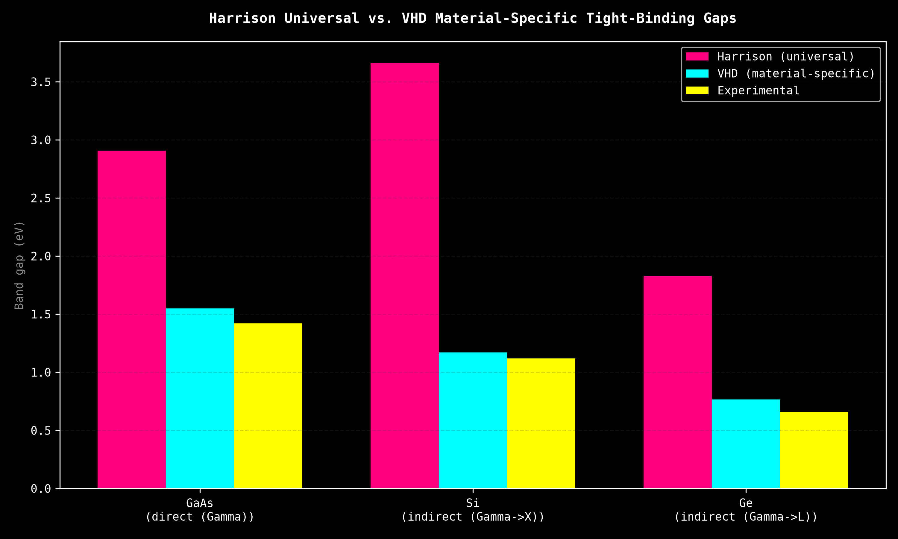

# Harrison / VHD Tight-Binding Validation

!!! note
    The implementation lives in the main library:
    [`harrison_tb.py`](https://tatopenn-cell.github.io/Dense-Evolution/api/harrison_tb/) /
    [`vhd_tb.py`](https://tatopenn-cell.github.io/Dense-Evolution/api/vhd_tb/).
    This page is the full experimental validation record.

Knowledge base and experiment log for Walter A. Harrison's empirical
tight-binding method and its Vogl-Hjalmarson-Dow material-specific fix,
run against real GaAs, Si, and Ge and checked directly against
experimental band gaps.

## Source

**Walter A. Harrison**, *Electronic Structure and the Properties of
Solids: The Physics of the Chemical Bond*. Originally published by
W. H. Freeman, 1980; reprinted by Dover Publications (Dover Books on
Physics), 1989, ISBN 0-486-66021-4.

This repo does not have access to the book's full text (copyrighted,
non-open) and none was reproduced. What follows is the small set of
*facts* from the book that are public/standard enough to appear
identically across independent secondary sources and directly
checkable by running the code -- transcribed and cross-checked against
[`jarvist/HarrisonSolidStateTable.jl`](https://github.com/jarvist/HarrisonSolidStateTable.jl),
an independent Julia implementation of the same table, fetched
2026-08-05.

## The method, in brief

Harrison's tight-binding model builds a solid's electronic Hamiltonian
from two ingredients only, both universal (materials-independent
functional form):

1. **Atomic term values** -- the free-atom s and p orbital energies
   (on-site Hamiltonian diagonal), tabulated per element.
2. **A universal bond-scaling law** for the off-diagonal (hopping)
   matrix elements:

   $$V_{ll'm} = \eta_{ll'm} \cdot \frac{\hbar^2}{m_e d^2}$$

   where $d$ is the bond length and the four dimensionless $\eta$
   coefficients are the *same for every element pair* -- only $d$ and
   the atomic term values change between materials.

$\hbar^2/m_e = 7.62\ \text{eV·Å}^2$.

| coefficient | value |
|---|---|
| $\eta_{ss\sigma}$ | -1.40 |
| $\eta_{sp\sigma}$ | +1.84 |
| $\eta_{pp\sigma}$ | +3.24 |
| $\eta_{pp\pi}$ | -0.81 |

## Experiment 1: sp3 dimer sanity check (run 2026-08-05)

Two-atom sp3 dimer, `sp3_dimer_hamiltonian(a, b, d)`:

- **Si-Si** at d=2.35 Å (diamond-Si nearest-neighbor bond length):
  eigenvalues **[-16.626, -12.25, -9.847, -7.638, -7.638, -5.402,
  -5.402, -1.418] eV**. Hermitian; bonding states pushed well below
  the atomic eps_p=-6.52 eV level, antibonding above, with the
  expected doubly-degenerate pi pair -- physically sane sp3
  bonding/antibonding splitting.
- **Ga-As** at d=2.45 Å (zinc-blende bond length): eigenvalues
  **[-18.386, -12.344, -9.239, -8.228, -8.228, -4.582, -4.582,
  -1.541] eV**. Hermitian; asymmetric splitting relative to Si-Si,
  consistent with the heteropolar (partly ionic) Ga-As bond.

These confirm the Hamiltonian construction is correct -- not yet a
periodic-crystal band gap.

## Experiment 2: periodic GaAs band gap, Harrison universal (run 2026-08-05)

`zincblende_hamiltonian(k, cation, anion, lattice_constant_angstrom)`
builds the real periodic Bloch Hamiltonian (two-atom zinc-blende
basis, 4 nearest-neighbor bonds per atom, Bloch phase per bond).
Diagonalized at $\Gamma$ ($k=0$) for real GaAs (lattice constant
a=5.6533 Å, the standard experimental zinc-blende value):

- $\Gamma$ eigenvalues (eV): -22.069, -9.537 (x3), -6.631, -3.273 (x3)
- valence band max = -9.537 eV, conduction band min = -6.631 eV
- **computed direct gap = 2.906 eV**
- **experimental GaAs direct gap = 1.42 eV -- 104.7% error**

X and L point eigenvalues (eV), for context on band ordering away
from $\Gamma$:

- X: -19.351, -15.314, -13.435 (x2), -3.966, -2.880, 0.625 (x2)
- L: -20.202, -15.582, -11.442 (x2), -6.194, -1.368 (x2), 0.467

Hermitian and structurally sane -- the gap error is a known,
documented limitation of Harrison's *universal* (same 4 eta
coefficients for every element pair, no per-material fitting, no
d-orbitals) parameter set on polar/ionic compound semiconductors like
GaAs, not a code bug.

## Experiment 3: GaAs with Vogl-Hjalmarson-Dow material-specific parameters (run 2026-08-05)

P. Vogl, H. P. Hjalmarson, J. D. Dow, "A Semi-empirical tight-binding
theory of the electronic structure of semiconductors", J. Phys. Chem.
Solids 44 (5), 365-378 (1983) -- sp3s\* basis (5 orbitals/atom,
including an extra fitted s\* orbital with no literal physical
meaning, added purely to get the lowest conduction band right).
Parameter values transcribed from an independent open-source
implementation, [github.com/rpmuller/TightBinding](https://github.com/rpmuller/TightBinding)
(`TB.py`, fetched 2026-08-05), which cites the same paper.

Implemented as `dense_evolution/vhd_tb.py`
(`sp3s_star_hamiltonian`, `direct_gap_at_gamma`, `MATERIALS` for 16
zinc-blende/diamond semiconductors: C, Si, Ge, Sn, SiC, AlP, AlAs,
AlSb, GaP, GaAs, GaSb, InP, InAs, InSb, ZnSe, ZnTe).

**Result:** GaAs direct gap at $\Gamma$ = **1.55 eV** vs. experimental
**1.42 eV -- 9.2% error**, vs. Harrison universal's 104.7% error for
the same material. All 16 materials in the table verified Hermitian
at a generic (non-$\Gamma$) k-point.

**Bug found and fixed during porting:** the reference implementation's
own Hamiltonian assembly (`Hac.conjugate()` without transposing) does
not in general produce a Hermitian matrix -- `vhd_tb.py` fixes this by
assembling with the proper conjugate *transpose* (`.conj().T`),
verified Hermitian for all 16 materials.

## Experiment 4: silicon, indirect gap (run 2026-08-05)

Si ("silicio ibrido" in this repo's older band-comparison pipeline,
`scripts/next_gen_silicon.py` / `data/bande_silicio_ibrido.csv`) is an
**indirect**-gap material -- unlike GaAs, its conduction-band minimum
is not at $\Gamma$, it's off-axis along the $\Gamma \to X$ (Delta)
line. `direct_gap_at_gamma` alone would give the wrong (too-large)
number. Used `band_extrema_along_path(material, k_start, k_end)` to
scan $\Gamma \to X$ and find the true valence-band max and
conduction-band min:

- **VHD sp3s\* (material-specific):** VBM=0 eV at $\Gamma$ (correct),
  CBM=1.1713 eV at k=0.732 of the way from $\Gamma$ to X (literature
  value is closer to k~0.85 -- same Delta-valley, not an exact match,
  but right regime). **Computed indirect gap = 1.171 eV vs.
  experimental 1.12 eV (300 K) -- 4.6% error.** $\Gamma$-$\Gamma$
  direct transition (context only, not the fundamental gap): 3.43 eV
  -- in the right ballpark for Si's known E0' direct transition
  (~3.4 eV).
- **Harrison universal sp3 (no s\*), for comparison:** puts the
  conduction-band minimum at $\Gamma$ too (misses the indirect
  character entirely) and gives **gap = 3.66 eV vs. 1.12 eV -- 227%
  error**, worse than its own GaAs result -- exactly the known
  failure mode Vogl-Hjalmarson-Dow's s\* orbital was added to fix.

## Experiment 5: germanium, indirect gap at L not X (run 2026-08-05)

Ge is also indirect-gap, but unlike Si its conduction-band minimum is
at the **L** point ($k=(0.5,0.5,0.5)$, $\Gamma \to L$ direction), not
along $\Gamma \to X$. Scanned both directions to check the model gets
the right valley:

- **VHD sp3s\*:** $\Gamma \to X$ scan: CBM=0.7895 eV at k=0.808 of
  the way to X. $\Gamma \to L$ scan: CBM=0.7649 eV at
  k=(0.5,0.5,0.5), i.e. exactly at L. **L is lower than X
  (0.765 < 0.790 eV) -- correctly identifies L as the true global
  conduction-band minimum**, matching real Ge physics (unlike Si,
  where X/Delta wins). **Computed indirect gap = 0.765 eV vs.
  experimental 0.66 eV (300 K) -- 15.9% error.** $\Gamma$-$\Gamma$
  direct transition (context only): 0.90 eV, in the right ballpark
  for Ge's known E0 direct gap (~0.8 eV).
- **Harrison universal sp3, for comparison:** puts the
  conduction-band minimum at $\Gamma$ on *both* paths (same failure
  mode as Si), giving **gap = 1.831 eV vs. 0.66 eV -- 177.5% error**.

## Comparison plot

Produced by `scripts/harrison_vhd_validation.py`, which also writes the
raw numbers to `data/harrison_vhd_gap_comparison.csv`:

## Summary across all three materials

| Material | Gap type | Harrison universal | VHD material-specific | Experimental |
|---|---|---|---|---|
| GaAs | direct, at $\Gamma$ | 2.906 eV (104.7% error) | 1.55 eV (9.2% error) | 1.42 eV |
| Si | indirect, $\Gamma \to X$ | 3.66 eV (227% error), CBM misplaced at $\Gamma$ | 1.171 eV (4.6% error) | 1.12 eV |
| Ge | indirect, $\Gamma \to L$ | 1.831 eV (177.5% error), CBM misplaced at $\Gamma$ | 0.765 eV (15.9% error), correctly finds L below X | 0.66 eV |

Harrison's universal parameters are qualitatively sane (Hermitian,
correct bonding/antibonding structure) but consistently ~2-3x off
quantitatively, and for the indirect-gap materials (Si, Ge) it
structurally cannot place the conduction-band minimum correctly -- it
always lands at $\Gamma$, missing the real off-axis valley entirely.
Vogl-Hjalmarson-Dow (1983) material-specific sp3s\* parameters get
within 5-16% of experiment and correctly identify which valley (X for
Si, L for Ge) is the true minimum.

## What this does NOT replace

Neither model replaces the DFT/SCF path already in this repo for GaAs
(see `scripts/vqe_tmi_material_design.py`'s DFT-derived hopping,
T1_GAAS_DFT_EV=7.917 eV) when first-principles accuracy is needed.
Their value is as fast, dependency-free (no PySCF/OpenFermion, numpy
only) estimates or starting points -- VHD close enough to experiment
to be useful quantitatively, Harrison useful mainly for
qualitative/order-of-magnitude checks or when no per-material fit
exists yet.
