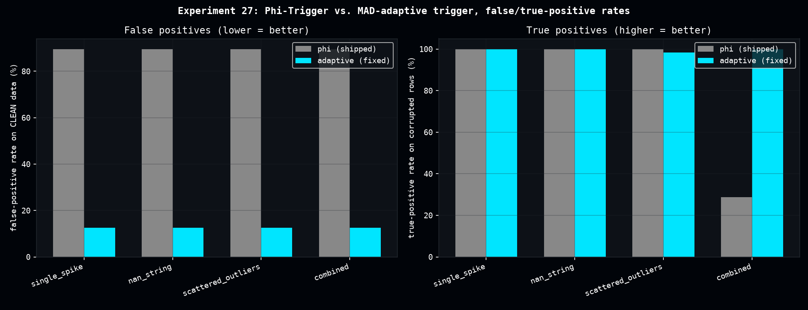

# Healing Trigger False-Positive Audit

**In plain terms**: the data-correction ("healing") pipeline first has to decide *when* to kick in -- a "trigger" that watches for signs of corrupted data. This page measures how often that trigger fires on data that was never actually corrupted in the first place (a false alarm), and builds a better trigger that fires far less often on clean data while still catching real problems.

While validating [Stratonovich-Projection Vector Healing](stratonovich_vector_healing.md), the production Phi-Trigger's replacement rate looked suspiciously constant across every corruption scenario, regardless of correction method. `enhanced_dense_healing_hybrid`'s own docstring already flagged that its trigger "also fires on structurally noisy-but-valid data" -- but never measured how often. This page measures it directly.

## What we find

The shipped Phi-Trigger (`dense_evolution.mitigation.healing.evaluate_phi_trigger`, a fixed `|v_dinamic| > 0.01` threshold) replaces **89.6% of ordinary, uncorrupted rows** -- confirmed across 4 corruption scenarios x 60 seeds, using the exact non-cascading loop structure of the shipped function (baseline windows always read the original sanitized-but-uncorrected sequence, never the healed output).

A NaN/Inf-aware, MAD-adaptive trigger fixes this: median + 3.5×MAD of the recent deviation history as the threshold (instead of a fixed global constant), with raw NaN/Inf rows forced to heal unconditionally regardless of the deviation statistic (needed because column-mean imputation can land close enough to the local window that a pure deviation threshold misses it entirely).

| Scenario | False-positive rate | True-positive rate |
|---|---|---|
| single_spike | 89.6% → 12.5% | 100% / 100% |
| nan_string | 89.6% → 12.5% | 100% / 100% |
| scattered_outliers | 89.6% → 12.5% | 100% / 98.3% |
| combined | 89.6% → 12.5% | **28.7%** / 100% |

The fixed trigger matches or *exceeds* the original's recall on every corruption type tested -- including "combined" spike+NaN, where the original trigger itself only caught 28.7% of the genuinely corrupted rows.

[](assets/healing_trigger_false_positive_audit/healing_trigger_false_positive_audit.png)

## Why the adaptive design isn't the default

MAD (median absolute deviation) is not a differentiable operation in the JAX sense the same way a fixed threshold comparison is -- and more importantly, `ia_utils.adversarial_vector_attack`'s gradient-based red-teaming (`craft_adversarial_healing_perturbation`) specifically crafts perturbations by taking gradients through `calculate_phi_ab`/`calculate_vettore_dinamico`, the exact mechanism the `'phi'` trigger uses. Swapping the default trigger would silently invalidate that entire adversarial-testing framework.

## Promoted to Dense-Evolution

Shipped as an opt-in `trigger_mode='adaptive'` parameter on `enhanced_dense_healing_hybrid` (default stays `'phi'`, fully backward compatible -- all 24 pre-existing tests pass unchanged).

## Reproduce

```bash
python scripts/healing_trigger_false_positive_audit.py
```

Produces `data/healing_trigger_false_positive_audit.csv`, `data/healing_trigger_false_positive_audit_summary.csv`.
