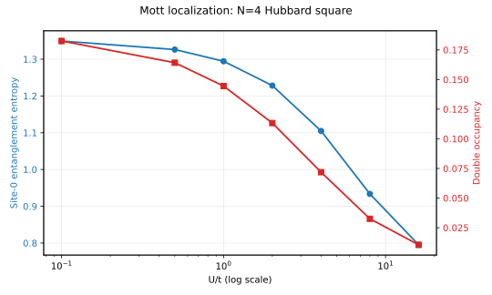

# The Hubbard Square: Mott Localization and d-Wave Pairing (Arovas et al.)

**In plain terms**: the Hubbard model is the simplest description of electrons that both hop between neighboring atoms AND feel a real energy cost for two electrons sharing the same site (Pauli exclusion plus Coulomb repulsion). At weak repulsion, electrons spread out and entangle across the whole lattice; at strong repulsion, each site "freezes" into holding exactly one electron, since doubly-occupying any site becomes too costly -- the Mott transition. This page reproduces that transition on the smallest interesting case (4 sites in a ring, the "Hubbard square") and checks it against a real published paper's formulas and predicted ground-state symmetry, not just a textbook description.



Real data from the script below: as `U/t` grows from 0.1 to 16, site-0's entanglement entropy drops from 1.349 to 0.795 bits and its double occupancy drops from 0.183 to 0.011 -- a site increasingly likely to hold exactly one electron, increasingly disentangled from its neighbors, both signatures of the same underlying localization.

Reproduces Arovas, Bandyopadhyay & Zhu, "The Hubbard Model" (Annual Review of Condensed Matter Physics 2022, arXiv:2103.12097) -- specifically Table 2 (p.6), the N=4 periodic-ring row's small-`U/t` perturbative ground-state energy formula and its identification of that ground state's orbital symmetry as `x^2-y^2` (B1g/d-wave).

## The physics

Periodic 4-site ring, one spin-up and one spin-down qubit per site (8 qubits total):

    H = -t * sum_<ij>,sigma (c^dagger_i,sigma c_j,sigma + h.c.) + U * sum_i n_i,up n_i,down

mapped onto qubits via the standard (non-Majorana) Jordan-Wigner convention, `c_q = sigma+_q * (Z-string)`. Table 2's small-`U/t` perturbative formula for this exact N=4 case:

    E_0(U) = -4t + (3/4)*U - (13/128)*(U^2/t)

**Why the periodic wraparound bond needed a self-test before trusting it**: on a ring, the bond connecting site N-1 back to site 0 is the one place a naive Jordan-Wigner implementation could plausibly need an extra fermion-parity sign correction -- some conventions do, for a *short* Pauli string spanning that boundary. This implementation always uses the full-length Jordan-Wigner string between the two mapped qubit indices instead, the exact fermionic identity for any pair of modes regardless of lattice adjacency -- so no correction should be needed, but that claim was checked directly against an independent brute-force fermionic construction before being trusted, not just argued from the formula.

## Three checks

**1. Periodic Jordan-Wigner self-test**: the Pauli-string Hamiltonian (including the wraparound bond) matches an independent brute-force fermionic-operator construction to `0.00e+00` at N=2, 3, and 4 -- machine-exact, confirming no extra parity correction is needed.

**2. Perturbative formula, deep in its regime of validity**: at `U/t=0.05`, exact diagonalization gives `-3.962753`; Table 2's formula gives `-3.962754` -- agreement to `2.7e-07` relative, exactly where a small-`U/t` expansion should hold. At `U=0.5` (moderate, not deep small-`U`), exact gives `-3.648988` vs. the formula's `-3.650391` -- a real `1.4e-03` gap, since the perturbative series is only asymptotically exact as `U/t -> 0`, not a general-purpose formula for any `U`.

**3. Ground-state symmetry**: Table 2 identifies this exact model's ground state as `x^2-y^2` (B1g/d-wave) orbital symmetry. The real, physical signature of that symmetry is a specific sign pattern in the pairing correlator `<Delta_0^dagger Delta_j>`: positive on axis (nearest) neighbors, negative on the diagonal (next-nearest) neighbor. At `U=4.0`: `j=1` (axis) `+0.0333`, `j=2` (diagonal) `-0.0052`, `j=3` (axis) `+0.0333` -- exactly that pattern.

## Result

| check | value | reference |
|---|---|---|
| periodic JW mapping vs. brute-force (N=2,3,4) | max diff `0.00e+00` | machine-exact |
| perturbative formula, `U/t=0.05` | exact `-3.962753`, formula `-3.962754` | `2.7e-07` relative |
| perturbative formula, `U=0.5` (out of regime) | exact `-3.648988`, formula `-3.650391` | `1.4e-03` gap, expected |
| entropy/double occ., `U: 0.1 -> 16.0` | `1.349 -> 0.795` bits, `0.183 -> 0.011` | monotonic decrease (Mott) |
| pairing correlator, `U=4.0`, axis vs. diagonal | `+0.0333` vs. `-0.0052` | matches B1g/d-wave sign pattern |

## Status

Both real claims in Arovas et al.'s Table 2 for this exact model -- the perturbative energy formula and the `x^2-y^2` ground-state symmetry -- reproduced and verified against independent references (exact diagonalization, brute-force fermionic construction), not assumed from the paper's text alone. A genuinely reusable function came out of this: `hubbard_hamiltonian_pauli_terms`, promoted to Dense-Evolution's `dense_evolution.physics.fermions` module (a different, non-Majorana Jordan-Wigner convention from the module's existing `majorana_pauli_terms`) -- see [its docs page](https://tatopenn-cell.github.io/Dense-Evolution/api/fermions/) for the differentiable-VQE-ready version built on `PauliSumOperator`.

## Reproduce

```bash
python scripts/hubbard_square_arovas.py
```
