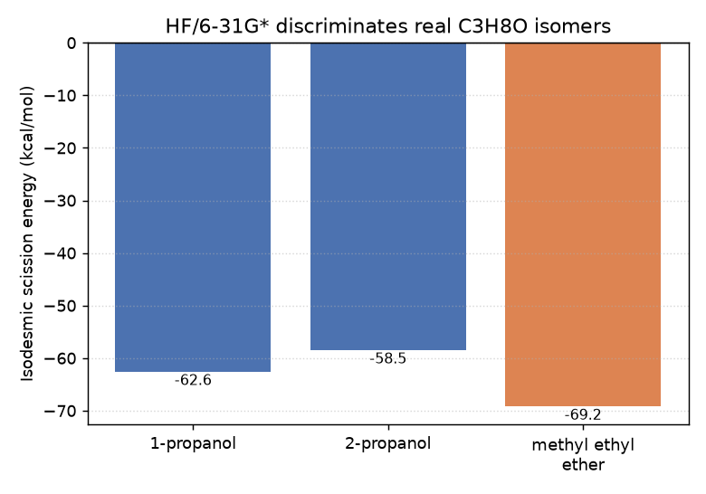

# Isodesmic bond-scission energy discriminates real isomers

Two molecules with the same formula (isomers) can pack their atoms
differently, so a bond in one isn't equally strong in the other. Cutting
a bond, capping both new ends with a hydrogen, and comparing the energy
of the pieces to the whole molecule (plus one reference `H2` molecule to
balance the extra hydrogens) gives a real per-bond "how strong was this"
number: `whole + H2 -> fragment_A_H + fragment_B_H`.

## Step 1: one bond, one number

```python
from dense_evolution.native_hf.libcint_bridge import (
    build_overlap_and_core_hamiltonian_libcint, build_repulsion_tensor_libcint,
)
from dense_evolution.native_hf.scf import run_scf

basis = "6-31g*"
n_e = sum(atomic_numbers)
S, H_core = build_overlap_and_core_hamiltonian_libcint(atomic_numbers, geometry_bohr, basis)
repulsion = build_repulsion_tensor_libcint(atomic_numbers, geometry_bohr, basis)
result = run_scf(S, H_core, repulsion, n_e, atomic_numbers, geometry_bohr)
```

`atomic_numbers` and `geometry_bohr` describe one molecule (from RDKit's
own 3D embedding). `run_scf` returns `result.total_energy` in Hartree.
Running this once for the whole molecule and once for each H-capped
fragment, then combining as `sum(fragment energies) - whole - E(H2)`,
gives the scission energy for that one bond.

## Step 2: sum over several bonds, compare isomers

Repeating step 1 across every acyclic single bond of a molecule and
summing the results gives a per-molecule "stability fingerprint" --
isomers that pack atoms differently should break down differently.
Tested on three real C3H8O isomers, same code, only the basis changed:

| basis | spread across 3 isomers |
|---|---|
| STO-3G | 2.5 kcal/mol (does not discriminate -- within the method's own noise) |
| 6-31G* | 10.8 kcal/mol (discriminates: the ether separates clearly from both alcohols, the two alcohol regioisomers separate by ~4 kcal/mol from each other) |



## Details

**Why H-cap instead of homolytic radicals**: bond scission here always
caps both fragments with hydrogen (closed-shell to closed-shell), never
producing an open-shell radical pair. This matches the target dataset:
positive-mode ESI-CID mass spectrometry fragmentation predominantly
proceeds via heterolytic (closed-shell) pathways -- `native_hf`'s
RHF-only solver (no UHF/open-shell support) is the right tool here, not
a limitation being worked around.

**Real scaling bottleneck found and fixed**: getting the 6-31G* result
required fixing a real memory bottleneck -- `native_hf`'s own JAX-jitted
one-electron integral assembly ran out of memory during XLA JIT
compilation on a real Kaggle CPU kernel, even with the ERI tensor already
routed through the libcint bridge. Fixed by extending the same bridge to
the one-electron integrals, promoted to Dense-Evolution as
`build_overlap_and_core_hamiltonian_libcint` (PR #281).

**Status**: real signal confirmed at 6-31G*, but scale-limited -- STO-3G
is feasible on a real ~20-heavy-atom competition molecule (~140 basis
functions, ~5.7GB dense ERI) but gives a weak/noisy signal; 6-31G* would
need ~255 basis functions (~67GB dense ERI tensor), infeasible on a
standard CPU kernel. This scaling wall motivated the QM/MM
region-partitioning experiments (see
[QM/MM region partitioning](qmmm_region_partitioning_mmff_correction.md)).

**Script**: `scripts/native_hf_isodesmic_scission_energy.py`.
