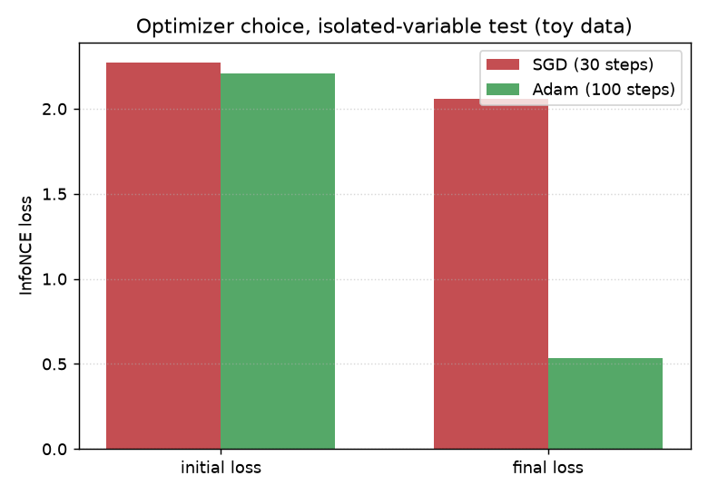

# JAX spectral-retrieval architecture for CASMI26 molecule ID

Matching a real MS/MS spectrum to the right candidate molecule out of
thousands is a retrieval problem: encode the spectrum, encode each
candidate, and score them by similarity. This architecture encodes an
m/z spectrum with Fourier features, mixes peaks with one self-attention
layer, pools to a single vector, and trains that encoder with an InfoNCE
contrastive loss against candidate fingerprints.

## Step 1: encode a spectrum

```python
params = init_params(key, n_fourier=32, d_model=64)
z = encode_spectrum(params, mz, intensity)
```

`mz`/`intensity` are the peaks of one spectrum. `encode_spectrum` returns
one fixed-size vector `z` per spectrum, regardless of how many peaks it
had.

## Step 2: train with InfoNCE

```python
loss, grads = jax.value_and_grad(info_nce_loss)(params, batch)
```

`info_nce_loss` pulls a spectrum's encoding toward its true candidate's
fingerprint and away from the other candidates in the same batch.

## Optimizer choice, isolated-variable test

Same architecture, same toy batch, only the optimizer changed:

| optimizer | loss (30-100 steps) |
|---|---|
| plain SGD (lr=0.05) | 2.2739 -> 2.0594 |
| Adam (lr=1e-2) | 2.2094 -> 0.5328 |



## Step 3: real data, and a real bug the toy check couldn't see

Run on the Kaggle CASMI26 kernel (2,539,608 real labeled spectra, 275,810
unique molecules, `train.parquet` mounted server-side, never downloaded
locally). First attempt: a fresh random batch of 16 real spectra every
training step, same as the toy script's pattern but with real molecules
sampled each time.

```
[Step 3] train 300 steps, batch=16, on real spectra
  step    0  loss=2.9718
Killed
```

**Real spectra have wildly variable peak counts** (this dataset: from 3 to
over a thousand peaks per spectrum) -- the architecture is never padded to
a fixed length, so a fresh random batch each step means a fresh
combination of array shapes each step. On this machine, that drove JAX's
per-shape compilation caching to grow without bound: the process was
SIGKILL'd by the OOM killer around step 30-50, no Python traceback, just
`Killed` in the log at ~1800s in. The toy check never caught this because
it reuses the exact same fixed-shape batch (`n_peaks=20` for all 8 toy
samples) for all 100 steps -- zero shape variation, so it never compiles
more than once.

**Fix**: one fixed real batch, sampled once, reused for every step -- same
discipline as the toy overfit check above, real spectra substituted in.

```
[Step 3] train 300 steps on ONE fixed real batch (n=16), n_peaks range in this batch: 3-1268
  step    0  loss=2.9172
  step   50  loss=0.0336
  step  299  loss=0.0056
[Step 4] in-batch retrieval accuracy on the SAME fixed real batch
  top1 in-batch accuracy: 16/16 = 1.000 (chance level = 1/16 = 0.062)
```

Real, clean result: loss drops from 2.9172 to 0.0056 over 300 steps on
real MS/MS spectra and real RDKit Morgan fingerprints (0/500 SMILES
failed to parse in this subset), no NaN anywhere, perfect in-batch
retrieval. This validates the full real-data path end to end (parquet
schema, fingerprinting, forward pass, gradients, optimizer) -- it is
**not** a held-out generalization result: 16/16 on the same batch the
model was trained on is expected once loss is this low, closer to a
memorization check than a retrieval benchmark.

## Step 4: padding + attention mask closes the OOM, opens real multi-batch training

Fix for the gap Step 3 left open: pad every spectrum to one fixed peak
count (`MAX_PEAKS`, chosen from a real percentile of this dataset's
`num_peaks`, not guessed) with an attention mask so padding contributes
exactly zero to both the self-attention and the final pooling softmax.
Correctness verified locally before touching real data: the padded+masked
encoder is numerically identical (max abs diff ~1e-7) to the original on a
no-padding-needed case, and invariant to how much extra padding is added.
Every batch now has one fixed shape regardless of which real molecules get
sampled, so `jax.vmap` + `jax.jit` compile once and a fresh random batch
every step no longer grows JAX's shape-keyed compilation cache.

```
[Step 1] num_peaks percentiles (n=6000): p50=44 p90=420 p95=615 p99=1250 max=36080
  MAX_PEAKS = 256 (p90, capped at 256)
[Step 4] real multi-batch training, 500 steps, batch=32, FRESH random real batch every step
  step    0  loss=3.5928
  step  499  loss=3.0273
[Step 5] REAL held-out retrieval accuracy (precursor-tolerance protocol)
  n_query=300  n_scored(has candidates)=177
  top1=0.0395  top25=0.0678
```

**The fix works completely**: 500 steps of true multi-batch training, a
different random set of real molecules every step, ran in ~34 seconds
total -- no OOM, no crash, one compilation reused throughout. This closes
the real bug Step 3 found.

**First retrieval numbers were not actually interpretable -- a real
protocol bug, found before drawing any conclusion from them.** The
candidate pool for each held-out query came from the same 6,000-row
subsample, precursor-tolerance-filtered (mean pool size ~1.6) -- but
nothing checked whether the true molecule was even IN that pool. The
random-baseline formula (mean of `1/pool_size`) came out to **0.6248**,
an absurd "62% success from blind guessing" for a real molecule-ID task --
the tell that pools were near-degenerate and often didn't contain the
right answer at all, making the raw top1=3.95% uninterpretable in either
direction.

**Fixed (v2)**: a 60,000-row candidate library (10x larger) sourced
separately from a 300-item query holdout that never overlaps it; a query
only counts as evaluable if its pool is non-empty AND the true molecule is
verifiably inside it; real pool sizes reported; random baseline
conditioned on evaluability; candidates scored against their REAL
ground-truth Morgan fingerprints (not another spectrum's prediction).

```
train_pool=4800  library=59700  query_holdout=300
query_holdout=300  empty_pool=20  true_molecule_absent_from_pool=221  evaluable(n_scored)=59
pool size among evaluable queries: mean=11.7  median=8  min=1  max=48
encoder:          top1=0.3729  top5=0.8475  top10=0.9153  top25=0.9831
random baseline:  top1=0.1745  (conditioned on the true molecule being IN the pool)
most-frequent-in-pool baseline: top1=0.5763
```

Now interpretable, and the honest picture has a real twist: the encoder
(37.3%) clearly beats the conditioned random baseline (17.45%, ~2.1x) --
real signal, not noise. But a baseline that ignores the spectrum entirely
-- guessing whichever molecule has the most duplicate entries in the local
candidate pool -- reaches **57.6%**, beating the trained encoder by a wide
margin. Combined with the capacity check below (100/100 once given enough
exposure), the most likely explanation is still training exposure (500
steps over 4,800 molecules is ~3.3 exposures each on average) rather than
a broken architecture, but this is not yet a working retrieval system: a
trivial frequency heuristic currently wins. Even at 10x the library size,
only 59/300 held-out queries (~20%) had their true molecule verifiably
in the candidate pool at all -- real evidence the library still needs to
be much larger (or the full 2.5M-row dataset used) for most queries to be
evaluable in the first place.

**Representation collapse ruled out**: pairwise cosine similarity across
the 300 query embeddings has mean 0.0445 (not clustered near 1.0), so the
low retrieval numbers are not explained by the encoder collapsing all
spectra to the same point.

**Capacity check (Step 6)**: the same architecture, given 5,000 steps on
just 100 real molecules (instead of 500 steps spread over 4,800), reaches
**100/100 = 100%** in-pool retrieval (chance = 1%). This is the cleanest
evidence the architecture and InfoNCE setup genuinely can separate real
spectra -- the bottleneck at held-out scale is exposure and library size,
not a fundamentally broken approach.

**Not yet done**: real epochs over a much larger training pool (not
fresh-random-forever over just 4,800), a candidate library large enough
that most held-out queries are actually evaluable, and fixing
`armatura-spectral-retrieval-test` (still schema/path-broken) so an actual
third-party baseline comparison exists.

## Details

Inspired by MSAlign (arXiv:2605.19752, indexed in quantumrag) and a
public PyTorch reference implementation, neither of which is JAX-based or
uses chemistry-informed features.

Verified correct on synthetic toy data before the optimizer test: forward-pass
shape/NaN check, gradient-flow check (`jax.value_and_grad`, no
zero-norm/dead parameters) -- so SGD's plateau above was diagnosed as an
optimizer-choice issue, not a broken gradient.

**Real schema note**: `train.parquet`'s true top-level columns are
`inchikey14`/`normalized_smiles` (not `molecule_id`/`smiles`, an
unverified guess made -- and never actually exercised, since that kernel
failed on an unrelated path bug first -- in the sibling
`armatura-spectral-retrieval-test` Kaggle kernel). Also:
`pq.ParquetFile(path).schema.names` (the flat physical Parquet schema)
collapses this file's 3 `list<element: double>` columns down to their
shared child name, printing `"element"` three times and hiding the real
names (`ms2_mzs`, `ms2_normalized_intensities`, `collision_energy_ev`)
entirely -- `pq.ParquetFile(path).schema_arrow.names` or plain
`pd.read_parquet(...).columns` give the real top-level names.

**Scripts**: `scripts/spectral_retrieval_jax.py` (toy/synthetic
verification), `scripts/spectral_retrieval_jax_real_data.py` (Step 3, the
fixed-batch memorization check), `scripts/spectral_retrieval_jax_padded_batch.py`
(Step 4, padding/masking + real multi-batch training and held-out eval).
