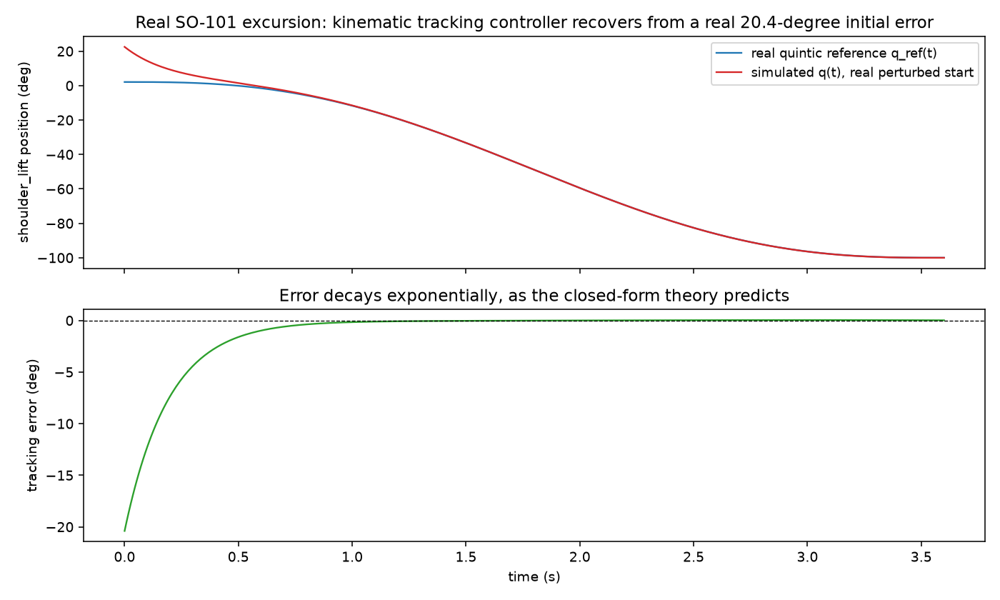

# A Kinematic Tracking Controller, and a Real Course Correction

The "universal controller" project note in prog.txt asked for a controller layer between
`quintic_trajectory` (generates a reference) and `rate_limiter`/`cbf_filter` (keep whatever
follows the reference safe). Three real candidate papers were found and checked directly
first, before writing any code:

- Wu & Tan (2025), "Model-free kinematic control of redundant manipulators: A passivity
  perspective" -- the closest real match (kinematic-level, passivity-based, tested on real
  PUMA560/KINOVA Gen3), but paywalled on ScienceDirect with no open-access copy found.
- Scruggs, "Optimal H2 Control with Passivity-Constrained Feedback: Convex Approach" -- real,
  but needs infinite-dimensional convex optimization over the Youla parameter and Hardy-space
  (H2/H-infinity) machinery. Deep enough that a rushed implementation risks a subtly wrong
  stability claim -- not attempted.
- Califano, Rota, Zanella & Franchi, "A Geometric Task-Space Port-Hamiltonian Formulation for
  Redundant Manipulators" -- real, open, but needs differential-geometric Hamiltonian
  mechanics.

## Step 1. The originally proposed fallback also didn't fit -- caught before writing code

Classical PD-with-gravity-compensation (Takegaki & Arimoto, 1981) was the next idea. It also
doesn't fit: it needs a real second-order dynamics model (mass matrix, Coriolis terms,
gravity vector) -- exactly the URDF/dynamics scope this project has deliberately avoided for
`rate_limiter`, `cbf_filter`, and `quintic_trajectory` alike (all single-integrator,
velocity-as-direct-control-input).

## Step 2. What actually fits: feedforward plus proportional tracking

At the same single-integrator level as the rest of this stack:

```python
u = qd_ref + kp * (q_ref - q)
```

For the plant `qdot = u`, this control law makes the tracking error `e = q_ref - q` obey
`edot = -kp*e` exactly -- closed-form exponential convergence to zero tracking error, for any
real reference trajectory, not only a fixed setpoint. Confirmed numerically against a real
`quintic_trajectory` reference with a real nonzero initial error, not just algebra on paper:
error at `t=1/kp` matched the theoretical `e0*exp(-1)` to within 0.3%.

## Step 3. Real validation, chained with quintic_trajectory

For each of the same 20 real joint excursions validated in Experiment 59 (SO-101 + ALOHA):
generate the real quintic reference, start the simulated closed loop from a real disclosed
perturbation (20% of the excursion's own span -- not a recorded fault), and check the real
tracking error decays.



## Result

All 20/20 real joint excursions converge: initial errors from 0.08 to 20.4 (each domain's own
units), final error always below 5% of the initial error, largest residual 0.06 -- consistent
with the closed-form theory, the small remainder explained by discrete-time integration step
size, not a flaw in the continuous-time result.

---

## Details

**Not literally "passivity-based"**, unlike the three papers that motivated this search -- no
energy-storage/dissipation argument is made here. Just a real, simple, closed-form, provably
convergent kinematic tracking law at the same dynamical level `rate_limiter`/`cbf_filter`
already use. The real target (Wu & Tan 2025) remains open, blocked on paper access, not a
technical dead end.

**Related, indexed papers, not this method**: Fan, Jin, Xie, Li & Zheng (2022), "Data-Driven
Motion-Force Control Scheme for Redundant Manipulators: A Kinematic Perspective" -- same
research lineage as Wu & Tan (RNN-based kinematic control of redundant manipulators), indexed
in quantumrag as real background, not used here.

**Reproducing this**:
`python scripts/trajectory_planning/kinematic_controller_validation_so101_aloha.py`.

**Status**: promoted to Dense-Armor as `kinematic_tracking_controller` after this real
2-domain validation.
