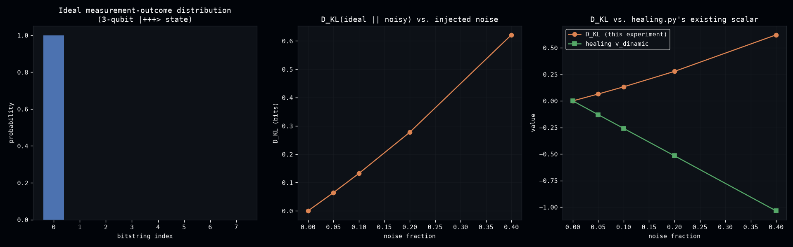

# Kullback-Leibler Divergence: the Real Thing Behind `healing.py`'s Log-Ratio

**In plain terms**: Kullback-Leibler (KL) divergence is a standard way to measure how different two probability distributions are from each other. The healing pipeline's own code already uses something *similar* but not the real thing -- this page builds the actual, textbook-correct KL divergence and checks whether it behaves as a genuinely different, useful signal, or is just a rescaled copy of what was already there.

`dense_evolution/mitigation/healing.py`'s own module docstring already flags an honest gap: `calculate_vettore_dinamico`'s core term, `log(E_B/E_A)`, is a log-likelihood ratio -- "the same elementary quantity Kullback-Leibler divergence is built from" -- but explicitly *not* a full KL divergence. It is one un-weighted log-ratio between two scalars, not a probability-weighted sum over a distribution: `D_KL(p‖q) = Σₓ p(x)·log(p(x)/q(x))` (Kullback, S. & Leibler, R.A., "On Information and Sufficiency", *Annals of Mathematical Statistics*, 22(1), 79-86, 1951).

**A real terminological nuance, checked directly against the paper's own text (Section 2, eq. 2.2-2.3) rather than assumed from the textbook formula alone**: what this experiment implements is what Kullback & Leibler call `I(1:2)`, "the mean information for discrimination between H₁ and H₂" -- what the broader literature later popularized as "the KL divergence". Their *own* word "divergence", `J(1,2) = I(1:2) + I(2:1)` (eq. 2.9), names the *symmetrized* sum of both directions instead. This experiment builds the real asymmetric `I(1:2)` quantity -- the one everyone today calls "KL divergence" -- and checks the concrete question a healing-pipeline maintainer would actually ask before adding it as a diagnostic: is it genuinely a different signal, or just a rescaling of what's already there?

## Validation against an independent reference

`kl_divergence(p, q)` matches `scipy.stats.entropy(p, q)` (converted from nats to bits) to `1e-9` across 20 random trials on distributions of 2-8 outcomes -- an independent implementation, not just a self-consistency check.

## Gibbs' inequality, asymmetry, support violation

- **Non-negativity** (Gibbs' inequality): `D_KL(p‖q) ≥ 0` always, confirmed across 200 random distribution pairs (min observed: `1.13e-03`, never negative).
- **Asymmetry**: `D_KL(p‖q) ≠ D_KL(q‖p)` in general -- caught one accidental counterexample first (`q` = `p` with indices reversed makes the two equal by construction, an index-permutation coincidence, not a property of KL divergence itself) before landing on a genuinely asymmetric pair (`0.7188` vs. `0.8440` bits).
- **Support violation**: when `p` has mass where `q` is exactly zero, `D_KL(p‖q) = +∞` -- the mathematically correct value, not a numerical artifact to clamp away (the same lesson already learned the hard way for `sandwiched_renyi_divergence`'s `α>1` case). The reverse case -- `p` has zero mass exactly where `q` doesn't -- stays finite, confirming the violation check doesn't fire spuriously.

## Applied to real measurement-outcome distributions, and compared against `healing.py`'s scalar

Using a 3-qubit `|000⟩` state's measurement distribution as the reference, mixed with an increasing fraction of uniform noise: `D_KL(ideal‖noisy)` grows from `0` to `0.62` bits as noise goes from 0 to 40% -- monotonic by construction, confirming the divergence responds to genuine distributional drift.

[](assets/kullback_leibler_divergence/kullback_leibler_divergence.png)

Run side by side against `healing.py`'s existing `calculate_vettore_dinamico` on the same states: the two signals are **not** a trivial rescaling of each other -- `D_KL` stays positive and grows smoothly with noise, while `v_dinamic` goes *negative* over the same sweep (`-1.04` at 40% noise). Confirms in a concrete, checkable way what the module docstring already claimed from the formulas alone: these are genuinely different quantities, not the same thing under two names.

## Status

Validated in `scripts/kullback_leibler_divergence.py` and `tests/test_kullback_leibler_divergence.py` (7/7 passing). Promoted to `dense_evolution.mitigation.kl_divergence`/`kl_divergence_jit` as an additive diagnostic, alongside `sandwiched_renyi_divergence` -- not a replacement for `healing.py`'s existing (already-validated) scalar signal.

## Reproduce

```bash
python scripts/kullback_leibler_divergence.py
pytest tests/test_kullback_leibler_divergence.py -v
```
