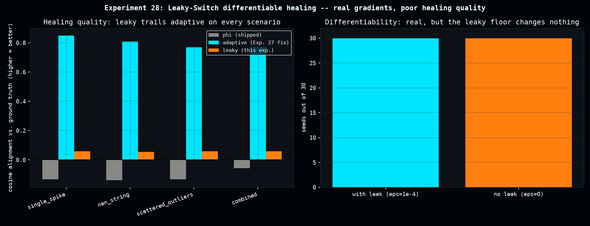

# Leaky-Switch Differentiable Healing

The same proposal line behind [Stratonovich-Projection Vector Healing](stratonovich_vector_healing.md) and the [Healing Trigger False-Positive Audit](healing_trigger_false_positive_audit.md) also suggested a JAX/XLA rewrite of the healing filter using `jax.lax.scan` and a sigmoid "soft trigger" (blending the raw and healed values continuously) instead of a hard if/else branch, plus a small "leaky" floor (`trigger_activation * (1 - 1e-4)`) specifically meant to prevent the sigmoid from fully saturating and killing the gradient -- intended for use cases where healing sits inside a differentiable training loop (e.g. a VQE loss). The original validation was a single 4x8 toy gradient check on one seed, and never checked healing quality at all, only that a gradient existed.

This page asks two separate questions.

## 1. Differentiability -- real, as claimed

30/30 seeds give finite, non-zero `jax.grad` on a `sum(healed**2)` loss (gradient norm 48.7-71.0). But the "leaky" 1e-4 floor turned out to be unnecessary insurance for every case tested: an ablation removing it entirely (`epsilon=0`) *also* gave 30/30 finite non-zero gradients, with gradient norms within 0.1% of the leaky version -- the plain `jax.nn.sigmoid` never saturated hard enough in these trials to need the floor.

## 2. Healing quality -- clearly worse than what's already shipped

Compared against the [MAD-adaptive trigger](healing_trigger_false_positive_audit.md) on the same 4 corruption scenarios x 40 seeds, this design's cosine alignment with the ground truth sits at ~0.055-0.058 (barely above chance) versus ~0.77-0.85 for the adaptive trigger -- a 0-10% win rate for the leaky design, every comparison significant at p<0.0001. L2 error is also suspiciously near-constant (~56.7-56.8) across every corruption type, the signature of a filter that smooths indiscriminately rather than correcting the actual anomalies.

Three concrete structural reasons stand out:

- a *fixed* 0.25 sigmoid threshold, not the MAD-adaptive one
- zero-imputation of NaN/Inf instead of column-mean imputation
- `jax.lax.scan` cascading each correction into the next window's statistics (the shipped `enhanced_dense_healing_hybrid` deliberately does not cascade)

[](assets/leaky_differentiable_healing/leaky_differentiable_healing.png)

## On the arXiv:1510.05279 citation

Re-reading the actual Hu & Šverák paper again, specifically looking for anything that could improve this design, turns up nothing applicable. The paper's Euler-Arnold bracket requires a known finite-dimensional Lie algebra structure that arbitrary hidden-state vectors don't have. More directly: this design has no stochastic noise term at all (`healed = state_A + drift_step * 0.5` is fully deterministic), so the paper's central Itô-vs-Stratonovich concern -- the entire point of citing this specific paper -- doesn't even arise here.

## Verdict

Sound differentiability engineering, not promoted to `dense-evolution`. Healing quality would need the same MAD-adaptive threshold and NaN-handling fixes documented in the trigger audit, rewritten differentiably (a non-trivial task, since median/MAD have no useful gradient as-is and would need a soft approximation), before being competitive. Documented here as an honest negative result rather than left unrecorded.

## Reproduce

```bash
python scripts/leaky_differentiable_healing.py
```

Produces `data/leaky_differentiable_healing.csv`.
