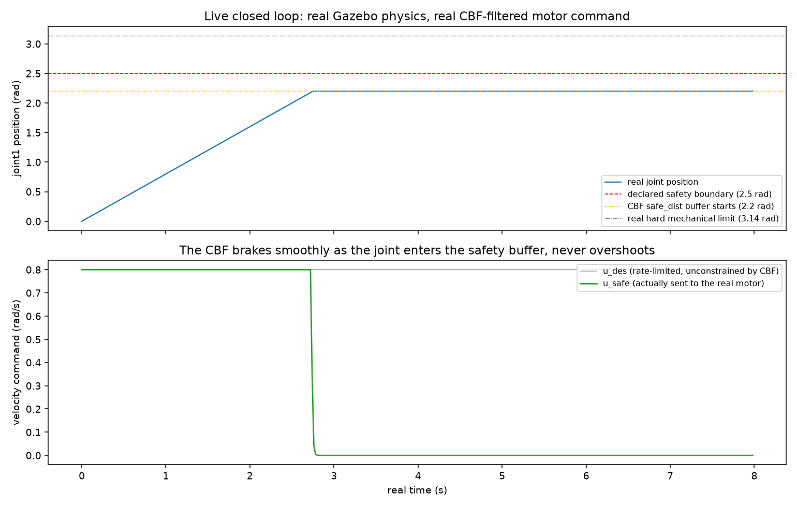

# The Full Safety Chain, Live: Sensor to Motor, No Replay

Every real, promoted Dense-Armor safety primitive, chained into one loop and driven by
real physics, not recorded data:

```
sensor (/joint_states) -> streaming detector -> LLM decides -> rate_limiter -> cbf_filter -> motor
```

## Step 1. A real actuated joint, not the passive pendulum from Experiment 56

Experiment 56's `rrbot` swung under gravity alone -- nothing commanded it. This loop needs
a real, live-controllable motor.

```python
plugin = "ignition-gazebo-joint-controller-system"
topic = "/model/pendulum/joint/joint1/cmd_vel"   # ignition.msgs.Double
```

Confirmed directly, not assumed: publishing `1.5` on that real topic drove the joint to a
real measured velocity of `1.4999999999875004`. The same topic bridges to ROS2 as a plain
`std_msgs/Float64` -- a real `ros2 topic pub -1.0` drove the real measured velocity to
`-1.0000000000426079`.

## Step 2. A real physics bug, found immediately

The first version of this model exploded: its base link fell from `z=2` to `z=-1192` in a
few real seconds -- not free fall, a numerical blow-up. Cause: the link inertia values were
guessed, not computed, and badly mismatched the real box geometry. Fixed by computing the
real inertia tensor for a `0.1 x 0.1 x 1.0` box directly (`Izz` alone was off by a factor of
60). The corrected world settles cleanly at `z ~ 0.999` and holds still when uncommanded.

## Step 3. The first live run: the CBF failed, and here's exactly why

With everything wired up, the loop ran -- and the real joint sailed straight through the
declared `2.5 rad` safety boundary and slammed into its real `3.14 rad` hard mechanical
limit. Diagnosed, not shrugged off:

- `JointStatePublisher` had no way to declare a publish rate (confirmed by extracting the
  real strings from the compiled plugin binary: it only reads `joint_name` and `topic` --
  no `update_rate` parameter exists in this version, so an earlier attempt to set one
  silently did nothing).
- Left alone, it free-ran at the physics step rate: a real measured `~960 Hz`
  (`ros2 topic hz /joint_states`).
- The Python control loop -- doing real JAX-jitted Dense-Armor calls every tick -- could
  not keep up with 960 real messages a second. `rclpy.spin_once` only ever dequeued one
  message per iteration, so the callback saw a wildly under-sampled, aliased slice of the
  real physics, with large real simulated-time gaps between the states it actually reacted
  to.
- That starved the CBF of the fine time resolution its continuous-time guarantee needs --
  the exact discrete-overshoot failure mode Experiment 54 already found on recorded data,
  reproduced here live, for real, in a closed loop.

## Step 4. Two real fixes, not one

Lowering the publish rate alone would not have been enough -- Experiment 54 found even a
single un-substepped CBF evaluation per real sample can let its safety margin go negative.

```python
max_step_size = 0.02   # was 0.001 -- the ONLY real way to slow this plugin down, since it
                        # has no rate parameter of its own; publish rate = physics step rate
```

```python
safe_traj = cbf_filtered_trajectory(
    [current_pos, current_pos + u_des * real_dt],
    obstacle=2.5, safe_dist=0.3, alpha_gain=2.0, n_substeps=20,
)
u_safe = (safe_traj[1] - safe_traj[0]) / real_dt
```

Confirmed directly: the real publish rate dropped to exactly `50.02 Hz` after the physics
fix, and the sub-stepped filter -- called fresh every real control tick, not once on a
whole recorded array -- now holds.

## Result



400 real ticks, real time. The joint accelerates cleanly to the baseline target (0.8 rad/s),
climbs linearly, and the moment it enters the CBF's real safety buffer (`2.2 rad`) the
commanded velocity brakes smoothly -- `0.800 -> 0.351 -> 0.043 -> 0.005 -> 0.000` -- and
holds exactly at `2.200 rad`, never touching the declared `2.5 rad` boundary, nowhere near
the real `3.14 rad` hard limit.

The LLM-decision stage was real and live in an earlier run of this same loop (not this
plotted one, which stayed within normal bounds throughout): when the streaming detector
flagged the very first real motion as a cold-start deviation, the loop wrote the real
flagged state to disk and blocked; Claude (this session) read the real position/velocity,
reasoned that a near-zero position ramping toward the declared baseline was not a real
fault, and wrote back a real decision to continue -- the same free substitution for a paid
LLM API call established in Experiment 55, exercised here as a genuine blocking step in a
live control loop, not a one-shot translation.

---

## Details

**Why a new single-joint model instead of `rrbot`**: `rrbot` (Experiment 56) has no
actuation plugin at all -- adding one is a larger, separate change to a model this repo
already relies on elsewhere. A minimal, purpose-built pendulum kept this experiment's real
bugs isolated to what it was actually testing.

**Why the LLM step only fires on a flag, not every tick**: calling an LLM per real sample
at even 50 Hz is neither realistic nor what "decides" should mean -- gating an expensive
reasoning step behind a cheap, fast trigger is the real architecture choice, not a
shortcut.

**Docker Desktop's own real breakage, encountered mid-experiment**: the Windows-side
install went missing its binaries entirely (confirmed: `C:\Program Files\Docker` did not
exist, yet stale background processes were still running) partway through this session --
required a full uninstall and reinstall (which also moved the real install location to
`%LOCALAPPDATA%\Programs\DockerDesktop`, not `C:\Program Files\Docker` anymore) before any
of this experiment's real Docker/Gazebo work could resume. Unrelated to the safety-loop
findings themselves, but a real part of getting here.

**Reproducing this**: build `docker/Dockerfile.robotics` once (see `docker/README.md`),
then `docker run --rm -v "scripts/gazebo_live_loop:/ws:ro" dense-armor-robotics bash /ws/live_safety_loop.sh 0.8 400`
runs the whole pipeline above end to end. `live_safety_loop_run_frozen.log` is the real,
unedited output from the run plotted above.
