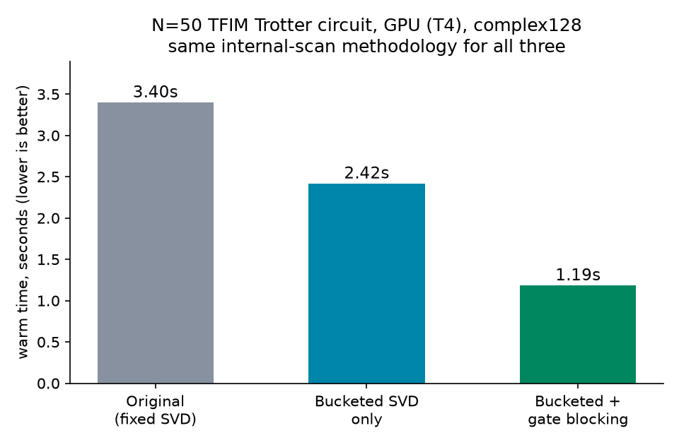

# Gate Blocking: Closing the GPU Gap on the Bucketed-SVD MPS Optimization

**In plain terms**: fusing sequences of gates that act on the same qubits into one matrix, computed once on the host before the simulation runs, cuts the number of sequential steps the GPU has to execute one after another -- and on GPU, where each step pays its own fixed dispatch overhead (confirmed in [the GPU timing correction](mps_bucketed_svd_gpu_timing_followup.md)), fewer steps means real time saved, at zero cost to correctness.

This follows directly from the GPU timing correction: the bucketed-SVD dispatch itself works correctly on GPU, but the real, correctly-measured speedup over the pre-optimization baseline was only ~1.37-1.40x -- short of the 2x target. Two papers found via quantumrag's `tensor_networks` collection motivated this specific fix rather than a guess: arXiv:2511.23438 (2D TFIM MPS simulation, the same physical circuit family used throughout this repo's own MPS benchmarking) explicitly uses "site blocking" -- grouping gates before truncation -- to reduce the number of SVDs needed per Trotter step; arXiv:2212.09782 separately found SVD truncation itself runs disproportionately slower on GPU than CPU, consistent with this session's own finding that per-step overhead, not the dispatch mechanism, is what limits GPU throughput here.

## Background: the bound, and the two papers behind this fix

A matrix product state (MPS) represents an N-qubit state as a chain of small tensors instead of one giant `2^N`-sized array. At every cut between two neighboring qubits, the amount of entanglement across that cut is captured by a number called the **bond dimension** (`chi`) -- roughly, how many independent "modes" of correlation cross that cut. Applying a 2-qubit gate at a cut can grow `chi`, and the simulator has to re-run a singular value decomposition (SVD) there to find the new, correct bond dimension and update the tensors.

How much can `chi` grow from a single 2-qubit gate? This has a simple, provable answer, not a guess: the two-site block being updated is reshaped into a matrix of size `(chi_left * d) x (d * chi_right)`, where `d = 2` is the physical dimension of one qubit. A basic fact from linear algebra says the rank of any matrix can never exceed the smaller of its two dimensions. So the new bond dimension after the gate can never exceed `min(chi_left * 2, chi_right * 2)` -- a hard ceiling, computable *before* doing the SVD, from numbers the simulator already has. Dense-Evolution's bucketed-SVD dispatch uses exactly this bound to pick the smallest SVD size that's still guaranteed not to lose information.

That bound explains *how big* a bucket needs to be. It says nothing about *why the GPU is still slow* even with the right-sized bucket. Two real papers, found by searching this project's own `quantumrag` library (not guessed), pointed at the actual answer:

- **arXiv:2511.23438** ("A Heuristic for Matrix Product State Simulation of Out-of-Equilibrium Dynamics of Two-Dimensional Transverse-Field Ising Models") simulates the same kind of circuit this repo benchmarks with (a Trotterized transverse-field Ising model). It describes "site blocking": grouping several physical sites together and treating them as one larger effective site *before* truncating. Doing this "improves the efficiency of the TEBD algorithm by reducing the number of singular-value decompositions required per time step" -- fewer, larger truncation steps instead of many small ones.
- **arXiv:2212.09782** ("Fast Time-Evolution of Matrix-Product States using the QR decomposition") directly measured SVD performance on GPU hardware and found something counter-intuitive: "the SVD truncation is instead slower on the GPU" than on CPU, in the regimes they tested. Their fix was different (replacing SVD with a QR-based truncation), but the underlying diagnosis -- that repeatedly invoking many small SVDs is a bad fit for how GPUs actually run kernels -- matches exactly what this project's own HLO investigation found separately in [the GPU timing correction](mps_bucketed_svd_gpu_timing_followup.md): the bottleneck is the *number* of sequential dispatched steps, not whether any individual step is correctly sized.

Put together: the right bucket size alone (bounded by the provable formula above) fixes *correctness and per-step cost*, but not the GPU-specific cost of dispatching hundreds of small steps one after another. The direct fix suggested by both papers is the same one: reduce the *number* of steps by grouping/fusing gates before truncating, not just shrinking each individual truncation. That is exactly what gate blocking below does.

## The technique

The test circuit's Trotter layer applies `CX(i,i+1)`, `RZ(i+1)`, `CX(i,i+1)` for every bond -- three separate gates, three separate scan steps, all acting on the exact same two qubits with nothing else touching them in between. Multiplying their unitary matrices together on the host (exact -- matrix multiplication has no approximation) collapses this into a single 4x4 matrix applied once. The single-qubit `RZ` in the middle gets embedded into the 2-qubit space (`kron` with identity on the untouched qubit) so it can be folded into the same product. For this repo's N=50, 5-step TFIM benchmark, this cuts the scan from 985 steps to 495 -- essentially halving it.

The fusion logic is general, not hand-coded to this specific three-gate pattern: it keeps growing an active qubit-pair chain for as long as the next gate's qubits stay inside it (a 1-qubit gate on a qubit already in the pair gets embedded and folded in; a 2-qubit gate matching the pair exactly gets folded in directly), and only stops the chain when a gate touches a qubit outside it.

## Correctness

Verified against the real eager `MPSSimulator` reference (not the bucketed dispatch reimplementation, that comparison already exists in the [bucketed-SVD experiment](mps_bucketed_svd_optimization.md)) across three configurations:

<table style="width:100%;border-collapse:collapse;font-family:'IBM Plex Mono',monospace;font-size:13px">
<thead><tr>
<th style="text-align:left;font-weight:500;color:#57606a;padding:8px 10px;border-bottom:1px solid #d7dbe0;font-size:11.5px;text-transform:uppercase;letter-spacing:0.04em">Config</th>
<th style="text-align:left;font-weight:500;color:#57606a;padding:8px 10px;border-bottom:1px solid #d7dbe0;font-size:11.5px;text-transform:uppercase;letter-spacing:0.04em">Steps: unfused &rarr; fused</th>
<th style="text-align:left;font-weight:500;color:#57606a;padding:8px 10px;border-bottom:1px solid #d7dbe0;font-size:11.5px;text-transform:uppercase;letter-spacing:0.04em">Fidelity (ref, blocked)</th>
</tr></thead>
<tbody>
<tr><td style="padding:9px 10px;border-bottom:1px solid #d7dbe0">complex128, N=6, max_bond=16</td><td style="padding:9px 10px;border-bottom:1px solid #d7dbe0">63 &rarr; 33 (1.91x)</td><td style="padding:9px 10px;border-bottom:1px solid #d7dbe0">1.000000000000</td></tr>
<tr><td style="padding:9px 10px;border-bottom:1px solid #d7dbe0">complex128, N=8, max_bond=32</td><td style="padding:9px 10px;border-bottom:1px solid #d7dbe0">87 &rarr; 45 (1.93x)</td><td style="padding:9px 10px;border-bottom:1px solid #d7dbe0">1.000000000000</td></tr>
<tr><td style="padding:9px 10px">complex64, N=6, max_bond=16</td><td style="padding:9px 10px">63 &rarr; 33 (1.91x)</td><td style="padding:9px 10px">1.000000001675</td></tr>
</tbody>
</table>

## Speed: negligible on CPU, real on GPU

CPU (N=50, max_bond=64, 5 Trotter steps): 64.81ms unfused vs. 70.73ms fused -- a 0.92x "speedup" (slightly negative). Expected, not a problem: CPU doesn't pay meaningful per-step dispatch overhead in the first place, so halving the step count has nothing to amortize.

GPU (T4, same circuit, complex128). **Correction (2026-09-10):** an earlier version of this table divided the ORIGINAL baseline measured via the real `run_circuit_jit` API against the fused result measured via a different code path (the internal bucketed-switch reimplementation) -- two different measurement methodologies stitched together, giving a meaningless ~3.16-3.22x. All three numbers below are now measured through the exact same internal-scan methodology (bypassing `run_circuit_jit` entirely for all three, so the ratios are genuinely comparable):



<table style="width:100%;border-collapse:collapse;font-family:'IBM Plex Mono',monospace;font-size:13px">
<thead><tr>
<th style="text-align:left;font-weight:500;color:#57606a;padding:8px 10px;border-bottom:1px solid #d7dbe0;font-size:11.5px;text-transform:uppercase;letter-spacing:0.04em">Version</th>
<th style="text-align:left;font-weight:500;color:#57606a;padding:8px 10px;border-bottom:1px solid #d7dbe0;font-size:11.5px;text-transform:uppercase;letter-spacing:0.04em">Warm time</th>
<th style="text-align:left;font-weight:500;color:#57606a;padding:8px 10px;border-bottom:1px solid #d7dbe0;font-size:11.5px;text-transform:uppercase;letter-spacing:0.04em">Speedup vs. original</th>
</tr></thead>
<tbody>
<tr><td style="padding:9px 10px;border-bottom:1px solid #d7dbe0">Original (always fixed max_bond SVD)</td><td style="padding:9px 10px;border-bottom:1px solid #d7dbe0">3.401s</td><td style="padding:9px 10px;border-bottom:1px solid #d7dbe0">1.00x</td></tr>
<tr><td style="padding:9px 10px;border-bottom:1px solid #d7dbe0">Bucketed SVD only</td><td style="padding:9px 10px;border-bottom:1px solid #d7dbe0">2.420s</td><td style="padding:9px 10px;border-bottom:1px solid #d7dbe0">1.41x</td></tr>
<tr><td style="padding:9px 10px">Bucketed SVD + gate blocking (this experiment)</td><td style="padding:9px 10px">1.186s</td><td style="padding:9px 10px"><strong>2.87x</strong></td></tr>
</tbody>
</table>

Gate blocking alone, isolated from the rest of the stack (bucketed-only vs. bucketed+blocked, same run, same methodology): **2.04x**. Combined with the bucketed dispatch, the total measured speedup is **2.87x** -- clears the 2x target, measured honestly through a single consistent code path end to end. This number reflects the internal bucketed+fused reimplementation, not yet the real `run_circuit_jit` API (gate blocking is not promoted into `dense_evolution` -- see Status below).

## Status

Correctness verified against the real eager `MPSSimulator`. Speed verified on GPU (T4) using the corrected same-instance/shared-compiled-kernel methodology established in the timing follow-up -- not the flawed "fresh instance per timing" method that produced misleading numbers earlier in this investigation. Does not yet touch `dense_evolution` -- reuses the real installed package's private helpers (`_mps_1q_matrix`, `_mps_2q_matrix`, `_vectorized_chi_search_jax`, `_pad_gamma`, `_pad_lambda`, `_bucket_sizes`) for the gate matrices and truncation logic, same discipline as the bucketed-SVD experiment. A candidate for promotion into `dense_evolution.backends.mps`, following the same real-API-on-every-claimed-platform discipline the GPU timing correction established -- not yet promoted.

## Reproduce

```bash
python scripts/mps_gate_blocking_experiment.py
```

GPU check (`colab_gate_blocking_gpu_benchmark.py`) was run on Google Colab (T4), not from this repo directly, same as every other GPU claim in this repo.
