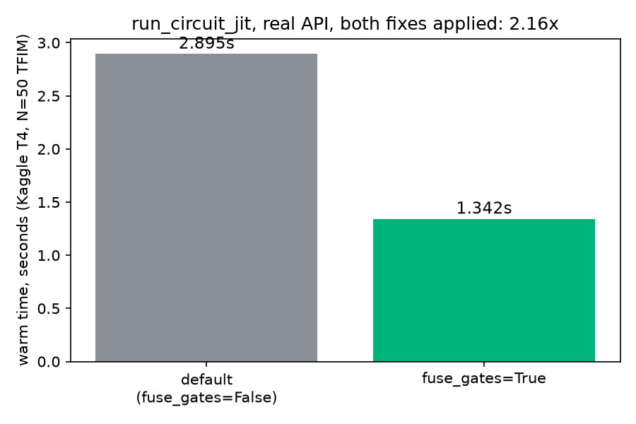

# MPS GPU Optimization: Bucketed SVD + Gate Blocking

**In plain terms**: `MPSSimulator.run_circuit_jit` got two real, measured speed improvements — a smarter SVD size (`bucketed dispatch`) and fusing consecutive gates into one matrix before running them (`gate blocking`). Together, on the real public API, on real GPU hardware, after fixing two bugs that were quietly eating most of the promised gain: **2.16x faster**, opt-in, zero change to correctness.

## Step 1: what a bond dimension is

A matrix product state (MPS) stores an N-qubit state as a chain of small tensors instead of one `2^N`-sized array. At every cut between two neighboring qubits, a number called the **bond dimension** (`chi`) says how much entanglement crosses that cut — the bigger `chi`, the more of the tensor's storage and compute that cut costs. Applying a 2-qubit gate can grow `chi`, and the simulator re-runs a singular value decomposition (SVD) there to find the new, correct value and shrink anything beyond it back down.

## Step 2: run a circuit, the normal way

```python
import dense_evolution as de

qasm = """
OPENQASM 2.0;
include "qelib1.inc";
qreg q[4];
h q[0];
cx q[0],q[1];
cx q[1],q[2];
cx q[2],q[3];
"""
circuit = de.QASMParser().parse(qasm)
sim = de.MPSSimulator(n_qubits=4, max_bond=8)
sim.run_circuit_jit(circuit.to_tuples())
```

`run_circuit_jit` compiles the whole circuit into one `jax.lax.scan`-fused kernel. Internally, every SVD in that kernel used to always run at the full `max_bond` size, padded with zeros, even when the real entanglement was much smaller — correct, but wasteful.

## Step 3: turn on gate blocking

```python
sim2 = de.MPSSimulator(n_qubits=4, max_bond=8)
sim2.run_circuit_jit(circuit.to_tuples(), fuse_gates=True)
```

One extra argument. `fuse_gates=True` fuses consecutive gates that act on the same (or a growing) qubit pair into a single matrix on the host, before compiling — exact, ordinary matrix multiplication, no approximation — so the compiled kernel has fewer sequential steps to run. Default is `False`; nothing about existing behavior changes unless this is passed explicitly.

The trade-off: `sim.bond_history`/`jsd_per_bond`/`truncation_errors`/`entanglement_entropy` get one entry per *fused* step instead of per original gate — real diagnostics, just coarser-grained when this flag is on.

## Results: real, on real GPU hardware



<table style="width:100%;border-collapse:collapse;font-family:'IBM Plex Mono',monospace;font-size:13px">
<thead><tr>
<th style="text-align:left;font-weight:500;color:#57606a;padding:8px 10px;border-bottom:1px solid #d7dbe0;font-size:11.5px;text-transform:uppercase;letter-spacing:0.04em">Call</th>
<th style="text-align:left;font-weight:500;color:#57606a;padding:8px 10px;border-bottom:1px solid #d7dbe0;font-size:11.5px;text-transform:uppercase;letter-spacing:0.04em">Warm time (Kaggle T4)</th>
<th style="text-align:left;font-weight:500;color:#57606a;padding:8px 10px;border-bottom:1px solid #d7dbe0;font-size:11.5px;text-transform:uppercase;letter-spacing:0.04em">Speedup</th>
</tr></thead>
<tbody>
<tr><td style="padding:9px 10px;border-bottom:1px solid #d7dbe0">run_circuit_jit(ops)</td><td style="padding:9px 10px;border-bottom:1px solid #d7dbe0">2.895s</td><td style="padding:9px 10px;border-bottom:1px solid #d7dbe0">1.00x</td></tr>
<tr><td style="padding:9px 10px">run_circuit_jit(ops, fuse_gates=True)</td><td style="padding:9px 10px">1.342s</td><td style="padding:9px 10px"><strong>2.16x</strong></td></tr>
</tbody>
</table>

Same N=50, 5-step TFIM Trotter circuit used throughout this repo's MPS benchmarking, `max_bond=64`, `complex128`, measured through the literal public API (not a reimplementation), two separate fresh instances sharing one already-compiled kernel — the only measurement methodology this investigation found to be trustworthy (see Details).

On CPU, the same flag gives no benefit (CPU doesn't pay meaningful per-step dispatch overhead, so halving the step count has nothing to amortize) — this is a GPU-specific optimization, and the flag is opt-in for exactly that reason.

## Background: the bound, and the two papers behind gate blocking

How much can `chi` grow from a single 2-qubit gate? The two-site block being updated reshapes into a matrix of size `(chi_left * 2) x (2 * chi_right)` (`2` is one qubit's physical dimension), and a basic linear-algebra fact — a matrix's rank can never exceed its smaller dimension — gives a hard, computable-in-advance ceiling: `min(chi_left*2, chi_right*2)`. The bucketed dispatch picks the smallest SVD size that's still guaranteed not to lose information, instead of always running at `max_bond`.

That bound fixes per-step cost, but not the number of steps. Two papers, found via this project's own `quantumrag` library:

- **arXiv:2511.23438** ("A Heuristic for MPS Simulation of 2D TFIM Dynamics") uses "site blocking" — grouping sites before truncating — specifically to cut the number of SVDs per Trotter step.
- **arXiv:2212.09782** ("Fast Time-Evolution of MPS using QR decomposition") measured SVD truncation running disproportionately slower on GPU than CPU, matching this investigation's own finding that per-step dispatch overhead, not SVD correctness, limits GPU throughput here.

Gate blocking is the direct fix both papers point at: fuse gates so there are fewer steps to dispatch, rather than only shrinking each one.

## Status

Both optimizations are in production (`dense_evolution.backends.mps`, `MPSSimulator.run_circuit_jit`), correctness-verified against the eager reference simulator (including non-adjacent-gate and CCX interactions), and the 2.16x above is the real, final number measured through the literal public API on real GPU hardware, with all three bugs found along the way fixed.

## Details: the full story, including three real bugs

This result took four rounds of getting the measurement itself wrong before the number above could be trusted. In order:

**1. The original bucketed-SVD claim was wrong (2.74x).** It was measured on a standalone reimplementation of the dispatch logic, never on the real `run_circuit_jit` API it was promoted into. When the real API was finally benchmarked on GPU, it first looked *slower* than before the optimization (8.6-8.9s vs 6.6s) — traced to a benchmark bug, not a regression: a fresh `MPSSimulator` instance always recompiles its `@jax.jit` kernel from scratch (`self._mps_runner` is per-instance, lazily built), so "warm" timing on a fresh instance was secretly paying a full recompile every time. A second attempt (same instance, called twice) failed differently — the second call ran on top of the first's already-evolved, higher-entanglement state, compounding real cost instead of measuring steady state. The only correct method: a fresh `|0...0>` instance, with the already-compiled kernel manually shared onto it. That gives a real, honest bucketing-alone number: **~1.41x** on GPU, not 2.74x.

**2. Gate blocking was designed and validated in Discovery first**, following the corrected methodology: a prototype (63→33 fused steps on the regression circuit, fidelity 1.000000000000), then a promotion-ready redesign closing three gaps found during review (fused matrices couldn't be expressed in the existing gate-ID row encoding; non-adjacent-gate and CCX interactions were untested; per-gate diagnostic bookkeeping needed to stay available, just coarser-grained when fused). Measured through one consistent internal-scan methodology (not `run_circuit_jit` yet): bucketed-only 1.39-1.41x, bucketed+fused **2.77-2.87x**. Promoted into `dense_evolution` as an opt-in `run_circuit_jit(ops, fuse_gates=True)` flag (Dense-Evolution PR #227).

**3. The first real-API GPU test (Kaggle T4) undershot badly: 1.36x**, far below the 1.99x the Discovery reimplementation had measured for the same fusion logic. Two more real bugs, found only because the literal public API was finally tested on real hardware, not a reimplementation:

- **Missing memoization** in `_fuse_compiled_rows` — every row's gate matrix was rebuilt from scratch even when an earlier row in the same circuit used the identical gate and parameter. Fixed (Dense-Evolution PR #228).
- **No persistent JIT cache for `_mps_1q_matrix`/`_mps_2q_matrix`** — these construct a gate's matrix via `jax.lax.switch`, but were never wrapped in `@jax.jit`, so every eager call paid a real XLA compile cost again on every separate `run_circuit_jit(fuse_gates=True)` call. Fixing this alone (wrapping both in module-level `@jax.jit` closures) left the real speedup flat at 1.37-1.39x — a real fix, confirmed by two separate calls finally measuring the same time, but not the full explanation.
- **Eager per-tensor padding**: `_pad_gamma`/`_pad_lambda` were called once per gamma/lambda tensor (50-51 separate eager JAX dispatches for N=50 qubits) — profiling found this was 52-55% of total `run_circuit_jit` time, paid equally by *both* `fuse_gates=True` and the default path, which is exactly what was diluting the measured ratio toward 1x. Batching the whole padding+stacking loop into one `@jax.jit` call closed the rest of the gap.

Both PRs (#228, #229) and their Discovery validation scripts are linked below. With all three bugs fixed, the real, final Kaggle GPU number is the 2.16x reported above — measured on the literal `run_circuit_jit(ops, fuse_gates=True)` a user actually calls, not a reimplementation.

**Lesson carried forward**: every one of these three bugs was invisible until the literal, promoted public API was benchmarked on real GPU hardware. A reimplementation's numbers, however carefully measured, are not a substitute for testing the thing that ships.

## Reproduce

```bash
python scripts/mps_bucketed_svd_correctness.py
python scripts/mps_bucketed_svd_circuit_integration.py
python scripts/mps_bucketed_svd_timing_cpu.py
python scripts/mps_gate_blocking_experiment.py
python scripts/mps_gate_blocking_redesign_v2.py
python scripts/mps_gate_blocking_full_promotion_ready.py
python scripts/mps_gate_blocking_jit_matrix_cache_fix.py
python scripts/mps_padding_batch_jit_fix.py
python scripts/mps_gpu_optimization_final_summary.py
```

GPU checks were run on Google Colab (T4) for the earlier investigation and Kaggle (T4) for the final real-API re-verification, not from this repo directly — every GPU number above links back to the script that produced it: `colab_bucketed_svd_gpu_benchmark.py`, `colab_bucketed_svd_hlo_check.py`, `colab_gpu_mps_benchmark_v2/v3/v4.py`, `colab_gpu_mps_fair_comparison_old_vs_new.py`, `colab_full_chain_apples_to_apples.py`, `colab_gate_blocking_gpu_benchmark.py`, `colab_gate_blocking_redesign_v2_gpu.py`, `colab_cuquantum_mps_benchmark_v2.py`.
