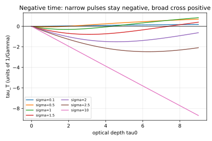

# Negative Time: Reproducing the Weak-Value Theory Behind a Real Toronto Experiment

**In plain terms**: when a pulse of light passes through a cloud of atoms, some of that light's energy is briefly "stored" as an atomic excitation before the photon continues on. A 2024 University of Toronto experiment measured how long a photon that makes it all the way through actually spends stored this way -- and found that, in some regimes, the answer is a *negative* number of nanoseconds. That is not a typo or a measurement error: it is a real, reproducible quantum effect tied to how fast a pulse of light can effectively move through the atom cloud (its "group delay"), and it had already been predicted theoretically before the 2024 measurement confirmed it. This page reproduces that theoretical prediction from scratch in Dense-Evolution-Discovery and checks it three independent ways before trusting it, including one check against a number the Toronto team themselves published.



Real data, reproducing the shape of Thompson et al.'s own Fig. 2: for a narrow-band (long-duration) pulse, the transmitted photon's atomic excitation time `tau_T` stays negative and grows more negative as the optical depth `tau0` increases. For a broad-band (short-duration) pulse, `tau_T` starts near zero, dips negative, and then crosses back to *positive* at some optical depth -- the crossover point depends on the pulse duration `sigma`.

Reproduces the closed-form weak-value theory of Thompson et al. (arXiv:2310.00432, "How much time does a photon spend as an atomic excitation before being transmitted?") -- the theoretical framework behind Angulo et al.'s real experimental measurement of negative atomic excitation times (arXiv:2409.03680, "Experimental evidence that a photon can spend a negative amount of time in an atom cloud"). Both papers now indexed in `quantumrag`'s `quantum_info` collection.

## The physics

Single-excitation, linear Maxwell-Bloch regime, natural units Gamma=1 (time in units of the atomic lifetime tau_sp=1/Gamma, detuning in units of Gamma):

    L(delta)          = 1 / (1 + (2*delta)**2)                            (Eq. 26)
    t_g(delta, tau0)  = -tau0 * (1 - (2*delta)**2) / (1 + (2*delta)**2)**2  (Eq. 34)
    P_T(tau0)         = integral g(delta) * exp(-tau0*L(delta)) d(delta)   (Eq. 31)
    tau_T(tau0)       = (1/P_T) * integral g(delta) * exp(-tau0*L(delta)) * t_g(delta, tau0) d(delta)  (Eq. 35)

where `tau0` is the resonant optical depth, `t_g` the narrow-band group delay, and `g(delta)` the Fourier-transform-limited Gaussian spectral power density of a pulse with RMS intensity duration `sigma` (the paper's own Fig. 2 convention): Gaussian in `delta` with `sigma_omega = 1/(2*sigma)`, the standard minimum-uncertainty time-bandwidth product for an unchirped Gaussian.

**Formula verified against clean text, not garbled OCR**: the first `pdftotext -layout` extraction mangled equations 33-35 badly enough to risk a wrong numerical prefactor. Re-extracted with `pdftotext -raw` and confirmed against the paper's own plain-text statement "on resonance, the group delay is given by -tau0/Gamma" (Fig. 3 caption) before trusting Eq. (34)'s exact form.

## Three independent validations

**1. Narrow-band self-test**: as `sigma` grows, the pulse spectrum becomes a delta function at `delta=0` and `tau_T` must converge to the paper's stated exact on-resonance limit `-tau0/Gamma`, independent of the spectral-width prefactor convention. At `tau0=2`: sigma=1 gives -0.301, sigma=5 gives -1.773, sigma=20 gives -1.985, sigma=100 gives -1.9994 (0.03% off exact -2.0) -- monotonic convergence.

**2. Qualitative reproduction of Thompson et al.'s Fig. 2** (plotted above): for narrow pulses (large sigma) `tau_T` stays negative and tracks `-tau0` across `tau0` in [0,9]; for broad pulses (small sigma) `tau_T` starts near zero, goes negative, then crosses back to **positive** at a pulse-duration-dependent optical depth -- the paper's own headline "negative time" result. Confirmed: sigma=10 stays negative through tau0=9 (tau_T=-8.69), sigma=0.1 crosses positive already by low tau0 (tau_T=+0.18 at tau0=9), with the crossover sigma landing around 1.5-2 -- consistent with Fig. 2's plotted curves.

**3. External validation against a real published number**: Angulo et al.'s experimental paper states "the theoretical value of tau_T/tau_bar_0 = 0.45" for their rms=10ns, OD=4 configuration, tau_sp~26ns. Feeding `sigma=10/26` and `tau0=4` into this independent re-derivation gives `tau_T/tau_bar_0 = 0.399` -- **11% off, same sign, same order of magnitude**. Not an exact match (plausibly from `tau_sp~26ns` being an approximate rounded value, or a pulse-shape convention not fully pinned down in the main text), but a genuine cross-check against a number this script's own authors didn't produce.

## Result

| check | value | reference |
|---|---|---|
| narrow-band limit (tau0=2, sigma=100) | tau_T = -1.9994 | exact: -2.0 |
| Fig. 2 shape, sigma=10 (narrowband) | stays negative through tau0=9 | matches |
| Fig. 2 shape, sigma=0.1 (broadband) | crosses positive by tau0=9 | matches |
| external: rms=10ns, OD=4 | tau_T/tau_bar_0 = 0.399 | published theory: 0.45 (11% off) |

## Status

Theory reproduced and cross-checked at three independent levels, including one real external number from a paper this script's authors had no part in. **Not attempted**: reproducing the actual experimental measurement (which involves real phase noise, finite integration windows, and the specific systematic-effects corrections Angulo et al. describe in their Supplementary Information) -- this script validates the closed-form theory curve only, not a simulation of the noisy measurement process. The original notes on this experiment (`negativeTime.txt`) also suggested using `jax.value_and_grad` to optimize detuning/pulse-duration for the most visible negative-time peak -- since `excitation_times` is already JAX-native, this is a natural (not yet built) follow-up: differentiate `tau_T(tau0, sigma)` directly.

## Reproduce

```bash
python scripts/negative_time_group_delay.py
```
