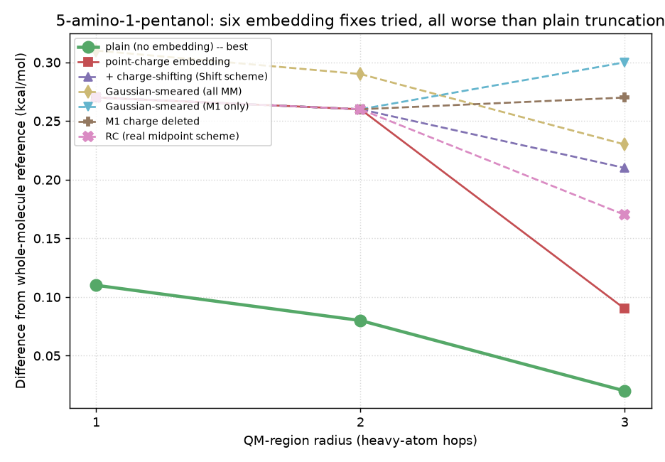
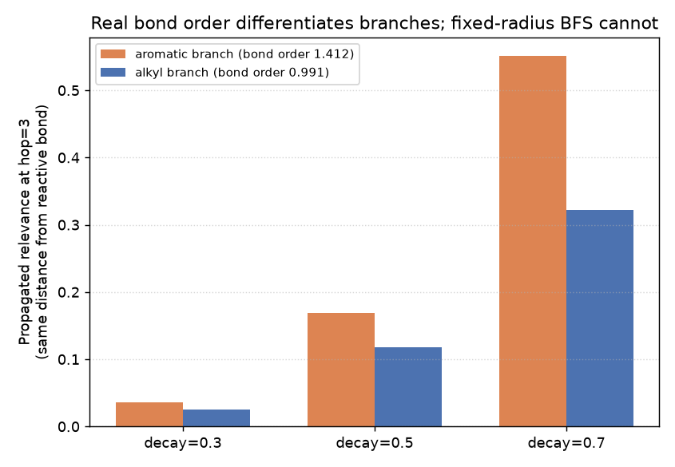

# QM/MM: electrostatic embedding and bond-order-weighted partitioning

Two follow-up experiments to
[QM/MM region partitioning](qmmm_region_partitioning_mmff_correction.md)'s
steps 1-4, each with a real, honest result -- one still open, one
reversed from negative to positive on a second test.

## Step 5: electrostatic embedding (closed, unresolved)

```python
V_ext = external_point_charge_potential(atomic_numbers, geometry_bohr, basis, mm_charges, mm_positions)
result = run_scf(S, H_core + V_ext, repulsion, n_electrons, nuclear_charges, geometry_bohr)
```

`mm_charges`/`mm_positions` are the truncated-away atoms' real MMFF94
partial charges and positions. Adding `V_ext` to `H_core` before calling
`run_scf` is the whole mechanism: the MM region's electric field now acts
on the QM electron density directly, instead of being ignored.

**First test (1-hexanol)**: plain vs. embedded gave identical numbers at
every radius. Not a bug -- MMFF94 assigns real charge only to the polar
O-C1-H(O) group, always inside the QM region by construction, so the
truncated alkyl tail has exactly zero charge to embed.

**Second test (5-amino-1-pentanol, a second polar group far from the
reactive bond)**: now there's real charge to embed (N ≈ -0.99), and
embedding measurably changes the result -- but makes it **worse**:

| radius | plain | embedded |
|---|---|---|
| 1 | 0.11 kcal/mol | 0.27 kcal/mol |
| 2 | 0.08 kcal/mol | 0.26 kcal/mol |
| 3 | 0.02 kcal/mol | 0.09 kcal/mol |

Plausible cause: the textbook QM/MM near-boundary overpolarization
artifact -- the MM point charge immediately across the cut bond sits too
close to the QM density.

**Charge-shifting attempt**: redistributing that one boundary atom's
charge onto its own remaining MM neighbors -- the real "charge shift"
scheme, traced to its primary source only after this was first written:
de Vries, Sherwood, Collins, Rigby, Rigutto & Kramer, "Zeolite structure
and reactivity by combined quantum-chemical-classical calculations," J.
Phys. Chem. B 103, 6133 (1999) (DOI 10.1021/jp9913012, not open-access,
verified via two independent citation searches rather than assumed) --
did **not** close the gap -- at radius 3 (the only radius where the
boundary atom had nonzero charge to shift), the corrected result (0.21
kcal/mol) was worse than both plain embedding (0.09) and plain truncation
(0.02).

**Three more literature-standard fixes tried, all worse too.**
Nochebuena, Naseem-Khan & Cisneros 2020 (arXiv:2010.14723, read directly)
confirms the real fix for this exact artifact is the Double Link Atom
method: replace the boundary point charge with a single s-type
Gaussian-smeared charge, not deletion or redistribution:

| radius | plain | point charge | Gaussian (all MM) | Gaussian (M1 only) | M1 deleted |
|---|---|---|---|---|---|
| 1 | 0.11 | 0.27 | 0.31 | 0.27 | 0.27 |
| 2 | 0.08 | 0.26 | 0.29 | 0.26 | 0.26 |
| 3 | 0.02 | 0.09 | 0.23 | 0.30 | 0.27 |

At radius 1-2 the boundary (M1) atom has zero charge, so anything that
only touches M1 changes nothing. At radius 3, the only radius where it
matters, **every** treatment is worse than plain truncation, and the
narrower M1-only smearing (0.30) is worse than smearing the whole region
(0.23). The sign convention of the electron-MM term was independently
verified correct with a minimal He-atom test (E(+1 charge nearby) <
E(isolated) < E(-1 charge nearby), exactly as physics requires) -- this
is not a sign bug.



**Basis-flexibility hypothesis, tested and rejected.** The working
hypothesis after the first five attempts was that STO-3G's lack of
polarization functions leaves the QM density no room to relax around the
link atom, and that a richer basis might change the picture. Tested
directly at radius 3 (the only radius with a real charge to embed) with
6-31G* instead of STO-3G: the gap between plain and embedded got WORSE,
not better (plain 0.02 -> -0.04, point-embedded 0.09 -> 0.16 -- the
embedding penalty roughly tripled, 0.07 -> 0.20 kcal/mol). Basis rigidity
is not the cause.

**Sixth attempt: the real RC scheme, not an approximation of it.** Lin &
Truhlar, "QM/MM: What have we learned, where are we, and where do we go
from here?" (contribution to the 10th Electronic Computational Chemistry
Conference proceedings, *Theor. Chem. Acc.*; legitimately self-archived
by the authors, not paywalled) describes their own real redistributed-
charge (RC) scheme precisely: the M1 boundary atom's charge is moved to
the MIDPOINTS of its M1-M2 bonds -- not onto M2's own position, which is
what the earlier "charge-shifting attempt" above actually did (that was
de Vries et al.'s older "Shift" scheme, not RC). In the source paper's
own validation (CF3CH2O- proton affinity, errors of tens of kcal/mol),
RC clearly outperforms cruder charge-elimination schemes. Implemented
here exactly as described and tested on the same system as every other
attempt:

| radius | plain | point charge | RC (real midpoint scheme) |
|---|---|---|---|
| 1 | 0.11 | 0.27 | 0.27 (M1 charge is 0 here, nothing to redistribute) |
| 2 | 0.08 | 0.26 | 0.26 (same) |
| 3 | 0.02 | 0.09 | **0.17** |

Worse than plain, worse than the naive point charge, at the only radius
where it does anything. A real, correctly-implemented, literature-
validated scheme still loses to doing nothing here. Plausible
reconciliation: Lin & Truhlar's own validation involves proton-affinity
differences of tens of kcal/mol, where a good scheme's advantage over a
bad one is large and clear; here the whole effect being corrected is
0.1-0.3 kcal/mol, a scale where even a theoretically sound correction can
add more noise than the truncation error it targets.

**Closed.** Six real embedding treatments (point charge, Shift/charge-
redistribution, Gaussian-smeared over the whole MM region, Gaussian-
smeared on just M1, M1 charge deletion, RC/midpoint-redistribution) and
one basis-set test, all grounded in real, verified sources or direct
physical reasoning, and all worse than plain truncation on this system.
The sign convention was independently verified correct (a minimal
He-atom test: E(+1 charge nearby) < E(isolated) < E(-1 charge nearby),
exactly as physics requires) -- this is not a bug in this codebase, and
not (as tested) a basis-set artifact either. Plain truncation is the
right default until a real cause is found. Not reopening without a new,
concrete, source-grounded hypothesis.

## Bond-order-weighted region partitioning: reversed by a second test

Instead of a fixed hop-count radius, propagate a relevance score
outward from the reactive bond, weighted at each step by the real
Mayer/Wiberg bond order between the two atoms:

```python
bond_order = real_mayer_bond_order(density_matrix, overlap_matrix, ao_atom_map)
relevance = propagate(bond_order, seeds=(o_idx, c_idx), decay=0.3)
qm_atoms = [i for i in range(n_atoms) if relevance[i] > threshold]
```

`bond_order` comes from an actual HF density matrix (`D = 2P`, from
`run_scf`'s own `density_matrix`) -- no diffusion model exists for
molecules in this codebase, so real chemistry substitutes for a learned
affinity (inspired by Diffuse2Seg, arXiv:2609.06491, Hümmer et al. 2026,
which propagates through a diffusion model's own attention weights
instead). A stronger bond lets relevance travel further before `decay`
shrinks it below `threshold`.

**First test (5-amino-1-pentanol, aliphatic chain): negative.** Every
backbone bond has similar bond order (~0.97-0.99) -- no heterogeneity to
exploit. The method's regions differ from fixed-radius BFS but aren't
demonstrably better, BFS is itself already isomorphism-invariant (so
that property isn't a differentiator), and the method costs strictly
more (a real whole-molecule HF calculation just to get a density matrix,
where BFS is free and instant).

**Second test (1-phenyl-pentan-1-ol-like branching, `OCC(c1ccccc1)CCC`):
positive.** A branching carbon with two paths at equal hop-distance --
one into an aromatic ring, one into a saturated propyl chain. Real bond
order confirms the aromatic ring's internal bond (1.412) is genuinely
stronger than the alkyl chain's (0.991). At the same hop distance (3
hops), the aromatic branch's propagated relevance is 40-70% higher than
the alkyl branch's (e.g. decay=0.7: 0.551 vs. 0.322 relevance) -- a real
difference fixed-radius BFS structurally cannot represent, since it
always includes or excludes both branches together at a given radius.



**Decisive follow-up (matched atom budget, real reaction energy):**
tested against fixed-radius BFS at the SAME atom count on the branching
molecule above. At both budgets tested (3 and 10 heavy atoms), the
bond-order threshold selected the EXACT SAME atoms as BFS -- identical
SMILES, identical isodesmic energies. The chosen thresholds happened to
land where both methods agree, not in the differentiating zone
identified above; this test does not show bond-order beating BFS on
reaction energy, only that the two didn't happen to diverge at these
specific thresholds. Separately, on this same molecule, the MMFF94
correction from
[QM/MM region partitioning](qmmm_region_partitioning_mmff_correction.md)
was found not to hold up at all once geometry was fixed -- see that
page's retraction note.

**Conclusion**: bond order has no advantage on uniform aliphatic chains,
and a real signal differentiating aromatic vs. alkyl branches at equal
hop-distance -- but that signal has not yet translated into a
demonstrated reaction-energy win over BFS. Not promoted.

## Details

Bond orders were checked for chemical sanity throughout (O-H ~0.95, C-C
~1.0, non-bonded pairs ~0.01), and the propagation was verified
isomorphism-invariant -- not just assumed from its structure -- by
randomly relabeling every atom and checking the selected region maps
back to the same atoms regardless.

**Status**: neither promoted to Dense-Evolution (region partitioning and
Diffuse2Seg propagation WERE promoted separately, see
[QM/MM region utilities](qmmm_utils.md) -- embedding was not, since it
never worked). Step 5 (electrostatic embedding) is CLOSED, unsolved,
after six real fix attempts plus a basis-set test (above) -- not
reopening without a new, concrete, source-grounded hypothesis. Bond-order
partitioning has a real differentiation signal but no demonstrated
reaction-energy advantage over BFS yet -- would need thresholds chosen to
actually diverge from BFS's selection, not just a differently-computed
region that happens to match it.

**Scripts**: `scripts/qmmm_electrostatic_embedding_charge_shifting.py`,
`scripts/qmmm_rc_midpoint_scheme.py` (sixth attempt, real RC scheme),
`scripts/qmmm_bond_order_partition_vs_radius.py` (first, negative test),
`scripts/qmmm_bond_order_aromatic_vs_alkyl_branch.py` (second, positive
signal), `scripts/qmmm/` (the reusable partitioning/capping/propagation
utility that came out of all of this and WAS promoted -- ring-safe BFS
and Diffuse2Seg propagation only, no electrostatic embedding, no MMFF94
correction).
