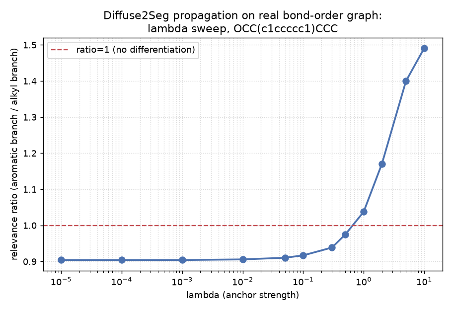

# QM/MM region utilities

Every QM/MM experiment in this repo (issue #283) needs the same three
pieces: pick which atoms are "QM", cut a valid molecule out of them, and
optionally weight that choice by something better than a fixed radius.
`scripts/qmmm/` collects the parts that survived testing, so new
experiments import them instead of re-deriving the same two real bugs.

## Step 1: partition a QM region around a reactive bond

```python
from rdkit import Chem
from qmmm.region import partition_qm_mm_region

mol = Chem.AddHs(Chem.MolFromSmiles("OCCCCCC"))
qm_atoms, boundary_pairs = partition_qm_mm_region(mol, {0, 1}, radius=2)
```

`partition_qm_mm_region` walks outward from the seed heavy atoms (here,
the O-C1 reactive bond) in heavy-atom hops. Hydrogens are added
afterward, always following their own heavy atom -- never independently
walked, since that spuriously cuts a terminal C-H bond and leaves an
empty MM fragment. Any boundary bond that would cut into an aromatic
ring pulls the whole ring into the QM region first: cutting a lone
aromatic atom out of its ring produces an invalid molecule once capped
with hydrogen.

## Step 2: turn the region into a real molecule

```python
from qmmm.region import sliced_geometry

atoms, geom_bohr = sliced_geometry(whole_atomic_numbers, whole_geom_bohr, qm_atoms, boundary_pairs)
```

`sliced_geometry` takes a coordinate SUBSET of one whole-molecule
conformer -- never an independently re-embedded fragment. That
distinction mattered more than it looked: an earlier version of the
region-partitioning experiment re-embedded each fragment separately, and
a classical MMFF94 correction that looked like it fixed the resulting
error was later found to be compensating for that geometry choice, not
for truncation itself (see [QM/MM region partitioning](qmmm_region_partitioning_mmff_correction.md)'s
retraction). Every piece sliced from the SAME conformer removes that
whole failure mode.

## Step 3: weight the region by real bond order instead of radius

```python
from qmmm.propagation import propagate_relevance

relevance = propagate_relevance(bond_order_matrix, seed_idx=[0, 1], n_nodes=n_atoms)
region = set(i for i in range(n_atoms) if relevance[i] > threshold)
```

`propagate_relevance` is Algorithm 1 of Hümmer, Sicking, Hüger &
Gottschalk 2026 ("Diffuse2Seg", arXiv:2609.06491) -- non-linear
p-Laplacian graph propagation, solved by Gauss-Jacobi iteration,
originally built to spread point prompts through a diffusion model's
self-attention for image segmentation. Here the "affinity" is real
Mayer/Wiberg bond order between atoms instead of self-attention between
image patches: a stronger bond lets relevance travel further before the
edge-preserving smoothing throttles it, so a molecule's own aromatic
rings and conjugated systems (which fixed-radius BFS cannot see) can
shape the QM region.

## Measured, not assumed



At the paper's own `lam=1e-5` -- calibrated for a dense grid of prompts
later merged together, not a single isolated seed -- the aromatic branch
of a real branched/aromatic molecule (`OCC(c1ccccc1)CCC`) gets slightly
LESS relevance than its alkyl branch (ratio 0.90), the opposite of the
naive expectation that a stronger bond (1.412 aromatic vs. 0.991 alkyl)
should propagate further. The ratio only crosses 1.0 around `lam~0.5-1`,
and only reaches a large aromatic-favoring differentiation (ratio 1.49)
at `lam=10`, two orders of magnitude above the paper's calibrated value.
`lam` is not retuned to whatever value looks best -- the full sweep is
reported so the real, measured lam-dependence is visible, not hidden.

## Details

**A real implementation bug, found and fixed only by reading the actual
paper**: earlier scripts in this repo
(`qmmm_bond_order_partition_vs_radius.py`,
`qmmm_bond_order_aromatic_vs_alkyl_branch.py`) called their propagation
mechanism "Diffuse2Seg-inspired" and reported a 40-70% relevance
difference between the aromatic and alkyl branches -- using a
max-product-with-decay heuristic invented without having read the paper.
That number does not reproduce with the real algorithm above at the
paper's own hyperparameters; see the sweep table.

**A real numerical bug, found and fixed by working out the exact limit**:
the p-Laplacian weight formula has a term that diverges as a node's
local affinity-neighborhood becomes exactly uniform (`g_i -> 0`). An
earlier version clamped this with an epsilon -- the same category of
shortcut already rejected for degenerate eigenvalues elsewhere in this
project (`dense_evolution.physics.spectral`, Kato's divided-difference
formula). Worked out directly: as `g_i -> 0`, every affinity-connected
neighbor already equals the node's own value, so the smoothing term's
correct limit is simply "leave this node unchanged" -- implemented as an
explicit special case, not an epsilon.

**Full lambda sweep** (`OCC(c1ccccc1)CCC`, aromatic-branch vs.
alkyl-branch relevance at the same hop distance):

| lambda | aromatic | alkyl | ratio |
|---|---|---|---|
| 1e-5 | 0.045021 | 0.049805 | 0.9040 |
| 1e-4 | 0.045017 | 0.049800 | 0.9040 |
| 1e-3 | 0.044978 | 0.049746 | 0.9041 |
| 1e-2 | 0.044585 | 0.049220 | 0.9058 |
| 0.05 | 0.042255 | 0.046416 | 0.9104 |
| 0.1 | 0.039752 | 0.043356 | 0.9169 |
| 0.3 | 0.030731 | 0.032738 | 0.9387 |
| 0.5 | 0.026192 | 0.026857 | 0.9753 |
| 1.0 | 0.017166 | 0.016544 | 1.0376 |
| 2.0 | 0.010421 | 0.008904 | 1.1703 |
| 5.0 | 0.005443 | 0.003889 | 1.3997 |
| 10.0 | 0.002545 | 0.001707 | 1.4907 |

Not included in `scripts/qmmm/`, both real negative results with the
full record in [QM/MM bond order and electrostatic embedding](qmmm_bond_order_and_embedding.md):
the MMFF94 ONIOM-style correction (retracted -- it was a geometry
artifact) and electrostatic embedding (five real attempts, all worse
than no embedding).

**Status**: not promoted to Dense-Evolution -- RDKit is not a
Dense-Evolution dependency, and this is classical graph/geometry
preprocessing (not JAX, not differentiable), a different category from
`dense_evolution.native_hf`. Validated on two molecules
(1-hexanol, `OCC(c1ccccc1)CCC`) for partitioning/slicing; the propagation
function's real behavior is measured (above) but not yet shown to
improve an actual reaction-energy comparison over fixed-radius BFS.

**Scripts**: `scripts/qmmm/region.py`, `scripts/qmmm/propagation.py`,
`scripts/qmmm_diffuse2seg_propagation_lambda_sweep.py` (the sweep above).
