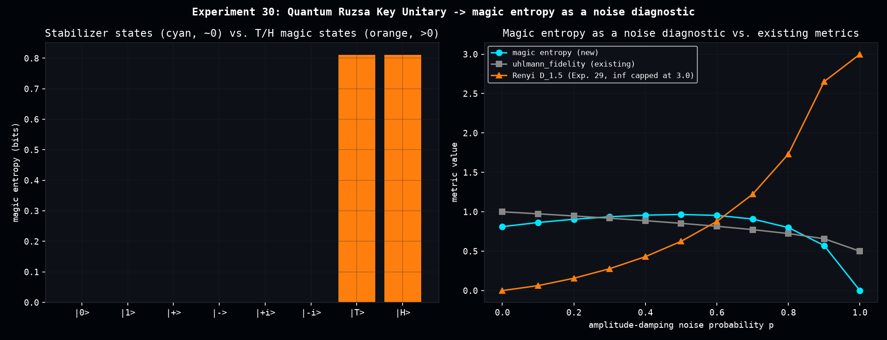

# Quantum Ruzsa Key Unitary -> Magic Entropy as a Noise Diagnostic

A "Quantum Ruzsa Divergence" for `dense_evolution` was proposed as a pairwise convolution `rho \boxtimes sigma` parametrized by `s,t` with `s^2+t^2 = 1 mod d`, following Bu, Gu, Jaffe (arXiv:2401.14385). That equation has **no solution for qubits** (`d=2` -- confirmed by reading the paper directly). The companion paper (arXiv:2306.09292, "Stabilizer testing and magic entropy") does not patch this gap with a qubit-specific pairwise formula; it replaces the pairwise convolution with a structurally different object entirely.

## What the paper actually defines (Def. 7-8, p.6)

The "Key Unitary" needs **K quantum registers with K odd, K >= 3** -- there is no `K=2` case. Two layers of CNOTs across the registers:

1. Fan register 1's value into every other register: `CNOT(1->i)` for `i=2..K`.
2. XOR every register back into register 1: `CNOT(j->1)` for `j=2..K`.

On computational basis states this gives (Lemma 9, verified against our implementation basis-state by basis-state): `V|x1 x2 x3> = |x1+x2+x3> (x) |x2+x1> (x) |x3+x1>` (mod 2). The convolution is `boxtimes_K(rho_1,...,rho_K) = Tr_{2..K}[V(rho_1 (x) ... (x) rho_K)V^dagger]`, keeping only register 1.

For qubits the smallest valid `K` is 3, and there is no pairwise `rho boxtimes sigma` -- only a minimum **3-fold self-convolution** `boxtimes_3(psi,psi,psi)` of one state with itself. The paper calls the entropy of that reduced output register "magic entropy": zero for stabilizer states, positive for non-stabilizer ("magic") states.

**So "a Ruzsa divergence between two qubit states" is not implementable correctly, because no correct definition of it exists in either source paper.** The real, well-defined qubit object is different: a single-state magic monotone, not a two-state divergence.

## What we built instead

- `KEY_UNITARY_K3`: the real 8x8 unitary for K=3, n=1-qubit registers, built directly from the CNOT circuit in Definition 7 (not a shortcut formula) and verified basis-state by basis-state against the paper's own Lemma 9 identity.
- `magic_entropy(rho)`: von Neumann entropy of the reduced output register after 3-fold self-convolution.

Validated against the paper's own claim: all six single-qubit stabilizer states (`|0>`, `|1>`, `|+>`, `|->`, `|+i>`, `|-i>`) give magic entropy `~0` (max `4e-11`, floating-point noise); the two standard single-qubit magic states, `|T>` and `|H>`, both give `0.811` bits.

[](assets/quantum_ruzsa_magic_entropy/quantum_ruzsa_magic_entropy.png)

## Using it as a noise diagnostic (and a wrong first guess, corrected)

The first hypothesis was that magic entropy should decay to 0 under any noise channel, since noise "washes out" quantum resources. Testing on a `|T>` state under **depolarizing** noise proved that wrong: at full depolarization (`p=1`) the state is `I/2`, which is maximally *mixed* but not a pure stabilizer state -- and `magic_entropy(I/2) = 1` (its own intrinsic entropy), not 0. Verified directly: depolarizing drives magic entropy monotonically up to 1 and it stays there.

**Amplitude damping tells a different, more informative story.** Its `p=1` fixed point is the pure state `|0>`, which *is* a stabilizer state -- so magic entropy rises to a peak around `p=0.5-0.6` and then falls all the way back to exactly 0 by `p=1`. Compared side by side with the two diagnostics this repo already has, on the same `|T>`-state amplitude-damping sweep:

- **`uhlmann_fidelity`** (existing) decreases smoothly and monotonically toward its own floor.
- **Sandwiched Renyi divergence** (Experiment 29, alpha=1.5) increases monotonically and **diverges to `+inf`** at `p=1` -- a genuine support-mismatch case, exactly the behavior Experiment 29's fix was built to produce correctly.
- **Magic entropy** (this experiment) is the only one of the three that is *non-monotonic*: it rises then returns to exactly 0.

None of these three curves is a simple rescaling of another -- they capture genuinely different information about how the state degrades.

## Status

`magic_entropy` is implemented and validated in `scripts/quantum_ruzsa_magic_entropy.py`, not yet promoted to `dense_evolution`. Two things worth resolving before promotion: (a) whether the non-monotonic amplitude-damping shape is a generally useful early-warning signal (e.g. distinguishing "still recoverable" from "past the point of no return") or just a curiosity of this one channel, and (b) the connection to Classical Shadows raised separately (shadow-based magic estimation) is still open.

## Reproduce

```bash
python scripts/quantum_ruzsa_magic_entropy.py
```

Produces `data/quantum_ruzsa_magic_entropy_states.csv`, `data/quantum_ruzsa_magic_entropy_noise_sweep.csv`.
