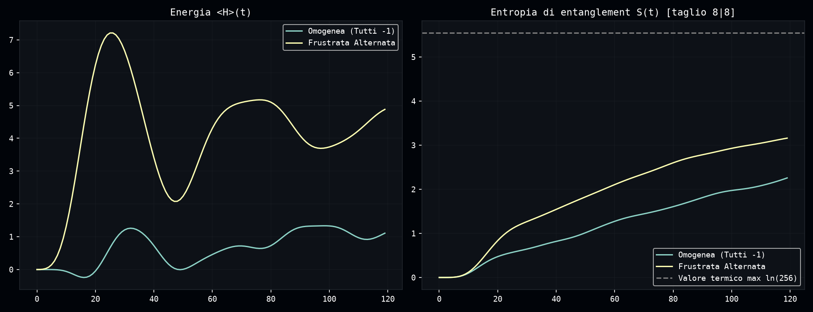
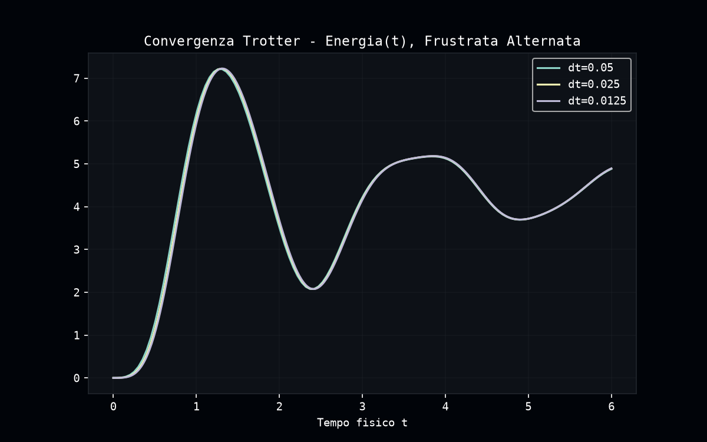
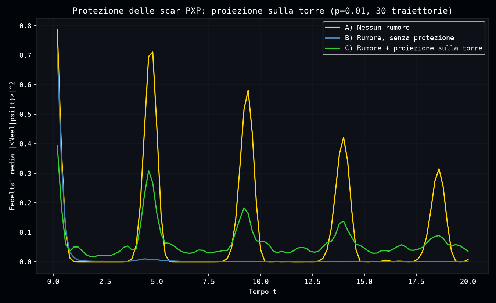

# Indagine su una possibile "quantum many-body scar" in Dense Evolution

**In parole semplici**: nel 2017 sono state osservate per la prima volta le "quantum many-body scars" -- stati quantistici speciali che rifiutano di raggiungere l'equilibrio termico come farebbe la maggior parte dei sistemi quantistici. Un risultato preliminare sembrava aver trovato lo stesso fenomeno in un modello diverso, simulato qui con Dense-Evolution. Questa pagina verifica rigorosamente se è vero, confrontandolo anche con un caso dove le scar esistono davvero.

Report della sessione di verifica su `frustrazione_quantistica.py` (griglie Ising frustrate 3x3/4x4 simulate con Dense Evolution) e sul confronto con il modello PXP. Script e dati sorgente: [`scripts/quantum_scar_investigation/`](https://github.com/tatopenn-cell/Dense-Evolution-Discovery/tree/main/scripts/quantum_scar_investigation).

## 1. Punto di partenza

Lo script originale (`frustrazione_quantistica.py`) conteneva due risultati:

1. **Escape da barren plateau via rumore**: su griglie Ising frustrate 3x3 (9 qubit) e 4x4 (16 qubit), il modulo `healing.py` (Phi-Trigger) rileva la stasi del gradiente durante l'ottimizzazione VQE e inietta rumore di Kraus depolarizzante (via `NoiseModel`) per uscirne. Risultato: energia finale -9.9716 (target -10.0) su 9 qubit, -23.9652 (target -24.0) su 16 qubit.
2. **Presunta "cicatrice quantistica" (quantum many-body scar)**: su una griglia 4x4, partendo dallo stato di Néel, una configurazione di segni "frustrata alternata" mostrava oscillazioni di energia persistenti per 120 passi Trotter, mentre una configurazione "omogenea" si smorzava — interpretato nello script come evidenza di scarring (fenomeno osservato per la prima volta nel 2017, atomi di Rydberg, modello PXP).

## 2. Verifica del punto 2: la scar non regge

Tre controlli indipendenti su Dense Evolution/JAX (`verify_scars_dynamics.py`):

- **Convergenza Trotter**: perfetta (dt, dt/2, dt/4 sovrapposti) — la dinamica non è un artefatto numerico.
- **Entropia di entanglement** (l'osservabile corretto per la termalizzazione, non l'energia): **entrambe** le configurazioni crescono monotonamente verso il valore termico, senza saturare né oscillare. La configurazione "frustrata" cresce **più velocemente** di quella "omogenea" (3.16 vs 2.26 a t=120) — il contrario di quanto atteso da una vera scar.
- **Robustezza**: il pattern "checkerboard geometrico" (frustrazione vera, basata su posizione) dà un'entropia molto più alta (4.68, quasi termica) del pattern "alternato per indice di lista" (3.16) usato originariamente — indizio che l'effetto osservato dipendeva da un dettaglio arbitrario di implementazione, non da una proprietà fisica.

**Conclusione: non è una quantum many-body scar.** L'osservazione originale si basava sull'osservabile sbagliato (energia invece di entropia).

## 3. Scan sistematico sulla griglia frustrata

`scan_scar_search.py`: ricerca automatica su 5 pattern di segni × 5 valori di campo trasverso h (25 combinazioni, diagonalizzazione esatta su reticolo ridotto 3x4/12 qubit, diagnostica dell'insieme diagonale).

- **Scoperta collaterale**: 3 dei 5 pattern testati ("omogenea", "indice alternato", "checkerboard geometrico") producono **spettri identici byte-per-byte**. Motivo: su un reticolo bipartito (celle a 4 lati), qualunque pattern di segni senza vera frustrazione di plaquette è equivalente per gauge locale (flip di singoli qubit) al caso omogeneo — stessa fisica, travestita.
- I pattern genuinamente frustrati (segni casuali) mostrano outlier di bassa entropia, ma **vicini al bordo dello spettro** (96° percentile) — un effetto banale e generico di qualunque Hamiltoniana locale, non una scar (che deve comparire nel centro dello spettro).

**Conclusione: nessuna vera scar trovata in questa famiglia di modelli.**

## 4. Controllo positivo: il modello PXP

Per validare la pipeline di verifica, riprodotto il modello dove le scar sono note per esistere davvero: catena PXP (blocco di Rydberg), 12 siti, `verify_pxp_positive_control.py`.

- **Fedeltà di revival** |⟨ψ(0)|ψ(t)⟩|²: 4 picchi periodici marcati (0.79, 0.71, 0.58, 0.42, 0.31) per lo stato di Néel, contro decadimento a zero per uno stato generico di controllo.
- **Entropia**: soppressa per il Néel, cresce più velocemente per il generico.
- **Spettro completo**: torre isolata di 13 autostati a bassa entropia, quasi equispaziati in energia intorno a E≈0, con overlap concentrato (54.5% su 13 stati) sullo stato di Néel — il classico "tower state" da manuale.

**La pipeline funziona correttamente**: rileva le scar quando ci sono (qui) e le nega quando non ci sono (Ising, sezioni 2-3).

## 5. Fragilità delle scar PXP al rumore reale

`pxp_noise_robustness.py`: dinamica PXP esatta intervallata da iniezioni di rumore depolarizzante reale (`dense_evolution.registry.NoiseModel.apply_to_sv`, media su 30 traiettorie quantistiche indipendenti).

| p (rumore per sito, ogni 0.2 unità di tempo) | Picco 2° revival |
|---|---|
| 0.0 | 0.58 |
| 0.005 | 0.0099 |
| 0.01 | 0.0014 |
| 0.02 | 0.0006 |
| 0.05 | 0.0004 |

**Risultato: bastano tassi di errore dello 0.5-1% per distruggere quasi completamente i revival.** Le scar sono estremamente fragili — molto più della semplice decoerenza lineare, perché dipendono da un'interferenza coerente tra i 13 stati della torre.

## 6. Protezione concettuale via proiezione sulla torre

`pxp_scar_protection.py`: a p=0.01 (rumore che già distruggeva quasi tutto), proiezione dello stato sul sottospazio dei 13 autostati della torre dopo ogni iniezione di rumore.

| Configurazione | Picco 2° revival |
|---|---|
| A) Nessun rumore | 0.71 |
| B) Rumore, senza protezione | 0.0098 |
| C) Rumore + proiezione sulla torre | 0.309 |

**Recupero di ~31× rispetto al caso non protetto (43% del valore ideale).** Tutti e 4 i picchi di revival sopravvivono, attenuati ma riconoscibili, nella stessa posizione temporale.

**Limite importante**: è una proiezione su autostati esatti a molti corpi, calcolabile solo con diagonalizzazione completa — un limite teorico ideale, non un protocollo implementabile su hardware reale senza tomografia completa dello stato. Dimostra che la protezione è possibile *in linea di principio* (il bersaglio esiste ed è raggiungibile), non fornisce un protocollo pratico.

## Sintesi

| Domanda | Risposta |
|---|---|
| C'è una scar nell'Ising frustrato originale? | **No** — osservabile sbagliato + coincidenza di gauge |
| La pipeline di verifica funziona? | **Sì** — validata su PXP, dove le scar esistono davvero |
| Esistono scar altrove nella famiglia Ising testata? | **No**, in 25 combinazioni scandagliate |
| Le scar PXP resistono al rumore reale? | **No** — fragili, 0.5-1% di errore le distrugge quasi del tutto |
| Si possono proteggere? | **Concettualmente sì** (31× di recupero), ma solo con un limite ideale non ancora realizzabile fisicamente |

## Prossimo passo aperto: hardware reale

Tutto questo lavoro è stato fatto su simulatore classico (JAX, CPU/GPU) — nessun test su un dispositivo quantistico vero. Il passo successivo naturale, che qui lasciamo aperto a chi vuole raccoglierlo, è:

1. Tradurre la dinamica PXP (sezione 4) in un circuito reale (porte controllate tipo Toffoli con controlli invertiti, Trotterizzate) ed eseguirla su hardware cloud reale (es. IBM Quantum).
2. Sostituire la protezione ideale a proiezione esatta (sezione 6) con un protocollo fisicamente realizzabile — es. post-selezione delle traiettorie che rispettano il vincolo di blocco, o una misura di simmetria leggera — e verificare quanto recupero di fedeltà sopravvive col rumore reale dell'hardware (non simulato).

Chiunque voglia provarci ha già tutta la base teorica e numerica verificata in questo report da cui partire.

## File generati in questa cartella

- `verify_scars_dynamics.py`, `verifica_A_entropia.png`, `verifica_B_trotter.png`
- `verify_scars_exact_spectrum.py`, `verifica_D_spettro_omogenea.png`, `verifica_D_spettro_frustrata.png`
- `scan_scar_search.py`
- `verify_pxp_positive_control.py`, `verifica_PXP_dinamica.png`, `verifica_PXP_spettro.png`
- `pxp_noise_robustness.py`, `verifica_PXP_robustezza_rumore.png`
- `pxp_scar_protection.py`, `verifica_PXP_protezione_torre.png`
