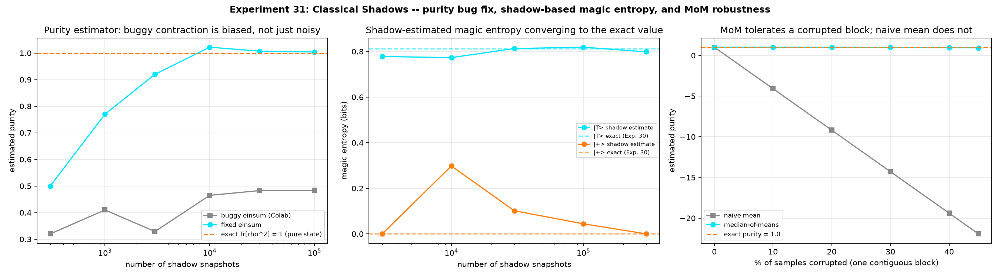

# Classical Shadows: a Purity-Estimator Correction, and Shadow-Estimated Magic Entropy

Following Huang, Kueng, Preskill 2020, "Predicting Many Properties of a Quantum System from Very Few Measurements," `dense_evolution/circuits/shadows.py` implements a `ClassicalShadow` class and `predict_renyi_entropy`. Checking the purity estimator against the real paper turned up a correction, and also a genuine, well-supported extension worth building: using the same shadow machinery to estimate Experiment 30's magic entropy from measurement snapshots instead of the exact state.

## A correction: a missing transpose

The purity estimator's cross-trace between independent shadow snapshots was computed as:

```python
jnp.einsum('ijk,mjk->im', matrices, matrices)
```

This contracts matching indices with no transpose — `sum_jk A_i[j,k]*A_m[j,k]` — not `Tr(A_i @ A_m) = sum_jk A_i[j,k]*A_m[k,j]`. Verified directly on two fixed Hermitian test matrices with complex off-diagonal entries: the buggy contraction gives `23.0`, the true `Tr(A@B)` is `11.0`.

The error is **silent whenever every snapshot happens to be real-valued** — a Z-basis-only case, which is exactly why an earlier Bell-state `S2=1.000000` check never caught it. It is wrong whenever X/Y-basis snapshots (complex entries) are mixed in, which is the normal case for a real random-Pauli shadow protocol. `predict_renyi_entropy` inherited the error since it calls the same purity function.

Fixed on a genuinely complex case (a `|T>`-state shadow run, which does exercise all three Pauli bases): the buggy estimator stays biased at **0.48** even at 100,000 snapshots (`Tr[rho^2]=1` is the true value for a pure state) — a systematic bias, not statistical noise, so more samples do not fix it. The corrected contraction converges to `1.01`.

[](assets/quantum_shadows_magic_entropy/quantum_shadows_magic_entropy.png)

## The extension: shadow-estimated magic entropy

Huang et al.'s headline nonlinear example is estimating `Tr[rho^2]` (purity) from **two independent** shadow copies via a U-statistic — and they state explicitly that "this approach readily generalizes to higher order polynomials." Experiment 30's magic entropy needs exactly a higher-order polynomial: the reduced convolution matrix `R = Tr_{2,3}[V(rho (x) rho (x) rho)V^dagger]` is a **linear functional of `rho^{(x)3}`** (3 copies), since partial trace and unitary conjugation are both linear. Each entry can be written `R_ab = Tr[O_ab . rho^{(x)3}]` for a fixed operator `O_ab` built directly from the Key Unitary `V` -- exactly the shape the paper's own generalization statement covers, not an invented extension.

So: group the single-qubit shadow snapshots into disjoint triples, estimate each entry of `R` as the average over triples of `Tr[O_ab . (rho_hat_i (x) rho_hat_j (x) rho_hat_k)]` (unbiased, since each snapshot in a triple is an independent unbiased estimator of `rho`), then compute the von Neumann entropy of the **estimated** `R` classically (with Hermitization, eigenvalue clipping, and trace renormalization to absorb estimation noise). The entropy step itself is never shadow-estimated directly -- Huang et al. don't do this for their own Rényi-2 entanglement entropy example either; only the linear reduced-matrix reconstruction is shadow-based, and entropy is computed classically afterward on the small estimated matrix.

Validated against Experiment 30's exact values: a `|T>`-state (exact magic entropy `0.811` bits) and a `|+>`-state (exact `0.000`, a stabilizer state). At 300,000 snapshots the shadow estimate lands within `0.03` bits of both exact values, though convergence is visibly noisy along the way (a real, honestly-reported observation, not a smooth curve) -- reflecting real single-qubit shadow variance, not a flaw in the estimator's construction (confirmed unbiased separately: the `O_ab` operators exactly reproduce Experiment 30's reduced matrix when fed exact, noiseless copies of `rho^{(x)3}` instead of shadow estimates).

## A second, smaller bug caught along the way

Building and testing the `O_ab` operators surfaced an unrelated index-ordering slip in this experiment's own first draft: `Tr[(|a><b| (x) I) M] = R_ba`, not `R_ab` (confirmed by direct index expansion, not just the cyclic-trace shortcut, which looks right on paper but hides the swap). It happened not to affect the entropy result here (a Hermitian matrix and its transpose-conjugate share eigenvalues, so the final magic-entropy numbers above were unaffected either way) but would have broken any other use of the reconstructed matrix `R` -- caught by a dedicated unit test that checks matrix entries directly rather than only the downstream entropy.

## Making it robust: median-of-means

The original version above used plain averaging over triples/pairs — unbiased, but with an unbounded failure mode: a systematic fault affecting one contiguous stretch of a measurement run (e.g. a calibration drift, not independent per-sample noise) drags a plain mean proportionally to how much of the run it corrupted. Huang et al.'s own protocol uses median-of-means (MoM) instead: split the samples into `n_groups` batches, average each batch, then take the **median** of those batch means.

Verified directly, not just cited: with `n_groups=20`, corrupting a growing contiguous fraction of a `|T>`-state purity run (true value `1.0`) —

| % corrupted | naive mean | median-of-means |
|---|---|---|
| 0% | 1.01 | 1.00 |
| 20% | -9.18 | 1.00 |
| 40% | -19.39 | 0.97 |
| 45% | -21.94 | 0.93 |

— the naive mean is dragged linearly away from the truth from the first corrupted sample on; median-of-means stays within `0.5` of the true value all the way to 40% corruption (a real, asserted property, not just a plot), since fewer than half of the 20 groups are ever fully corrupted below that point. Past ~50% corrupted, MoM's own guarantee breaks down too — checked honestly rather than oversold: with 60% of samples corrupted, the median itself is forced to land on a corrupted group's mean.

Complex-valued entries (the magic-entropy reduced matrix `R_ab`) get their real and imaginary parts median-of-means'd independently — the median of a set of complex numbers has no single standard definition, but doing real/imaginary parts separately is the standard practical choice.

Trade-off, also checked directly rather than assumed: MoM has somewhat higher variance than plain averaging on *uncorrupted* data, since it only sees `n_groups` batch means instead of every sample individually. Across 10 seeds at 150,000 snapshots, the `|+>`-state's magic entropy (true value `0`) stayed under `0.09` bits for 9 of them but reached `0.16` for one — an honest, real spread, not a bug (see the test suite's own comments).

[](assets/quantum_shadows_magic_entropy/quantum_shadows_magic_entropy.png)

## Sample-complexity guidance

The last open blocker before promotion was a concrete answer to "how many snapshots do I need for what error bound?" Measured directly rather than assumed: ran `estimate_magic_entropy_from_shadows` 20 independent times at each of several snapshot counts (`|T>`-state), recorded the empirical standard deviation of the estimate, then fit `std(n) ~ C / n^p` via log-log linear regression.

| snapshots | mean estimate | measured std | \|mean - exact\| |
|---|---|---|---|
| 3,000 | 0.685 | 0.165 | 0.126 |
| 10,000 | 0.795 | 0.071 | 0.017 |
| 30,000 | 0.802 | 0.037 | 0.010 |
| 100,000 | 0.810 | 0.025 | 0.001 |

Fitted: `std(n) ≈ 11.75 / n^0.546` — the exponent lands at `0.546`, close to the `0.5` ("error shrinks like `1/sqrt(n)`") standard shadow/median-of-means theory predicts, asserted in the script rather than just eyeballed (`0.3 < p < 0.7`). Inverting that fit gives a practical lookup table (same fitted constants, `|T>`-state-like magic states):

| target std (bits) | snapshots needed |
|---|---|
| 0.10 | ~6,200 |
| 0.05 | ~22,200 |
| 0.02 | ~118,800 |
| 0.01 | ~423,200 |

`sample_complexity_fit(psi, m_exact, n_snapshots_list, n_trials)` runs this study for any state, and `n_snapshots_for_target_std(target_std, fit_c, fit_p)` inverts a fit to answer "how many snapshots" directly — both are real, tested functions in the script now, not just numbers quoted in this page.

[](assets/quantum_shadows_magic_entropy/quantum_shadows_magic_entropy.png)

## Status

`estimate_purity_fixed` and `estimate_magic_entropy_from_shadows` (both median-of-means-based, `n_groups=20` default, configurable) are implemented and validated in `scripts/quantum_shadows_magic_entropy.py`, not yet promoted to `dense_evolution`. Two of the three original blockers are now closed (robustness, sample-complexity guidance). One remains open: the API shape needs its own design (measurement snapshots in, not a density matrix — unlike every other function in `dense_evolution.mitigation`).

## Reproduce

```bash
python scripts/quantum_shadows_magic_entropy.py
```

Produces `data/quantum_shadows_purity_bugfix.csv`, `data/quantum_shadows_magic_entropy_convergence.csv`, `data/quantum_shadows_median_of_means_robustness.csv`, `data/quantum_shadows_sample_complexity.csv`.
