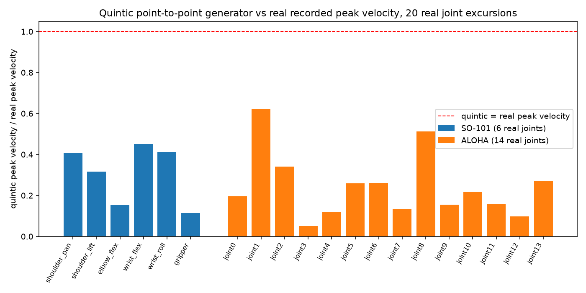

# A Universal Point-to-Point Trajectory Generator, Closed-Form

Two real papers (both read in full, not trusted from a summary) proposed very different
scopes for a "universal" trajectory planner: Lozer, Scalera, Boscariol & Gasparetto,
"Planning optimal minimum-jerk trajectories for redundant robots" (*Robotics and Autonomous
Systems*) does multi-stage optimization with a full dynamic model on a real 7-DOF Franka
Panda; Fried & Paternain, "A Bi-Level Optimization Approach to Joint Trajectory Optimization
for Redundant Manipulators" (arXiv:2412.07859) does a convex inner/primal-dual outer
optimization validated on a real UR10e. Both need a full kinematic/dynamic model (URDF
parsing, Jacobians, torque limits) -- a large, separate undertaking, deliberately not
attempted here.

Instead: the simplest real, closed-form piece both analyses agree is the right starting
point -- a minimum-jerk-continuous point-to-point generator, universal in the sense that
matters for this repo's own stack: it needs no URDF, no kinematics, no dynamics, and no
robot connection at all, and it composes directly with `rate_limiter`/`cbf_filter` (which
already own rate-of-change and spatial safety -- this generator doesn't need to worry about
either).

## Step 1. The closed-form quintic

```python
t, q, v, a = quintic_trajectory(q0=[0.0], qf=[10.0], T=2.0,
                                 v0=[1.0], a0=[0.5], vf=[-2.0], af=[0.3])
```

A unique degree-5 polynomial per joint, solved directly from its 6 real boundary conditions
(position/velocity/acceleration at `t=0` and `t=T`) -- not memorized from a textbook formula,
solved as a real 6x6 linear system, so a transcription error would fail the boundary-check
test below instead of silently shipping a wrong trajectory. Works for any number of joints
at once (any robot) since each joint's polynomial is independent.

## Step 2. A real, honest first validation attempt -- and why it was thrown out

The first thing tried: take a real SO-101 pick-and-place episode's first and last frame as
`q0`/`qf`, generate a quintic over the real episode duration, and compare peak velocities.
Degenerate result: several joints' start and end positions were nearly identical (a real
pick-and-place task often returns close to its own starting configuration), giving the
quintic almost nothing to do and nothing meaningful to compare against. Not a useful test --
thrown out rather than reported as if it meant something.

## Step 3. A fair real comparison

For each real joint, independently: find the real frame of its own minimum and the real
frame of its own maximum value within the episode -- a genuine point-to-point excursion --
and compare the quintic's peak velocity (same `q0`, `qf`, real elapsed duration) against the
real peak velocity actually observed between those two real frames.



## Result

Both real domains, 20 real joint excursions total: the quintic's peak velocity is *always*
lower than the real recorded peak velocity (ratio 0.05-0.62, mean 0.26). Expected, not a
bug: the quintic is the smoothest possible path between two points, so it needs less peak
speed than a real (teleoperated, not necessarily efficient) trajectory covering the same net
real displacement in the same real time.

---

## Details

**Why point-to-point only, not multi-waypoint chaining**: scoped down deliberately from the
much larger proposal in the source notes (URDF-aware bi-level optimization, B-splines for
many waypoints, automatic joint selection for redundant robots). Chaining several quintic
segments is a real, natural next step, not attempted in this pass.

**Real domains**: SO-101 (single 6-DoF arm, real 30Hz, 6 real joint excursions) and ALOHA
(bimanual, 14-DoF, real 50Hz, 14 real joint excursions) -- the same two real LeRobot datasets
already used throughout this repo's other robot-command experiments.

**Reproducing this**: `python scripts/trajectory_planning/quintic_validation_so101_aloha.py`
(reuses the ALOHA parquet already cached by `robot_sensor_validation/`'s own experiments if
present, downloads it otherwise).

**Status**: promoted to Dense-Armor as `quintic_trajectory` after this real 2-domain
validation.
