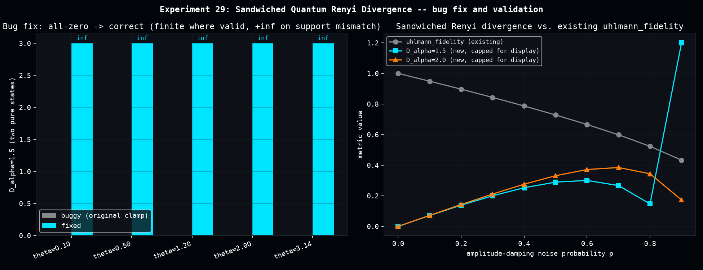

# Sandwiched Quantum Rényi Divergence for Density-Matrix Diagnostics

A Colab session read Müller-Lennert et al. ("On quantum Rényi entropies: a new generalization and some applications", arXiv:1306.3142) and proposed adding the Sandwiched Quantum Rényi Divergence to `dense_evolution` as a noise/state-distance diagnostic. Two problems were already found with the original proposal in an earlier evaluation pass: a real implementation bug, and a disproven original use case (replacing the JSD-based truncation criterion in `mps.py`'s bond-dimension search -- the Colab's own benchmarking showed Rényi and JSD induce the exact same truncation ordering on that diagonal singular-value spectrum, since `rho` and `sigma` commute there and there's nothing for a non-commuting-aware divergence to add).

This page fixes and validates the divergence itself for the case where it *does* have something to add: full density-matrix diagnostics, where states genuinely don't commute.

## Bug 1: the clamp that zeroed the signal

The formula (Definition 13 of the paper): `D_α(ρ‖σ) := 1/(α−1) · log Tr[(σ^e ρ σ^e)^α]`, `e = (1-α)/(2α)`.

The original code computed the inner trace correctly, then clamped it: `tr_inner = jnp.maximum(tr_inner, 1.0)`. Since a sub-1 trace is the *normal* case for non-commuting states, this silently forced `log2(1) = 0` for the majority of real inputs -- confirmed directly in the Colab's own printed output: `alpha=1.5` gave exactly `0.000000` for every rotation angle in a sweep, including a large rotation where a real divergence should have been substantial.

**Fix:** floor at a small numerical epsilon (to avoid `log2(0)`), not at 1.0.

## Bug 2: infinite divergence mishandled as a wrong-signed finite number

Fixing bug 1 alone was not enough. For `α > 1`, the sandwiched Rényi divergence is only finite when `supp(ρ) ⊆ supp(σ)` -- exactly analogous to the classical relative entropy diverging to `+∞` outside full support overlap. Two different pure states (both rank-1) generically violate this: verified by hand that `Tr[Q^1.5] = 0.6759`, matching the closed-form prediction `(|⟨σ|ρ⟩|²)^α` exactly, and plugging that into the naive formula gives a **finite negative** divergence (`-1.13`) -- worse than the original bug's silent zero, since it's a wrong-signed answer that looks plausible instead of visibly broken.

**Fix:** detect `tr_inner < 1` at `α > 1` and return `+∞`, matching the standard convention for quantum divergences under support mismatch. Verified this branch does *not* fire spuriously for `α < 1`, where sub-1 traces are the ordinary, always-finite case (confirmed against the classical Rényi formula below).

## Validation against three independent references

- **α→1 limit** matches an independent numpy computation of `Tr[ρ(log ρ − log σ)]` to 4 decimal places (0.234028 both ways), on states specifically chosen to be full-rank (avoiding a separate, legitimate edge case: exactly-singular density matrices make `scipy.linalg.logm` itself raise `LogmExactlySingularWarning`, an inherent ill-conditioning of relative entropy near degenerate support, not an implementation bug).
- **Commuting/diagonal case** reproduces the classical Rényi divergence formula `D_α(p‖q) = 1/(α−1) log Σ pᵢ^α qᵢ^(1−α)` exactly, at α = 0.7, 1.5, 2.0, 3.0.
- **Two different pure states** at α > 1 correctly give `+∞` (support mismatch), not a finite number of either sign.

[](assets/sandwiched_renyi_density_matrix/sandwiched_renyi_density_matrix.png)

## Comparison against the existing `uhlmann_fidelity` metric

On a Bell state degraded by amplitude damping, the fixed divergence tracks `uhlmann_fidelity`'s noise sensitivity in the well-behaved (mid-noise) regime, and correctly diverges to `+∞` at high noise (`p=0.9`, α=1.5) as the damped state approaches a support boundary relative to the ideal state -- the mathematically expected behavior, not a bug. One open observation, reported honestly rather than smoothed over: the α=1.5 curve dips between p=0.5 and p=0.7 before jumping to infinity. No theorem in Müller-Lennert et al. requires monotonicity along an arbitrary one-parameter noise sweep (the data-processing inequality governs a fixed channel applied to both states, not a channel-parameter scan on one of them), so this isn't necessarily wrong -- just not yet fully explained.

## Status

The clamp bug and the infinity-handling bug are both fixed and validated in `scripts/sandwiched_renyi_density_matrix.py`. Not yet promoted to `dense_evolution` -- pending a decision on the right integration point (likely alongside `zne_density_matrix`/`uhlmann_fidelity` in `dense_evolution.mitigation` as an additional, α-tunable distance metric for density-matrix ZNE diagnostics).

## Reproduce

```bash
python scripts/sandwiched_renyi_density_matrix.py
```

Produces `data/sandwiched_renyi_bugfix_confirmation.csv`, `data/sandwiched_renyi_noise_scaling.csv`, `data/sandwiched_renyi_vs_uhlmann_fidelity.csv`.
