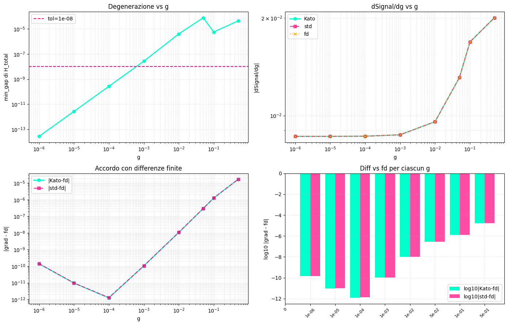

# Gauge-safe spectral-function gradients at exact eigenvalue degeneracy

A Hermitian matrix `H` has real eigenvalues `lambda` and orthonormal
eigenvectors `V`. Many physics quantities are built from `H` through its
eigendecomposition, e.g. time evolution `exp(-iHt) = V exp(-i*lambda*t) V^dagger`.
When two eigenvalues happen to be exactly equal ("degenerate"), the pair
of eigenvectors spanning that subspace is not unique -- any orthonormal
basis of the subspace is an equally valid answer. `jnp.linalg.eigh`
still returns a correct value in that case, but its *gradient* silently
breaks: differentiating divides by `lambda_i - lambda_j`, which is zero
for a degenerate pair. This gives a finite, wrong number, not an error.

## Step 1: build a Hamiltonian with an exact degeneracy

```python
import jax.numpy as jnp

H0 = jnp.diag(jnp.array([1.0, 1.0, 2.0, 2.0], dtype=jnp.complex128))
```

`H0` has two exact ties: the first pair of eigenvalues is `1.0`, the
second pair is `2.0`.

## Step 2: check for the problem before it bites

```python
from dense_evolution.physics.spectral import has_exact_degeneracy

is_degenerate = has_exact_degeneracy(H0)
```

`has_exact_degeneracy` is a pure diagnostic: it returns `True` here
because two pairs of eigenvalues are closer than its tolerance. It
changes nothing about `H0` -- it only tells you whether the next step
matters for this particular matrix.

## Step 3: evolve it with a gauge-safe gradient

```python
from dense_evolution.physics.spectral import spectral_evolve

t0 = 1.0
U0 = spectral_evolve(H0, t0)
```

`spectral_evolve(H, t)` returns `exp(-iHt)`, identical to what plain
`jnp.linalg.eigh`-based code would compute. The difference only shows up
under `jax.grad`: `spectral_evolve` uses Kato's divided-difference
formula for the derivative, so `jax.grad` of anything built from `U0`
stays correct even though `H0` is degenerate.

## Step 4: differentiate through it

```python
import jax

A0 = jnp.eye(4, dtype=jnp.complex128)

def loss0(H):
    return jnp.real(jnp.sum(A0 * spectral_evolve(H, t0)))

grad0 = jax.grad(loss0)(H0)
```

`grad0` is the gradient of `loss0` with respect to every entry of `H0`.
Replacing `spectral_evolve` with a plain `jnp.linalg.eigh`-based
`exp(-iHt)` in `loss0` would silently corrupt `grad0` here, since `H0`
is exactly degenerate -- see the measured comparison below.

## Measured, not assumed

| method | gradient error vs. central finite differences (real degenerate `H`, 4 exact pairs) |
|---|---|
| plain `jnp.linalg.eigh` | 0.98 |
| `spectral_evolve` | 4e-10 |



On a real Discovery Hamiltonian (wormhole/SYK teleportation signal,
scanned toward exact degeneracy as coupling `g -> 0`), `spectral_evolve`
and plain `eigh` stay in agreement across the whole scan -- SYK's random
disorder never produces a mathematically exact tie, only a numerically
small one, so plain `eigh`'s gradient doesn't break there. `spectral_evolve`
is validated and correct for the case it targets; it is not automatically
a win for every real physics Hamiltonian.

## Details

**Citations, verified against the source, not assumed**: Kato's
divided-difference formula for matrix function derivatives (Kato,
*Perturbation Theory for Linear Operators*, 1995, Ch. II.5.6), following
Kasim (arXiv:2011.04366, 2020) -- the PDF was downloaded and read
directly; Kasim's Eq. 4.72 (a compatibility condition an earlier,
discarded `custom_vjp`-based attempt needed, which the divided-difference
approach avoids) was confirmed present in the real paper text at that
exact equation number.

**Verification history**: 7/7 checks pass, including a guard test
(`test_std_eigh_fails_at_degeneracy`) that fails loudly if plain `eigh`'s
gradient ever becomes correct at degeneracy -- first checked on the
Colab draft, then re-verified independently on a real Kaggle CPU kernel.
A real bug surfaced only by running the code, not by reading it: the
first draft passed `f`/`f_prime` (Python closures) as ordinary positional
arguments to a `@jax.custom_jvp`-decorated function, which crashes
(`TypeError: ... is not a valid JAX type`) since JAX traces every
positional argument by default -- fixed with `nondiff_argnums=(1, 2)`.

**Usage gotcha**: `spectral_evolve` calls `ensure_x64()` internally, but
that can't retroactively upcast arrays a caller already built in
float32/complex64. A caller building its own Hamiltonian before calling
`spectral_evolve` still needs `jax.config.update("jax_enable_x64", True)`
up front -- omitting it produced a spurious NaN on the first (JIT-tracing)
call in the real Hamiltonian test above.

**Status**: promoted to Dense-Evolution as `dense_evolution.physics.spectral`
(`has_exact_degeneracy`, `matrix_function_eigh`, `spectral_evolve`).

**Scripts**: `scripts/spectral_evolve_kato_degeneracy.py`,
`scripts/kato_syk_wormhole_real_usecase.py`.
