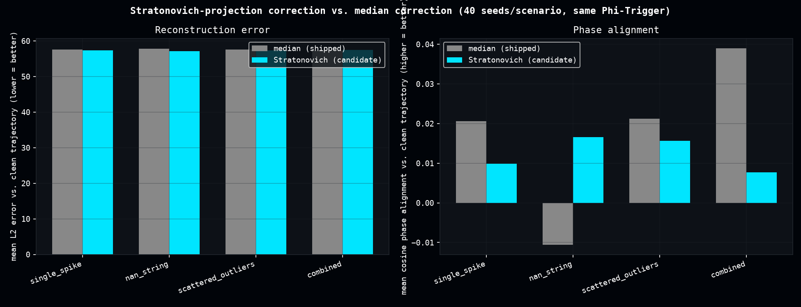

# Stratonovich-Projection Vector Healing

Following Hu & Šverák's "Regularity of a stochastically perturbed Euler-Arnold equation" (arXiv:1510.05279), a variant of `ia_utils.vector_healing.enhanced_dense_healing_hybrid` was proposed, replacing the median-fallback correction step with a "Stratonovich projection" (local-mean baseline plus a damped drift term along the recent finite-difference velocity direction). A single-seed test (seed=42, one spike corruption) reported a dramatic win: cosine phase alignment going from -0.16 to +0.98.

This page is the actual controlled test of that claim.

## On the arXiv:1510.05279 citation

The paper is real (a genuine result in stochastic differential geometry on Lie groups), and its framing -- a "control mechanism" keeping some quantities close to constant while random perturbations induce drift along a constraint surface -- is legitimately quoted from Section 3.3 of the paper. But nothing in this healing code actually implements the paper's math: the paper's Euler-Arnold bracket `q(z,z)` requires a genuine finite-dimensional Lie algebra with known structure constants, and arbitrary hidden-state embedding vectors have no such structure. The `q_force = ipg_vector * norm_A` heuristic used here is not derivable from the paper's formalism -- it is a hand-rolled approximation only loosely inspired by the paper's *shape*, not its content.

## Method

Holding the real production Phi-Trigger (`dense_evolution.mitigation.healing.evaluate_phi_trigger`) fixed and swapping only the correction step isolates the actual claim ("the replacement is better") from a separate question ("the trigger is better"), which the single-seed original test conflated.

4 corruption scenarios (single spike, NaN string, scattered outliers, spike+NaN combined) x 40 seeds each, scored against the known-clean ideal trajectory (trend + IID Gaussian noise) on two metrics: L2 reconstruction error and flattened cosine phase alignment.

## Results

Restricted to exactly the corrupted indices (the original comparison design, bypassing the trigger):

| Scenario | L2 error: median → Stratonovich | Win rate | Wilcoxon p |
|---|---|---|---|
| single_spike | 7.38 → 4.12 (-44%) | 100% | <10⁻¹¹ |
| scattered_outliers | 21.45 → 17.75 | 98% | <10⁻¹⁰ |
| combined | 19.47 → 17.09 | 100% | <10⁻¹¹ |
| nan_string | 18.36 → 19.37 (**worse**) | 0% | <10⁻¹⁰ |

Stratonovich correction beats the shipped median fallback on spike-type corruption, but *loses* on pure NaN-gap corruption. Even in the winning cases, absolute cosine alignment stays deeply negative (-0.72 to -0.04) -- nowhere near the demo's +0.98, which was a favorable artifact of that one seed, not the general behavior.

[](assets/stratonovich_vector_healing/stratonovich_vector_healing.png)

## A separate finding: the trigger over-fires

The shipped production Phi-Trigger fires on 85-90% of *every* trajectory tested -- corrupted or not -- so in the real (non-oracle) pipeline, the correction-step choice barely moves total L2 error, because correction fires almost everywhere rather than selectively at real anomalies. This became its own investigation: see [Healing Trigger False-Positive Audit](healing_trigger_false_positive_audit.md).

## Reproduce

```bash
python scripts/stratonovich_vector_healing.py
```

Produces `data/stratonovich_vector_healing.csv`, `data/stratonovich_vector_healing_summary.csv`.
