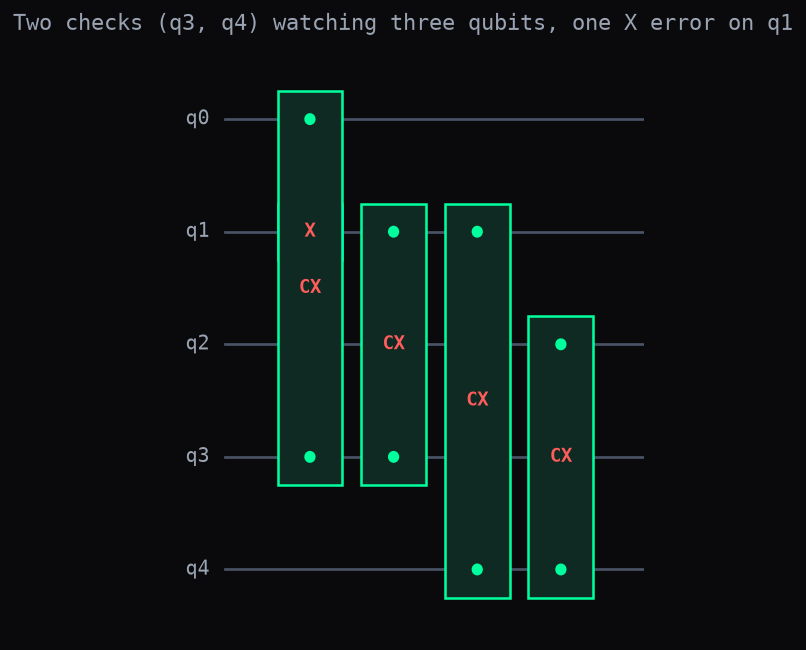
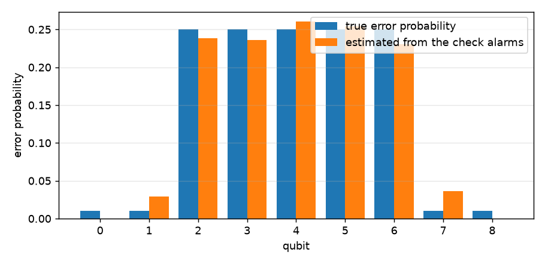

# Finding the Noisy Qubits from the Check Alarms

A quantum computer that protects its data does not look at the data. It looks at a few helper qubits, called **checks**, that ring an alarm when two neighbouring data qubits disagree. The list of which alarms rang in one round is called the **syndrome**. When one corner of the chip becomes noisy, the checks next to it ring more often than the rest. This page shows how to turn "how often did each check ring" into "how noisy is each qubit", and how to give that to a decoder so it guesses better.

## Step 1. One check, one error

A check rings when it sees an error next to it.

```python
import numpy as np
import dense_evolution as de

qasm = 'OPENQASM 2.0; include "qelib1.inc"; qreg q[5]; x q[1]; cx q[0],q[3]; cx q[1],q[3]; cx q[1],q[4]; cx q[2],q[4];'
c = de.QASMParser().parse(qasm)
sv0 = de.DenseSVSimulator(5)
sv0.run_circuit_jit(c.to_tuples())
pr = sv0.get_probabilities()
format(int(np.argmax(pr)), '05b'), float(pr.max())
```

```
('01011', 1.0)
```



Qubits `q0`, `q1`, `q2` hold the data. Qubits `q3` and `q4` are the checks: each `cx` pair copies "are these two data qubits different?" into a check. The `x q[1]` is the error. The answer is read left to right as `q0 q1 q2 q3 q4`: `01011` means `q1` is flipped (the error) and both checks, `q3` and `q4`, rang. Both rang because `q1` sits between them. That pair of alarms, `(1, 1)`, is the syndrome.

## Step 2. Many rounds: how often does each check ring?

If errors keep arriving, each check rings some fraction of the rounds.

```python
import numpy as np
import dense_evolution as de

rng = np.random.default_rng(7)
p = np.array([0.02, 0.3, 0.02])
hist = []
for _ in range(200):
    e = ''.join('X' if r < q else 'I' for r, q in zip(rng.random(3), p))
    hist.append(de.compute_syndrome(e, ['ZZI', 'IZZ']))
hist = np.array(hist, dtype=int)
hist.mean(axis=0)
```

```
[0.255 0.235]
```

Here qubit 1 is the noisy one: it flips in 30% of the rounds, the other two in 2%. `'ZZI'` and `'IZZ'` are the two checks of Step 1 written as Pauli strings, and `compute_syndrome` returns which of them ring for a given error. `hist` holds 200 rounds, one row per round, and the last line is the fraction of rounds in which each check rang: both rang about a quarter of the time. You see the alarms, never the qubits that caused them. The next step goes backwards, from alarms to qubits.

## Step 3. From alarm counts to noisy qubits

`estimate_error_rates_from_syndromes` reads the rounds and returns one error probability per qubit.

```python
import numpy as np
from syndrome_rate_estimator import estimate_error_rates_from_syndromes as est

h = np.array([[1, 1, 0], [0, 1, 1]])
hist = np.array([[1, 1]] * 25 + [[1, 0]] * 5 + [[0, 1]] * 4 + [[0, 0]] * 66)
est(h, hist).round(3)
```

```
[0.136 0.217 0.119]
```

`h` says which qubits each check watches: the first check watches qubits 0 and 1, the second watches qubits 1 and 2. `hist` is 100 rounds written by hand: both checks rang together 25 times, the first alone 5 times, the second alone 4 times, and neither 66 times. Both ringing together points at the qubit they share, qubit 1, and the result agrees: qubit 1 gets the highest probability. With only two checks watching three qubits, the exact values cannot be pinned down; the ranking is what to trust here. Step 4 uses more checks.

## Step 4. A bigger chip, a noisy zone

With more checks, the estimate follows a whole noisy zone.

```python
import numpy as np
from syndrome_rate_estimator import estimate_error_rates_from_syndromes as est

n = 9
h = np.eye(n - 1, n, dtype=int) + np.eye(n - 1, n, 1, dtype=int)
p = np.full(n, 0.01)
p[2:7] = 0.25
e = (np.random.default_rng(3).random((2000, n)) < p).astype(int)
est(h, (e @ h.T) % 2).round(3)
```

```
[0.    0.029 0.238 0.236 0.261 0.255 0.23  0.036 0.   ]
```



Nine qubits in a row, eight checks between neighbours (`h`). A burst makes qubits 2 to 6 noisy (25% per round) while the others stay at 1% (`p`). The line `e @ h.T % 2` is what the checks would have shown over 2000 rounds. The estimate puts 0.23 to 0.26 on the five noisy qubits and at most 0.04 on the rest, which matches the true values in the picture.

## Step 5. Giving the estimate to the decoder

A decoder picks the cheapest explanation for the alarms; telling it which qubits are noisy changes what "cheapest" means.

```python
import numpy as np
import dense_evolution as de
from syndrome_rate_estimator import estimate_error_rates_from_syndromes as est

n = 9
st = [''.join('Z' if j in (i, i + 1) else 'I' for j in range(n)) for i in range(n - 1)]
h = np.array([[c == 'Z' for c in s] for s in st], dtype=int)
p = np.full(n, 0.01)
p[2:7] = 0.25
e = (np.random.default_rng(3).random((2000, n)) < p).astype(int)
w = -np.log(est(h, (e @ h.T) % 2) + 1e-3)
sy = de.compute_syndrome('IIXXXXXII', st)
de.pymatching_decode(sy, st, n), de.pymatching_decode(sy, st, n, weights=w)
```

```
('XXIIIIIXX', 'IIXXXXXII')
```

The actual error is `IIXXXXXII`: five flips inside the noisy zone. The decoder that knows nothing prefers the explanation with the fewest flips, four at the two ends (`XXIIIIIXX`); that is wrong, and applying it flips every qubit, which destroys the stored information. The second decoder receives the weights `w = -log(estimate + 0.001)` (the 0.001 keeps a zero estimate from giving an infinite weight), so a flip on a noisy qubit is cheap and one on a quiet qubit is expensive; it returns `IIXXXXXII`, the true error. `st` lists the eight checks as Pauli strings, `sy` is their alarm pattern, and `pymatching_decode` is the standard matching decoder (it needs `pip install dense-evolution[pymatching]`).

## Details

**Where the function comes from.** It was built in the cosmic-ray burst study ([Cosmic-Ray Bursts: Zone-Weighted Decoding](cosmic_ray_zone_weighted_decoding.md), Step 5), where a decoder had to find the burst zone from the syndromes of the code it was decoding. In that study, on a 5x5 surface code with a strong burst, the estimate halved the failures between 30 and 100 microseconds after impact (47% and 50% fewer failures, against 85% and 71% when the true zone is given); with a moderate burst the gain was 14-16%; when the whole chip was uniformly hot the estimate invented differences between qubits and was up to 14% worse than not using it; windows of 10 rounds were too noisy to help.

**How it is built.** Three pieces, none taken from a paper:

1. For independent errors, a check rings with probability `(1 - prod(1 - 2 p))/2` over the qubits it watches. This is the standard rule for the parity of independent bits.
2. With `a = -ln(1 - 2 p)`, the logarithm of the measured ring frequency, `-ln(1 - 2 f)`, becomes the plain sum of `a` over the qubits of the check: a linear system.
3. The system is solved with non-negative least squares (`scipy.optimize.nnls`). A code has fewer checks than qubits, so a small pull toward the baseline rate (weight `lam = 0.1`, chosen here and not tuned) selects one solution.

**What is checked.** The five code blocks above were run as written. The failure rate on 20000 random rounds of Step 5 is 0.0014 for the blind decoder and 0.0002 with the estimated weights (`scripts/noise_mitigation_validation/syndrome_rate_estimator_figures.py` reproduces it and the two pictures). The tests in `tests/noise_mitigation_validation/test_syndrome_rate_estimator.py` cover uniform and localized noise, an empty history, a history in which every check always rings, all the input errors, and the Step 5 comparison.

**Limits.** It assumes independent errors and one error type at a time (run it once with the matrix that detects X errors and once with the one that detects Z errors). It needs tens of rounds to be stable. With fewer checks than qubits (Step 3) the ranking is reliable and the exact values are not. Its use against cosmic-ray bursts has been simulated only; it has not been compared with `stim`, and a search for earlier work on estimating noise from syndromes has not been made beyond the papers indexed locally.

**Status.** The function lives in `scripts/noise_mitigation_validation/syndrome_rate_estimator.py`. It is not part of the Dense-Evolution library.
