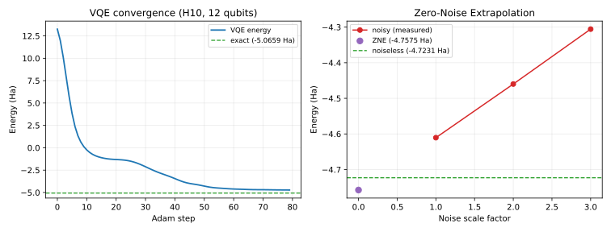

# VQE + Zero-Noise Extrapolation + Autodiff, Without Ever Building a Dense Hamiltonian

**In plain terms**: to find a molecule's ground-state energy on a quantum computer (VQE, Variational Quantum Eigensolver), you need two things at every optimization step: the current energy, and the *gradient* of that energy with respect to your circuit's parameters, so you know which way to adjust them. Getting that gradient automatically (autodiff, via JAX) usually means representing the molecule's Hamiltonian as one giant matrix and multiplying the quantum state by it. That matrix grows as 4 raised to the number of qubits -- by 14 qubits it is already too big to fit in memory on a normal laptop, long before the *quantum state itself* (which only grows as 2 raised to the number of qubits) becomes a problem. This page shows a way around that: keep the Hamiltonian as a sum of small Pauli terms instead of one giant matrix, apply it term-by-term directly to the state, and stay fully differentiable throughout -- combined here with Zero-Noise Extrapolation (ZNE), a real error-mitigation technique, in a single JAX-traced pipeline.



Left: a hardware-efficient ansatz optimized with Adam over 80 steps converges from +13.3 Ha down to -4.72 Ha (exact ground state: -5.07 Ha -- the gap is expected, a shallow 2-layer ansatz is not meant to reach chemical accuracy). Right: the same converged circuit evaluated under three levels of simulated depolarizing noise (40 trajectories each, averaged), Richardson-extrapolated back to an estimated zero-noise energy.

## The wall this avoids

`circuit_to_energy_fn` (this package's differentiable-VQE entry point) computes `energy = <psi| H_dense |psi>` -- `H_dense` has to be an explicit `(2**n, 2**n)` matrix for that `@` to mean anything. At 12 qubits that is 268MB (fine); at 14 qubits it is 4GB (the practical ceiling on an 8GB laptop); at 16 qubits it is 64GB (impossible on any laptop). The quantum *state* itself never has this problem -- a 20-qubit statevector is 16MB, no issue at all. The wall is specifically the **Hamiltonian matrix**, not the state.

## The fix: `PauliSumOperator`

A real molecular Hamiltonian, in its natural form, is already a *sum of Pauli strings* (`0.5 * ZZII + 0.3 * XIXI + ...`), not a dense matrix -- `dense_evolution.pauli_hamiltonian_to_matrix` only builds the dense version because that is what `circuit_to_energy_fn` expected. `PauliSumOperator` wraps that same Pauli-sum representation behind a `__matmul__`, so it drops directly into `circuit_to_energy_fn`'s `h_matrix` argument (its only use of `h_matrix` is `h_matrix @ statevector`) without ever materializing the dense matrix:

```python
import jax
import dense_evolution as de

circuit = de.QASMParser().parse(qasm_string)          # your ansatz
energy_fn, n_params = de.circuit_to_energy_fn(circuit, n_qubits)

terms = [(0.5, {0: 'Z', 1: 'Z'}), (0.3, {0: 'X', 2: 'X'}), ...]   # your Hamiltonian, as Pauli terms
h_op = de.PauliSumOperator(terms, n_qubits)

energy, statevector = energy_fn(theta, h_op)
grad = jax.grad(lambda th: energy_fn(th, h_op)[0])(theta)   # real autodiff, no dense H anywhere
```

Underneath, `PauliSumOperator` calls the new `pauli_sum_matvec_jax` -- a pure-`jnp`, `jax.grad`/`jax.jit`-traceable rewrite of the existing (`numpy`-based, non-differentiable) `pauli_sum_matvec`. Verified to agree with a dense-matrix reference to machine precision (`~1e-15`), both in value and in gradient, before being trusted here.

## Result

| quantity | value |
|---|---|
| exact ground-state energy (dense reference) | -5.0659 Ha |
| VQE, noiseless, converged (80 Adam steps) | -4.7231 Ha |
| noisy, scale=1x (p=0.05, 40-shot average) | -4.6105 +/- 0.2536 Ha |
| noisy, scale=2x (p=0.10, 40-shot average) | -4.4598 +/- 0.4247 Ha |
| noisy, scale=3x (p=0.15, 40-shot average) | -4.3056 +/- 0.5940 Ha |
| Zero-Noise Extrapolation (Richardson, back to VQE energy) | -4.7575 Ha |
| raw (uncorrected) error vs. VQE energy | 0.1126 Ha |
| **ZNE-corrected error vs. VQE energy** | **0.0344 Ha (3.3x smaller)** |

ZNE genuinely helps here: the extrapolated estimate recovers most of what the base-noise measurement lost, using the same `PauliSumOperator`-based energy function throughout -- no separate code path for the noiseless and noisy evaluations.

## Status

Working end-to-end: differentiable VQE via `PauliSumOperator` (promoted to `dense_evolution` as part of this experiment, alongside `pauli_sum_matvec_jax`/`pauli_sum_expectation_jax`), converging on a real molecular Hamiltonian, combined with ZNE error mitigation in the same traced pipeline. Not attempted: an ansatz expressive enough to reach chemical accuracy (this demo intentionally uses a shallow, generic hardware-efficient ansatz, not a chemistry-informed one like UCCSD), and the full 20-qubit H10 system (deferred for a real memory/compile-time constraint on typical development hardware, not a limitation of `PauliSumOperator` itself -- see Details).

## Reproduce

```bash
python scripts/vqe_pauli_sum_zne_autodiff.py
```

Or try it directly in Colab -- no local install needed: [vqe_pauli_sum_zne_autodiff.ipynb](https://colab.research.google.com/github/tatopenn-cell/Dense-Evolution-Discovery/blob/main/notebooks/vqe_pauli_sum_zne_autodiff.ipynb)

---

## Details

**Why 12 qubits, not the full 20-qubit H10 system**: the standard VQE-scaling benchmark in the literature is H10 (a chain of 10 hydrogen atoms, STO-3G basis, bond length 0.74 Angstrom) at full active space, which needs 20 qubits and has 7151 Pauli terms -- compiling that many term-blocks under `jax.jit` measured ~4.3GB peak RAM on an 8GB development machine, workable on a larger machine but not on a modest laptop or a free Colab instance. Reducing the active space to 6 of H10's 10 spatial orbitals (`active_electrons=10, active_orbitals=6`) keeps the same real molecule and mapping but gives 12 qubits / 919 terms, compiling in under a minute and running in ~0.3s per already-compiled gradient step. `PauliSumOperator` itself is unaffected by qubit count -- the constraint is compile time/RAM for this many Pauli terms, not the operator.

**A real mistake, caught and fixed**: the first version of this experiment's ZNE step called the noisy energy function once per noise scale and got back bit-identical energies at 1x, 2x, and 3x noise -- which looked like "noise has no effect," but was not. `dense_evolution`'s noise model (`NoiseModel.apply_to_sv`) is a single-shot stochastic sample (one random fire/no-fire draw per qubit per call), not an ensemble average -- its own docstring says so directly. A single draw at low noise probability across only 12 qubits has a real chance of landing on "no error fired at all," and by coincidence all three scales did. Fixed by averaging 40 independent noise trajectories per scale (matching this project's own `zne_density_matrix` precedent), after which the noisy energies showed the expected monotonic drift away from the noiseless value as noise increases.
