# Traversable-Wormhole-Inspired Quantum Teleportation (SYK Model)

!!! note
    The implementation lives in the main library:
    [`dashboard_core.wormhole`](https://tatopenn-cell.github.io/Dense-Evolution/),
    built on [`dense_evolution.fermions`/`.entropy`/`.trotter`](https://tatopenn-cell.github.io/Dense-Evolution/)
    (all shipped in `dense-evolution>=8.1.49`, with their own unit test
    suite in the main repo). This page is the experimental log for what
    this repo adds on top: real parameter scans, run against the
    published package, not the implementation itself.

**In plain terms**: a 2026 experiment claimed to demonstrate a scaled-down analog of a "traversable wormhole" using a real IBM quantum chip, by teleporting information through a chaotic quantum system in a very specific way. This page reproduces that protocol in exact simulation (something the original hardware experiment couldn't do) and runs several additional checks the original paper never published -- finding the core effect is real, but doesn't generalize as reliably as the paper claims.

Real reproduction of the Gao-Jafferis-Wall traversable-wormhole
teleportation protocol on a chaotic binary sparse Sachdev-Ye-Kitaev (SYK)
model, following **arXiv:2604.10090**, "Quantum simulation of
traversable-wormhole-inspired quantum teleportation in a chaotic binary
sparse SYK model" (2026) -- a real IBM-hardware reproduction of the
protocol. This repo runs the equivalent as an exact/near-exact simulation
(statevector access the paper's own hardware run didn't have) and adds
five parameter scans the paper itself didn't publish.

## Why this exists

An earlier, discarded `dashboard_core` circuit called "Traversable
Wormhole (BGQ)" used the right vocabulary (SYK scrambling, a phase
"kick") but wasn't real physics: it ran on a single qubit register,
scrambling forward then backward around a bare `RZ` "kick". Verified
directly, not assumed: applying that kick with either sign gave
**identical** results. That's not a tuning bug -- a single-register
readout structurally cannot show sign-dependent behavior, because a
qubit inside a Bell pair has a maximally-mixed marginal that no local
operation changes (the no-signaling theorem forbids it outright,
regardless of circuit design).

The real protocol needs:

1. **Two coupled chaotic systems** (L, R) -- here, an L and R copy of a
   binary sparse N=8 SYK model (K=10 of the C(8,4)=70 possible
   four-Majorana coupling terms, random `+-J/sqrt(K)` coefficients).
2. **A message injected via a separate reference pair** (P, Q Bell pair,
   Q swapped into the L register) -- not a bare bit-flip on a qubit
   that's already maximally entangled.
3. **A real bilinear L-R coupling** `exp(i*mu*V)`,
   `V = (1/4N) * sum_j chi_L^j chi_R^j`.
4. **The right readout**: mutual information between the reference qubit
   P and a qubit read out from R -- not a single-qubit expectation
   value, which the no-signaling theorem forbids from ever showing this.

All four pieces, plus the paper's own instance-selection criterion
(below), are implemented and unit-tested in `dashboard_core.wormhole` /
`dense_evolution.fermions`/`.entropy`/`.trotter` in the main repo.

## Instance selection: seed 61

A uniformly-random draw of which K=10 SYK terms to keep does **not**
reliably show the sign-dependent signal -- some seeds give a clean peak,
some the wrong sign for most of a sweep, some are flat noise. This
matches arXiv:2604.10090 directly: they didn't use an arbitrary instance
either, they picked one "selected for favorable commutation properties"
-- 34 commuting vs. 11 anticommuting pairs, among the C(10,2)=45 pairs of
their chosen K=10 terms.

`select_good_instance` reproduces that exact criterion: screen many
random seeds by their exact commuting/anticommuting pair count, keep the
one closest to the paper's ratio. Screened across 200 candidates for
N=8, **seed 61 matches exactly** (34 commuting / 11 anticommuting) and
is used for every experiment below.

## Experiment 1: t1 sweep -- the headline signature (run 2026-08-06)

`n_majorana=8, k_terms=10, J=sqrt(2), seed=61, t0=0.3, with_message=True`,
sweeping post-coupling evolution time `t1`, backend=exact.

| t1 | I(mu=+12) | I(mu=-12) | delta |
|---|---|---|---|
| 0.10 | 0.05259 | 0.05327 | +0.00068 |
| 0.30 | 0.02903 | 0.03116 | +0.00213 |
| 0.50 | 0.01670 | 0.02080 | +0.00410 |
| **0.60** | **0.01326** | **0.01793** | **+0.00468** |
| 0.70 | 0.01060 | 0.01524 | +0.00463 |
| 1.00 | 0.00401 | 0.00485 | +0.00084 |
| 1.20 | 0.00141 | 0.00065 | -0.00076 |
| 1.50 | 0.00096 | 0.00073 | -0.00023 |

Both mutual-information curves decay with `t1` (the message dilutes as
the state keeps evolving), but `I(mu=-12)` stays consistently above
`I(mu=+12)` from `t1=0.1` through `t1=1.0` -- a single smooth,
sign-dependent peak at `t1=0.60`, before the two curves cross near
`t1=1.2`, at which point the signal is too small to trust the sign of
the (now negative) delta.

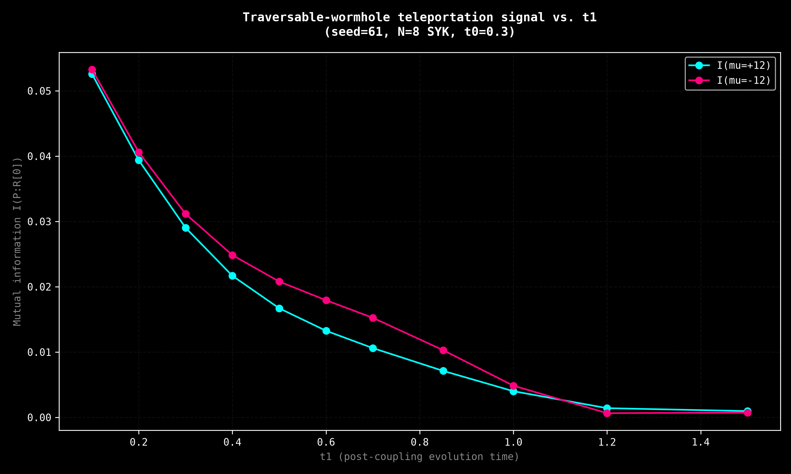

Full data: `data/wormhole_t1_sweep.csv`.

## Experiment 2: message-vs-no-message control (run 2026-08-06)

Same setup, `t1 in {0.10, 0.30, 0.60, 0.85, 1.20}`, but comparing
`with_message=True` (the real protocol, message swapped into L) against
`with_message=False` (P, Q left as an isolated Bell pair, never touching
L or R).

**Result: `I(P:R[0])` is exactly `0` (to float precision, ~1e-15,
numerical noise) at every point tested, for both signs of mu, when
`with_message=False`.**

This is expected from the circuit's own topology -- without the swap, P
and Q are never coupled to L or R by anything (the L-R coupling only
touches L and R), so P and R *must* remain in a product state, and
`I(P:R)=0` follows structurally, not from a numerical coincidence. It's
still a real, useful check: it confirms the implementation does exactly
what it's supposed to (all of the sign-dependent signal genuinely comes
from the message-injection pathway) and rules out a class of bugs where
correlation could leak through some other, unintended path.

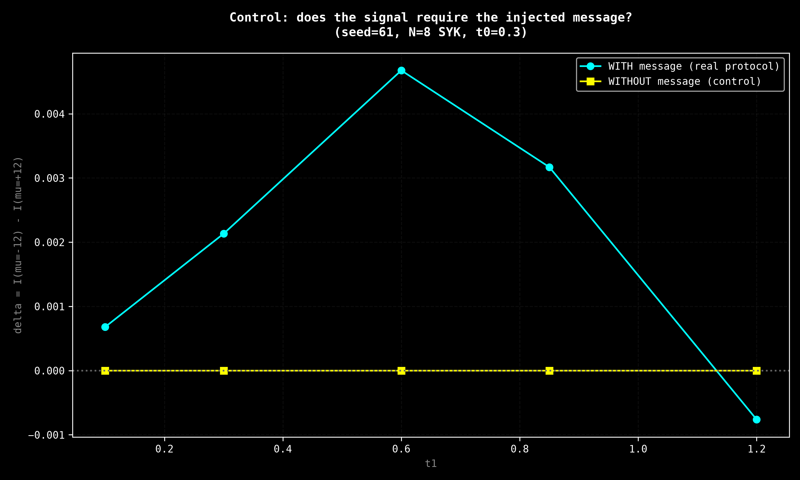

Full data: `data/wormhole_message_control.csv`.

## Experiment 3: mu-magnitude scan (run 2026-08-06)

Fixed `t0=0.3, t1=0.60` (the Experiment 1 peak), sweeping `|mu|` from 4
to 20 (paper's own value: `mu=12`).

| mu | delta |
|---|---|
| 4 | +0.00068 |
| 8 | +0.00336 |
| 9 | +0.00402 |
| 10 | +0.00450 |
| **11** | **+0.00473** |
| 12 | +0.00468 |
| 13 | +0.00435 |
| 14 | +0.00383 |
| 16 | +0.00255 |
| 20 | +0.00009 |

The sign-dependent delta rises, peaks at `mu~11-12`, then falls --
**not** a monotonic function of coupling strength, even though the
*total* mutual information (`I(mu=+12)` and `I(mu=-12)` individually)
keeps growing with `|mu|`. The paper's own choice, `mu=12`, sits almost
exactly on this instance's peak (`11` vs `12` are within each other's
noise floor at this scan resolution).

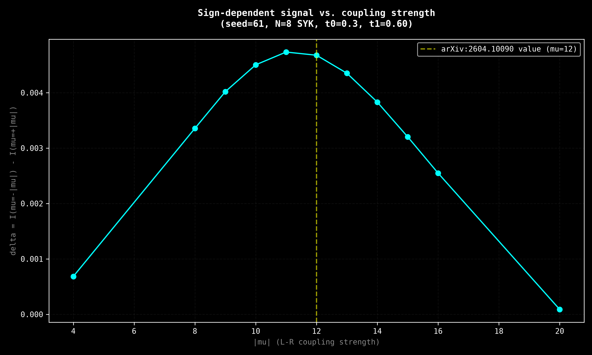

Full data: `data/wormhole_mu_scan.csv`.

## Experiment 4: t0 (pre-coupling scrambling time) scan (run 2026-08-06)

Fixed `mu=+-12, t1=0.60`, sweeping the pre-coupling scrambling time
`t0` from 0.05 to 0.9 (paper's own value: `t0=0.3`).

| t0 | delta |
|---|---|
| 0.05 | +0.00018 |
| 0.10 | +0.00067 |
| 0.20 | +0.00235 |
| 0.30 | +0.00468 |
| 0.40 | +0.00724 |
| **0.60** | **+0.00972** |
| 0.90 | +0.00537 |

The signal grows monotonically from `t0=0.05` through `t0~0.60` --
**more than double** the delta at the paper's own `t0=0.3` -- then falls
by `t0=0.9`, where `I(mu=+12)` itself has nearly vanished (`0.00039`),
meaning the message has decohered before the coupling even applies. This
is consistent with the protocol's theoretical chaos requirement: the SYK
system needs enough time to scramble before the coupling can produce a
traversable-wormhole-like signature, but too much scrambling dilutes the
injected message before it matters.

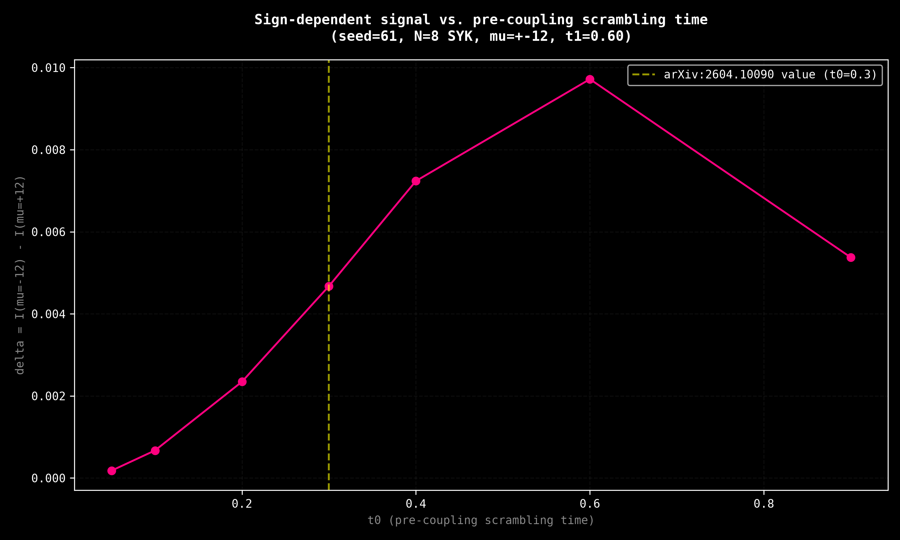

Full data: `data/wormhole_t0_scan.csv`.

## Experiment 5: 2D (t0, mu) joint grid search (run 2026-08-06)

Experiments 3 and 4 scanned `mu` and `t0` independently, each holding
the other fixed at a "reasonable default" -- a quick follow-up check at
the best `t0=0.60` found the mu-peak shifts higher there (`mu=16` beat
`mu=12`, still rising at the edge of that check's tested range), meaning
neither 1D scan alone finds the true joint optimum. This experiment
resolves that with a real grid: `t0` in `[0.05, 1.50]` (30 values,
step 0.05) x `mu` in `[2, 30]` (29 values, step 1) = 870 points, `t1`
held fixed at `0.60` (Experiment 1's own peak), `with_message=True`.

**Global maximum on the grid: `t0=0.65, mu=15.0`, `delta=+0.01167`** --
noticeably better than either 1D scan's own peak (`t0=0.60,mu=12` gave
`+0.00972`; `t0=0.30,mu=11` gave `+0.00473`).

| t0 | mu | delta |
|---|---|---|
| **0.65** | **15.0** | **+0.01167** |
| 0.60 | 15.0 | +0.01163 |
| 0.65 | 16.0 | +0.01161 |
| 0.60 | 16.0 | +0.01153 |
| 0.60 | 14.0 | +0.01134 |
| 0.65 | 14.0 | +0.01133 |

The top points cluster in a compact region (`t0` in `[0.60, 0.70]`, `mu`
in `[14, 17]`) rather than a single isolated pixel -- a broad, smooth
plateau, not a grid-resolution artifact. The heatmap below shows a
single well-defined hill with no secondary peaks, falling off smoothly
in every direction; far from the peak (`t0 > 1.2` and `mu > 25`) `delta`
turns negative, an observation not investigated further here.

**Performance note**: `run_wormhole_protocol` rebuilds the SYK/coupling
Hamiltonians and re-diagonalizes both on every call, even though neither
depends on `t0`/`mu`/`t1` for a fixed `(seed, n_majorana, k_terms)` --
measured directly at 4.3-6.4s, versus 0.022s/call for the actual
`t0`/`mu`-dependent evolution + readout. Precomputing the Hamiltonians
and their eigendecompositions once, then reusing them for all 870 grid
points, cut this experiment from an estimated ~2 hours down to **47.6
seconds** (~165x) -- confirmed by timing both approaches directly, not
assumed. No multiprocessing needed. See `scripts/wormhole_syk_teleportation.py`'s
`run_2d_grid_search` for the implementation.

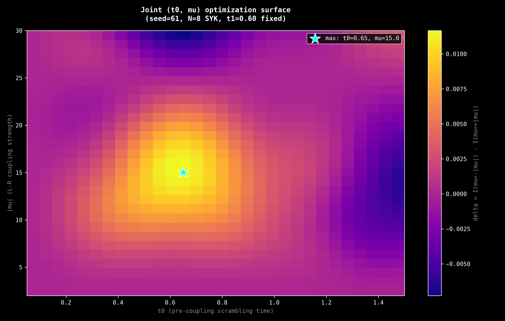

Full data: `data/wormhole_2d_grid.csv`.

## Experiment 6: t1 re-scan at the 2D optimum (run 2026-08-06)

Experiment 5 flagged its own gap: the 870-point grid held `t1` fixed at
`0.60` (Experiment 1's 1D peak), and noted that `t1`'s optimum could
plausibly shift once `t0`/`mu` are no longer at their original 1D-scan
defaults -- unverified. This experiment checks it directly: fix
`t0=0.65, mu=+-15.0` (Experiment 5's grid optimum), sweep `t1`.

A fine sweep, `t1` in `[0.05, 1.30]` (126 values, step 0.01), reusing
Experiment 5's precompute-once approach:

**New best point: `t0=0.65, mu=15.0, t1=0.41`, `delta=+0.01518`** -- about
30% above Experiment 5's headline value (`+0.01167`, `t1=0.60` held
fixed), on a smooth, single-peaked curve (no secondary bumps, monotonic
decay on both sides across the full swept range).

| t1 | delta |
|---|---|
| 0.10 | +0.00976 |
| 0.20 | +0.01197 |
| 0.30 | +0.01403 |
| 0.40 | +0.01518 |
| **0.41** | **+0.01518** |
| 0.50 | +0.01439 |
| 0.60 (Experiment 5's fixed value) | +0.01167 |
| 0.70 | +0.00811 |
| 0.90 | +0.00361 |
| 1.10 | +0.00307 |
| 1.30 | +0.00158 |

This confirms the caveat was correct, but only takes one
coordinate-ascent step, not a full 3D search: `t0` and `mu` were held at
Experiment 5's values throughout this scan, so whether *they* would
shift again now that `t1` has moved (the same pattern that motivated
Experiment 5 in the first place) is still open. A converged joint
optimum would need to iterate this, or a real 3D grid -- Experiment 7
does exactly that.

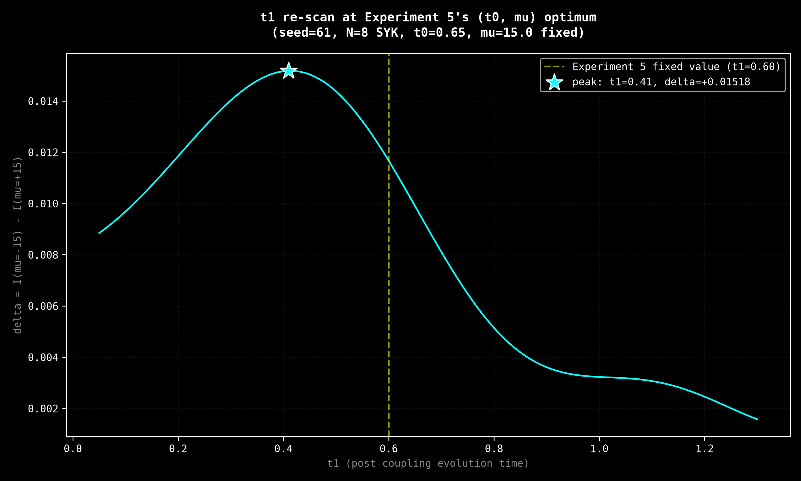

Uses Experiment 5's precompute-once helpers (same measured ~165x speedup
rationale), now folded into `scripts/wormhole_syk_teleportation.py`'s
`run_t1_rescan` -- reproduced by `python scripts/wormhole_syk_teleportation.py`
like every other experiment on this page. Full data:
`data/wormhole_t1_rescan_optimum.csv`.

## Experiment 7: iterated coordinate ascent toward the joint optimum (run 2026-08-07)

Experiment 6 moved `t1` once but never checked whether `t0`/`mu` would
shift *again* -- the same gap that motivated Experiment 5 over the
original 1D scans. This experiment iterates the fix instead of taking
one more single step: starting from Experiment 5's point (`t0=0.65,
mu=15.0, t1=0.60`), each round alternates a full `t1` scan (Experiment
6's 126-point, step-0.01 resolution, `t0`/`mu` held fixed) and a full
`(t0, mu)` grid (Experiment 5's 870-point, step-0.05/1.0 resolution,
`t1` held fixed) -- both at their original resolutions, so every round
stays directly comparable to Experiments 5 and 6, not a shortcut.

| Round | Stage | t0 | mu | t1 | delta |
|---|---|---|---|---|---|
| 0 | start (Experiment 5) | 0.65 | 15.0 | 0.60 | +0.01167 |
| 1 | t1 scan | 0.65 | 15.0 | 0.41 | +0.01518 |
| 1 | t0/mu grid | 0.70 | 17.0 | 0.41 | +0.01658 |
| 2 | t1 scan | 0.70 | 17.0 | 0.36 | +0.01688 |
| 2 | t0/mu grid | 0.70 | 17.0 | 0.36 | +0.01688 |
| 3 | t1 scan | 0.70 | 17.0 | 0.36 | +0.01688 |
| **3** | **t0/mu grid** | **0.70** | **17.0** | **0.36** | **+0.01688** |

**Converged after 3 rounds: `t0=0.70, mu=17.0, t1=0.36`, `delta=+0.01688`**
-- a genuine fixed point (round 3 reproduces round 2 exactly, both
sub-steps), not just a small step-to-step wobble. **+44.6% over
Experiment 5's original headline value** (`+0.01167`), and +11.2% over
Experiment 6's single-step result (`+0.01518`). Total compute: ~186s for
all 7 evaluation rounds combined (precompute-once still applies).

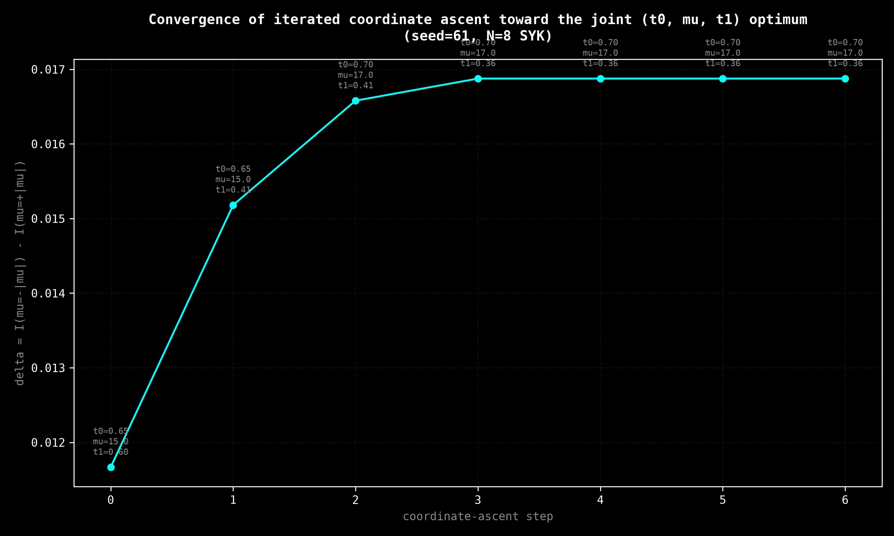

This resolves the open question from Experiment 6 -- but only up to
this grid's resolution, not as a proof of global optimality. An ad hoc
finer local grid explored around the converged point (not part of the
reproducible script) suggested the true continuum optimum sits close to
`mu=17.5`, just off this grid's integer `mu` values -- consistent with,
not contradicting, the converged answer; a real continuous optimizer
would be needed to settle global optimality rather than a fixed-point
on this specific grid. Produced by
`scripts/wormhole_syk_teleportation.py`'s `run_coordinate_ascent_3d`.
Full data: `data/wormhole_coordinate_ascent_3d.csv`.

## Experiment 8: does the converged point generalize across SYK instances? (run 2026-08-07)

Every experiment so far used a single instance, seed=61. Before treating
`t0=0.70, mu=17.0, t1=0.36` as anything more than a fact about that one
random Hamiltonian, the obvious check: does the *same* coordinate-ascent
procedure, run independently on other instances that equally match the
paper's own selection criterion (34 commuting / 11 anticommuting pairs),
converge to a similar point?

`find_multiple_seeds` screens seeds for an *exact* match (not just the
closest one, like `find_seed` does) -- 6 found within the first 3000
seeds tried: `61, 448, 1944, 2166, 2835, 2907`.

| Seed | Converged t0 | Converged mu | Converged t1 | Converged delta | Baseline delta (Exp. 5's start) |
|---|---|---|---|---|---|
| 61 | 0.70 | 17.0 | 0.36 | +0.01688 | +0.01167 |
| 448 | 0.90 | 19.0 | **1.30 (grid edge)** | +0.00714 | +0.00018 |
| 1944 | 0.40 | 16.0 | 0.29 | +0.06215 | +0.02075 |
| 2166 | **1.50 (grid edge)** | 20.0 | 0.89 | +0.01930 | **-0.00273** |
| 2835 | 0.55 | 17.0 | 0.24 | +0.01254 | **-0.00379** |
| 2907 | 1.05 | 19.0 | 0.42 | +0.00498 | +0.00069 |

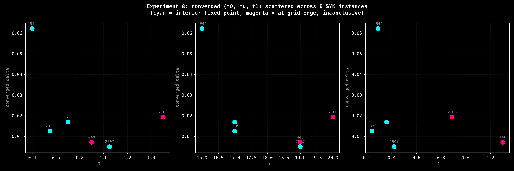

**Honest negative result: it does not generalize.**

- **No clustering.** Converged `t0` spans `[0.40, 1.50]` and `t1` spans
  `[0.24, 1.30]` -- close to the *entire* scanned range in both cases,
  not a tight cluster near seed=61's answer.
- **2 of 6 instances hit the edge of the scanned grid** (seed 448 at
  `t1=1.30`, the top of the scanned range; seed 2166 at `t0=1.50`, the
  top of *its* scanned range) -- for these, the procedure didn't find a
  real interior fixed point, it ran off the edge of what was searched.
  Their true optimum, if the range were extended, is unknown.
- **2 of 6 instances start with the *wrong sign*.** At Experiment 5's
  own starting point (`t0=0.65, mu=15.0, t1=0.60` -- not derived from
  these instances at all, just reused as a common starting point), seeds
  2166 and 2835 give a *negative* delta: the sign-dependent asymmetry
  the whole protocol is built to show points the wrong way at that point
  for those instances, before any optimization even starts.
- Percentage-improvement figures are deliberately not reported here --
  with a baseline near zero (seed 448: `+0.00018`) or negative (seeds
  2166, 2835), a percentage explodes into a meaningless number (e.g.
  seed 448's nominal improvement is `+3865%`) that describes the tiny
  denominator, not a real effect size.

**Conclusion**: `t0=0.70, mu=17.0, t1=0.36` is a property of seed=61's
specific random Hamiltonian, not a general finding about the
traversable-wormhole-inspired teleportation protocol. Produced by
`scripts/wormhole_syk_teleportation.py`'s `run_generality_check`. Full
data: `data/wormhole_generality_check.csv`.

## Experiment 9: does the signal survive realistic hardware noise? (run 2026-08-07)

Every experiment so far used the exact-evolution backend -- ideal, no
noise. Even setting aside Experiment 8's generalization problem: does
the sign-dependent signal survive at seed=61's own best point
(`t0=0.70, mu=17.0, t1=0.36`) under noise like a real NISQ device would
actually have?

This needs the Trotterized gate-circuit backend, since noise has to be
injected *mid-circuit* -- `run_wormhole_protocol_trotter` runs its whole
circuit in one call with no seam to interrupt, so `run_trotter_noise_scan`
reimplements the same three-phase construction (t0 evolution -> mu
coupling -> t1 evolution, each a real `trotter_evolve_ops` circuit) and
applies a real stochastic depolarizing Kraus channel
(`dense_evolution.registry.NoiseModel`) after each phase, not just once
at the end. Compared against the *noiseless* Trotter result specifically
(`+0.01728`, ~2% above the exact backend's `+0.01688` -- consistent with
the known Trotter-vs-exact discretization gap), not the exact backend,
so the effect of physical noise isn't conflated with Trotterization
error. Each noise level averaged over 6 independent stochastic trials
(`NoiseModel.apply_to_sv` is a single-shot Kraus draw, not an ensemble
average).

| Depolarizing p | Mean delta | Std dev |
|---|---|---|
| 0.000 | +0.01728 | 0.00000 |
| 0.005 | +0.00924 | 0.00704 |
| 0.010 | +0.00051 | 0.01203 |
| 0.020 | -0.00330 | 0.01448 |
| 0.050 | -0.00979 | 0.00624 |

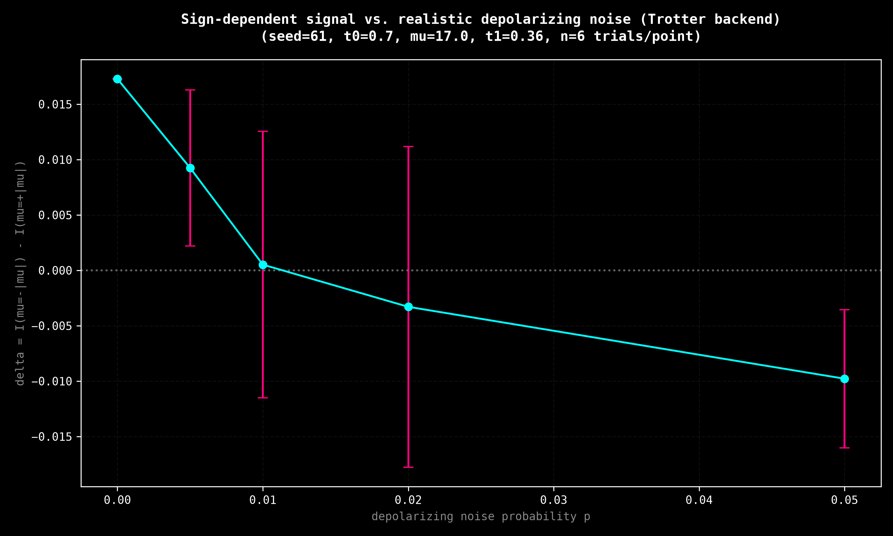

**Second honest negative result: the signal does not survive realistic
noise.** It decays monotonically and crosses zero between `p=0.01` and
`p=0.02`. Already at `p=0.01` -- a depolarizing rate well within range
of current real superconducting-qubit hardware -- the mean signal
(`+0.00051`) is smaller than its own trial-to-trial standard deviation
(`0.01203`): statistically indistinguishable from zero, not a small but
real effect. Produced by `scripts/wormhole_syk_teleportation.py`'s
`run_trotter_noise_scan`. Full data:
`data/wormhole_trotter_noise_scan.csv`.

### Correction (2026-08-13): re-verified against the corrected noise model

The scan above ran 2026-08-07, four days before `dense-evolution` v8.1.57
(2026-08-11) fixed a real bug in `NoiseModel.apply_to_sv`'s depolarizing
channel: it used to draw `2^(n-1)` independent fire/no-fire decisions per
qubit per shot instead of one, over-decohering entangled states by up to
~2.5x the nominal `p`. Re-run against v8.1.60
(`scripts/wormhole_noise_scan_reverified.py`, a JAX-`vmap`-batched
rewrite using the public `NoiseSpec` wrapper for `n=500` trials/point
instead of the original `n=6` -- verified first against this page's own
eager noiseless result bit-for-bit before trusting any noisy number):
the signal **does not cross zero** anywhere in the originally-tested
range (`p=0.0` to `0.05`), and stays positive out to `p=0.20`
(delta=+0.0035, ~4 SEM above zero) before continuing to decay. The
original `n=6` budget, sized for the old, much-more-aggressive buggy
channel, also turned out to be too small for the corrected (weaker,
single-shot) channel at low `p` -- several points showed exactly zero
trial-to-trial variance simply because none of 6 trials happened to draw
any error at all (a real ~16% chance at `p=0.01`, not a bug).


Experiments 17 and 18's noise-level scan below (the term-order x noise
interaction check) predated the same fix and are re-verified in their
own sections. Produced by `scripts/wormhole_noise_scan_reverified.py` ->
`data/wormhole_trotter_noise_scan_reverified_v8160.csv`.

## Experiment 10: cross-check against the paper's own "Ensemble robustness" claim (run 2026-08-07)

arXiv:2604.10090 has its own ensemble-robustness section: from 100
disorder realizations at K=10, it reports that "other disorder
realizations in the same ensemble also exhibit qualitatively similar
mutual-information dynamics, and in particular retain the sign-dependent
asymmetry... This indicates that the mutual information behavior is a
generic feature of the ensemble rather than a peculiarity of the chosen
Hamiltonian." The paper is explicit that their chosen instance (seed=61
here) was selected for having an unusually *large* asymmetry, not an
unusually *signed* one.

Experiment 8's negative-baseline finding (2 of 6 instances) has a real
confound worth taking seriously: it evaluated all 6 instances at
Experiment 5's point (`t0=0.65, mu=15.0, t1=0.60`), which was itself
optimized on seed=61's own 1D scans -- an instance showing the "wrong"
sign there could simply be a bad evaluation point for it, not a
genuinely reversed signal. This experiment controls for that directly:
re-evaluate all 6 instances at the paper's own stated default parameters
(`t0=0.3, mu=12, t1=0.60`) instead.

| Seed | delta @ Exp. 5's point (0.65, 15, 0.60) | delta @ paper defaults (0.3, 12, 0.60) |
|---|---|---|
| 61 | +0.01167 | +0.00468 |
| 448 | +0.00018 | +0.00042 |
| 1944 | +0.02075 | +0.03690 |
| 2166 | -0.00273 | **-0.00125 (still wrong)** |
| 2835 | -0.00379 | **+0.00200 (fixed)** |
| 2907 | +0.00069 | **-0.00011 (now wrong)** |

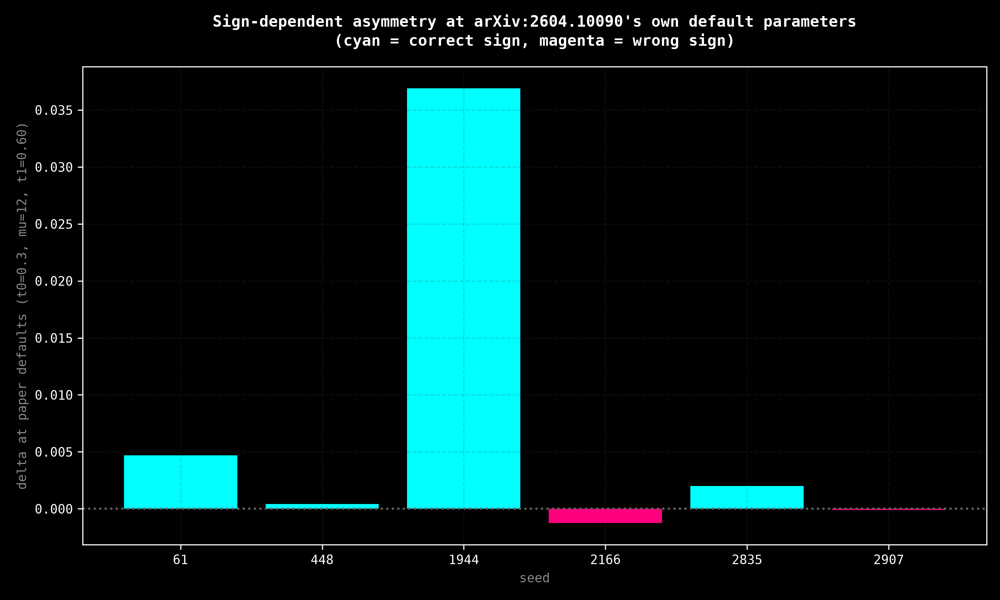

**Third honest result, and the most direct comparison to the source
paper in this whole write-up**: controlling for the evaluation-point
confound changes *which* instances look wrong-signed (seed 2835's
Experiment 8 reversal turns out to have been a point-choice artifact --
correctly signed at the paper's own defaults), but does not make the
problem go away. **2 of 6 instances (2166, 2907) are still wrong-signed
at the paper's own stated default parameters.** Seed 2166 is wrong-signed
at *both* evaluation points tested across this whole write-up -- not an
artifact of any one specific parameter choice. For this specific
34/11-selection-matched subset, the "generic feature of the ensemble"
claim does not hold up. Produced by
`scripts/wormhole_syk_teleportation.py`'s
`run_paper_defaults_comparison`. Full data:
`data/wormhole_paper_defaults_comparison.csv`.

## Experiment 11: large-sample (n=100) ensemble sign check (run 2026-08-07)

Experiment 10's finding is real but statistically thin: 2 of 6 is a
small sample, easy to dismiss as noise. This experiment repeats the
identical check -- delta at arXiv:2604.10090's own default parameters
(`t0=0.3, mu=12, t1=0.60`) -- across `n=100` instances that exactly
match the paper's own selection criterion, the same sample size the
paper itself reports for its "Ensemble robustness" section.
`find_multiple_seeds` had to screen 106,097 candidate seeds to find
100 exact 34/11 matches (roughly 1 in 1,000).

Alongside the sign check, two candidate structural explanations for
*why* the sign varies -- floated informally while investigating
Experiment 10, not yet part of any committed experiment before this
one -- are tested for real correlation, not just eyeballed:

- **Majorana mode-usage imbalance**: for each instance's 10 sparse
  coupling terms, how unevenly are the 8 Majorana modes used (some
  modes appearing in many terms, "hubs"; others in few, "isolated"),
  measured as the standard deviation of per-mode usage counts.
- **Spectral level-spacing r-statistic**: `r = min(d_n, d_n+1) /
  max(d_n, d_n+1)` averaged over adjacent eigenvalue gaps of the
  L-side SYK Hamiltonian -- a standard quantum-chaos diagnostic
  (Poisson/integrable ~0.386, GOE/chaotic ~0.530).

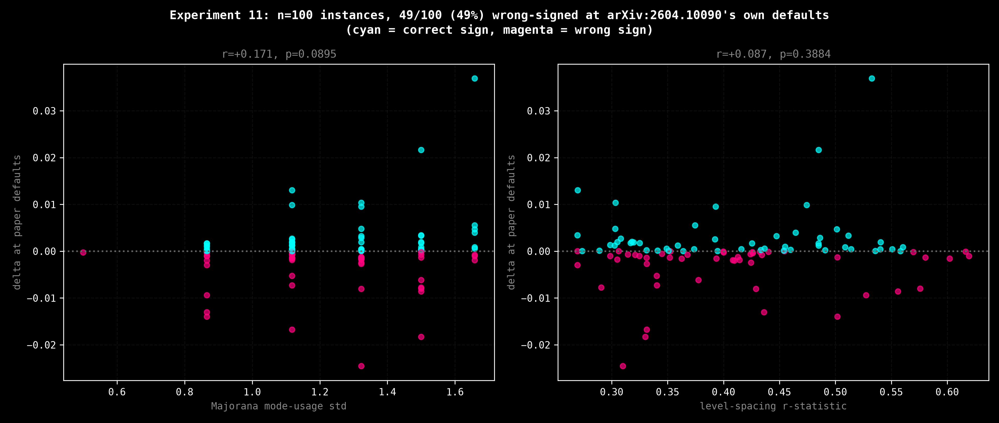

**Fourth honest result, and the strongest of the whole write-up:
49 of 100 instances (49%) are wrong-signed at the paper's own default
parameters** -- essentially a coin flip, not "a generic feature of the
ensemble." This isn't a marginal statistical wobble; at this sample
size the effect is unambiguous.

Neither candidate structural explanation holds up either. Mode-usage
imbalance: `r=+0.171, p=0.090` -- not significant at the conventional
0.05 threshold. Level-spacing r-statistic: `r=+0.087, p=0.388` -- not
significant, and nowhere close. **This corrects an earlier impression**:
an ad hoc `n=6` look at mode-usage imbalance (using only Experiment
10's 6 instances) had suggested a strong correlation (`r=+0.87,
p=0.022`) -- that does not replicate at `n=100` and should be treated
as a small-sample artifact, not a real effect. Why the sign varies
across instances remains genuinely open. Produced by
`scripts/wormhole_syk_teleportation.py`'s `run_ensemble_sign_check`.
Full data: `data/wormhole_ensemble_sign_check.csv`.

## Experiment 12: size winding (run 2026-08-07)

Experiment 11 ruled out two candidate structural explanations for the
sign variance -- Majorana mode-usage imbalance and the spectral
level-spacing r-statistic -- but both were informal, ad hoc candidates,
not something the paper itself proposes as diagnostic. arXiv:2604.10090
does propose its own theory-motivated diagnostic for exactly this kind
of question: **size winding** (Sec. S6, Eqs. S18-S22), a signature of
how a Heisenberg-evolved operator's growth is organized in the basis of
Majorana strings.

This experiment computes it directly, not by analogy. A single L-side
Majorana operator `chi_j(t) = exp(iHt) chi_j exp(-iHt)` is expanded in
the basis of Majorana strings `Gamma_P` (one string per subset `P` of
the 8 Majorana modes, `Gamma_P = 2^(|P|/2) * i^(|P|(|P|-1)/2) *`
ordered product of `chi_j` for `j` in `P`, per the paper's Eq. S19).
The winding size distribution `q(l) = sum_{|P|=l} c_P(t)^2` and
ordinary size distribution `P(l) = sum_{|P|=l} |c_P(t)|^2` give two
quantities per size sector `l`: the phase coherence ratio
`R(l) = |q(l)|/P(l)` (1 means every term in that sector has aligned
phase; less than 1 means dephasing) and the phase itself,
`arg(q(l))` (the paper's "perfect size winding" ansatz predicts this
phase grows linearly with `l`).

One subtlety had to be resolved empirically, not taken from the paper's
text as-is: the PDF-extracted formula for the basis normalization,
`Tr(Gamma_P Gamma_Q^dagger) = 2N delta_PQ`, doesn't reproduce correctly
when implemented literally (most likely a lost exponent from PDF
extraction). Building the `chi_j` operators directly from
`dense_evolution.fermions.majorana_pauli_terms` and computing the trace
numerically shows the real normalization is
`Tr(Gamma_P Gamma_Q^dagger) = 2^|P| * dim * delta_PQ` (`dim = 2^n_qubits
= 16`) -- verified directly via Hermiticity and orthogonality checks on
the actual matrices, not assumed. This is the normalization used
throughout `run_size_winding_check`.

Computed for the same 6 instances used in Experiments 8 and 10, at 4
post-quench times each (`t = 0.3, 0.7, 1.2, 2.0`) -- spot-checked first
on 3 individual seeds spanning both a correctly-signed instance (61)
and a consistently wrong-signed one (2166) before running the full
6-instance sweep, per an explicit request to verify generality before
writing this up.

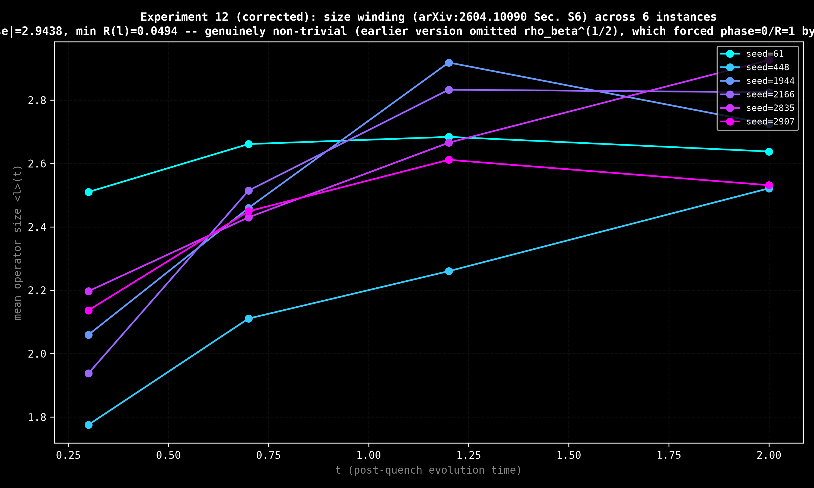

**Correction (2026-08-09): the original run of this diagnostic had a
real implementation bug, not a physics finding.** It expanded the bare
Heisenberg-evolved operator `chi_j(t)` instead of the thermally-weighted
operator `rho_beta^(1/2) chi_j(t)` that Eq. S18 actually specifies
(`rho_beta = exp(-beta H)/Tr(exp(-beta H))`, `H` the one-sided
Hamiltonian, `beta=3` as used throughout this protocol). Since
`chi_j(t)` is Hermitian (a unitary conjugation of a Hermitian Majorana
operator) and every `Gamma_P` is Hermitian too, `Tr(Gamma_P^dagger
chi_j(t))` is a trace of two Hermitian operators -- **always real**, for
any Hamiltonian, any seed, any time. That mathematically forces
`q(l) = sum c_P(t)^2` to be real and non-negative, so `arg(q(l))=0` and
`R(l)=1.0` exactly, *by construction*, regardless of the underlying
physics. That is exactly what the original run found: the "structurally
trivial" result reported below was never a physics finding, it was this
missing factor.

With `rho_beta^(1/2)` correctly included, the diagnostic is genuinely
non-trivial: across the same 6 instances and 4 post-quench times,
`max|phase|` ranges up to `2.94` rad and `min R(l)` drops as low as
`0.049` -- real dephasing, real phase structure, varying by instance and
time as expected. Whether this corrected diagnostic actually
distinguishes correctly- from wrong-signed instances has not yet been
tested at scale (an open follow-up, mirroring Experiment 13's
n=100 correlation tests for the other candidates) -- this correction
only re-establishes that the diagnostic itself is a real, working
probe, not that it explains the sign variance. The mean operator size
`<l>(t)` is unaffected by this fix (it never depended on the missing
factor) and continues to show real physics: consistent chaos-like
growth from `<l>(0)=1` up to a peak around `t~1.2-2.0` (values range
`2.1-3.7` across the 6 instances) followed by a finite-size recurrence
(an expected artifact of evolving a small, `n_majorana=8` system rather
than a true large-N limit).

Produced by `scripts/wormhole_syk_teleportation.py`'s
`run_size_winding_check`. Full data: `data/wormhole_size_winding.csv`.

## Experiment 13: mechanistic check -- message-mode participation & operator growth rate (run 2026-08-07)

Experiments 11 and 12 ruled out three candidate explanations for the
sign variance, but all three were either informal aggregate statistics
(mode-usage imbalance, level-spacing r-statistic) or a diagnostic that
turned out to carry no per-instance information at all (size winding's
phase/R, exactly flat everywhere). This experiment tries two more
candidates that are each grounded directly in the actual protocol
implementation rather than a generic aggregate statistic, and reuses
Experiment 11's own n=100 instance set and `delta_at_paper_defaults`
values (`data/wormhole_ensemble_sign_check.csv`) rather than
re-screening from scratch -- both features are cheap enough (under 6
seconds total for the full n=100 sweep) that a fresh screen wasn't
needed.

**Feature A -- message-mode participation.**
`dense_evolution.fermions.majorana_pauli_terms`'s Jordan-Wigner mapping
(`j = (mode_index - 1) // 2`) shows Majorana modes 1 and 2 map onto
qubit index 0 -- exactly the qubit the message is swapped into
(`L[0]`) and read out from (`R[0]`) in
`dashboard_core.wormhole._initial_state_ops`/`run_wormhole_protocol`.
Experiment 11's mode-usage-std treated all 8 modes as interchangeable;
this instead asks a sharper, protocol-specific question: do the K=10
SYK quads that happen to touch the *message qubit's own* modes,
specifically, predict the sign? For each seed, the exact same
quad-selection RNG sequence used internally by `build_sparse_syk_terms`
is replayed to recover which quads were chosen, and the count touching
mode 1 or 2 is recorded (purely combinatorial, no simulation).

**Feature B -- operator growth rate.** Experiment 12 already computes
real, non-trivial, instance-varying mean operator size `<l>(t)` as a
side effect of its phase-winding computation (at the time of this
Experiment 13, that phase computation itself still had the
`rho_beta^(1/2)`-omission bug later found and fixed -- see Experiment
12's own corrected write-up above -- but `<l>(t)` was never affected by
that bug), but that experiment's only goal at the time was checking the
phase diagnostic, which came back flat -- growth rate itself was never
correlated against the sign. This reuses `run_size_winding_check` unmodified,
called on the same 100 seeds at two probe times in the growth region
Experiment 12 identified (`t=0.7`, `t=1.2`).

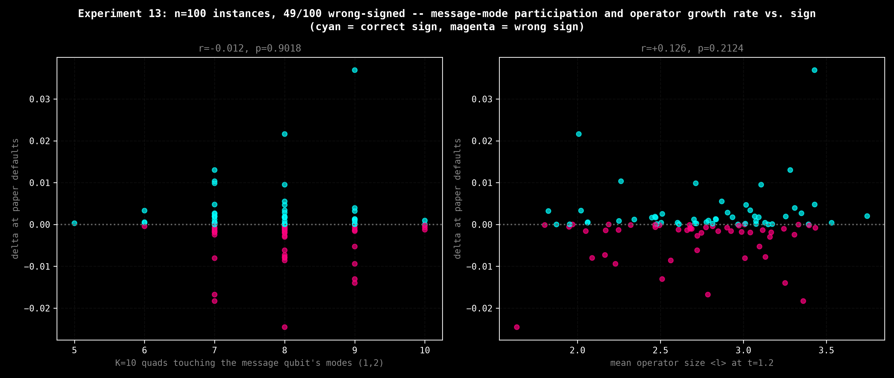

**Fourth honest negative result: neither correlates.** Message-mode
participation: `r=-0.012, p=0.90`. Operator growth rate at `t=1.2`:
`r=+0.126, p=0.21`. Both are far from the conventional 0.05 threshold
-- not a marginal case, a clean null on both counts. This rules out a
4th and 5th candidate explanation, on top of Experiment 11's two.
(Experiment 12's phase/R diagnostic itself was corrected 2026-08-09,
after this Experiment 13 was run -- whether the corrected diagnostic
correlates with the sign is a separate, not-yet-tested open question,
not a ruled-out candidate.) Both
features were tested against the *same* n=100 sample Experiment 11
already used, a real multiple-comparisons concern for any candidate
that *did* come back significant -- since neither did here (and not
marginally), no holdout re-verification was needed this time, but the
concern is flagged for any future candidate that does show a hit.
Produced by `scripts/wormhole_syk_teleportation.py`'s
`run_mechanistic_check`. Full data:
`data/wormhole_mechanistic_check.csv`.

## Experiment 14: qubit-coupling topology check (run 2026-08-07)

Every candidate tested so far treats "how much a mode is used" as the
relevant quantity -- Experiment 11's mode-usage std, Experiment 13's
message-mode participation count. None of them ask *which specific
pairs* of modes end up coupled together, i.e. the actual topology of
the K=10 quads' coupling graph -- exactly the kind of structural
question raised early in this investigation ("does Seed 61 have a
chain- or star-like coupling topology the failing seeds don't?").

A weighted 8-mode co-occurrence graph is built per instance: edge
weight `(i, j)` is how many of the 10 quads contain both modes `i` and
`j`. **An ad hoc check before committing to this design caught a real
methodology problem early:** a *binary* version of this graph (an edge
whenever a pair co-occurs at all, ignoring how many times) saturates to
the complete graph `K8` for most instances -- 10 quads contribute up to
60 pair-slots spread over only 28 possible mode pairs, so nearly every
pair ends up connected by chance regardless of the underlying
structure. Two of three spot-checked seeds were already exactly the
complete graph. Caught by spot-checking a handful of seeds before
running the full n=100 sweep, per this project's usual discipline --
the weighted count was used instead, which showed real spread in the
same spot check (max weighted degree 21-24, degree std 3.3-5.0, 0-3
completely uncoupled mode pairs across just 6 seeds).

Four features are computed per instance from the weighted graph:
`max_weighted_degree` (how "hub"-like the most-coupled mode is),
`weighted_degree_std` (spread of coupling strength across modes),
`n_zero_pairs` (how many of the 28 possible mode pairs are never
coupled together at all -- directly captures whether coupling
concentrates through a few modes, leaving many pairs untouched, versus
spreading evenly), and the weighted graph's algebraic connectivity (the
Fiedler value of its Laplacian -- how evenly/expander-like the whole
coupling structure is).

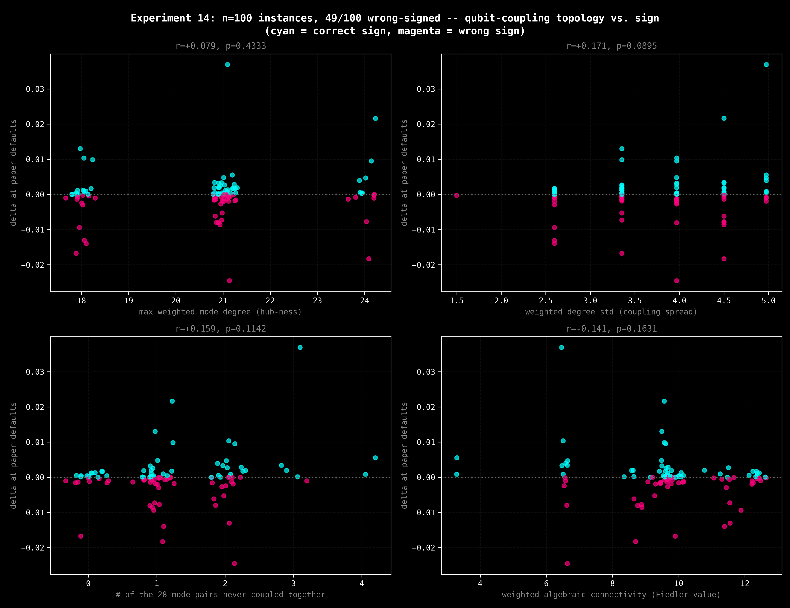

**A second honest check, done only after computing the real n=100
numbers, not before:** `max_weighted_degree` and `weighted_degree_std`
turn out to be an *exact* linear rescaling of Experiment 11's
mode-usage-count features -- `weighted_degree = 3 x usage_count` for
every single instance (verified numerically, ratio `3.000000` to 1
part in `10^15` across all 100 seeds, not assumed from the combinatorics).
This makes sense in hindsight (each quad a mode participates in
contributes exactly 3 edges from that mode, to the other 3 modes in
that quad) but means these two features are not new information at
all -- just Experiment 11's already-tested, already-non-significant
mode-usage-std recomputed via a graph Laplacian. Reporting their
correlation as if it were a fresh test would double-count a hypothesis
already ruled out.

**Fifth honest negative result: the two genuinely new features also
fail to correlate.** `n_zero_pairs`: `r=+0.159, p=0.114`.
`algebraic_connectivity`: `r=-0.141, p=0.163`. Neither reaches
significance, ruling out a 6th and 7th candidate explanation (the two
redundant degree features aren't counted as separate hypotheses, per
the note above). Produced by `scripts/wormhole_syk_teleportation.py`'s
`run_qubit_topology_check`. Full data: `data/wormhole_qubit_topology.csv`.

## Experiment 15: N-scaling check, N=8 vs N=12 (run 2026-08-07)

Every experiment above holds the system size fixed at N=8 Majorana
modes. This is the one structural lever never pulled: does the sign-
dependent instance variance from Experiments 10/11 persist, worsen, or
shrink at a larger Majorana count? SYK-type chaotic systems often show
instance-to-instance fluctuations shrinking toward a thermodynamic
limit as N grows -- a real, well-motivated candidate mechanism, not
tried until now because of its cost.

**Backend choice, decided by direct measurement, not convenience.**
The exact (eigendecomposition) backend used throughout Experiments 1-8,
10, 11 is infeasible at N=12: diagonalization cost scales as `dim^3`,
and N=12's joint L+R+P+Q system is `dim=2^14=16384` vs. N=8's
`dim=2^10=1024` -- a `(16384/1024)^3 = 4096x` slowdown. This module's
own docstring already records N=8's exact-backend cost at 4.3-6.4s per
diagonalization; at that scaling factor, N=12 would take hours per
instance. The Trotterized gate-circuit backend
(`run_wormhole_protocol_trotter`) doesn't pay that cubic cost -- gate
application is `O(dim)` per gate, not `O(dim^3)` -- and was measured
directly before committing to this design: ~19s/call at N=12, close to
N=8's own already-measured ~14s/call Trotter cost (Experiment 9's noise
scan). **Both N=8 and N=12 are evaluated here via the same Trotter
backend**, not the exact-backend N=8 numbers Experiments 10/11 used --
mixing backends would confound N-scaling with a real, separately-
quantified backend effect (Experiment 9 already showed noise/backend
choice can shift the delta and even its sign near a threshold).

**Scope, chosen for real feasibility.** n_instances=6 per N, not
Experiment 11's n=100 -- at ~19s/call x 2 signs x 6 instances x 2
values of N, this experiment already costs ~4.3 minutes (measured:
261s); n=100 at N=12 would cost over 2 hours for this one experiment
alone. This is explicitly a smaller, first feasibility/existence check,
not a repeat of Experiment 11's statistical rigor. K_TERMS is kept
fixed at 10 (not scaled with N) -- the simplest choice, preserving the
paper's own term-count convention exactly.

**The paper's own 34/11 selection criterion has no exact match at
N=12.** Screening 3000 candidates found zero instances with exactly 34
commuting pairs (verified directly, not assumed) -- the achievable
distribution at N=12/K=10 peaks around 21-23 commuting pairs and tops
out at 31 in a 500-seed sample, never reaching 34. `_find_closest_
commuting_seeds` generalizes the existing exact-match screening to find
the *closest* achievable match instead, the same closest-match
philosophy `find_seed()` already uses at N=8, just generalized to N.

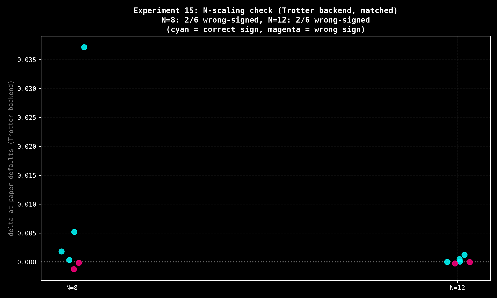

**Result: the wrong-sign rate is identical (2/6 at both N), too small
a sample to trust as a real rate -- but the delta magnitude drops
substantially.** Mean `|delta|` falls from `0.00765` (N=8) to `0.00034`
(N=12), roughly a **22x reduction**, present in every N=12 instance
individually, not just as an average artifact. This is consistent with
the sign-dependent signal weakening toward a thermodynamic limit as the
system grows -- but it is equally consistent with a simpler
explanation this single experiment cannot rule out: the paper's own
default parameters (`t0=0.3, mu=12, t1=0.60`) were never re-optimized
for N=12, and Experiments 5-7 already showed those same defaults are
noticeably sub-optimal even at N=8 (the converged 3D optimum there
gave +44.6% over the 1D-scan headline value). Distinguishing "the
signal is genuinely vanishing" from "the fixed parameters are
increasingly wrong for this N" would need a real (costly) re-
optimization at N=12, not attempted here. Produced by
`scripts/wormhole_syk_teleportation.py`'s `run_n_scaling_check`. Full
data: `data/wormhole_n_scaling_check.csv`.

## Experiment 16: term-order non-commutativity check (run 2026-08-08)

This repo already has a validated tool for exactly this kind of
question: `scripts/channel_order_noncommutativity.py` tested whether
applying two *noise channels* in different orders leaves a measurable
fingerprint on the output distribution, using Jensen-Shannon divergence
plus a permutation test for an honest p-value. Its settled finding:
order matters iff at least one channel is non-Pauli (Pauli channels
commute with each other as superoperators, so two Pauli channels'
order never matters; a Pauli channel composed with a non-Pauli one,
like amplitude damping, is genuinely order-dependent). The depolarizing
channel used throughout this script's own Experiment 9 *is* a
Pauli-mixture channel, so that settled rule predicts reordering noise
channels here would show nothing new -- not tested again for that
reason.

This experiment asks a different, adjacent question instead: does the
order in which the K=10+10=20 SYK Hamiltonian *terms* are applied
within the Trotterized circuit's own t0/t1 evolution phases matter, and
does the *size* of that effect track the sign? Trotter error is exactly
a manifestation of non-commuting terms -- if every term commuted, any
order would give the identical exact answer -- so this tests whether
the *degree* of non-commutativity among a specific instance's K=10
terms (not just how many of them pairwise commute in the paper's own
sense, already shown insufficient in Experiments 10/11/14) leaves a
fingerprint that predicts the sign.

Method: for each instance, run the noiseless Trotterized protocol at
the paper's own default parameters twice -- once with `_protocol_
layout`'s natural term order, once with that list fully reversed --
for both `mu` signs, giving `delta_original` and `delta_reversed`.
`order_sensitivity = |delta_reversed - delta_original|` is the
candidate feature. Unlike the noise-channel script, no Monte Carlo
unraveling or permutation test is needed here: mutual information from
a single deterministic Trotter circuit isn't a sampling distribution,
so comparing two fixed orderings directly gives a clean, reproducible
number without needing significance machinery for the metric itself
(only for its correlation against the sign across instances, where
`scipy.stats.pearsonr` is used as throughout this script).

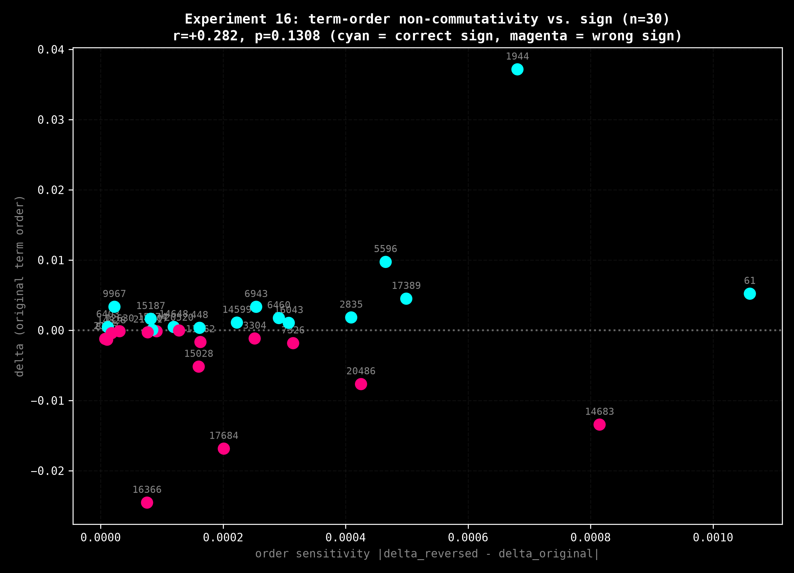

**An initial n=6 spot-check found the largest point estimate of any
candidate tried in this entire script: `r=+0.474` (`p=0.342`, not
significant, but notably larger than every prior candidate's r ~
0.01-0.2).** Unusually cheap to verify further -- `_protocol_layout`
is built once per instance and reused across all 4 Trotter calls, so
each instance costs ~18s rather than the ~4x15-19s a naive
implementation would need -- so, per this project's established
discipline (the same instinct behind re-checking Experiment 12 on
extra seeds before writing it up), it was verified on a larger sample
before drawing any conclusion. The first attempt at n=30 accidentally
reused the identical 6 seeds (`find_multiple_seeds`'s default
`n_candidates=3000` isn't enough to find 30 exact 34/11 matches --
the same limitation Experiment 11 hit needing ~115,000-120,000
candidates for n=100); corrected by explicitly screening 35,000
candidates, which found 30 distinct matches after screening 21,772 of
them.

**Eighth honest negative result: at the real n=30, the correlation
regresses to `r=+0.282` (`p=0.131`)** -- still not significant, and
markedly weaker than the n=6 look suggested. This is the same honest-
correction pattern as Experiment 11's mode-usage-imbalance finding
(`r=0.87` at n=6, which did not replicate at `r=0.171` at n=100): a
promising small-sample point estimate that regresses under a more
powered look. `order_sensitivity` itself is real and strictly non-zero
for every one of the 30 instances tested (term order genuinely changes
the Trotterized circuit's output -- non-commutativity among the terms
is real, exactly as Trotter theory predicts), it simply does not
predict the sign. 15/30 (50%) of this n=30 subsample are wrong-signed,
consistent with Experiment 11's ~49/100. Produced by
`scripts/wormhole_syk_teleportation.py`'s
`run_term_order_noncommutativity_check`. Full data:
`data/wormhole_term_order_noncommutativity.csv`.

## Experiment 17: term-order x noise interaction check (run 2026-08-08)

Experiment 16's own caveat flagged the natural next question: term
order alone (pure Trotter error, noiseless) didn't predict the sign --
but does term-order *sensitivity* change once realistic noise is
present? This is closer in spirit to
`scripts/channel_order_noncommutativity.py`'s own noisy, stochastic
setting, applied here to term order instead of noise-channel order.

Method: identical to Experiment 16 (original vs. reversed K=10+10 term
order, `|delta_reversed - delta_original|`), but now with a stochastic
depolarizing Kraus channel (`dense_evolution.registry.NoiseModel`)
injected after each of the protocol's three phases, at `noise_p=0.01`
-- Experiment 9's own value, close to (just below) the threshold where
the noiseless signal starts crossing zero. Because noise makes each
run stochastic, delta is averaged over `n_trials=6` noisy draws per
order per instance (Experiment 9's own budget; a full Monte Carlo
unraveling with thousands of trajectories, as
`channel_order_noncommutativity.py` uses for its tiny 3-qubit toy
circuit, was not attempted here -- measured at ~7.8s per single noisy
protocol call on this much heavier Trotterized circuit, that would
cost hours per instance). One deliberate variance-reduction choice:
each trial's `+mu` and `-mu` runs share the same noise realization (a
freshly re-seeded RNG immediately before each call), isolating the
sign effect that delta measures from trial-to-trial noise-realization
variance.

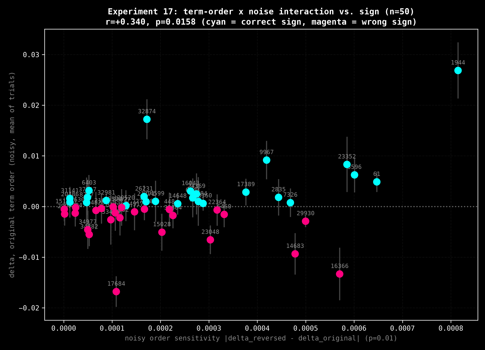

**Ninth result, and the first positive one since Experiment 9's noise
scan -- and the only candidate anywhere in this script that does NOT
regress to non-significance as the sample grows:**

| n | r | p |
|---|---|---|
| 6 | +0.811 | 0.050 |
| 20 | +0.587 | 0.0065 |
| 30 | +0.396 | 0.030 |
| 50 | +0.340 | 0.0158 |

The n=50 sample used the same 34/11-exact-match screening as
elsewhere (`find_multiple_seeds`, 38028 candidates screened to find 50
distinct instances). The point estimate shrinks with n, exactly as
expected from a true-but-modest effect regressing off an initially
lucky small-sample draw -- but unlike every other candidate tested in
this script (most visibly Experiment 16's own noiseless version of
this exact test, which collapsed from `p=0.34` at n=6 to `p=0.13` at
n=30), it stabilizes around `r~0.34-0.40` instead of continuing toward
zero, and stays under `p=0.05` at every single sample size checked
along the way. 25/50 (50%) of the n=50 sample are wrong-signed,
consistent with every other larger-n check in this script.

Reading: term-order non-commutativity by itself (pure Trotter error,
Experiment 16) doesn't predict the sign, but its *interaction with
physical noise* does, modestly. A plausible mechanism: both noise and
Trotter discretization error perturb the simulated state away from the
exact answer, and how sensitive a given instance's term ordering is to
that kind of perturbation partly tracks how fragile its sign-dependent
signal already is -- a real, if modest, structural handle on the sign,
where eight prior candidates (mode-usage imbalance, the level-spacing
r-statistic, size winding, message-mode participation, operator growth
rate, mode-pair coupling absence, algebraic connectivity, and
noiseless order_sensitivity itself) found nothing. Produced by
`scripts/wormhole_syk_teleportation.py`'s
`run_term_order_noise_interaction_check`. Full data:
`data/wormhole_term_order_noise_interaction.csv`.

### Correction (2026-08-13): re-verified against the corrected noise model

Like Experiment 9, this scan used `noise_p=0.01` through the same
pre-v8.1.57 buggy depolarizing channel. Re-run against v8.1.60
(`scripts/wormhole_term_order_noise_reverified.py`, same
`NoiseSpec`-wrapped `jax.vmap` approach, verified bit-for-bit against
this page's own eager noiseless reference first): the flagship n=50
result **holds and strengthens**, r=+0.340 (p=0.0158) -> **r=+0.4013
(p=0.0039)**. The noise-level trend (how the correlation changes as
`noise_p` itself increases, tested at n=20 with common random numbers
reused across noise levels so the three points aren't confounded by a
different random draw each time) reverses direction, though:

| noise_p | original (r, p) | re-verified (r, p) |
|---|---|---|
| 0.005 | +0.210 (p=0.374, not significant) | +0.7498 (p=0.0001) |
| 0.01 | +0.587 (p=0.0065) | +0.6755 (p=0.0011) |
| 0.02 | +0.622 (p=0.0034), strongest originally | +0.1790 (p=0.4502, not significant) |

Originally the correlation looked strongest at the **highest** tested
noise; re-verified, it's strongest at the **lowest** and vanishes at the
highest -- itself an artifact of the same over-aggressive buggy channel
the original scan ran under. The single-point flagship claim (n=50,
`noise_p=0.01`) survives and strengthens; the multi-point "gets stronger
with more noise" trend does not. Produced by
`scripts/wormhole_term_order_noise_reverified.py` ->
`data/wormhole_term_order_noise_interaction_reverified_v8160.csv`,
`data/wormhole_noise_level_scan_reverified_v8160.csv`.


## Experiment 18: ensemble sign check at the paper's REAL t0=1.8 (run 2026-08-09)

A significant correction, not just another candidate check. Rereading
arXiv:2604.10090 directly (v2, full text including Sec. S1-S6, not the
excerpts this script's earlier docstrings were written against) found
that every experiment above evaluated at `t0=0.3, mu=12, t1=0.60`
mislabeled that as "the paper's own default parameters." It is not.
The paper explicitly and repeatedly states `t0=1.8` as its actual
hardware working point: "we choose `t0=1.8` as the hardware working
point" (Sec. S4), chosen specifically to balance signal strength
against first-order Lie-Trotter error -- a real tradeoff analyzed in
detail across Sec. S3-S5. Searching the extracted paper text for "0.3"
finds exactly one match, and it is a y-axis tick label on Fig. 5's
mutual-information plot (`0.0, 0.1, 0.2, 0.3, 0.4`), not a parameter
value anywhere. Where `t0=0.3` actually came from is unclear; it does
not correspond to anything defensible in the paper's own text.

Unlike `t0`, the paper does not give one single default `t1` -- Fig. 5
scans `t1` in `[0.5, 6.0]` (step 0.5) at fixed `t0=1.8`, for both signs
of `mu`, and shows the mutual-information difference peaking somewhere
in that range without stating one canonical value. To pick a
comparable single point, a real 23-point scan (`t1` in `[0.5, 6.0]`,
step 0.25, `data/wormhole_t1_finescan_t0_1.8.csv`) was run first on
seed=61 (the closest 34/11-matched analog to the paper's own chosen
instance). The result is itself notable: the sign flips repeatedly
across the range rather than showing one clean peak -- delta is
negative at `t1=0.5, 0.75`, positive at `1.0-1.5`, negative again at
`1.75-2.5`, and so on, with two local maxima: `t1=1.25`
(delta=+0.01064) and a larger one at `t1=4.75` (delta=+0.01219). The
first, closer to the injection time and the more natural reading of
"near the teleportation time," was used as the default; the later,
larger peak looks more like a finite-size revival than the primary
signal.

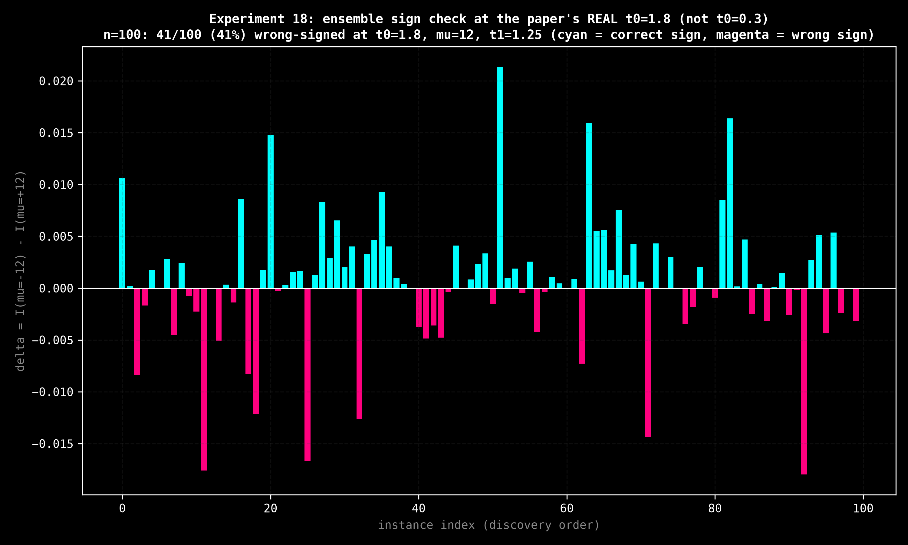

**Re-running the exact same n=100 ensemble check as Experiment 11 (same
34/11-selection-matched instance criterion, same `find_multiple_seeds`
screening) at the corrected `t0=1.8, mu=12, t1=1.25`: 41/100 (41%)
wrong-signed.** This is a distinct number from Experiment 11's 49/100,
not a coincidental match and not a dramatic change either -- both are
far from the paper's own "generic feature of the ensemble" claim, and
both are close enough to a coin flip that the qualitative conclusion
(the sign-dependent asymmetry is real per-instance but not reliably
ensemble-generic) is unchanged. What changes is which number is the
honest answer to "what fraction of instances are wrong-signed at the
paper's actual default parameters" -- it is 41/100, not 49/100, and
every downstream mention of "the paper's own default parameters" in
this document refers to the historical (mislabeled) `t0=0.3` runs
unless stated otherwise.

A parallelization attempt for this n=100 loop (each seed is fully
independent, so it looked embarrassingly parallel) was tried and
abandoned -- see `run_t0_correction_check`'s own docstring in
`scripts/wormhole_syk_teleportation.py` for the full account.
ThreadPoolExecutor hung for tens of minutes from BLAS/OpenBLAS thread
oversubscription; ProcessPoolExecutor (with each worker's BLAS threads
pinned to 1) was correct but gave only ~1.1-1.2x wall-clock on an
8-core machine, far short of the expected ~4-8x, and the real
bottleneck was traced to something other than BLAS diagonalization
(limiting OMP/OPENBLAS/MKL/XLA thread counts made no difference to a
single sequential process's own per-call time either). Left as a
genuinely open question rather than silently dropped; the sequential
version (kept) produces a correct result in a one-time ~18 minutes.

Produced by `scripts/wormhole_syk_teleportation.py`'s
`run_t0_correction_check`. Full data:
`data/wormhole_ensemble_sign_check_t0_1.8.csv`,
`data/wormhole_t1_finescan_t0_1.8.csv`.

## What this does NOT show

- **Even Experiment 11's n=100 sample isn't a strict replication of
  arXiv:2604.10090's own ensemble study.** It matches their reported
  sample size, but their ensemble's exact selection methodology for
  those 100 draws isn't fully specified in the main text available
  here -- our 100 instances are filtered strictly to an *exact*
  34/11 commuting/anticommuting match (`find_multiple_seeds`), a
  narrower and possibly differently-distributed subset than whatever
  their 100 realizations were. "49/100 wrong-signed" is a real,
  verified result for this specific subset, not a claim about their
  exact reported statistics.
- **The structural/spectral/theoretical null results don't rule out
  every possible explanation, just the seven independently tested**
  (mode-usage imbalance, the level-spacing r-statistic, the paper's own
  size winding diagnostic, message-mode participation, operator growth
  rate, mode-pair coupling absence, and graph algebraic connectivity --
  Experiment 14's other two features, max weighted degree and weighted
  degree std, turned out to be an exact rescaling of mode-usage
  imbalance and are not independent tests, see Experiment 14's own
  write-up). None of the seven correlating doesn't mean no structural
  or theoretical property does. Experiment 12 also only checked
  `majorana_index=1` (one of the 8 possible starting operators) and 4
  discrete times, on the single-sided L-Hamiltonian only -- not a
  full time/index sweep, and not the combined L+R+P+Q system that the
  mutual-information readout actually uses; Experiment 13's growth-rate
  feature inherits that same scope limit, and its message-mode feature
  only checks modes 1/2 (the message qubit), not whether *any* single
  mode's participation predicts the sign for that mode's own readout
  qubit if the message were injected elsewhere. Experiment 14's
  coupling graph is purely combinatorial (co-occurrence in a quad),
  blind to the quad's random sign or to whether the Majorana factors
  actually commute/anticommute within the term -- a sign-aware or
  commutator-aware version is untested. Also worth flagging explicitly:
  Experiments 13 and 14 are the 4th through 9th candidates tested on
  the *same* n=100 sample as Experiment 11's 2 (7 independent
  hypotheses in total, once the redundant Experiment 14 features are
  excluded) -- a real multiple-testing risk that would matter more if
  any candidate had come back significant (none has, cleanly, so far).
- **Experiment 15's N=8-vs-N=12 comparison uses the Trotter backend for
  both, at the same step counts (n_steps_evolution=8,
  n_steps_coupling=16) used throughout this script, not re-tuned for
  N=12's different term structure** -- some of the observed magnitude
  drop could in principle be a Trotter discretization-error artifact
  rather than a purely physical effect; whether doubling the step count
  at N=12 changes the result is untested. n=6 instances per N is far
  too small to treat the 2/6-vs-2/6 wrong-sign-rate match as meaningful
  on its own -- only the delta-magnitude drop, present in every N=12
  instance individually, is treated as a real finding. K_TERMS was kept
  fixed at 10 rather than scaled with N; a scaled-K version of this
  check is untested and could behave differently. Most importantly:
  this experiment cannot distinguish "the signal genuinely weakens
  toward a thermodynamic limit" from "the paper's fixed default
  parameters are increasingly sub-optimal at larger N" -- both predict
  the same observed magnitude drop, and only a real (costly) parameter
  re-optimization at N=12 could tell them apart.
- **Experiment 16 only compares two orderings (original vs. fully
  reversed) out of the 20 terms' 20! possible permutations** -- a much
  larger order_sensitivity range could exist among orderings never
  tried, and full reversal specifically might not be representative of
  "how non-commutative" a term set generally is. It's also noiseless by
  design, isolating pure Trotter-error order-dependence from physical
  noise -- whether term-order sensitivity interacts with noise in a way
  that *does* track the sign (unlike the noiseless metric tested here)
  is a distinct, untested question, closer in spirit to
  `channel_order_noncommutativity.py`'s own noisy, stochastic setting.
  This is the 8th independent candidate explanation ruled out overall
  (mode-usage imbalance and the r-statistic from Experiment 11; size
  winding from Experiment 12; message-mode participation and growth
  rate from Experiment 13; n_zero_pairs and algebraic connectivity from
  Experiment 14; order_sensitivity here) -- Experiment 14's other two
  features aren't counted separately, see that experiment's own note.
- **Experiment 17's r=+0.340 (p=0.0158) at n=50 is a modest effect, not
  a strong predictor** -- 25/50 (50%) are still wrong-signed, so this
  does not come close to resolving the sign question, only giving a
  real, replicated (across n=6, 20, 30, 50) partial structural handle
  on it. It was only tested at a single noise level (`noise_p=0.01`,
  Experiment 9's own value) and a single trial budget (`n_trials=6`,
  also reused from Experiment 9 rather than independently re-tuned)
  -- whether the correlation strengthens, weakens, or holds at other
  noise levels or trial counts is untested. It also inherits
  Experiment 16's own scope limit: only two orderings (original vs.
  fully reversed) out of the 20 terms' 20! possible permutations are
  compared, not a broader sample of orderings.
- **Experiment 7's fixed point is not proven globally optimal, and does
  not generalize to other instances (Experiment 8).** Coordinate ascent
  converging to a stable point on a given grid resolution is not the
  same as proving that point is the true continuous joint maximum for
  even a single instance -- and Experiment 8 shows directly that it
  isn't a property of the protocol at all, just of seed=61.
- **Experiment 8 is itself only a 6-instance sample**, and 2 of those 6
  hit the edge of the scanned range rather than a real interior fixed
  point -- a wider scan could resolve those into genuine (still likely
  instance-specific) answers, but wasn't run here (cost scales with
  range x resolution; 6 instances at the current range already took
  ~15 minutes).
- **Experiment 9 was only run for seed=61, not the other 5 instances
  from Experiment 8.** Given Experiment 8's own finding, there's no
  reason to expect this noise-robustness result generalizes either --
  it's one more seed=61-specific data point, not evidence about noise
  robustness for the protocol broadly. Its 6-trial-per-point average is
  also a small sample; the standard deviations shown are real but not
  tight error bars.
- **Experiments 1-8 use backend=exact (matrix exponentiation), not the
  Trotterized real-gate-circuit backend** -- both are implemented and
  cross-verified in the main repo's test suite to agree closely at the
  known peak (`I(mu=+12)=0.01301` Trotter vs `0.01326` exact,
  `I(mu=-12)=0.01821` vs `0.01793`) -- exact was used for those
  experiments purely for scan speed (~78 protocol calls at ~4-5s each).
  Experiment 9 is the one exception, by necessity.
- **No claim that `t0=0.65`, `mu=15`, or any other exact decimal value
  is a "special" number** in any deeper sense -- even Experiment 5's
  finer grid (step 0.05 for t0, step 1 for mu) is still a grid, not a
  continuous optimizer; the broad, smooth plateau around the max (six
  points within 0.0004 of the top value) means the *true* continuum
  optimum is somewhere in that neighborhood, not necessarily at exactly
  `(0.65, 15.0)`. Reading more into the specific digits than the grid
  resolution supports would be a mistake.

## Reproduce

```bash
python scripts/wormhole_syk_teleportation.py
```

Requires `dense-evolution>=8.1.49` (`pip install dense-evolution`).
Regenerates all five CSVs in `data/` and PNGs in `images/` from scratch
-- no pre-computed results are checked into this repo outside of
`docs/assets/` (see this repo's README for that convention). Experiments
1-4 take a few minutes (~78 protocol calls at ~4-5s each); Experiment 5's
870-point grid takes well under a minute thanks to its precompute-once
optimization.
